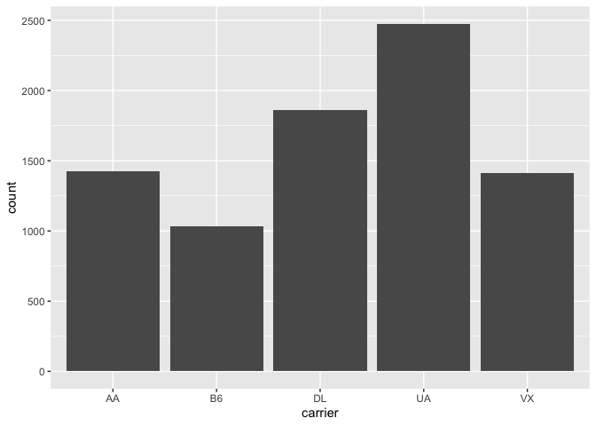

## Install Packages

```r
options(repos = c(CRAN = "http://cran.rstudio.com"))
install.packages("tidyverse")
```

```
## 
## The downloaded binary packages are in
## 	/var/folders/t3/1srkhjyx5xv_8j28hd0ns_lw0000gn/T//RtmpcjCRR8/downloaded_packages
```

```r
install.packages("nycflights13")
```

```
## 
## The downloaded binary packages are in
## 	/var/folders/t3/1srkhjyx5xv_8j28hd0ns_lw0000gn/T//RtmpcjCRR8/downloaded_packages
```

## Working directory

```r
getwd()
```

```
## [1] "/Users/lisayuan/Desktop/BIS15W2022_ryuan/lab1"
```

## Session Info

```r
sessionInfo()
```

```
## R version 4.1.2 (2021-11-01)
## Platform: x86_64-apple-darwin17.0 (64-bit)
## Running under: macOS Big Sur 10.16
## 
## Matrix products: default
## BLAS:   /Library/Frameworks/R.framework/Versions/4.1/Resources/lib/libRblas.0.dylib
## LAPACK: /Library/Frameworks/R.framework/Versions/4.1/Resources/lib/libRlapack.dylib
## 
## locale:
## [1] en_US.UTF-8/en_US.UTF-8/en_US.UTF-8/C/en_US.UTF-8/en_US.UTF-8
## 
## attached base packages:
## [1] stats     graphics  grDevices utils     datasets  methods   base     
## 
## loaded via a namespace (and not attached):
##  [1] compiler_4.1.2  magrittr_2.0.1  fastmap_1.1.0   tools_4.1.2    
##  [5] htmltools_0.5.2 yaml_2.2.1      jquerylib_0.1.4 stringi_1.7.6  
##  [9] rmarkdown_2.11  knitr_1.37      stringr_1.4.0   xfun_0.29      
## [13] digest_0.6.29   rlang_0.4.12    evaluate_0.14
```

## Load the libraries

```r
library(nycflights13)
library(tidyverse)
```

```
## ── Attaching packages ─────────────────────────────────────── tidyverse 1.3.1 ──
```

```
## ✓ ggplot2 3.3.5     ✓ purrr   0.3.4
## ✓ tibble  3.1.6     ✓ dplyr   1.0.7
## ✓ tidyr   1.1.4     ✓ stringr 1.4.0
## ✓ readr   2.1.1     ✓ forcats 0.5.1
```

```
## ── Conflicts ────────────────────────────────────────── tidyverse_conflicts() ──
## x dplyr::filter() masks stats::filter()
## x dplyr::lag()    masks stats::lag()
```

## nycflights13

```r
flights
```

```
## # A tibble: 336,776 × 19
##     year month   day dep_time sched_dep_time dep_delay arr_time sched_arr_time
##    <int> <int> <int>    <int>          <int>     <dbl>    <int>          <int>
##  1  2013     1     1      517            515         2      830            819
##  2  2013     1     1      533            529         4      850            830
##  3  2013     1     1      542            540         2      923            850
##  4  2013     1     1      544            545        -1     1004           1022
##  5  2013     1     1      554            600        -6      812            837
##  6  2013     1     1      554            558        -4      740            728
##  7  2013     1     1      555            600        -5      913            854
##  8  2013     1     1      557            600        -3      709            723
##  9  2013     1     1      557            600        -3      838            846
## 10  2013     1     1      558            600        -2      753            745
## # … with 336,766 more rows, and 11 more variables: arr_delay <dbl>,
## #   carrier <chr>, flight <int>, tailnum <chr>, origin <chr>, dest <chr>,
## #   air_time <dbl>, distance <dbl>, hour <dbl>, minute <dbl>, time_hour <dttm>
```

## Filter
Flights between JFK and SFO airports.

```r
flights %>% 
  filter(origin=="JFK" & dest=="SFO")
```

```
## # A tibble: 8,204 × 19
##     year month   day dep_time sched_dep_time dep_delay arr_time sched_arr_time
##    <int> <int> <int>    <int>          <int>     <dbl>    <int>          <int>
##  1  2013     1     1      611            600        11      945            931
##  2  2013     1     1      655            700        -5     1037           1045
##  3  2013     1     1      729            730        -1     1049           1115
##  4  2013     1     1      734            737        -3     1047           1113
##  5  2013     1     1      745            745         0     1135           1125
##  6  2013     1     1      803            800         3     1132           1144
##  7  2013     1     1     1029           1030        -1     1427           1355
##  8  2013     1     1     1031           1030         1     1353           1415
##  9  2013     1     1     1112           1100        12     1440           1438
## 10  2013     1     1     1124           1100        24     1435           1431
## # … with 8,194 more rows, and 11 more variables: arr_delay <dbl>,
## #   carrier <chr>, flight <int>, tailnum <chr>, origin <chr>, dest <chr>,
## #   air_time <dbl>, distance <dbl>, hour <dbl>, minute <dbl>, time_hour <dttm>
```

##Plot
Count of flights between JFK and SFO airports by carrier.

```r
flights %>% 
  filter(origin=="JFK" & dest=="SFO") %>% 
  ggplot(aes(x=carrier))+
  geom_bar()
```

<!-- -->
