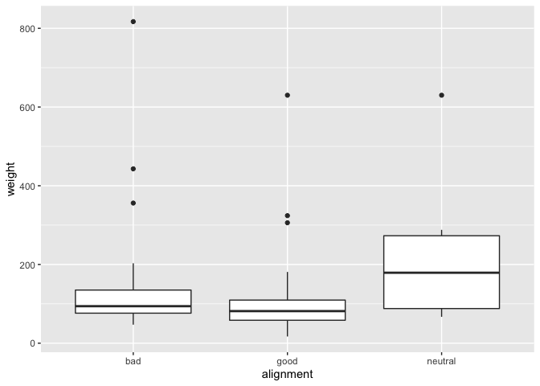
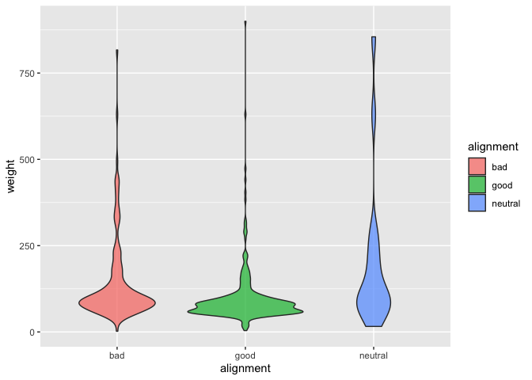
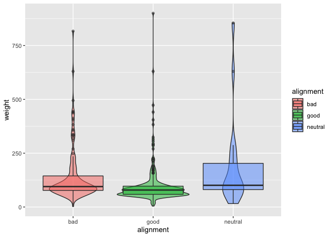
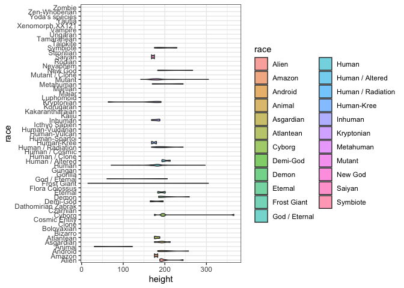
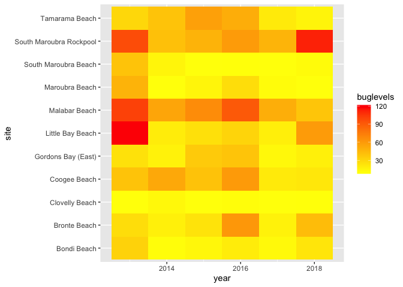
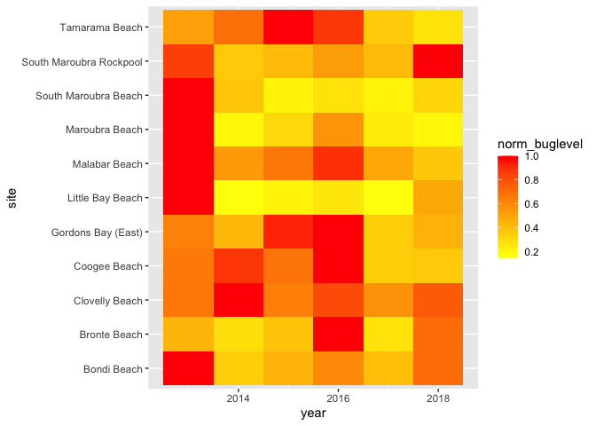
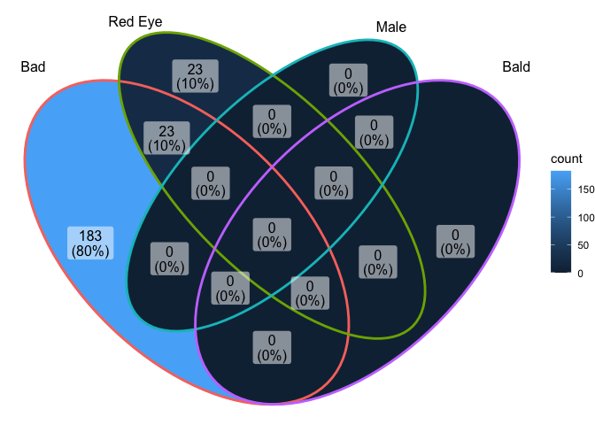
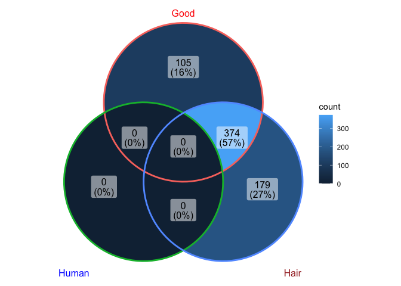
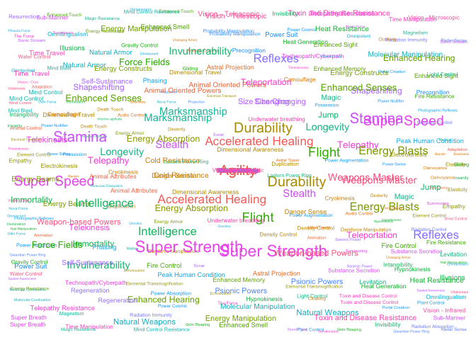
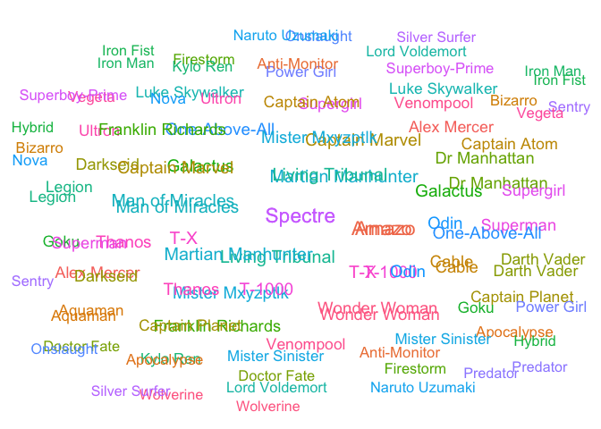

### Load the Libraries

```r
library(tidyverse)
```

```
## ── Attaching packages ─────────────────────────────────────── tidyverse 1.3.1 ──
```

```
## ✓ ggplot2 3.3.5     ✓ purrr   0.3.4
## ✓ tibble  3.1.6     ✓ dplyr   1.0.8
## ✓ tidyr   1.2.0     ✓ stringr 1.4.0
## ✓ readr   2.1.2     ✓ forcats 0.5.1
```

```
## ── Conflicts ────────────────────────────────────────── tidyverse_conflicts() ──
## x dplyr::filter() masks stats::filter()
## x dplyr::lag()    masks stats::lag()
```

```r
library(janitor)
```

```
## 
## Attaching package: 'janitor'
```

```
## The following objects are masked from 'package:stats':
## 
##     chisq.test, fisher.test
```

```r
library("palmerpenguins")

#install.packages("ggVennDiagram")
library(ggVennDiagram)
library(RColorBrewer)

#install.packages("ggworldcloud")
library(ggwordcloud)


options(scipen=999) #cancels the use of scientific notation for the session
```


### Data

```r
superhero_info <- readr::read_csv("data/heroes_information.csv", na = c("", "-99", "-"))
```

```
## Rows: 734 Columns: 10
## ── Column specification ────────────────────────────────────────────────────────
## Delimiter: ","
## chr (8): name, Gender, Eye color, Race, Hair color, Publisher, Skin color, A...
## dbl (2): Height, Weight
## 
## ℹ Use `spec()` to retrieve the full column specification for this data.
## ℹ Specify the column types or set `show_col_types = FALSE` to quiet this message.
```

```r
superhero_powers <- readr::read_csv("data/super_hero_powers.csv", na = c("", "-99", "-"))
```

```
## Rows: 667 Columns: 168
## ── Column specification ────────────────────────────────────────────────────────
## Delimiter: ","
## chr   (1): hero_names
## lgl (167): Agility, Accelerated Healing, Lantern Power Ring, Dimensional Awa...
## 
## ℹ Use `spec()` to retrieve the full column specification for this data.
## ℹ Specify the column types or set `show_col_types = FALSE` to quiet this message.
```

```r
beachbugs_long <- readr::read_csv("data/beachbugs_long.csv")
```

```
## Rows: 66 Columns: 3
## ── Column specification ────────────────────────────────────────────────────────
## Delimiter: ","
## chr (1): site
## dbl (2): year, buglevels
## 
## ℹ Use `spec()` to retrieve the full column specification for this data.
## ℹ Specify the column types or set `show_col_types = FALSE` to quiet this message.
```

### 1. 
Clean up the column names (no capitals, not spaces) of `superhero_info`, then use 2 functions to remind yourself of structure of the `superhero_info` data set.


```r
superhero_info<-clean_names(superhero_info)
names(superhero_info)
```

```
##  [1] "name"       "gender"     "eye_color"  "race"       "hair_color"
##  [6] "height"     "publisher"  "skin_color" "alignment"  "weight"
```


```r
glimpse(superhero_info)
```

```
## Rows: 734
## Columns: 10
## $ name       <chr> "A-Bomb", "Abe Sapien", "Abin Sur", "Abomination", "Abraxas…
## $ gender     <chr> "Male", "Male", "Male", "Male", "Male", "Male", "Male", "Ma…
## $ eye_color  <chr> "yellow", "blue", "blue", "green", "blue", "blue", "blue", …
## $ race       <chr> "Human", "Icthyo Sapien", "Ungaran", "Human / Radiation", "…
## $ hair_color <chr> "No Hair", "No Hair", "No Hair", "No Hair", "Black", "No Ha…
## $ height     <dbl> 203, 191, 185, 203, NA, 193, NA, 185, 173, 178, 191, 188, 1…
## $ publisher  <chr> "Marvel Comics", "Dark Horse Comics", "DC Comics", "Marvel …
## $ skin_color <chr> NA, "blue", "red", NA, NA, NA, NA, NA, NA, NA, NA, NA, NA, …
## $ alignment  <chr> "good", "good", "good", "bad", "bad", "bad", "good", "good"…
## $ weight     <dbl> 441, 65, 90, 441, NA, 122, NA, 88, 61, 81, 104, 108, 90, 90…
```


```r
str(superhero_info)
```

```
## spec_tbl_df [734 × 10] (S3: spec_tbl_df/tbl_df/tbl/data.frame)
##  $ name      : chr [1:734] "A-Bomb" "Abe Sapien" "Abin Sur" "Abomination" ...
##  $ gender    : chr [1:734] "Male" "Male" "Male" "Male" ...
##  $ eye_color : chr [1:734] "yellow" "blue" "blue" "green" ...
##  $ race      : chr [1:734] "Human" "Icthyo Sapien" "Ungaran" "Human / Radiation" ...
##  $ hair_color: chr [1:734] "No Hair" "No Hair" "No Hair" "No Hair" ...
##  $ height    : num [1:734] 203 191 185 203 NA 193 NA 185 173 178 ...
##  $ publisher : chr [1:734] "Marvel Comics" "Dark Horse Comics" "DC Comics" "Marvel Comics" ...
##  $ skin_color: chr [1:734] NA "blue" "red" NA ...
##  $ alignment : chr [1:734] "good" "good" "good" "bad" ...
##  $ weight    : num [1:734] 441 65 90 441 NA 122 NA 88 61 81 ...
##  - attr(*, "spec")=
##   .. cols(
##   ..   name = col_character(),
##   ..   Gender = col_character(),
##   ..   `Eye color` = col_character(),
##   ..   Race = col_character(),
##   ..   `Hair color` = col_character(),
##   ..   Height = col_double(),
##   ..   Publisher = col_character(),
##   ..   `Skin color` = col_character(),
##   ..   Alignment = col_character(),
##   ..   Weight = col_double()
##   .. )
##  - attr(*, "problems")=<externalptr>
```


### 2.
Are bad guys bigger? Make box-plots of weight by `alignment` (alignment on the x-axis).

```r
superhero_info%>%
  na.exclude()%>%
  ggplot(aes(x=alignment,y=weight))+
  geom_boxplot()
```

<!-- -->

### 3. 
Now, make a violin plot of weight by `alignment` (alignment on the x-axis). Add some color!
  What information can you observe in the violin plot that was not visible in the boxplot?

```r
superhero_info%>%
  filter(alignment!="NA",weight!="NA")%>%
  ggplot(aes(x=alignment,y=weight,fill=alignment))+
  geom_violin(alpha=0.7)
```

<!-- -->
We can't see the shape of distriution of the data in boxplot. We can only see how many outliers there are but don't know its distribution from the mean.


### 4. 
Use `alpha = .5` in `geom_boxplot()` and `geom_violin()` to layer both plots on top of one another. What does this tell you about the distribution of weight in "`bad`" guys?

```r
superhero_info%>%
  filter(alignment!="NA",weight!="NA")%>%
  ggplot(aes(x=alignment,y=weight,fill=alignment))+
  geom_violin(alpha=0.5)+
  geom_boxplot(alpha=0.5)
```

<!-- -->
The mean of bad guys' weight is at around 125, most of the bad guys' weight is under 250, only a few is above 250.

### 5. 
Box plots are great for showing how the distribution of a numeric variable (e.g. weight) varies among a categorical variable (e.g. alignment).
  Make your own violin plot with the superhero data. 
  What is your numeric data? 
  -height
  What is your categorical variable?
  -race


```r
superhero_info%>%
  filter(race!="NA",height!="NA")%>%
  ggplot(aes(x=race,y=height,fill=race))+
  geom_violin(alpha=0.6)+
  coord_flip()+
  theme_bw()
```

```
## Warning: Groups with fewer than two data points have been dropped.
## Groups with fewer than two data points have been dropped.
## Groups with fewer than two data points have been dropped.
## Groups with fewer than two data points have been dropped.
## Groups with fewer than two data points have been dropped.
## Groups with fewer than two data points have been dropped.
## Groups with fewer than two data points have been dropped.
## Groups with fewer than two data points have been dropped.
## Groups with fewer than two data points have been dropped.
## Groups with fewer than two data points have been dropped.
## Groups with fewer than two data points have been dropped.
## Groups with fewer than two data points have been dropped.
## Groups with fewer than two data points have been dropped.
## Groups with fewer than two data points have been dropped.
## Groups with fewer than two data points have been dropped.
## Groups with fewer than two data points have been dropped.
## Groups with fewer than two data points have been dropped.
## Groups with fewer than two data points have been dropped.
## Groups with fewer than two data points have been dropped.
## Groups with fewer than two data points have been dropped.
## Groups with fewer than two data points have been dropped.
## Groups with fewer than two data points have been dropped.
## Groups with fewer than two data points have been dropped.
## Groups with fewer than two data points have been dropped.
## Groups with fewer than two data points have been dropped.
## Groups with fewer than two data points have been dropped.
## Groups with fewer than two data points have been dropped.
## Groups with fewer than two data points have been dropped.
## Groups with fewer than two data points have been dropped.
## Groups with fewer than two data points have been dropped.
## Groups with fewer than two data points have been dropped.
## Groups with fewer than two data points have been dropped.
## Groups with fewer than two data points have been dropped.
## Groups with fewer than two data points have been dropped.
```

<!-- -->

### 6. 
Remind yourself what `beachbugs` looks like. Then generate a heatmap of buglevels by site and year. 
color it with `scale_fill_gradient(low="yellow", high="red")` or colors of your choice. you may find it looks best with one color!
(dont forget, `coord_flip()` is a quick way to improve the look of your plot if you dont like the default orientation)


```r
beachbugs_long
```

```
## # A tibble: 66 × 3
##     year site                    buglevels
##    <dbl> <chr>                       <dbl>
##  1  2013 Bondi Beach                 32.2 
##  2  2013 Bronte Beach                26.8 
##  3  2013 Clovelly Beach               9.28
##  4  2013 Coogee Beach                39.7 
##  5  2013 Gordons Bay (East)          24.8 
##  6  2013 Little Bay Beach           122.  
##  7  2013 Malabar Beach              101.  
##  8  2013 Maroubra Beach              47.1 
##  9  2013 South Maroubra Beach        39.3 
## 10  2013 South Maroubra Rockpool     96.4 
## # … with 56 more rows
```


```r
beachbugs_long%>%
  ggplot(aes(x=site,y=year,fill=buglevels))+
  geom_tile()+
  scale_fill_gradient(low = "yellow",high = "red")+
  coord_flip()
```

<!-- -->

### 7.  
Use the provided code to normalize the beachbug data set. 
Then make a heatmap with the `beachbugs_normalized` data, and use the same color chois as above. Which heatmap do you think is more informative? why?


```r
#makes a new column of the highest buglevel observed at each site
beachbugs_w_max <- beachbugs_long %>% 
  group_by(site) %>% 
  mutate(max_buglevel = max(buglevels, na.rm=T)) %>% 
  arrange(site)
beachbugs_w_max
```

```
## # A tibble: 66 × 4
## # Groups:   site [11]
##     year site         buglevels max_buglevel
##    <dbl> <chr>            <dbl>        <dbl>
##  1  2013 Bondi Beach       32.2         32.2
##  2  2014 Bondi Beach       11.1         32.2
##  3  2015 Bondi Beach       14.3         32.2
##  4  2016 Bondi Beach       19.4         32.2
##  5  2017 Bondi Beach       13.2         32.2
##  6  2018 Bondi Beach       22.9         32.2
##  7  2013 Bronte Beach      26.8         61.3
##  8  2014 Bronte Beach      17.5         61.3
##  9  2015 Bronte Beach      23.6         61.3
## 10  2016 Bronte Beach      61.3         61.3
## # … with 56 more rows
```

```r
#makes a new table where the buglevels are normalized to the max_buglevel
beachbugs_normalized <- beachbugs_w_max %>% 
  group_by(site) %>% 
  mutate(norm_buglevel = buglevels/max_buglevel) %>% 
  arrange(site,year) %>%
  select(site, year, norm_buglevel)   # you dont have to select(), but I think its a clearer looking table
beachbugs_normalized
```

```
## # A tibble: 66 × 3
## # Groups:   site [11]
##    site          year norm_buglevel
##    <chr>        <dbl>         <dbl>
##  1 Bondi Beach   2013         1    
##  2 Bondi Beach   2014         0.344
##  3 Bondi Beach   2015         0.445
##  4 Bondi Beach   2016         0.601
##  5 Bondi Beach   2017         0.409
##  6 Bondi Beach   2018         0.710
##  7 Bronte Beach  2013         0.436
##  8 Bronte Beach  2014         0.285
##  9 Bronte Beach  2015         0.385
## 10 Bronte Beach  2016         1    
## # … with 56 more rows
```
 

```r
beachbugs_normalized%>%
  ggplot(aes(x=site,y=year,fill=norm_buglevel))+
  geom_tile()+
  scale_fill_gradient(low = "yellow",high = "red")+
  coord_flip()
```

<!-- -->
The second one, because it shows the max bug level at different years so we can better know which site has the worst bug issue at different years


### 8.
Let's make a venn diagram of `superhero_info`, from 4 questions:
Is their alignment evil? 
Are their eyes red?
Are they male?
Are they bald?

Start by making the 4 vectors, then the list of vectors. The vector for alignment is provided:
### super heros venn

```r
# evil

evil_vec <- superhero_info %>%
  filter(alignment == "bad")%>%
  pull(name)

# red eyes
red_eye_vec<-superhero_info%>%
  filter(eye_color=="red")%>%
  pull(name)

# male
male_vec<-superhero_info%>%
  filter(gender=="male")%>%
  pull(name)

# bald
bald_vec<-superhero_info%>%
  filter(hair_color=="bald")%>%
  pull(name)
```

Your list of vectors will look something like this:

```r
 questions_list <- list(evil_vec, red_eye_vec, male_vec, bald_vec)
```

### 9. 
Let's make the venn diagram! use the code from lab as a reference. 

```r
# something like:
 ggVennDiagram( questions_list, category.names = c("Bad", "Red Eye", "Male", "Bald"))
```

<!-- -->
Bad people that are red-eyed

### 10. Choose one intersection of the venn diagram that is interesting to you. Use dplyr to find the names of the superheros in that intersection. 


```r
superhero_info%>%
  filter(alignment=="bad"&eye_color=="red")%>%
  select(name)
```

```
## # A tibble: 23 × 1
##    name        
##    <chr>       
##  1 Amazo       
##  2 Apocalypse  
##  3 Black Abbott
##  4 Blackout    
##  5 Darkseid    
##  6 Demogoblin  
##  7 Doomsday    
##  8 Evilhawk    
##  9 Fixer       
## 10 Killer Croc 
## # … with 13 more rows
```


### 11. Make another venn diagram with the `superhero_info` data. What are your questions? ( At least 2!) 

```r
#are they good?

good_vec<-superhero_info%>%
  filter(alignment=="good")%>%
  pull(name)

#are they human?

human_vec<-superhero_info%>%
  filter(race=="human")%>%
  pull(name)

#do they have hair?

hair_vec<-superhero_info%>%
  filter(hair_color!="bald")%>%
  pull(name)
```


```r
q11_hero_list<-list(good_vec,human_vec,hair_vec)

ggVennDiagram(q11_hero_list,set_color=c("red","blue","brown"),category.names = c("Good","Human","Hair"))
```

<!-- -->


### 12.
What are some very common super powers? Lets make a word cloud with the `superhero_powers` data.

Use the provided code to make the frequency table, then make a word cloud with it. 
Remember, you can change `scale_size_area(max_size = 20)` to a different number if the words wont fit!


```r
head(superhero_powers)
```

```
## # A tibble: 6 × 168
##   hero_names  Agility `Accelerated Healing` `Lantern Power Ri…` `Dimensional A…`
##   <chr>       <lgl>   <lgl>                 <lgl>               <lgl>           
## 1 3-D Man     TRUE    FALSE                 FALSE               FALSE           
## 2 A-Bomb      FALSE   TRUE                  FALSE               FALSE           
## 3 Abe Sapien  TRUE    TRUE                  FALSE               FALSE           
## 4 Abin Sur    FALSE   FALSE                 TRUE                FALSE           
## 5 Abomination FALSE   TRUE                  FALSE               FALSE           
## 6 Abraxas     FALSE   FALSE                 FALSE               TRUE            
## # … with 163 more variables: `Cold Resistance` <lgl>, Durability <lgl>,
## #   Stealth <lgl>, `Energy Absorption` <lgl>, Flight <lgl>,
## #   `Danger Sense` <lgl>, `Underwater breathing` <lgl>, Marksmanship <lgl>,
## #   `Weapons Master` <lgl>, `Power Augmentation` <lgl>,
## #   `Animal Attributes` <lgl>, Longevity <lgl>, Intelligence <lgl>,
## #   `Super Strength` <lgl>, Cryokinesis <lgl>, Telepathy <lgl>,
## #   `Energy Armor` <lgl>, `Energy Blasts` <lgl>, Duplication <lgl>, …
```

```r
power_frequency <- superhero_powers %>% 
  select(-hero_names) %>%
  summarise_all(~(sum(.))) %>%
  pivot_longer(everything(), names_to = "power", values_to = "freq")
power_frequency
```

```
## # A tibble: 167 × 2
##    power                  freq
##    <chr>                 <int>
##  1 Agility                 242
##  2 Accelerated Healing     178
##  3 Lantern Power Ring       11
##  4 Dimensional Awareness    25
##  5 Cold Resistance          47
##  6 Durability              257
##  7 Stealth                 126
##  8 Energy Absorption        77
##  9 Flight                  212
## 10 Danger Sense             30
## # … with 157 more rows
```


```r
power_frequency%>%
  ggplot(aes(label=power,size=freq,color=power))+
  geom_text_wordcloud()+
  geom_text_wordcloud_area(max=1)+
  theme_minimal()
```

```
## Warning: Ignoring unknown parameters: ymax
```

```
## Warning in wordcloud_boxes(data_points = points_valid_first, boxes = boxes, :
## Some words could not fit on page. They have been placed at their original
## positions.

## Warning in wordcloud_boxes(data_points = points_valid_first, boxes = boxes, :
## Some words could not fit on page. They have been placed at their original
## positions.
```

<!-- -->
### 13.  
Who are some very powerful supers? 
 Lets make a different word cloud with the `superhero_powers` data. 
Use the provided code to make the frequency table, then make a word cloud with it.
You can use `hero_names` for the labels, and `sum_powers` for size. 


```r
power_quantity <- superhero_powers %>% 
  pivot_longer(-hero_names, names_to = "power", values_to = "yes_or_no") %>% 
  group_by(hero_names) %>% 
  mutate(sum_powers = sum(yes_or_no, na.rm=T)) %>%
  arrange(desc(sum_powers), hero_names, desc(yes_or_no))
power_quantity
```

```
## # A tibble: 111,389 × 4
## # Groups:   hero_names [667]
##    hero_names power                 yes_or_no sum_powers
##    <chr>      <chr>                 <lgl>          <int>
##  1 Spectre    Agility               TRUE              49
##  2 Spectre    Accelerated Healing   TRUE              49
##  3 Spectre    Dimensional Awareness TRUE              49
##  4 Spectre    Stealth               TRUE              49
##  5 Spectre    Energy Absorption     TRUE              49
##  6 Spectre    Flight                TRUE              49
##  7 Spectre    Marksmanship          TRUE              49
##  8 Spectre    Longevity             TRUE              49
##  9 Spectre    Intelligence          TRUE              49
## 10 Spectre    Super Strength        TRUE              49
## # … with 111,379 more rows
```

```r
#we have to trim down to only the top 50, or it will crowd the image!
power_quantity <- power_quantity %>% 
  ungroup %>%
  distinct(hero_names, sum_powers) %>%
  slice_max(sum_powers, n = 50)
power_quantity
```

```
## # A tibble: 51 × 2
##    hero_names        sum_powers
##    <chr>                  <int>
##  1 Spectre                   49
##  2 Amazo                     44
##  3 Living Tribunal           35
##  4 Martian Manhunter         35
##  5 Man of Miracles           34
##  6 Captain Marvel            33
##  7 T-X                       33
##  8 Galactus                  32
##  9 T-1000                    32
## 10 Mister Mxyzptlk           31
## # … with 41 more rows
```


```r
power_quantity%>%
  ggplot(aes(label=hero_names,size=sum_powers,color=hero_names))+
  geom_text_wordcloud()+
  geom_text_wordcloud_area(max=1)+
  theme_minimal()
```

```
## Warning: Ignoring unknown parameters: ymax
```

<!-- -->

## That's it! 🎉
Thanks for coding with us all winter! 
Now go finish your group project :) 

