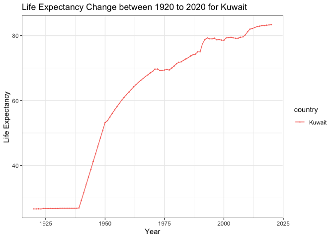
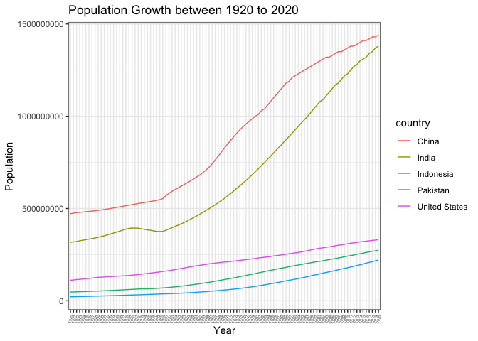
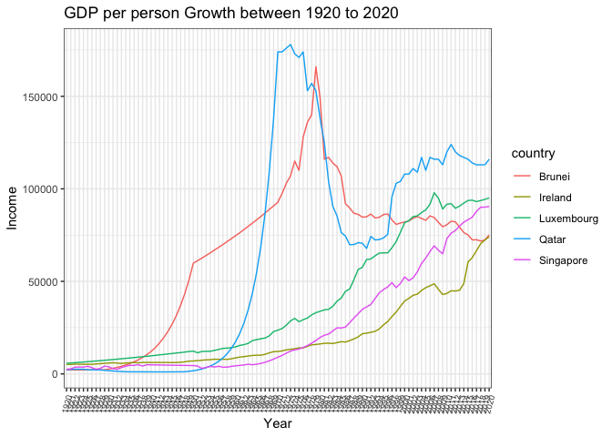
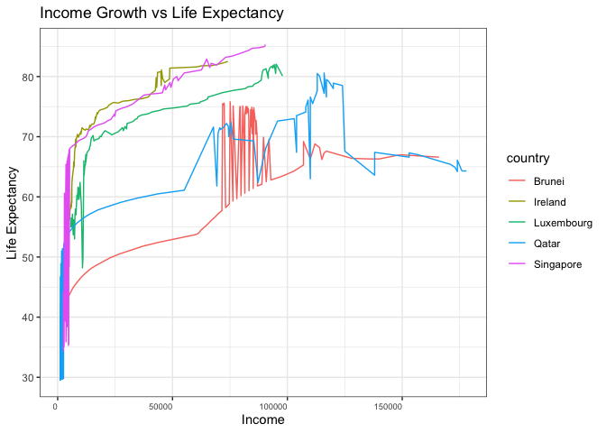

## Instructions
Answer the following questions and complete the exercises in RMarkdown. Please embed all of your code and push your final work to your repository. Your code should be organized, clean, and run free from errors. Be sure to **add your name** to the author header above. You may use any resources to answer these questions (including each other), but you may not post questions to Open Stacks or external help sites. There are 10 total questions.  

Make sure to use the formatting conventions of RMarkdown to make your report neat and clean! Your plots should use consistent aesthetics throughout.  

This exam is due by **12:00p on Tuesday, February 22**.  

## Gapminder
For this assignment, we are going to use data from  [gapminder](https://www.gapminder.org/). Gapminder includes information about economics, population, social issues, and life expectancy from countries all over the world. We will use three data sets, so please load all three as separate objects.    

1. population_total.csv  
2. income_per_person_gdppercapita_ppp_inflation_adjusted.csv  
3. life_expectancy_years.csv  

```r
library(here)
```

```
## here() starts at /Users/lisayuan/Desktop/BIS15W2022_ryuan
```

```r
library(tidyverse)
```

```
## ── Attaching packages ─────────────────────────────────────── tidyverse 1.3.1 ──
```

```
## ✓ ggplot2 3.3.5     ✓ purrr   0.3.4
## ✓ tibble  3.1.6     ✓ dplyr   1.0.8
## ✓ tidyr   1.2.0     ✓ stringr 1.4.0
## ✓ readr   2.1.2     ✓ forcats 0.5.1
```

```
## ── Conflicts ────────────────────────────────────────── tidyverse_conflicts() ──
## x dplyr::filter() masks stats::filter()
## x dplyr::lag()    masks stats::lag()
```

```r
library(readr)
library(janitor)
```

```
## 
## Attaching package: 'janitor'
```

```
## The following objects are masked from 'package:stats':
## 
##     chisq.test, fisher.test
```

```r
options(scipen = 999)
```


```r
population<-read_csv(here("midterm2","data","population_total.csv"))
```

```
## Rows: 195 Columns: 302
## ── Column specification ────────────────────────────────────────────────────────
## Delimiter: ","
## chr   (1): country
## dbl (301): 1800, 1801, 1802, 1803, 1804, 1805, 1806, 1807, 1808, 1809, 1810,...
## 
## ℹ Use `spec()` to retrieve the full column specification for this data.
## ℹ Specify the column types or set `show_col_types = FALSE` to quiet this message.
```

```r
population
```

```
## # A tibble: 195 × 302
##    country `1800` `1801` `1802` `1803` `1804` `1805` `1806` `1807` `1808` `1809`
##    <chr>    <dbl>  <dbl>  <dbl>  <dbl>  <dbl>  <dbl>  <dbl>  <dbl>  <dbl>  <dbl>
##  1 Afghan… 3.28e6 3.28e6 3.28e6 3.28e6 3.28e6 3.28e6 3.28e6 3.28e6 3.28e6 3.28e6
##  2 Albania 4   e5 4.02e5 4.04e5 4.05e5 4.07e5 4.09e5 4.11e5 4.13e5 4.14e5 4.16e5
##  3 Algeria 2.5 e6 2.51e6 2.52e6 2.53e6 2.54e6 2.55e6 2.56e6 2.56e6 2.57e6 2.58e6
##  4 Andorra 2.65e3 2.65e3 2.65e3 2.65e3 2.65e3 2.65e3 2.65e3 2.65e3 2.65e3 2.65e3
##  5 Angola  1.57e6 1.57e6 1.57e6 1.57e6 1.57e6 1.57e6 1.57e6 1.57e6 1.57e6 1.57e6
##  6 Antigu… 3.7 e4 3.7 e4 3.7 e4 3.7 e4 3.7 e4 3.7 e4 3.7 e4 3.7 e4 3.7 e4 3.7 e4
##  7 Argent… 5.34e5 5.2 e5 5.06e5 4.92e5 4.79e5 4.66e5 4.53e5 4.41e5 4.29e5 4.17e5
##  8 Armenia 4.13e5 4.13e5 4.13e5 4.13e5 4.13e5 4.13e5 4.13e5 4.13e5 4.13e5 4.13e5
##  9 Austra… 2   e5 2.05e5 2.11e5 2.16e5 2.22e5 2.27e5 2.33e5 2.39e5 2.46e5 2.52e5
## 10 Austria 3   e6 3.02e6 3.04e6 3.05e6 3.07e6 3.09e6 3.11e6 3.12e6 3.14e6 3.16e6
## # … with 185 more rows, and 291 more variables: `1810` <dbl>, `1811` <dbl>,
## #   `1812` <dbl>, `1813` <dbl>, `1814` <dbl>, `1815` <dbl>, `1816` <dbl>,
## #   `1817` <dbl>, `1818` <dbl>, `1819` <dbl>, `1820` <dbl>, `1821` <dbl>,
## #   `1822` <dbl>, `1823` <dbl>, `1824` <dbl>, `1825` <dbl>, `1826` <dbl>,
## #   `1827` <dbl>, `1828` <dbl>, `1829` <dbl>, `1830` <dbl>, `1831` <dbl>,
## #   `1832` <dbl>, `1833` <dbl>, `1834` <dbl>, `1835` <dbl>, `1836` <dbl>,
## #   `1837` <dbl>, `1838` <dbl>, `1839` <dbl>, `1840` <dbl>, `1841` <dbl>, …
```

```r
income<-read_csv(here("midterm2","data","income_per_person_gdppercapita_ppp_inflation_adjusted.csv"))
```

```
## Rows: 193 Columns: 242
## ── Column specification ────────────────────────────────────────────────────────
## Delimiter: ","
## chr   (1): country
## dbl (241): 1800, 1801, 1802, 1803, 1804, 1805, 1806, 1807, 1808, 1809, 1810,...
## 
## ℹ Use `spec()` to retrieve the full column specification for this data.
## ℹ Specify the column types or set `show_col_types = FALSE` to quiet this message.
```

```r
income
```

```
## # A tibble: 193 × 242
##    country `1800` `1801` `1802` `1803` `1804` `1805` `1806` `1807` `1808` `1809`
##    <chr>    <dbl>  <dbl>  <dbl>  <dbl>  <dbl>  <dbl>  <dbl>  <dbl>  <dbl>  <dbl>
##  1 Afghan…    603    603    603    603    603    603    603    603    603    603
##  2 Albania    667    667    667    667    667    668    668    668    668    668
##  3 Algeria    715    716    717    718    719    720    721    722    723    724
##  4 Andorra   1200   1200   1200   1200   1210   1210   1210   1210   1220   1220
##  5 Angola     618    620    623    626    628    631    634    637    640    642
##  6 Antigu…    757    757    757    757    757    757    757    758    758    758
##  7 Argent…   1640   1640   1650   1650   1660   1660   1670   1680   1680   1690
##  8 Armenia    514    514    514    514    514    514    514    514    514    514
##  9 Austra…    817    822    826    831    836    841    845    850    855    860
## 10 Austria   1850   1850   1860   1870   1880   1880   1890   1900   1910   1920
## # … with 183 more rows, and 231 more variables: `1810` <dbl>, `1811` <dbl>,
## #   `1812` <dbl>, `1813` <dbl>, `1814` <dbl>, `1815` <dbl>, `1816` <dbl>,
## #   `1817` <dbl>, `1818` <dbl>, `1819` <dbl>, `1820` <dbl>, `1821` <dbl>,
## #   `1822` <dbl>, `1823` <dbl>, `1824` <dbl>, `1825` <dbl>, `1826` <dbl>,
## #   `1827` <dbl>, `1828` <dbl>, `1829` <dbl>, `1830` <dbl>, `1831` <dbl>,
## #   `1832` <dbl>, `1833` <dbl>, `1834` <dbl>, `1835` <dbl>, `1836` <dbl>,
## #   `1837` <dbl>, `1838` <dbl>, `1839` <dbl>, `1840` <dbl>, `1841` <dbl>, …
```

```r
life_expectancy<-read.csv(here("midterm2","data","life_expectancy_years.csv"))
life_expectancy
```

```
##                            country X1800 X1801 X1802 X1803 X1804 X1805 X1806
## 1                      Afghanistan  28.2  28.2  28.2  28.2  28.2  28.2  28.1
## 2                          Albania  35.4  35.4  35.4  35.4  35.4  35.4  35.4
## 3                          Algeria  28.8  28.8  28.8  28.8  28.8  28.8  28.8
## 4                          Andorra    NA    NA    NA    NA    NA    NA    NA
## 5                           Angola  27.0  27.0  27.0  27.0  27.0  27.0  27.0
## 6              Antigua and Barbuda  33.5  33.5  33.5  33.5  33.5  33.5  33.5
## 7                        Argentina  33.2  33.2  33.2  33.2  33.2  33.2  33.2
## 8                          Armenia  34.0  34.0  34.0  34.0  34.0  34.0  34.0
## 9                        Australia  34.0  34.0  34.0  34.0  34.0  34.0  34.0
## 10                         Austria  34.4  34.4  34.4  34.4  34.4  34.4  34.4
## 11                      Azerbaijan  29.2  29.2  29.2  29.2  29.2  29.2  29.2
## 12                         Bahamas  35.2  35.2  35.2  35.2  35.2  35.2  35.2
## 13                         Bahrain  30.3  30.3  30.3  30.3  30.3  30.3  30.3
## 14                      Bangladesh  25.5  25.5  25.5  25.5  25.5  25.5  25.5
## 15                        Barbados  32.1  32.1  32.1  32.1  32.1  32.1  32.1
## 16                         Belarus  36.2  36.2  36.2  36.2  36.2  36.2  36.2
## 17                         Belgium  40.0  40.0  40.0  40.0  40.0  40.0  40.0
## 18                          Belize  26.5  26.5  26.5  26.5  26.5  26.5  26.5
## 19                           Benin  31.0  31.0  31.0  31.0  31.0  31.0  31.0
## 20                          Bhutan  28.8  28.8  28.8  28.8  28.8  28.8  28.8
## 21                         Bolivia  33.0  33.0  33.0  33.0  33.0  33.0  33.0
## 22          Bosnia and Herzegovina  35.1  35.1  35.1  35.1  35.1  35.1  35.1
## 23                        Botswana  33.6  33.6  33.6  33.6  33.6  33.6  33.6
## 24                          Brazil  32.0  32.0  32.0  32.0  32.0  32.0  32.0
## 25                          Brunei  29.2  29.2  29.2  29.2  29.2  29.2  29.2
## 26                        Bulgaria  35.8  35.8  35.9  35.9  36.0  36.0  36.1
## 27                    Burkina Faso  29.2  29.2  29.2  29.2  29.2  29.2  29.2
## 28                         Burundi  31.5  31.5  31.5  31.5  31.5  31.5  31.5
## 29                        Cambodia  35.0  35.0  35.0  35.0  35.0  35.0  35.0
## 30                        Cameroon  28.8  28.8  28.8  28.8  28.8  28.8  28.8
## 31                          Canada  39.0  39.0  39.0  39.0  39.0  39.0  39.0
## 32                      Cape Verde  33.8  33.8  33.8  33.8  33.8  33.8  33.8
## 33        Central African Republic  30.0  30.0  30.0  30.0  30.0  30.0  30.0
## 34                            Chad  30.9  30.9  30.9  30.9  30.9  30.9  30.9
## 35                           Chile  32.0  32.0  32.0  32.0  32.0  32.0  32.0
## 36                           China  32.0  32.0  32.0  32.0  32.0  32.0  32.0
## 37                        Colombia  32.0  32.0  32.0  32.0  32.0  32.0  32.0
## 38                         Comoros  32.1  32.1  32.1  32.1  32.1  32.1  32.1
## 39                Congo, Dem. Rep.  31.6  31.6  31.6  31.6  31.6  31.6  31.6
## 40                     Congo, Rep.  32.7  32.7  32.7  32.7  32.7  32.7  32.7
## 41                      Costa Rica  30.2  30.2  30.2  30.2  30.2  30.2  30.2
## 42                   Cote d'Ivoire  31.2  31.2  31.2  31.2  31.2  31.2  31.2
## 43                         Croatia  36.1  36.1  36.1  36.1  36.1  36.1  36.1
## 44                            Cuba  32.2  32.3  32.5  32.6  32.7  32.9  33.0
## 45                          Cyprus  38.5  38.5  38.5  38.5  38.5  38.5  38.5
## 46                  Czech Republic  35.0  35.0  35.0  35.0  35.0  35.0  35.0
## 47                         Denmark  37.4  38.5  44.4  44.8  42.8  43.0  43.8
## 48                        Djibouti  29.9  29.9  29.9  29.9  29.9  29.9  29.9
## 49                        Dominica    NA    NA    NA    NA    NA    NA    NA
## 50              Dominican Republic  29.9  29.9  29.9  29.9  29.9  29.9  29.9
## 51                         Ecuador  32.9  32.9  32.9  32.9  32.9  32.9  32.9
## 52                           Egypt  33.0  33.0  33.0  33.0  33.0  33.0  33.0
## 53                     El Salvador  28.7  28.7  28.7  28.7  28.7  28.7  28.7
## 54               Equatorial Guinea  29.8  29.8  29.8  29.8  29.8  29.8  29.8
## 55                         Eritrea  30.2  30.2  30.2  30.2  30.2  30.2  30.2
## 56                         Estonia  36.1  35.7  35.3  34.8  34.4  33.9  34.1
## 57                        Eswatini  32.3  32.3  32.3  32.3  32.3  32.3  32.3
## 58                        Ethiopia  29.7  29.7  29.7  29.7  29.7  29.7  29.7
## 59                            Fiji  26.1  26.1  26.1  26.1  26.1  26.1  26.1
## 60                         Finland  36.6  40.3  39.2  28.5  35.9  39.8  38.8
## 61                          France  34.0  36.4  34.4  30.6  29.4  34.9  35.0
## 62                           Gabon  30.6  30.6  30.6  30.6  30.6  30.6  30.6
## 63                          Gambia  28.8  28.8  28.8  28.8  28.8  28.8  28.8
## 64                         Georgia  31.9  31.9  31.9  31.9  31.9  31.9  31.9
## 65                         Germany  38.4  38.4  38.4  38.4  38.4  38.4  38.4
## 66                           Ghana  28.0  28.0  28.0  28.0  28.0  28.0  28.0
## 67                          Greece  36.6  36.6  36.6  36.6  36.6  36.6  36.6
## 68                         Grenada  31.4  31.4  31.4  31.4  31.4  31.4  31.4
## 69                       Guatemala  25.8  25.8  25.8  25.8  25.8  25.8  25.8
## 70                          Guinea  29.5  29.5  29.5  29.5  29.5  29.6  29.6
## 71                   Guinea-Bissau  32.0  32.0  32.0  32.0  32.0  32.0  32.0
## 72                          Guyana  31.1  31.1  31.1  31.1  31.1  31.1  31.1
## 73                           Haiti  29.0  29.0  29.0  29.0  29.0  29.0  29.0
## 74                        Honduras  33.9  33.9  33.9  33.9  33.9  33.9  33.9
## 75                         Hungary  36.0  36.0  36.0  36.0  36.0  36.0  36.0
## 76                         Iceland  42.9  33.9  27.6  19.6  24.8  30.9  45.8
## 77                           India  25.4  25.4  25.0  24.0  23.5  25.4  25.4
## 78                       Indonesia  30.0  30.0  30.0  30.0  30.0  30.0  30.0
## 79                            Iran  25.6  25.6  25.6  25.6  25.6  25.6  25.6
## 80                            Iraq  31.2  31.2  31.2  31.2  31.2  31.2  31.2
## 81                         Ireland  38.3  38.3  38.3  38.3  38.3  38.3  38.3
## 82                          Israel  32.0  32.0  32.0  32.0  32.0  32.0  32.0
## 83                           Italy  29.7  29.7  29.7  29.7  29.7  29.7  29.7
## 84                         Jamaica  34.2  34.2  34.2  34.2  34.2  34.2  34.2
## 85                           Japan  36.4  36.4  36.4  36.4  36.4  36.4  36.4
## 86                          Jordan  31.7  31.7  31.7  31.7  31.7  31.7  31.7
## 87                      Kazakhstan  26.2  26.2  26.2  26.2  26.2  26.2  26.2
## 88                           Kenya  25.5  25.5  25.5  25.5  25.5  25.5  25.5
## 89                        Kiribati  24.9  24.9  24.9  24.9  24.9  24.9  24.9
## 90                          Kuwait  26.0  26.0  26.0  26.0  26.0  26.0  26.0
## 91                 Kyrgyz Republic  23.9  23.9  23.9  23.9  23.9  23.9  23.9
## 92                             Lao  31.9  31.9  31.9  31.9  31.9  31.9  31.9
## 93                          Latvia  33.0  33.0  33.0  33.0  33.0  33.0  33.0
## 94                         Lebanon  29.7  29.7  29.7  29.7  29.7  29.7  29.7
## 95                         Lesotho  32.8  32.8  32.8  32.8  32.8  32.8  32.8
## 96                         Liberia  31.1  31.1  31.1  31.1  31.1  31.1  31.1
## 97                           Libya  33.1  33.1  33.1  33.1  33.1  33.1  33.1
## 98                       Lithuania  28.9  28.9  28.9  28.9  28.9  28.9  28.9
## 99                      Luxembourg  36.9  36.9  36.9  36.9  36.9  36.9  36.9
## 100                     Madagascar  30.5  30.5  30.5  30.5  30.5  30.5  30.5
## 101                         Malawi  30.3  30.3  30.3  30.3  30.3  30.3  30.3
## 102                       Malaysia  30.6  30.6  30.6  30.6  30.6  30.6  30.6
## 103                       Maldives  32.6  32.6  32.6  32.6  32.6  32.6  32.6
## 104                           Mali  26.4  26.4  26.4  26.4  26.4  26.4  26.4
## 105                          Malta  28.7  28.7  28.7  28.7  28.7  28.7  28.7
## 106               Marshall Islands    NA    NA    NA    NA    NA    NA    NA
## 107                     Mauritania  32.0  32.0  32.0  32.0  32.0  32.0  32.0
## 108                      Mauritius  28.7  28.7  28.7  28.7  28.7  28.7  28.7
## 109                         Mexico  26.9  26.9  26.9  26.9  26.9  26.9  26.9
## 110          Micronesia, Fed. Sts.  26.7  26.7  26.7  26.7  26.7  26.7  26.7
## 111                        Moldova  33.1  33.1  33.1  33.1  33.1  33.1  33.1
## 112                       Mongolia  31.8  31.8  31.8  31.8  31.8  31.8  31.8
## 113                     Montenegro  35.4  35.4  35.4  35.4  35.4  35.4  35.4
## 114                        Morocco  33.1  33.1  33.1  33.1  33.1  33.1  33.1
## 115                     Mozambique  30.3  30.3  30.3  30.3  30.3  30.3  30.3
## 116                        Myanmar  30.8  30.8  30.8  30.8  30.8  30.8  30.8
## 117                        Namibia  32.4  32.4  32.4  32.4  32.4  32.4  32.4
## 118                          Nepal  32.8  32.8  32.8  32.8  32.8  32.8  32.8
## 119                    Netherlands  39.9  39.9  39.9  39.9  39.9  39.9  39.9
## 120                    New Zealand  34.0  34.0  34.0  34.0  34.0  34.0  34.0
## 121                      Nicaragua  25.4  25.4  25.4  25.4  25.4  25.4  25.4
## 122                          Niger  30.8  30.8  30.8  30.8  30.8  30.8  30.8
## 123                        Nigeria  30.4  30.4  30.4  30.4  30.4  30.4  30.4
## 124                    North Korea  26.0  26.0  26.0  26.0  26.0  26.0  26.0
## 125                North Macedonia  36.1  36.1  36.1  36.1  36.1  36.1  36.1
## 126                         Norway  37.9  35.8  38.4  38.7  40.5  44.3  43.8
## 127                           Oman  32.3  32.3  32.3  32.3  32.3  32.3  32.3
## 128                       Pakistan  25.8  25.8  25.8  25.8  25.8  25.8  25.8
## 129                      Palestine  32.1  32.1  32.1  32.1  32.1  32.1  32.1
## 130                         Panama  32.9  32.9  32.9  32.9  32.9  32.9  32.9
## 131               Papua New Guinea  31.5  31.5  31.5  31.5  31.5  31.5  31.5
## 132                       Paraguay  35.5  35.5  35.5  35.5  35.5  35.5  35.5
## 133                           Peru  35.7  35.7  35.7  35.7  35.7  35.7  35.7
## 134                    Philippines  30.9  30.9  30.9  30.9  30.9  30.9  30.9
## 135                         Poland  35.9  35.9  35.9  35.9  35.9  35.9  35.9
## 136                       Portugal  35.6  35.6  35.6  35.6  35.6  35.6  35.6
## 137                          Qatar  30.8  30.8  30.8  30.8  30.8  30.8  30.8
## 138                        Romania  35.7  35.7  35.7  35.7  35.7  35.7  35.7
## 139                         Russia  29.6  29.6  29.6  29.6  29.6  29.6  29.6
## 140                         Rwanda  31.8  25.0  25.0  31.8  31.8  31.8  31.8
## 141                          Samoa  25.4  25.4  25.4  25.4  25.4  25.4  25.4
## 142          Sao Tome and Principe  31.0  31.0  31.0  31.0  31.0  31.0  31.0
## 143                   Saudi Arabia  32.1  32.1  32.1  32.1  32.1  32.1  32.1
## 144                        Senegal  25.2  25.2  25.2  25.2  25.2  25.2  25.2
## 145                         Serbia  35.5  35.5  35.5  35.5  35.5  35.5  35.5
## 146                     Seychelles  37.0  37.0  37.0  37.0  37.0  37.0  37.0
## 147                   Sierra Leone  25.1  25.1  25.1  25.1  25.1  25.1  25.1
## 148                      Singapore  29.1  29.1  29.1  29.1  29.1  29.1  29.1
## 149                Slovak Republic  36.4  36.4  36.4  36.4  36.4  36.4  36.4
## 150                       Slovenia  36.6  36.6  36.6  36.6  36.6  36.6  36.6
## 151                Solomon Islands  25.1  25.1  25.1  25.1  25.1  25.1  25.1
## 152                        Somalia  29.4  29.4  29.4  29.4  29.4  29.4  29.4
## 153                   South Africa  33.5  33.5  33.5  33.5  33.5  33.5  33.5
## 154                    South Korea  25.8  25.8  25.8  25.8  25.8  25.8  25.8
## 155                    South Sudan  26.7  26.7  26.7  26.7  26.7  26.7  26.7
## 156                          Spain  29.5  29.5  29.5  29.5  29.5  29.5  29.5
## 157                      Sri Lanka  32.6  32.6  32.6  32.6  32.6  32.6  32.6
## 158                      St. Lucia  28.0  28.0  28.0  28.0  28.0  28.0  28.0
## 159 St. Vincent and the Grenadines  26.0  26.0  26.0  26.0  26.0  26.0  26.0
## 160                          Sudan  31.4  31.4  31.4  31.4  31.4  31.4  31.4
## 161                       Suriname  32.9  32.9  32.9  32.9  32.9  32.9  32.9
## 162                         Sweden  32.2  36.9  40.2  40.3  39.7  41.0  36.2
## 163                    Switzerland  38.0  38.0  38.0  38.0  38.0  38.0  38.0
## 164                          Syria  31.1  31.1  31.1  31.1  31.1  31.1  31.1
## 165                     Tajikistan  24.2  24.2  24.2  24.2  24.2  24.2  24.2
## 166                       Tanzania  32.2  32.2  32.2  32.2  32.2  32.2  32.2
## 167                       Thailand  30.4  30.4  30.4  30.4  30.4  30.4  30.4
## 168                    Timor-Leste  28.9  28.9  28.9  28.9  28.9  28.9  28.9
## 169                           Togo  31.3  31.3  31.3  31.3  31.3  31.3  31.3
## 170                          Tonga  28.2  28.2  28.2  28.2  28.2  28.2  28.2
## 171            Trinidad and Tobago  32.9  32.9  32.9  32.9  32.9  32.9  32.9
## 172                        Tunisia  28.8  28.8  28.8  28.8  28.8  28.8  28.8
## 173                         Turkey  35.0  35.0  35.0  35.0  35.0  35.0  35.0
## 174                   Turkmenistan  24.0  24.0  24.0  24.0  24.0  24.0  24.0
## 175                         Uganda  25.3  25.3  25.3  25.3  25.3  25.3  25.3
## 176                        Ukraine  36.6  36.6  36.6  36.6  36.6  36.6  36.6
## 177           United Arab Emirates  30.7  30.7  30.7  30.7  30.7  30.7  30.7
## 178                 United Kingdom  38.6  37.4  38.6  37.3  41.4  42.3  43.2
## 179                  United States  39.4  39.4  39.4  39.4  39.4  39.4  39.4
## 180                        Uruguay  32.9  32.9  32.9  32.9  32.9  32.9  32.9
## 181                     Uzbekistan  26.9  26.9  26.9  26.9  26.9  26.9  26.9
## 182                        Vanuatu  24.3  24.3  24.3  24.3  24.3  24.3  24.3
## 183                      Venezuela  32.2  32.2  32.2  32.2  32.2  32.2  32.2
## 184                        Vietnam  32.0  32.0  32.0  32.0  32.0  32.0  32.0
## 185                          Yemen  23.4  23.4  23.4  23.4  23.4  23.4  23.4
## 186                         Zambia  32.6  32.6  32.6  32.6  32.6  32.6  32.6
## 187                       Zimbabwe  33.7  33.7  33.7  33.7  33.7  33.7  33.7
##     X1807 X1808 X1809 X1810 X1811 X1812 X1813 X1814 X1815 X1816 X1817 X1818
## 1    28.1  28.1  28.1  28.1  28.1  28.1  28.1  28.1  28.1  28.1  28.0  28.0
## 2    35.4  35.4  35.4  35.4  35.4  35.4  35.4  35.4  35.4  35.4  35.4  35.4
## 3    28.8  28.8  28.8  28.8  28.8  28.8  28.8  28.8  28.8  28.8  28.8  28.8
## 4      NA    NA    NA    NA    NA    NA    NA    NA    NA    NA    NA    NA
## 5    27.0  27.0  27.0  27.0  27.0  27.0  27.0  27.0  27.0  27.0  27.0  27.0
## 6    33.5  33.5  33.5  33.5  33.5  33.5  33.5  33.5  33.5  33.5  33.5  33.5
## 7    33.2  33.2  33.2  33.2  33.2  33.2  33.2  33.2  33.2  33.2  33.2  33.2
## 8    34.0  34.0  34.0  34.0  34.0  34.0  34.0  34.0  34.0  34.0  34.0  34.0
## 9    34.0  34.0  34.0  34.0  34.0  34.0  34.0  34.0  34.0  34.0  34.0  34.0
## 10   34.4  34.4  34.4  34.4  34.4  34.4  34.4  34.4  34.4  34.4  34.4  34.4
## 11   29.2  29.2  29.2  29.2  29.2  29.2  29.2  29.2  29.2  29.2  29.2  29.2
## 12   35.2  35.2  35.2  35.2  35.2  35.2  35.2  35.2  35.2  35.2  35.2  35.2
## 13   30.3  30.3  30.3  30.3  30.3  30.3  30.3  30.3  30.3  30.3  30.3  30.3
## 14   25.5  25.5  25.5  25.5  25.5  25.5  25.5  25.5  25.5  25.5  25.5  25.5
## 15   32.1  32.1  32.1  32.1  32.1  32.1  32.1  32.1  32.1  32.1  32.1  32.1
## 16   36.2  36.2  36.2  36.2  36.2  36.2  36.2  36.2  36.2  36.2  36.2  36.2
## 17   40.1  40.1  40.1  40.1  40.1  40.1  40.1  40.1  40.1  40.1  40.1  40.1
## 18   26.5  26.5  26.5  26.5  26.5  26.5  26.5  26.5  26.5  26.5  26.5  26.5
## 19   31.0  31.0  31.0  31.0  31.0  31.0  31.0  31.0  31.0  31.0  31.0  31.0
## 20   28.8  28.8  28.8  28.8  28.8  28.8  28.8  28.8  28.8  28.8  28.8  28.8
## 21   33.0  33.0  33.0  33.0  33.0  33.0  33.0  33.0  33.0  33.0  33.0  33.0
## 22   35.1  35.1  35.1  35.1  35.1  35.1  35.1  35.1  35.1  35.1  35.1  35.1
## 23   33.6  33.6  33.6  33.6  33.6  33.6  33.6  33.6  33.6  33.6  33.6  33.6
## 24   32.0  32.0  32.0  32.0  32.0  32.0  32.0  32.0  32.0  32.0  32.0  32.0
## 25   29.2  29.2  29.2  29.2  29.2  29.2  29.2  29.2  29.2  29.2  29.2  29.2
## 26   36.1  36.1  36.2  36.2  36.3  36.3  36.4  36.4  36.5  36.5  36.5  36.6
## 27   29.2  29.2  29.2  29.2  29.2  29.2  29.2  29.2  29.2  29.2  29.2  29.2
## 28   31.5  31.5  31.5  31.5  31.5  31.5  31.5  31.5  31.5  31.5  31.5  31.5
## 29   35.0  35.0  35.0  35.0  35.0  35.0  35.0  35.0  35.0  35.0  35.0  35.0
## 30   28.8  28.8  28.8  28.8  28.8  28.8  28.8  28.8  28.8  28.8  28.8  28.8
## 31   39.0  39.0  39.0  39.0  39.0  39.0  39.0  39.0  39.0  39.0  39.0  39.0
## 32   33.8  33.8  33.8  33.8  33.8  33.8  33.8  33.8  33.8  33.8  33.8  33.8
## 33   30.0  30.0  30.0  30.0  30.0  30.0  30.0  30.0  30.0  30.0  30.0  30.0
## 34   30.9  30.9  30.9  30.9  30.9  30.9  30.9  30.9  30.9  30.9  30.9  30.9
## 35   32.0  32.0  32.0  32.0  32.0  32.0  32.0  32.0  32.0  32.0  32.0  32.0
## 36   32.0  32.0  32.0  32.0  32.0  32.0  32.0  32.0  32.0  32.0  32.0  32.0
## 37   32.0  32.0  32.0  32.0  32.0  32.0  32.0  32.0  32.0  32.0  32.0  32.0
## 38   32.1  32.1  32.1  32.1  32.1  32.1  32.1  32.1  32.1  32.1  32.1  32.1
## 39   31.6  31.6  31.6  31.6  31.6  31.6  31.6  31.6  31.6  31.6  31.6  31.6
## 40   32.7  32.7  32.7  32.7  32.7  32.7  32.7  32.7  32.7  32.7  32.7  32.7
## 41   30.2  30.2  30.2  30.2  30.2  30.2  30.2  30.2  30.2  30.2  30.2  30.2
## 42   31.2  31.2  31.2  31.2  31.2  31.2  31.2  31.2  31.2  31.2  31.2  31.2
## 43   36.1  36.1  36.1  36.1  36.1  36.1  36.1  36.1  36.1  36.1  36.1  36.1
## 44   33.2  33.3  33.5  33.6  33.8  33.9  34.1  34.2  34.3  34.4  34.5  34.6
## 45   38.5  38.5  38.5  38.5  38.5  38.5  38.5  38.5  38.5  38.5  38.5  38.5
## 46   35.0  35.0  35.0  35.0  35.0  35.0  35.0  35.0  35.0  35.0  35.0  35.0
## 47   42.6  39.4  39.2  41.7  39.3  36.0  40.9  38.8  42.7  44.1  46.5  46.4
## 48   29.9  29.9  29.9  29.9  29.9  29.9  29.9  29.9  29.9  29.9  29.9  29.9
## 49     NA    NA    NA    NA    NA    NA    NA    NA    NA    NA    NA    NA
## 50   29.9  29.9  29.9  29.9  29.9  29.9  29.9  29.9  29.9  29.9  29.9  29.9
## 51   32.9  32.9  32.9  32.9  32.9  32.9  32.9  32.9  32.9  32.9  32.9  32.9
## 52   33.0  33.0  33.0  33.0  33.0  33.0  33.0  33.0  33.0  33.0  33.0  33.0
## 53   28.7  28.7  28.7  28.7  28.7  28.7  28.7  28.7  28.7  28.7  28.7  28.7
## 54   29.8  29.8  29.8  29.8  29.8  29.8  29.8  29.8  29.8  29.8  29.8  29.8
## 55   30.2  30.2  30.2  30.2  30.2  30.2  30.2  30.2  30.2  30.2  30.2  30.2
## 56   34.3  34.5  34.7  34.9  35.5  36.1  36.8  37.4  38.0  39.1  40.2  41.2
## 57   32.3  32.3  32.3  32.3  32.3  32.3  32.3  32.3  32.3  32.3  32.3  32.3
## 58   29.7  29.7  29.7  29.7  29.7  29.7  29.7  29.7  29.7  29.7  29.7  29.7
## 59   26.1  26.1  26.1  26.1  26.1  26.1  26.1  26.1  26.1  26.1  26.1  26.1
## 60   36.6  12.5  13.4  37.0  30.7  37.6  34.2  35.0  35.7  38.7  38.1  37.2
## 61   34.2  34.5  35.0  37.4  36.1  31.7  31.2  30.1  36.5  40.0  39.2  38.5
## 62   30.6  30.6  30.6  30.6  30.6  30.6  30.6  30.6  30.6  30.6  30.6  30.6
## 63   28.8  28.8  28.8  28.8  28.8  28.8  28.8  28.8  28.8  28.8  28.8  28.8
## 64   31.9  31.9  31.9  31.9  31.9  31.9  31.9  31.9  31.9  31.9  31.9  31.9
## 65   38.4  38.4  38.4  38.4  38.4  38.4  38.4  38.4  38.4  38.4  38.4  38.4
## 66   28.0  28.0  28.0  28.0  28.0  28.0  28.0  28.0  28.0  28.0  28.0  28.0
## 67   36.6  36.6  36.6  36.6  36.6  36.6  36.6  36.6  36.6  36.6  36.6  36.6
## 68   31.4  31.4  31.4  31.4  31.4  31.4  31.4  31.4  31.4  31.4  31.4  31.4
## 69   25.8  25.8  25.8  25.8  25.8  25.8  25.8  25.8  25.8  25.8  25.8  25.8
## 70   29.6  29.6  29.6  29.6  29.6  29.6  29.6  29.6  29.7  29.7  29.7  29.7
## 71   32.0  32.0  32.0  32.0  32.0  32.0  32.0  32.0  32.0  32.0  32.0  32.0
## 72   31.1  31.1  31.1  31.1  31.1  31.1  31.1  31.1  31.1  31.1  31.1  31.1
## 73   29.0  29.0  29.0  29.0  29.0  29.0  29.0  29.0  29.0  29.0  29.0  29.0
## 74   33.9  33.9  33.9  33.9  33.9  33.9  33.9  33.9  33.9  33.9  33.9  33.9
## 75   36.0  36.0  36.0  36.0  36.0  36.0  36.0  36.0  36.0  36.0  36.0  36.0
## 76   43.6  43.5  40.4  43.1  38.6  33.7  33.3  37.2  45.1  31.1  45.6  43.5
## 77   25.4  25.4  25.4  25.4  25.4  23.0  25.4  25.4  25.4  25.4  25.4  25.4
## 78   30.0  30.0  30.0  30.0  30.0  30.0  30.0  30.0  30.0  30.0  30.0  30.0
## 79   25.6  25.6  25.6  25.6  25.6  25.6  25.6  25.6  25.6  25.6  25.6  25.6
## 80   31.2  31.2  31.2  31.2  31.2  31.2  31.2  31.2  31.2  31.2  31.2  31.2
## 81   38.3  38.3  38.3  38.3  38.3  38.3  38.3  38.3  38.3  38.3  38.3  38.3
## 82   32.0  32.0  32.0  32.0  32.0  32.0  32.0  32.0  32.0  32.0  32.0  32.0
## 83   29.7  29.7  29.7  29.7  29.7  29.7  29.7  29.7  29.7  29.7  29.7  29.7
## 84   34.2  34.2  34.2  34.2  34.2  34.2  34.2  34.2  34.2  34.2  34.2  34.2
## 85   36.4  36.4  36.4  36.4  36.4  36.4  36.4  36.4  36.4  36.4  36.4  36.4
## 86   31.7  31.7  31.7  31.7  31.7  31.7  31.7  31.7  31.7  31.7  31.7  31.7
## 87   26.2  26.2  26.2  26.2  26.2  26.2  26.2  26.2  26.2  26.2  26.2  26.2
## 88   25.5  25.5  25.5  25.5  25.5  25.5  25.5  25.5  25.5  25.5  25.5  25.5
## 89   24.9  24.9  24.9  24.9  24.9  24.9  24.9  24.9  24.9  24.9  24.9  24.9
## 90   26.0  26.0  26.0  26.0  26.0  26.0  26.0  26.0  26.0  26.0  26.0  26.0
## 91   23.9  23.9  23.9  23.9  23.9  23.9  23.9  23.9  23.9  23.9  23.9  23.9
## 92   31.9  31.9  31.9  31.9  31.9  31.9  31.9  31.9  31.9  31.9  31.9  31.9
## 93   33.0  33.0  33.0  33.0  33.0  33.0  33.0  33.0  33.0  33.0  33.0  33.0
## 94   29.7  29.7  29.7  29.7  29.7  29.7  29.7  29.7  29.7  29.7  29.7  29.7
## 95   32.8  32.8  32.8  32.8  32.8  32.8  32.8  32.8  32.8  32.8  32.8  32.8
## 96   31.1  31.1  31.1  31.1  31.1  31.1  31.1  31.1  31.1  31.1  31.1  31.1
## 97   33.1  33.1  33.1  33.1  33.1  33.1  33.1  33.1  33.1  33.1  33.1  33.1
## 98   28.9  28.9  28.9  28.9  28.9  28.9  28.9  28.9  28.9  28.9  28.9  28.9
## 99   36.9  36.9  36.9  36.9  36.9  36.9  36.9  36.9  36.9  36.9  36.9  36.9
## 100  30.5  30.5  30.5  30.5  30.5  30.5  30.5  30.5  30.5  30.5  30.5  30.5
## 101  30.3  30.3  30.3  30.3  30.3  30.3  30.3  30.3  30.3  30.3  30.3  30.3
## 102  30.6  30.6  30.6  30.6  30.6  30.6  30.6  30.6  30.6  30.6  30.6  30.6
## 103  32.6  32.6  32.6  32.6  32.6  32.6  32.6  32.6  32.6  32.6  32.6  32.6
## 104  26.4  26.4  26.4  26.4  26.4  26.4  26.4  26.4  26.4  26.4  26.4  26.4
## 105  28.7  28.7  28.7  28.7  28.7  28.7  28.7  28.7  28.7  28.7  28.7  28.7
## 106    NA    NA    NA    NA    NA    NA    NA    NA    NA    NA    NA    NA
## 107  32.0  32.0  32.0  32.0  32.0  32.0  32.0  32.0  32.0  32.0  32.0  32.0
## 108  28.7  28.7  28.7  28.7  28.7  28.7  28.7  28.7  28.7  28.7  28.7  28.7
## 109  26.9  26.9  26.9  26.9  26.9  26.9  26.9  26.9  26.9  26.9  26.9  26.9
## 110  26.7  26.7  26.7  26.7  26.7  26.7  26.7  26.7  26.7  26.7  26.7  26.7
## 111  33.1  33.1  33.1  33.1  33.1  33.1  33.1  33.1  33.1  33.1  33.1  33.1
## 112  31.8  31.8  31.8  31.8  31.8  31.8  31.8  31.8  31.8  31.8  31.8  31.8
## 113  35.4  35.4  35.4  35.4  35.4  35.4  35.4  35.4  35.4  35.4  35.4  35.4
## 114  33.1  33.1  33.1  33.1  33.1  33.1  33.1  33.1  33.1  33.1  33.1  33.1
## 115  30.3  30.3  30.3  30.3  30.3  30.3  30.3  30.3  30.3  30.3  30.3  30.3
## 116  30.8  30.8  30.8  30.8  30.8  30.8  30.8  30.8  30.8  30.8  30.8  30.8
## 117  32.4  32.4  32.4  32.4  32.4  32.4  32.4  32.4  32.4  32.4  32.4  32.4
## 118  32.8  32.8  32.8  32.8  32.8  32.8  32.8  32.8  32.8  32.8  32.8  32.8
## 119  39.9  39.9  39.9  39.9  39.9  39.9  39.9  39.9  39.9  39.9  39.9  39.9
## 120  34.0  34.0  34.0  34.0  34.0  34.0  34.0  34.0  34.0  34.0  34.0  34.0
## 121  25.4  25.4  25.4  25.4  25.4  25.4  25.4  25.4  25.4  25.4  25.4  25.4
## 122  30.8  30.8  30.8  30.8  30.8  30.8  30.8  30.8  30.8  30.8  30.8  30.8
## 123  30.4  30.4  30.4  30.4  30.4  30.4  30.4  30.4  30.4  30.4  30.4  30.4
## 124  26.0  26.0  26.0  26.0  26.0  26.0  26.0  26.0  26.0  26.0  26.0  26.0
## 125  36.1  36.1  36.1  36.1  36.1  36.1  36.1  36.1  36.1  36.1  36.1  36.1
## 126  41.8  37.3  27.2  36.5  38.0  43.5  33.5  41.7  45.6  46.3  48.9  46.8
## 127  32.3  32.3  32.3  32.3  32.3  32.3  32.3  32.3  32.3  32.3  32.3  32.3
## 128  25.8  25.8  25.8  25.8  25.8  23.3  25.8  25.8  25.8  25.8  25.8  25.8
## 129  32.1  32.1  32.1  32.1  32.1  32.1  32.1  32.1  32.1  32.1  32.1  32.1
## 130  32.9  32.9  32.9  32.9  32.9  32.9  32.9  32.9  32.9  32.9  32.9  32.9
## 131  31.5  31.5  31.5  31.5  31.5  31.5  31.5  31.5  31.5  31.5  31.5  31.5
## 132  35.5  35.5  35.5  35.5  35.5  35.5  35.5  35.5  35.5  35.5  35.5  35.5
## 133  35.7  35.7  35.7  35.7  35.7  35.7  35.7  35.7  35.7  35.7  35.7  35.7
## 134  30.9  30.9  30.9  30.9  30.9  30.9  30.9  30.9  30.9  30.9  30.9  30.9
## 135  35.9  35.9  35.9  35.9  35.9  35.9  35.9  35.9  35.9  35.9  35.9  35.9
## 136  35.6  35.6  35.6  35.6  35.6  35.6  35.6  35.6  35.6  35.6  35.6  35.6
## 137  30.8  30.8  30.8  30.8  30.8  30.8  30.8  30.8  30.8  30.8  30.8  30.8
## 138  35.7  35.7  35.7  35.7  35.7  35.7  35.7  35.7  35.7  35.7  35.7  35.7
## 139  29.6  29.6  29.6  29.6  29.6  29.6  29.6  29.6  29.6  29.6  29.6  29.6
## 140  31.8  31.8  31.8  31.8  31.8  31.8  31.8  31.8  31.8  31.8  31.8  31.8
## 141  25.4  25.4  25.4  25.4  25.4  25.4  25.4  25.4  25.4  25.4  25.4  25.4
## 142  31.0  31.0  31.0  31.0  31.0  31.0  31.0  31.0  31.0  31.0  31.0  31.0
## 143  32.1  32.1  32.1  32.1  32.1  32.1  32.1  32.1  32.1  32.1  32.1  32.1
## 144  25.2  25.2  25.2  25.2  25.2  25.2  25.2  25.2  25.2  25.2  25.2  25.2
## 145  35.5  35.5  35.5  35.5  35.5  35.5  35.5  35.5  35.5  35.5  35.5  35.5
## 146  37.0  37.0  37.0  37.0  37.0  37.0  37.0  37.0  37.0  37.0  37.0  37.0
## 147  25.1  25.1  25.1  25.1  25.1  25.1  25.1  25.1  25.1  25.1  25.1  25.1
## 148  29.1  29.1  29.1  29.1  29.1  29.1  29.1  29.1  29.1  29.1  29.1  29.1
## 149  36.4  36.4  36.4  36.4  36.4  36.4  36.4  36.4  36.4  36.4  36.4  36.4
## 150  36.6  36.6  36.6  36.6  36.6  36.6  36.6  36.6  36.6  36.6  36.6  36.6
## 151  25.1  25.1  25.1  25.1  25.1  25.1  25.1  25.1  25.1  25.1  25.1  25.1
## 152  29.4  29.4  29.4  29.4  29.4  29.4  29.4  29.4  29.4  29.4  29.4  29.4
## 153  33.5  33.5  33.5  33.5  33.5  33.5  33.5  33.5  33.5  33.5  33.5  33.5
## 154  25.8  25.8  25.8  25.8  25.8  25.8  25.8  25.8  25.8  25.8  25.8  25.8
## 155  26.7  26.7  26.7  26.7  26.7  26.7  26.7  26.7  26.7  26.7  26.7  26.7
## 156  29.5  29.5  29.5  29.5  29.5  29.5  29.5  29.5  29.5  29.5  29.5  29.5
## 157  32.6  32.6  32.6  32.6  32.6  32.6  32.6  32.6  32.6  32.6  32.6  32.6
## 158  28.0  28.0  28.0  28.0  28.0  28.0  28.0  28.0  28.0  28.0  28.0  28.0
## 159  26.0  26.0  26.0  26.0  26.0  26.0  26.0  26.0  26.0  26.0  26.0  26.0
## 160  31.4  31.4  31.4  31.4  31.4  31.4  31.4  31.4  31.4  31.4  31.4  31.4
## 161  32.9  32.9  32.9  32.9  32.9  32.9  32.9  32.9  32.9  32.9  32.9  32.9
## 162  38.8  30.1  26.9  32.0  34.6  35.1  36.5  38.6  40.4  41.7  40.3  40.0
## 163  38.0  38.0  38.0  38.0  38.0  38.0  38.0  38.0  38.0  38.0  38.0  38.0
## 164  31.1  31.1  31.1  31.1  31.1  31.1  31.1  31.1  31.1  31.1  31.1  31.1
## 165  24.2  24.2  24.2  24.2  24.2  24.2  24.2  24.2  24.2  24.2  24.2  24.2
## 166  32.2  32.2  32.2  32.2  32.2  32.2  32.2  32.2  32.2  32.2  32.2  32.2
## 167  30.4  30.4  30.4  30.4  30.4  30.4  30.4  30.4  30.4  30.4  30.4  30.4
## 168  28.9  28.9  28.9  28.9  28.9  28.9  28.9  28.9  28.9  28.9  28.9  28.9
## 169  31.3  31.3  31.3  31.3  31.3  31.3  31.3  31.3  31.3  31.3  31.3  31.3
## 170  28.2  28.2  28.2  28.2  28.2  28.2  28.2  28.2  28.2  28.2  28.2  28.2
## 171  32.9  32.9  32.9  32.9  32.9  32.9  32.9  32.9  32.9  32.9  32.9  32.9
## 172  28.8  28.8  28.8  28.8  28.8  28.8  28.8  28.8  28.8  28.8  28.8   5.5
## 173  35.0  35.0  35.0  35.0  35.0  35.0  35.0  35.0  35.0  35.0  35.0  35.0
## 174  24.0  24.0  24.0  24.0  24.0  24.0  24.0  24.0  24.0  24.0  24.0  24.0
## 175  25.3  25.3  25.3  25.3  25.3  25.3  25.3  25.3  25.3  25.3  25.3  25.3
## 176  36.6  36.6  36.6  36.6  36.6  36.6  36.6  36.6  36.6  36.6  36.6  36.6
## 177  30.7  30.7  30.7  30.7  30.7  30.7  30.7  30.7  30.7  30.7  30.7  30.7
## 178  40.0  40.4  41.7  38.4  39.9  41.8  43.0  40.2  41.1  39.9  41.0  39.9
## 179  39.4  39.4  39.4  39.4  39.4  39.4  39.4  39.4  39.4  39.4  39.4  39.4
## 180  32.9  32.9  32.9  32.9  32.9  32.9  32.9  32.9  32.9  32.9  32.9  32.9
## 181  26.9  26.9  26.9  26.9  26.9  26.9  26.9  26.9  26.9  26.9  26.9  26.9
## 182  24.3  24.3  24.3  24.3  24.3  24.3  24.3  24.3  24.3  24.3  24.3  24.3
## 183  32.2  32.2  32.2  32.2  32.2  32.2  32.2  32.2  32.2  32.2  32.2  32.2
## 184  32.0  32.0  32.0  32.0  32.0  32.0  32.0  32.0  32.0  32.0  32.0  32.0
## 185  23.4  23.4  23.4  23.4  23.4  23.4  23.4  23.4  23.4  23.4  23.4  23.4
## 186  32.6  32.6  32.6  32.6  32.6  32.6  32.6  32.6  32.6  32.6  32.6  32.6
## 187  33.7  33.7  33.7  33.7  33.7  33.7  33.7  33.7  33.7  33.7  33.7  33.7
##     X1819 X1820 X1821 X1822 X1823 X1824 X1825 X1826 X1827 X1828 X1829 X1830
## 1    28.0  28.0  28.0  28.0  28.0  28.0  27.9  27.9  27.9  27.9  27.9  27.9
## 2    35.4  35.4  35.4  35.4  35.4  35.4  35.4  35.4  35.4  35.4  35.4  35.4
## 3    28.8  28.8  28.8  28.8  28.8  28.8  28.8  28.8  28.8  28.8  28.8  28.8
## 4      NA    NA    NA    NA    NA    NA    NA    NA    NA    NA    NA    NA
## 5    27.0  27.0  27.0  27.0  27.0  27.0  27.0  27.0  27.0  27.0  27.0  27.0
## 6    33.5  33.5  33.5  33.5  33.5  33.5  33.5  33.5  33.5  33.5  33.5  33.5
## 7    33.2  33.2  33.2  33.2  33.2  33.2  33.2  33.2  33.2  33.2  33.2  33.2
## 8    34.0  34.0  34.0  34.0  34.0  34.0  34.0  34.0  34.0  34.0  34.0  34.0
## 9    34.0  34.0  34.0  34.0  34.0  34.0  34.0  34.0  34.0  34.0  34.0  34.0
## 10   34.4  34.4  34.4  34.4  34.4  34.4  34.4  34.4  34.4  34.4  34.4  34.4
## 11   29.2  29.2  29.2  29.2  29.2  29.2  29.2  29.2  29.2  29.2  29.2  29.2
## 12   35.2  35.2  35.2  35.2  35.2  35.2  35.2  35.2  35.2  35.2  35.2  35.2
## 13   30.3  30.3  30.3  30.3  30.3  30.3  30.3  30.3  30.3  30.3  30.3  30.3
## 14   25.5  25.5  25.5  25.5  25.5  25.5  25.5  25.5  25.5  25.5  25.5  25.5
## 15   32.1  32.1  32.1  32.1  32.1  32.1  32.1  32.1  32.1  32.1  32.1  32.1
## 16   36.2  36.2  36.2  36.2  36.2  36.2  36.2  36.2  36.2  36.2  36.2  36.2
## 17   40.1  40.2  40.2  40.2  40.2  40.2  40.2  40.2  40.2  40.2  40.2  40.2
## 18   26.5  26.5  26.5  26.5  26.5  26.5  26.5  26.5  26.5  26.5  26.5  26.5
## 19   31.0  31.0  31.0  31.0  31.0  31.0  31.0  31.0  31.0  31.0  31.0  31.0
## 20   28.8  28.8  28.8  28.8  28.8  28.8  28.8  28.8  28.8  28.8  28.8  28.8
## 21   33.0  33.0  33.0  33.0  33.0  33.0  33.0  33.0  33.0  33.0  33.0  33.0
## 22   35.1  35.1  35.1  35.1  35.1  35.1  35.1  35.1  35.1  35.1  35.1  35.1
## 23   33.6  33.6  33.6  33.6  33.6  33.6  33.6  33.6  33.6  33.6  33.6  33.6
## 24   32.0  32.0  32.0  32.0  32.0  32.0  32.0  32.0  32.0  32.0  32.0  32.0
## 25   29.2  29.2  29.2  29.2  29.2  29.2  29.2  29.2  29.2  29.2  29.2  29.2
## 26   36.6  36.7  36.7  36.8  36.8  36.9  36.9  36.9  37.0  37.0  37.1  37.1
## 27   29.2  29.2  29.2  29.2  29.2  29.2  29.2  29.2  29.2  29.2  29.2  29.2
## 28   31.5  31.5  31.5  31.5  31.5  31.5  31.5  31.5  31.5  31.5  31.5  31.5
## 29   35.0  35.0  35.0  35.0  35.0  35.0  35.0  35.0  35.0  35.0  35.0  35.0
## 30   28.8  28.8  28.8  28.8  28.8  28.8  28.8  28.8  28.8  28.8  28.8  28.8
## 31   39.0  39.0  39.0  39.0  39.0  39.0  39.0  39.0  39.0  39.0  39.0  39.0
## 32   33.8  33.8  33.8  33.8  33.8  33.8  33.8  33.8  33.8  33.8  33.8  33.8
## 33   30.0  30.0  30.0  30.0  30.0  30.0  30.0  30.0  30.0  30.0  30.0  30.0
## 34   30.9  30.9  30.9  30.9  30.9  30.9  30.9  30.9  30.9  30.9  30.9  30.9
## 35   32.0  32.0  32.0  32.0  32.0  32.0  32.0  32.0  32.0  32.0  32.0  32.0
## 36   32.0  32.0  32.0  32.0  32.0  32.0  32.0  32.0  32.0  32.0  32.0  32.0
## 37   32.0  32.0  32.0  32.0  32.0  32.0  32.0  32.0  32.0  32.0  32.0  32.0
## 38   32.1  32.1  32.1  32.1  32.1  32.1  32.1  32.1  32.1  32.1  32.1  32.1
## 39   31.6  31.6  31.6  31.6  31.6  31.6  31.6  31.6  31.6  31.6  31.6  31.6
## 40   32.7  32.7  32.7  32.7  32.7  32.7  32.7  32.7  32.7  32.7  32.7  32.7
## 41   30.2  30.2  30.2  30.2  30.2  30.2  30.2  30.2  30.2  30.2  30.2  30.2
## 42   31.2  31.2  31.2  31.2  31.2  31.2  31.2  31.2  31.2  31.2  31.2  31.2
## 43   36.1  36.1  36.1  36.1  36.1  36.1  36.1  36.1  36.1  36.1  36.1  36.1
## 44   34.7  35.0  35.4  35.7  36.1  36.4  36.2  36.1  35.9  35.8  35.6  35.7
## 45   38.5  38.5  38.5  38.5  38.5  38.5  38.5  38.5  38.5  38.5  38.5  38.5
## 46   35.0  35.0  35.0  35.0  35.0  35.0  35.0  35.0  35.0  35.0  35.0  35.0
## 47   45.3  43.1  39.0  43.4  46.4  44.6  43.1  40.3  41.1  36.6  31.0  34.1
## 48   29.9  29.9  29.9  29.9  29.9  29.9  29.9  29.9  29.9  29.9  29.9  29.9
## 49     NA    NA    NA    NA    NA    NA    NA    NA    NA    NA    NA    NA
## 50   29.9  29.9  29.9  29.9  29.9  29.9  29.9  29.9  29.9  29.9  29.9  29.9
## 51   32.9  32.9  32.9  32.9  32.9  32.9  32.9  32.9  32.9  32.9  32.9  32.9
## 52   33.0  33.0  33.0  33.0  33.0  33.0  33.0  33.0  33.0  33.0  33.0  33.0
## 53   28.7  28.7  28.7  28.7  28.7  28.7  28.7  28.7  28.7  28.7  28.7  28.7
## 54   29.8  29.8  29.8  29.8  29.8  29.8  29.8  29.8  29.8  29.8  29.8  29.8
## 55   30.2  30.2  30.2  30.2  30.2  30.2  30.2  30.2  30.2  30.2  30.2  30.2
## 56   42.3  43.4  41.8  40.3  38.7  37.1  35.6  35.5  35.5  35.5  35.4  35.4
## 57   32.3  32.3  32.3  32.3  32.3  32.3  32.3  32.3  32.3  32.3  32.3  32.3
## 58   29.7  29.7  29.7  29.7  29.7  29.7  29.7  29.7  29.7  28.0  27.0  26.0
## 59   26.1  26.1  26.1  26.1  26.1  26.1  26.1  26.1  26.1  26.1  26.1  26.1
## 60   35.0  37.3  40.2  34.9  38.9  35.8  37.3  38.1  42.2  40.6  36.3  36.3
## 61   37.3  39.2  39.8  38.3  40.0  39.1  38.5  37.8  39.4  37.5  39.4  39.6
## 62   30.6  30.6  30.6  30.6  30.6  30.6  30.6  30.6  30.6  30.6  30.6  30.6
## 63   28.8  28.8  28.8  28.8  28.8  28.8  28.8  28.8  28.8  28.8  28.8  28.8
## 64   31.9  31.9  31.9  31.9  31.9  31.9  31.9  31.9  31.9  31.9  31.9  31.9
## 65   38.4  38.4  38.4  38.4  38.4  38.4  38.4  38.4  38.4  38.4  38.4  38.4
## 66   28.0  28.0  28.0  28.0  28.0  28.0  28.0  28.0  28.0  28.0  28.0  28.0
## 67   36.6  36.6  36.6  36.6  36.6  36.6  36.6  36.6  36.6  36.6  36.6  36.6
## 68   31.4  31.4  31.4  31.4  31.4  31.4  31.4  31.4  31.4  31.4  31.4  31.4
## 69   25.8  25.8  25.8  25.8  25.8  25.8  25.8  25.8  25.8  25.8  25.8  25.8
## 70   29.7  29.7  29.7  29.7  29.7  29.8  29.8  29.8  29.8  29.8  29.8  29.8
## 71   32.0  32.0  32.0  32.0  32.0  32.0  32.0  32.0  32.0  32.0  32.0  32.0
## 72   31.1  31.1  31.1  31.1  31.1  31.1  31.1  31.1  31.1  31.1  31.1  31.1
## 73   29.0  29.0  29.0  29.0  29.0  29.0  29.0  29.0  29.0  29.0  29.0  29.0
## 74   33.9  33.9  33.9  33.9  33.9  33.9  33.9  33.9  33.9  33.9  33.9  33.9
## 75   36.0  36.0  36.0  36.0  36.0  36.0  36.0  36.0  36.0  36.0  36.0  36.0
## 76   36.8  36.6  31.0  48.4  45.9  41.6  32.8  25.6  24.9  29.6  34.9  40.5
## 77   25.4  25.4  25.4  25.4  25.4  25.4  25.4  25.4  25.4  25.4  25.4  25.4
## 78   30.0  30.0  30.0  30.0  30.0  30.0  30.0  30.0  30.0  30.0  30.0  30.0
## 79   25.6  25.6  25.6  25.6  25.6  25.6  25.6  25.6  25.6  25.6  25.6  25.6
## 80   31.2  31.2  31.2  31.2  31.2  31.2  31.2  31.2  31.2  31.2  31.2  31.2
## 81   38.3  38.3  38.3  38.3  38.3  38.3  38.3  38.3  38.3  38.3  38.3  38.3
## 82   32.0  32.0  32.0  32.0  32.0  32.0  32.0  32.0  32.0  32.0  32.0  32.0
## 83   29.7  29.7  29.7  29.7  29.7  29.7  29.7  29.7  29.7  29.7  29.7  29.7
## 84   34.2  34.2  34.2  34.2  34.2  34.2  34.2  34.2  34.2  34.2  34.2  34.2
## 85   36.4  36.4  36.4  36.4  36.4  36.4  36.4  36.4  36.4  36.4  36.4  36.4
## 86   31.7  31.7  31.7  31.7  31.7  31.7  31.7  31.7  31.7  31.7  31.7  31.7
## 87   26.2  26.2  26.2  26.2  26.2  26.2  26.2  26.2  26.2  26.2  26.2  26.2
## 88   25.5  25.5  25.5  25.5  25.5  25.5  25.5  25.5  25.5  25.5  25.5  25.5
## 89   24.9  24.9  24.9  24.9  24.9  24.9  24.9  24.9  24.9  24.9  24.9  24.9
## 90   26.0  26.0  26.0  26.0  26.0  26.0  26.0  26.0  26.0  26.0  26.0  26.0
## 91   23.9  23.9  23.9  23.9  23.9  23.9  23.9  23.9  23.9  23.9  23.9  23.9
## 92   31.9  31.9  31.9  31.9  31.9  31.9  31.9  31.9  31.9  31.9  31.9  31.9
## 93   33.0  33.0  33.0  33.0  33.0  33.0  33.0  33.0  33.0  33.0  33.0  33.0
## 94   29.7  29.7  29.7  29.7  29.7  29.7  29.7  29.7  29.7  29.7  29.7  29.7
## 95   32.8  32.8  32.8  32.8  32.8  32.8  32.8  32.8  32.8  32.8  32.8  32.8
## 96   31.1  31.1  31.1  31.1  31.1  31.1  31.1  31.1  31.1  31.1  31.1  31.1
## 97   33.1  33.1  33.1  33.1  33.1  33.1  33.1  33.1  33.1  33.1  33.1  33.1
## 98   28.9  28.9  28.9  28.9  28.9  28.9  28.9  28.9  28.9  28.9  28.9  28.9
## 99   36.9  36.9  36.9  36.9  36.9  36.9  36.9  36.9  36.9  36.9  36.9  36.9
## 100  30.5  30.5  30.5  30.5  30.5  30.5  30.5  30.5  30.5  30.5  30.5  30.5
## 101  30.3  30.3  30.3  30.3  30.3  30.3  30.3  30.3  30.3  30.3  30.3  30.3
## 102  30.6  30.6  30.6  30.6  30.6  30.6  30.6  30.6  30.6  30.6  30.6  30.6
## 103  32.6  32.6  32.6  32.6  32.6  32.6  32.6  32.6  32.6  32.6  32.6  32.6
## 104  26.4  26.4  26.4  26.4  26.4  26.4  26.4  26.4  26.4  26.4  26.4  26.4
## 105  28.7  28.7  28.7  28.7  28.7  28.7  28.7  28.7  28.7  28.7  28.7  28.7
## 106    NA    NA    NA    NA    NA    NA    NA    NA    NA    NA    NA    NA
## 107  32.0  32.0  32.0  32.0  32.0  32.0  32.0  32.0  32.0  32.0  32.0  32.0
## 108  28.7  28.7  28.7  28.7  28.7  28.7  28.7  28.7  28.7  28.7  31.1  33.4
## 109  26.9  26.9  26.9  26.9  26.9  26.9  26.9  26.9  26.9  26.9  26.9  26.9
## 110  26.7  26.7  26.7  26.7  26.7  26.7  26.7  26.7  26.7  26.7  26.7  26.7
## 111  33.1  33.1  33.1  33.1  33.1  33.1  33.1  33.1  33.1  33.1  33.1  33.1
## 112  31.8  31.8  31.8  31.8  31.8  31.8  31.8  31.8  31.8  31.8  31.8  31.8
## 113  35.4  35.4  35.4  35.4  35.4  35.4  35.4  35.4  35.4  35.4  35.4  35.4
## 114  33.1  33.1  33.1  33.1  33.1  33.1  33.1  33.1  33.1  33.1  33.1  33.1
## 115  30.3  30.3  30.3  30.3  30.3  30.3  30.3  30.3  30.3  30.3  30.3  30.3
## 116  30.8  30.8  30.8  30.8  30.8  30.8  30.8  30.8  30.8  30.8  30.8  30.8
## 117  32.4  32.4  32.4  32.4  32.4  32.4  32.4  32.4  32.4  32.4  32.4  32.4
## 118  32.8  32.8  32.8  32.8  32.8  32.8  32.8  32.8  32.8  32.8  32.8  32.8
## 119  39.9  39.9  39.9  39.9  39.9  39.9  39.9  39.9  39.9  39.9  39.9  39.9
## 120  34.0  34.0  34.0  34.0  34.0  34.0  34.0  34.0  34.0  34.0  34.0  34.0
## 121  25.4  25.4  25.4  25.4  25.4  25.4  25.4  25.4  25.4  25.4  25.4  25.4
## 122  30.8  30.8  30.8  30.8  30.8  30.8  30.8  30.8  30.8  30.8  30.8  30.8
## 123  30.4  30.4  30.4  30.4  30.4  30.4  30.4  30.4  30.4  30.4  30.4  30.4
## 124  26.0  26.0  26.0  26.0  26.0  26.0  26.0  26.0  26.0  26.0  26.0  26.0
## 125  36.1  36.1  36.1  36.1  36.1  36.1  36.1  36.1  36.1  36.1  36.1  36.1
## 126  45.8  47.0  44.7  46.1  48.8  47.6  49.2  47.6  48.4  46.2  46.3  45.8
## 127  32.3  32.3  32.3  32.3  32.3  32.3  32.3  32.3  32.3  32.3  32.3  32.3
## 128  25.8  25.8  25.8  25.8  25.8  25.8  25.8  25.8  25.8  25.8  25.8  25.8
## 129  32.1  32.1  32.1  32.1  32.1  32.1  32.1  32.1  32.1  32.1  32.1  32.1
## 130  32.9  32.9  32.9  32.9  32.9  32.9  32.9  32.9  32.9  32.9  32.9  32.9
## 131  31.5  31.5  31.5  31.5  31.5  31.5  31.5  31.5  31.5  31.5  31.5  31.5
## 132  35.5  35.5  35.5  35.5  35.5  35.5  35.5  35.5  35.5  35.5  35.5  35.5
## 133  35.7  35.7  35.7  35.7  35.7  35.7  35.7  35.7  35.7  35.7  35.7  35.7
## 134  30.9  30.9  30.9  30.9  30.9  30.9  30.9  30.9  30.9  30.9  30.9  30.9
## 135  35.9  35.9  35.9  35.9  35.9  35.9  35.9  35.9  35.9  35.9  35.9  35.9
## 136  35.6  35.6  35.6  35.6  35.6  35.6  35.6  35.6  35.6  35.6  35.6  35.6
## 137  30.8  30.8  30.8  30.8  30.8  30.8  30.8  30.8  30.8  30.8  30.8  30.8
## 138  35.7  35.7  35.7  35.7  35.7  35.7  35.7  35.7  35.7  35.7  35.7  35.7
## 139  29.6  29.6  29.6  29.6  29.6  29.6  29.6  29.6  29.6  29.6  29.6  29.6
## 140  31.8  31.8  31.8  31.8  31.8  31.8  31.8  31.8  31.8  31.8  31.8  31.8
## 141  25.4  25.4  25.4  25.4  25.4  25.4  25.4  25.4  25.4  25.4  25.4  25.4
## 142  31.0  31.0  31.0  31.0  31.0  31.0  31.0  31.0  31.0  31.0  31.0  31.0
## 143  32.1  32.1  32.1  32.1  32.1  32.1  32.1  32.1  32.1  32.1  32.1  32.1
## 144  25.2  25.2  25.2  25.2  25.2  25.2  25.2  25.2  25.2  25.2  25.2  25.2
## 145  35.5  35.5  35.5  35.5  35.5  35.5  35.5  35.5  35.5  35.5  35.5  35.5
## 146  37.0  37.0  37.0  37.0  37.0  37.0  37.0  37.0  37.0  37.0  37.0  37.0
## 147  25.1  25.1  25.1  25.1  25.1  25.1  25.1  25.1  25.1  25.1  25.1  25.1
## 148  29.1  30.1  31.1  32.0  33.0  34.0  34.0  34.0  34.0  34.0  34.0  34.0
## 149  36.4  36.4  36.4  36.4  36.4  36.4  36.4  36.4  36.4  36.4  36.4  36.4
## 150  36.6  36.6  36.6  36.6  36.6  36.6  36.6  36.6  36.6  36.6  36.6  36.6
## 151  25.1  25.1  25.1  25.1  25.1  25.1  25.1  25.1  25.1  25.1  25.1  25.1
## 152  29.4  29.4  29.4  29.4  29.4  29.4  29.4  29.4  29.4  29.4  29.4  29.4
## 153  33.5  33.5  33.5  33.5  33.5  33.5  33.5  33.5  33.5  33.5  33.5  33.5
## 154  25.8  25.8  25.8  25.8  25.8  25.8  25.8  25.8  25.8  25.8  25.8  25.8
## 155  26.7  26.7  26.7  26.7  26.7  26.7  26.7  26.7  26.7  26.7  26.7  26.7
## 156  29.5  29.5  29.5  29.5  29.5  29.5  29.5  29.5  29.5  29.5  29.5  29.5
## 157  32.6  32.6  32.6  32.6  32.6  32.6  32.6  32.6  32.6  32.6  32.6  32.6
## 158  28.0  28.0  28.0  28.0  28.0  28.0  28.0  28.0  28.0  28.0  28.0  28.0
## 159  26.0  26.0  26.0  26.0  26.0  26.0  26.0  26.0  26.0  26.0  26.0  26.0
## 160  31.4  31.4  31.4  31.4  31.4  31.4  31.4  31.4  31.4  31.4  31.4  31.4
## 161  32.9  32.9  32.9  32.9  32.9  32.9  32.9  32.9  32.9  32.9  32.9  32.9
## 162  37.0  40.2  38.1  42.8  45.2  45.0  45.2  43.1  42.6  37.7  36.2  41.0
## 163  38.0  38.0  38.0  38.0  38.0  38.0  38.0  38.0  38.0  38.0  38.0  38.0
## 164  31.1  31.1  31.1  31.1  31.1  31.1  31.1  31.1  31.1  31.1  31.1  31.1
## 165  24.2  24.2  24.2  24.2  24.2  24.2  24.2  24.2  24.2  24.2  24.2  24.2
## 166  32.2  32.2  32.2  32.2  32.2  32.2  32.2  32.2  32.2  32.2  32.2  32.2
## 167  30.4  30.4  30.4  30.4  30.4  30.4  30.4  30.4  30.4  30.4  30.4  30.4
## 168  28.9  28.9  28.9  28.9  28.9  28.9  28.9  28.9  28.9  28.9  28.9  28.9
## 169  31.3  31.3  31.3  31.3  31.3  31.3  31.3  31.3  31.3  31.3  31.3  31.3
## 170  28.2  28.2  28.2  28.2  28.2  28.2  28.2  28.2  28.2  28.2  28.2  28.2
## 171  32.9  32.9  32.9  32.9  32.9  32.9  32.9  32.9  32.9  32.9  32.9  32.9
## 172   1.5   6.5  28.8  28.8  28.8  28.8  28.8  28.8  28.8  28.8  28.8  28.8
## 173  35.0  35.0  35.0  35.0  35.0  35.0  35.0  35.0  35.0  35.0  35.0  35.0
## 174  24.0  24.0  24.0  24.0  24.0  24.0  24.0  24.0  24.0  24.0  24.0  24.0
## 175  25.3  25.3  25.3  25.3  25.3  25.3  25.3  25.3  25.3  25.3  25.3  25.3
## 176  36.6  36.6  36.6  36.6  36.6  36.6  36.6  36.6  36.6  36.6  36.6  36.6
## 177  30.7  30.7  30.7  30.7  30.7  30.7  30.7  30.7  30.7  30.7  30.7  30.7
## 178  40.5  41.3  41.8  41.4  40.0  39.2  39.9  39.8  41.1  42.0  41.6  43.0
## 179  39.4  39.4  39.4  39.4  39.4  39.4  39.4  39.4  39.4  39.4  39.4  39.4
## 180  32.9  32.9  32.9  32.9  32.9  32.9  32.9  32.9  32.9  32.9  32.9  32.9
## 181  26.9  26.9  26.9  26.9  26.9  26.9  26.9  26.9  26.9  26.9  26.9  26.9
## 182  24.3  24.3  24.3  24.3  24.3  24.3  24.3  24.3  24.3  24.3  24.3  24.3
## 183  32.2  32.2  32.2  32.2  32.2  32.2  32.2  32.2  32.2  32.2  32.2  32.2
## 184  32.0  32.0  32.0  32.0  32.0  32.0  32.0  32.0  32.0  32.0  32.0  32.0
## 185  23.4  23.4  23.4  23.4  23.4  23.4  23.4  23.4  23.4  23.4  23.4  23.4
## 186  32.6  32.6  32.6  32.6  32.6  32.6  32.6  32.6  32.6  32.6  32.6  32.6
## 187  33.7  33.7  33.7  33.7  33.7  33.7  33.7  33.7  33.7  33.7  33.7  33.7
##     X1831 X1832 X1833 X1834 X1835 X1836 X1837 X1838 X1839 X1840 X1841 X1842
## 1    27.9  27.9  27.9  27.9  27.9  27.8  27.8  27.8  27.8  27.8  27.8  27.8
## 2    35.4  35.4  35.4  35.4  35.4  35.4  35.4  35.4  35.4  35.4  35.4  35.4
## 3    28.8  28.8  28.8  28.8  28.8  28.8  28.8  28.8  28.8  28.8  28.8  28.8
## 4      NA    NA    NA    NA    NA    NA    NA    NA    NA    NA    NA    NA
## 5    27.0  27.0  27.0  27.0  27.0  27.0  27.0  27.0  27.0  27.0  27.0  27.0
## 6    33.5  33.5  33.5  33.5  33.5  33.5  33.5  33.5  33.5  33.5  33.5  33.5
## 7    33.2  33.2  33.2  33.2  33.2  33.2  33.2  33.2  33.2  33.2  33.2  33.2
## 8    34.0  34.0  34.0  34.0  34.0  34.0  34.0  34.0  34.0  34.0  34.0  34.0
## 9    34.0  34.0  34.0  34.0  34.0  34.0  34.0  34.0  34.0  34.0  34.0  34.0
## 10   34.4  34.4  34.4  34.4  34.4  34.4  34.4  34.4  34.4  34.4  34.4  34.4
## 11   29.2  29.2  29.2  29.2  29.2  29.2  29.2  29.2  29.2  29.2  29.2  29.2
## 12   35.2  35.2  35.2  35.2  35.2  35.2  35.2  35.2  35.2  35.2  35.2  35.2
## 13   30.3  30.3  30.3  30.3  30.3  30.3  30.3  30.3  30.3  30.3  30.3  30.3
## 14   25.5  25.5  25.5  25.5  25.5  25.5  25.5  25.5  25.5  25.5  25.5  25.5
## 15   32.1  32.1  32.1  32.1  32.1  32.1  32.1  32.1  32.1  32.1  32.1  32.1
## 16   36.2  36.2  36.2  36.2  36.2  36.2  36.2  36.2  36.2  36.2  36.2  36.2
## 17   40.3  40.3  40.3  40.3  40.3  40.3  40.3  40.3  40.3  40.3  40.3  38.7
## 18   26.5  26.5  26.5  26.5  26.5  26.5  26.5  26.5  26.5  26.5  26.5  26.5
## 19   31.0  31.0  31.0  31.0  31.0  31.0  31.0  31.0  31.0  31.0  31.0  31.0
## 20   28.8  28.8  28.8  28.8  28.8  28.8  28.8  28.8  28.8  28.8  28.8  28.8
## 21   33.0  33.0  33.0  33.0  33.0  33.0  33.0  33.0  33.0  33.0  33.0  33.0
## 22   35.1  35.1  35.1  35.1  35.1  35.1  35.1  35.1  35.1  35.1  35.1  35.1
## 23   33.6  33.6  33.6  33.6  33.6  33.6  33.6  33.6  33.6  33.6  33.6  33.6
## 24   32.0  32.0  32.0  32.0  32.0  32.0  32.0  32.0  32.0  32.0  32.0  32.0
## 25   29.2  29.2  29.2  29.2  29.2  29.2  29.2  29.2  29.2  29.2  29.2  29.2
## 26   37.2  37.2  37.3  37.3  37.3  37.4  37.4  37.5  37.5  37.6  37.6  37.6
## 27   29.2  29.2  29.2  29.2  29.2  29.2  29.2  29.2  29.2  29.2  29.2  29.2
## 28   31.5  31.5  31.5  31.5  31.5  31.5  31.5  31.5  31.5  31.5  31.5  31.5
## 29   35.0  35.0  35.0  35.0  35.0  35.0  35.0  35.0  35.0  35.0  35.0  35.0
## 30   28.8  28.8  28.8  28.8  28.8  28.8  28.8  28.8  28.8  28.8  28.8  28.8
## 31   39.0  39.2  39.3  39.4  39.5  39.7  39.8  39.9  40.1  40.2  40.3  40.4
## 32   33.8  33.8  33.8  33.8  33.8  33.8  33.8  33.8  33.8  33.8  33.8  33.8
## 33   30.0  30.0  30.0  30.0  30.0  30.0  30.0  30.0  30.0  30.0  30.0  30.0
## 34   30.9  30.9  30.9  30.9  30.9  30.9  30.9  30.9  30.9  30.9  30.9  30.9
## 35   32.0  32.0  32.0  32.0  32.0  32.0  32.0  32.0  32.0  32.0  32.0  32.0
## 36   32.0  32.0  32.0  32.0  32.0  32.0  32.0  32.0  32.0  32.0  32.0  32.0
## 37   32.0  32.0  32.0  32.0  32.0  32.0  32.0  32.0  32.0  32.0  32.0  32.0
## 38   32.1  32.1  32.1  32.1  32.1  32.1  32.1  32.1  32.1  32.1  32.1  32.1
## 39   31.6  31.6  31.6  31.6  31.6  31.6  31.6  31.6  31.6  31.6  31.6  31.6
## 40   32.7  32.7  32.7  32.7  32.7  32.7  32.7  32.7  32.7  32.7  32.7  32.7
## 41   30.2  30.2  30.2  30.2  30.2  30.2  30.2  30.2  30.2  30.2  30.2  30.2
## 42   31.2  31.2  31.2  31.2  31.2  31.2  31.2  31.2  31.2  31.2  31.2  31.2
## 43   36.1  36.1  36.1  36.1  36.1  36.1  36.1  36.1  36.1  36.1  36.1  36.1
## 44   35.9  36.0  36.2  36.3  36.4  36.4  36.5  36.5  36.6  36.5  36.4  36.2
## 45   38.5  38.5  38.5  38.5  38.5  38.5  38.5  38.5  38.5  38.5  38.5  38.5
## 46   35.0  35.0  35.0  35.0  35.0  35.0  35.0  35.0  35.0  35.0  35.0  35.0
## 47   29.3  32.5  36.2  36.5  38.4  39.9  41.5  43.1  41.9  41.1  42.6  42.5
## 48   29.9  29.9  29.9  29.9  29.9  29.9  29.9  29.9  29.9  29.9  29.9  29.9
## 49     NA    NA    NA    NA    NA    NA    NA    NA    NA    NA    NA    NA
## 50   29.9  29.9  29.9  29.9  29.9  29.9  29.9  29.9  29.9  29.9  29.9  29.9
## 51   32.9  32.9  32.9  32.9  32.9  32.9  32.9  32.9  32.9  32.9  32.9  32.9
## 52   33.0  33.0  33.0  33.0  33.0  33.0  33.0  33.0  33.0  33.0  33.0  33.0
## 53   28.7  28.7  28.7  28.7  28.7  28.7  28.7  28.7  28.7  28.7  28.7  28.7
## 54   29.8  29.8  29.8  29.8  29.8  29.8  29.8  29.8  29.8  29.8  29.8  29.8
## 55   30.2  30.2  30.2  30.2  30.2  30.2  30.2  30.2  30.2  30.2  30.2  30.2
## 56   36.0  36.7  37.4  38.0  38.7  38.4  38.0  37.6  37.3  36.9  36.5  36.2
## 57   32.3  32.3  32.3  32.3  32.3  32.3  32.3  32.3  32.3  32.3  32.3  32.3
## 58   27.0  29.7  29.7  29.7  28.0  27.0  26.0  27.0  29.7  29.7  29.7  29.7
## 59   26.1  26.1  26.1  26.1  26.1  26.1  26.1  26.1  26.1  26.1  26.1  26.1
## 60   34.0  28.9  20.4  38.9  37.8  30.8  34.4  40.1  42.7  41.5  41.0  41.8
## 61   39.6  35.8  38.8  35.0  39.5  42.0  39.4  39.3  40.9  40.4  40.7  40.0
## 62   30.6  30.6  30.6  30.6  30.6  30.6  30.6  30.6  30.6  30.6  30.6  30.6
## 63   28.8  28.8  28.8  28.8  28.8  28.8  28.8  28.8  28.8  28.8  28.8  28.8
## 64   31.9  31.9  31.9  31.9  31.9  31.9  31.9  31.9  31.9  31.9  31.9  31.9
## 65   38.4  38.4  38.4  38.4  38.4  38.4  38.4  38.4  38.4  38.4  38.4  38.4
## 66   28.0  28.0  28.0  28.0  28.0  28.0  28.0  28.0  28.0  28.0  28.0  28.0
## 67   36.6  36.6  36.6  36.6  36.6  36.6  36.6  36.6  36.6  36.6  36.6  36.6
## 68   31.4  31.4  31.4  31.4  31.4  31.4  31.4  31.4  32.4  33.4  34.4  35.3
## 69   25.8  25.8  25.8  25.8  25.8  25.8  25.8  25.8  25.8  25.8  25.8  25.8
## 70   29.8  29.8  29.8  29.9  29.9  29.9  29.9  29.9  29.9  29.9  29.9  29.9
## 71   32.0  32.0  32.0  32.0  32.0  32.0  32.0  32.0  32.0  32.0  32.0  32.0
## 72   31.1  31.1  31.1  31.1  31.1  31.1  31.1  31.1  31.1  31.1  31.1  31.1
## 73   29.0  29.0  29.0  29.0  29.0  29.0  29.0  29.0  29.0  29.0  29.0  29.0
## 74   33.9  33.9  33.9  33.9  33.9  33.9  33.9  33.9  33.9  33.9  33.9  33.9
## 75   36.0  36.0  36.0  36.0  36.0  36.0  36.0  36.0  36.0  36.0  36.0  36.0
## 76   40.5  39.1  35.9  24.0  36.6  30.9  32.8  32.4  27.9  32.0  40.2  40.1
## 77   25.4  23.0  22.0  25.4  25.4  25.4  24.3  23.9  25.4  25.4  25.4  25.4
## 78   30.0  30.0  30.0  30.0  30.0  30.0  30.0  30.0  30.0  30.0  30.0  30.0
## 79   25.6  25.6  25.6  25.6  25.6  25.6  25.6  25.6  25.6  25.6  25.6  25.6
## 80   31.2  31.2  31.2  31.2  31.2  31.2  31.2  31.2  31.2  31.2  31.2  31.2
## 81   38.3  38.3  38.3  38.3  38.3  38.3  38.3  38.3  38.3  38.3  38.3  38.3
## 82   32.0  32.0  32.0  32.0  32.0  32.0  32.0  32.0  32.0  32.0  32.0  32.0
## 83   29.7  29.7  29.7  29.7  29.7  29.7  29.7  29.7  29.7  29.7  29.7  29.7
## 84   34.2  34.2  34.2  34.2  34.2  34.2  34.2  34.2  34.2  34.2  34.2  34.2
## 85   36.4  36.4  36.4  36.4  36.4  36.4  36.4  36.4  36.4  36.4  36.4  36.4
## 86   31.7  31.7  31.7  31.7  31.7  31.7  31.7  31.7  31.7  31.7  31.7  31.7
## 87   26.2  26.2  26.2  26.2  26.2  26.2  26.2  26.2  26.2  26.2  26.2  26.2
## 88   25.5  25.5  25.5  25.5  25.5  25.5  25.5  25.5  25.5  25.5  25.5  25.5
## 89   24.9  24.9  24.9  24.9  24.9  24.9  24.9  24.9  24.9  24.9  24.9  24.9
## 90   26.0  26.0  26.0  26.0  26.0  26.0  26.0  26.0  26.0  26.0  26.0  26.0
## 91   23.9  23.9  23.9  23.9  23.9  23.9  23.9  23.9  23.9  23.9  23.9  23.9
## 92   31.9  31.9  31.9  31.9  31.9  31.9  31.9  31.9  31.9  31.9  31.9  31.9
## 93   33.0  33.0  33.0  33.0  33.0  33.0  33.0  33.0  33.0  33.0  33.0  33.0
## 94   29.7  29.7  29.7  29.7  29.7  29.7  29.7  29.7  29.7  29.7  29.7  29.7
## 95   32.8  32.8  32.8  32.8  32.8  32.8  32.8  32.8  32.8  32.8  32.8  32.8
## 96   31.1  31.1  31.1  31.1  31.1  31.1  31.1  31.1  31.1  31.1  31.1  31.1
## 97   33.1  33.1  33.1  33.1  33.1  33.1  33.1  33.1  33.1  33.1  33.1  33.1
## 98   28.9  28.9  28.9  28.9  28.9  28.9  28.9  28.9  28.9  28.9  28.9  28.9
## 99   36.9  36.9  36.9  36.9  36.9  36.9  36.9  36.9  36.9  36.9  36.9  36.9
## 100  30.5  30.5  30.5  30.5  30.5  30.5  30.5  30.5  30.5  30.5  30.5  30.5
## 101  30.3  30.3  30.3  30.3  30.3  30.3  30.3  30.3  30.3  30.3  30.3  30.3
## 102  30.6  30.6  30.6  30.6  30.6  30.6  30.6  30.6  30.6  30.6  30.6  30.6
## 103  32.6  32.6  32.6  32.6  32.6  32.6  32.6  32.6  32.6  32.6  32.6  32.6
## 104  26.4  26.4  26.4  26.4  26.4  26.4  26.4  26.4  26.4  26.4  26.4  26.4
## 105  28.7  28.7  28.7  28.7  28.7  28.7  28.7  28.7  28.7  28.7  28.7  28.7
## 106    NA    NA    NA    NA    NA    NA    NA    NA    NA    NA    NA    NA
## 107  32.0  32.0  32.0  32.0  32.0  32.0  32.0  32.0  32.0  32.0  32.0  32.0
## 108  35.8  31.3  35.2  32.7  27.2  31.6  26.2  31.9  24.8  32.5  23.0  22.4
## 109  26.9  26.9  26.9  26.9  26.9  26.9  26.9  26.9  26.9  26.9  26.9  26.9
## 110  26.7  26.7  26.7  26.7  26.7  26.7  26.7  26.7  26.7  26.7  26.7  26.7
## 111  33.1  33.1  33.1  33.1  33.1  33.1  33.1  33.1  33.1  33.1  33.1  33.1
## 112  31.8  31.8  31.8  31.8  31.8  31.8  31.8  31.8  31.8  31.8  31.8  31.8
## 113  35.4  35.4  35.4  35.4  35.4  35.4  35.4  35.4  35.4  35.4  35.4  35.4
## 114  33.1  33.1  33.1  33.1  33.1  33.1  33.1  33.1  33.1  33.1  33.1  33.1
## 115  30.3  30.3  30.3  30.3  30.3  30.3  30.3  30.3  30.3  30.3  30.3  30.3
## 116  30.8  30.8  30.8  30.8  30.8  30.8  30.8  30.8  30.8  30.8  30.8  30.8
## 117  32.4  32.4  32.4  32.4  32.4  32.4  32.4  32.4  32.4  32.4  32.4  32.4
## 118  32.8  32.8  32.8  32.8  32.8  32.8  32.8  32.8  32.8  32.8  32.8  32.8
## 119  39.9  39.9  39.9  39.9  39.9  39.9  39.9  39.9  39.9  39.9  39.9  39.9
## 120  34.0  34.0  34.0  34.0  34.0  34.0  34.0  34.0  34.0  34.0  34.0  34.0
## 121  25.4  25.4  25.4  25.4  25.4  25.4  25.4  25.4  25.4  25.4  25.4  25.4
## 122  30.8  30.8  30.8  30.8  30.8  30.8  30.8  30.8  30.8  30.8  30.8  30.8
## 123  30.4  30.4  30.4  30.4  30.4  30.4  30.4  30.4  30.4  30.4  30.4  30.4
## 124  26.0  26.0  26.0  26.0  26.0  26.0  26.0  26.0  26.0  26.0  26.0  26.0
## 125  36.1  36.1  36.1  36.1  36.1  36.1  36.1  36.1  36.1  36.1  36.1  36.1
## 126  45.7  47.6  44.9  42.0  46.1  46.5  44.2  42.9  43.0  45.6  49.5  48.4
## 127  32.3  32.3  32.3  32.3  32.3  32.3  32.3  32.3  32.3  32.3  32.3  32.3
## 128  25.8  25.8  25.8  25.8  25.8  25.8  25.8  25.8  25.8  25.8  25.8  25.8
## 129  32.1  32.1  32.1  32.1  32.1  32.1  32.1  32.1  32.1  32.1  32.1  32.1
## 130  32.9  32.9  32.9  32.9  32.9  32.9  32.9  32.9  32.9  32.9  32.9  32.9
## 131  31.5  31.5  31.5  31.5  31.5  31.5  31.5  31.5  31.5  31.5  31.5  31.5
## 132  35.5  35.5  35.5  35.5  35.5  35.5  35.5  35.5  35.5  35.5  35.5  35.5
## 133  35.7  35.7  35.7  35.7  35.7  35.7  35.7  35.7  35.7  35.7  35.7  35.7
## 134  30.9  30.9  30.9  30.9  30.9  30.9  30.9  30.9  30.9  30.9  30.9  30.9
## 135  35.9  35.9  35.9  35.9  35.9  35.9  35.9  35.9  35.9  35.9  35.9  35.9
## 136  35.6  35.6  35.6  35.6  35.6  35.6  35.6  35.6  35.6  35.6  35.6  35.6
## 137  30.8  30.8  30.8  30.8  30.8  30.8  30.8  30.8  30.8  30.8  30.8  30.8
## 138  35.7  35.7  35.7  35.7  35.7  35.7  35.7  35.7  35.7  35.7  35.7  35.7
## 139  29.6  29.6  29.6  29.6  29.6  29.6  29.6  29.6  29.6  29.6  29.6  29.6
## 140  31.8  31.8  31.8  31.8  31.8  31.8  31.8  31.8  31.8  31.8  31.8  31.8
## 141  25.4  25.4  25.4  25.4  25.4  25.4  25.4  25.4  25.4  25.4  25.4  25.4
## 142  31.0  31.0  31.0  31.0  31.0  31.0  31.0  31.0  31.0  31.0  31.0  31.0
## 143  32.1  32.1  32.1  32.1  32.1  32.1  32.1  32.1  32.1  32.1  32.1  32.1
## 144  25.2  25.2  25.2  25.2  25.2  25.2  25.2  25.2  25.2  25.2  25.2  25.2
## 145  35.5  35.5  35.5  35.5  35.5  35.5  35.5  35.5  35.5  35.5  35.5  35.5
## 146  37.0  37.0  37.0  37.0  37.0  37.0  37.0  37.0  37.0  37.0  37.0  37.0
## 147  25.1  25.1  25.1  25.1  25.1  25.1  25.1  25.1  25.1  25.1  25.1  25.1
## 148  34.0  34.0  34.0  34.0  34.0  34.0  34.0  34.0  34.0  34.0  34.0  34.0
## 149  36.4  36.4  36.4  36.4  36.4  36.4  36.4  36.4  36.4  36.4  36.4  36.4
## 150  36.6  36.6  36.6  36.6  36.6  36.6  36.6  36.6  36.6  36.6  36.6  36.6
## 151  25.1  25.1  25.1  25.1  25.1  25.1  25.1  25.1  25.1  25.1  25.1  25.1
## 152  29.4  29.4  29.4  29.4  29.4  29.4  29.4  29.4  29.4  29.4  29.4  29.4
## 153  33.5  33.5  33.5  33.5  33.5  33.5  33.5  33.5  33.5  33.5  33.5  33.5
## 154  25.8  25.8  25.8  25.8  25.8  25.8  25.8  25.8  25.8  25.8  25.8  25.8
## 155  26.7  26.7  26.7  26.7  26.7  26.7  26.7  26.7  26.7  26.7  26.7  26.7
## 156  29.5  29.5  29.5  29.5  29.5  29.5  29.5  29.5  29.5  29.5  29.5  29.5
## 157  32.6  32.6  32.6  32.6  32.6  32.6  32.6  32.6  32.6  32.6  32.6  32.6
## 158  28.0  28.0  28.0  28.0  28.0  28.0  28.0  28.0  28.0  28.0  28.0  28.0
## 159  26.0  26.0  26.0  26.0  26.0  26.0  26.0  26.0  26.0  26.0  26.0  26.0
## 160  31.4  31.4  31.4  31.4  31.4  31.4  31.4  31.4  31.4  31.4  31.4  31.4
## 161  32.9  32.9  32.9  32.9  32.9  32.9  32.9  32.9  32.9  32.9  32.9  32.9
## 162  39.0  40.8  42.5  38.5  47.1  45.1  39.6  40.0  39.9  44.0  45.2  42.8
## 163  38.0  38.0  38.0  38.0  38.0  38.0  38.0  38.0  38.0  38.0  38.0  38.0
## 164  31.1  31.1  31.1  31.1  31.1  31.1  31.1  31.1  31.1  31.1  31.1  31.1
## 165  24.2  24.2  24.2  24.2  24.2  24.2  24.2  24.2  24.2  24.2  24.2  24.2
## 166  32.2  32.2  32.2  32.2  32.2  32.2  32.2  32.2  32.2  32.2  32.2  32.2
## 167  30.4  30.4  30.4  30.4  30.4  30.4  30.4  30.4  30.4  30.4  30.4  30.4
## 168  28.9  28.9  28.9  28.9  28.9  28.9  28.9  28.9  28.9  28.9  28.9  28.9
## 169  31.3  31.3  31.3  31.3  31.3  31.3  31.3  31.3  31.3  31.3  31.3  31.3
## 170  28.2  28.2  28.2  28.2  28.2  28.2  28.2  28.2  28.2  28.2  28.2  28.2
## 171  32.9  32.9  32.9  32.9  32.9  32.9  32.9  32.9  33.9  34.9  35.9  36.8
## 172  28.8  28.8  28.8  28.8  28.8  28.8  28.8  28.8  28.8  28.8  28.8  28.8
## 173  35.0  35.0  35.0  35.0  35.0  35.0  35.0  35.0  35.0  35.0  35.0  35.0
## 174  24.0  24.0  24.0  24.0  24.0  24.0  24.0  24.0  24.0  24.0  24.0  24.0
## 175  25.3  25.3  25.3  25.3  25.3  25.3  25.3  25.3  25.3  25.3  25.3  25.3
## 176  36.6  36.6  36.6  36.6  36.6  36.6  36.6  36.6  36.6  36.6  36.6  36.6
## 177  30.7  30.7  30.7  30.7  30.7  30.7  30.7  30.7  30.7  30.7  30.7  30.7
## 178  40.8  40.2  41.4  40.8  41.1  41.4  40.2  40.3  40.9  39.9  41.7  41.4
## 179  39.4  39.4  39.4  39.4  39.4  39.4  39.4  39.4  39.4  39.4  39.4  39.4
## 180  32.9  32.9  32.9  32.9  32.9  32.9  32.9  32.9  32.9  32.9  32.9  32.9
## 181  26.9  26.9  26.9  26.9  26.9  26.9  26.9  26.9  26.9  26.9  26.9  26.9
## 182  24.3  24.3  24.3  24.3  24.3  24.3  24.3  24.3  24.3  24.3  24.3  24.3
## 183  32.2  32.2  32.2  32.2  32.2  32.2  32.2  32.2  32.2  32.2  32.2  32.2
## 184  32.0  32.0  32.0  32.0  32.0  32.0  32.0  32.0  32.0  32.0  32.0  32.0
## 185  23.4  23.4  23.4  23.4  23.4  23.4  23.4  23.4  23.4  23.4  23.4  23.4
## 186  32.6  32.6  32.6  32.6  32.6  32.6  32.6  32.6  32.6  32.6  32.6  32.6
## 187  33.7  33.7  33.7  33.7  33.7  33.7  33.7  33.7  33.7  33.7  33.7  33.7
##     X1843 X1844 X1845 X1846 X1847 X1848 X1849 X1850 X1851 X1852 X1853 X1854
## 1    27.8  27.8  27.8  27.7  27.7  27.7  27.7  27.7  27.7  27.7  27.7  27.7
## 2    35.4  35.4  35.4  35.4  35.4  35.4  35.4  35.4  35.4  35.4  35.4  35.4
## 3    28.8  28.8  28.8  28.8  28.8  28.8  20.0  15.0  22.0  28.8  28.8  28.8
## 4      NA    NA    NA    NA    NA    NA    NA    NA    NA    NA    NA    NA
## 5    27.0  27.0  27.0  27.0  27.0  27.0  27.0  27.0  27.0  27.0  27.0  27.0
## 6    33.5  33.5  33.5  33.5  33.5  33.5  33.5  33.5  33.5  33.5  33.5  33.5
## 7    33.2  33.2  33.2  33.2  33.2  33.2  33.2  33.2  33.2  33.2  33.2  33.2
## 8    34.0  34.0  34.0  34.0  34.0  34.0  34.0  34.0  34.0  34.0  34.0  34.0
## 9    34.0  34.0  34.0  34.0  34.0  34.0  34.0  34.0  34.0  34.0  34.0  34.0
## 10   34.4  34.4  34.4  34.4  34.4  34.4  34.4  34.4  34.4  34.4  34.4  34.4
## 11   29.2  29.2  29.2  29.2  29.2  29.2  29.2  29.2  29.2  29.2  29.2  29.2
## 12   35.2  35.2  35.2  35.2  35.2  35.2  35.2  35.2  35.2  35.2  35.2  35.2
## 13   30.3  30.3  30.3  30.3  30.3  30.3  30.3  30.3  30.3  30.3  30.3  30.3
## 14   25.5  25.5  25.5  25.5  25.5  25.5  25.5  25.5  25.5  25.5  25.5  25.5
## 15   32.1  32.1  32.1  32.1  32.1  32.1  32.1  32.1  32.1  32.1  32.1  32.1
## 16   36.2  36.2  36.2  36.2  36.2  36.2  36.2  36.2  36.2  36.2  36.2  36.2
## 17   40.4  41.9  41.0  37.8  35.1  38.0  34.5  42.3  41.9  41.8  41.3  39.8
## 18   26.5  26.5  26.5  26.5  26.5  26.5  26.5  26.5  26.5  26.5  26.5  26.5
## 19   31.0  31.0  31.0  31.0  31.0  31.0  31.0  31.0  31.0  31.0  31.0  31.0
## 20   28.8  28.8  28.8  28.8  28.8  28.8  28.8  28.8  28.8  28.8  28.8  28.8
## 21   33.0  33.0  33.0  33.0  33.0  33.0  33.0  33.0  33.0  33.0  33.0  33.0
## 22   35.1  35.1  35.1  35.1  35.1  35.1  35.1  35.1  35.1  35.1  35.1  35.1
## 23   33.6  33.6  33.6  33.6  33.6  33.6  33.6  33.6  33.6  33.6  33.6  33.6
## 24   32.0  32.0  32.0  32.0  32.0  32.0  32.0  32.0  32.0  32.0  32.0  32.0
## 25   29.2  29.2  29.2  29.2  29.2  29.2  29.2  29.2  29.2  29.2  29.2  29.2
## 26   37.7  37.7  37.8  37.8  37.9  37.9  38.0  38.0  38.0  38.1  38.1  38.2
## 27   29.2  29.2  29.2  29.2  29.2  29.2  29.2  29.2  29.2  29.2  29.2  29.2
## 28   31.5  31.5  31.5  31.5  31.5  31.5  31.5  31.5  31.5  31.5  31.5  31.5
## 29   35.0  35.0  35.0  35.0  35.0  35.0  35.0  35.0  35.0  35.0  35.0  35.0
## 30   28.8  28.8  28.8  28.8  28.8  28.8  28.8  28.8  28.8  28.8  28.8  28.8
## 31   40.5  40.5  40.6  40.7  40.8  40.8  40.9  41.0  41.1  41.1  41.2  41.2
## 32   33.8  33.8  33.8  33.8  33.8  33.8  33.8  33.8  33.8  33.8  33.8  33.8
## 33   30.0  30.0  30.0  30.0  30.0  30.0  30.0  30.0  30.0  30.0  30.0  30.0
## 34   30.9  30.9  30.9  30.9  30.9  30.9  30.9  30.9  30.9  30.9  30.9  30.9
## 35   32.0  32.0  32.0  32.0  32.0  32.0  32.0  32.0  32.0  32.0  32.0  32.0
## 36   32.0  32.0  32.0  32.0  32.0  32.0  32.0  32.0  31.0  30.0  29.0  28.0
## 37   32.0  32.0  32.0  32.0  32.0  32.0  32.0  32.0  32.0  32.0  32.0  32.0
## 38   32.1  32.1  32.1  32.1  32.1  32.1  32.1  32.1  32.1  32.1  32.1  32.1
## 39   31.6  31.6  31.6  31.6  31.6  31.6  31.6  31.6  31.6  31.6  31.6  31.6
## 40   32.7  32.7  32.7  32.7  32.7  32.7  32.7  32.7  32.7  32.7  32.7  32.7
## 41   30.2  30.2  30.2  30.2  30.2  30.2  30.2  30.2  30.2  30.2  30.2  30.2
## 42   31.2  31.2  31.2  31.2  31.2  31.2  31.2  31.2  31.2  31.2  31.2  31.2
## 43   36.1  36.1  36.1  36.1  36.1  36.1  36.1  36.1  36.1  36.1  36.1  36.1
## 44   36.1  36.0  36.0  36.1  36.1  36.2  36.2  36.3  36.3  36.4  36.4  36.5
## 45   38.5  38.5  38.5  38.5  38.5  38.5  38.5  38.5  38.5  38.5  38.5  38.5
## 46   35.0  35.0  35.0  35.0  35.0  35.0  35.0  35.0  35.0  35.0  35.0  35.0
## 47   43.9  44.0  43.4  40.4  40.5  40.7  39.5  43.5  44.6  43.1  38.6  44.7
## 48   29.9  29.9  29.9  29.9  29.9  29.9  29.9  29.9  29.9  29.9  29.9  29.9
## 49     NA    NA    NA    NA    NA    NA    NA    NA    NA    NA    NA    NA
## 50   29.9  29.9  29.9  29.9  29.9  29.9  29.9  29.9  29.9  29.9  29.9  29.9
## 51   32.9  32.9  32.9  32.9  32.9  32.9  32.9  32.9  32.9  32.9  32.9  32.9
## 52   33.0  33.0  33.0  33.0  33.0  33.0  33.0  33.0  33.0  33.0  33.0  33.0
## 53   28.7  28.7  28.7  28.7  28.7  28.7  28.7  28.7  28.7  28.7  28.7  28.7
## 54   29.8  29.8  29.8  29.8  29.8  29.8  29.8  29.8  29.8  29.8  29.8  29.8
## 55   30.2  30.2  30.2  30.2  30.2  30.2  30.2  30.2  30.2  30.2  30.2  30.2
## 56   35.9  35.5  35.2  34.9  34.7  34.5  34.3  34.0  35.1  36.2  37.3  38.3
## 57   32.3  32.3  32.3  32.3  32.3  32.3  32.3  32.3  32.3  32.3  32.3  32.3
## 58   29.7  29.7  29.7  29.7  29.7  29.7  29.7  29.7  29.7  29.7  29.7  29.7
## 59   26.1  26.1  26.1  26.1  26.1  26.1  26.1  26.1  26.1  26.1  26.1  26.1
## 60   41.5  42.2  40.9  38.6  40.8  40.2  39.4  37.4  40.3  32.9  33.6  38.0
## 61   40.8  42.3  43.6  40.7  40.4  40.3  35.9  43.3  41.8  41.3  42.5  36.1
## 62   30.6  30.6  30.6  30.6  30.6  30.6  30.6  30.6  30.6  30.6  30.6  30.6
## 63   28.8  28.8  28.8  28.8  28.8  28.8  28.8  28.8  28.8  28.8  28.8  28.8
## 64   31.9  31.9  31.9  31.9  31.9  31.9  31.9  31.9  31.9  31.9  31.9  31.9
## 65   38.4  38.4  38.4  38.4  38.4  38.4  38.4  38.4  38.4  38.4  38.4  38.4
## 66   28.0  28.0  28.0  28.0  28.0  28.0  28.0  28.0  28.0  28.0  28.0  28.0
## 67   36.6  36.6  36.6  36.6  36.6  36.6  36.6  36.6  36.6  36.6  36.6  36.6
## 68   36.3  37.3  37.3  37.3  37.3  37.3  37.3  37.3  37.3  37.3  37.3  37.3
## 69   25.8  25.8  25.8  25.8  25.8  25.8  25.8  25.8  25.8  25.8  25.8  25.8
## 70   29.9  30.0  30.0  30.0  30.0  30.0  30.0  30.0  30.0  30.0  30.1  30.1
## 71   32.0  32.0  32.0  32.0  32.0  32.0  32.0  32.0  32.0  32.0  32.0  32.0
## 72   31.1  31.1  31.1  31.1  31.1  31.1  31.1  31.1  31.1  31.1  31.1  31.1
## 73   29.0  29.0  29.0  29.0  29.0  29.0  29.0  29.0  29.0  29.0  29.0  29.0
## 74   33.9  33.9  33.9  33.9  33.9  33.9  33.9  33.9  33.9  33.9  33.9  33.9
## 75   36.0  36.0  36.0  36.0  36.0  36.0  36.0  36.0  36.0  36.0  36.0  36.0
## 76   25.4  42.9  41.4  18.3  32.9  41.4  37.1  36.6  30.0  42.1  48.6  43.1
## 77   25.4  25.4  25.4  25.4  25.4  25.4  25.4  25.4  25.4  25.4  25.4  25.4
## 78   30.0  30.0  30.0  30.0  30.0  30.0  30.0  30.0  30.0  30.0  30.0  30.0
## 79   25.6  25.6  25.6  25.6  25.6  25.6  25.6  25.6  25.6  25.6  25.6  25.6
## 80   31.2  31.2  31.2  31.2  31.2  31.2  31.2  31.2  31.2  31.2  31.2  31.2
## 81   38.3  38.3  38.3  19.8  24.0  14.9  14.1  31.2  38.3  38.3  38.3  38.3
## 82   32.0  32.0  32.0  32.0  32.0  32.0  32.0  32.0  32.0  32.0  32.0  32.0
## 83   29.7  29.7  29.7  29.7  29.7  29.7  29.7  29.7  29.7  29.7  29.7  29.7
## 84   34.2  34.2  34.2  34.2  34.2  34.2  34.2  34.2  34.2  34.2  34.2  34.2
## 85   36.4  36.4  36.4  36.4  36.4  36.4  36.4  36.4  36.4  36.4  36.4  36.4
## 86   31.7  31.7  31.7  31.7  31.7  31.7  31.7  31.7  31.7  31.7  31.7  31.7
## 87   26.2  26.2  26.2  26.2  26.2  26.2  26.2  26.2  26.2  26.2  26.2  26.2
## 88   25.5  25.5  25.5  25.5  25.5  25.5  25.5  25.5  25.5  25.5  25.5  25.5
## 89   24.9  24.9  24.9  24.9  24.9  24.9  24.9  24.9  24.9  24.9  24.9  24.9
## 90   26.0  26.0  26.0  26.0  26.0  26.0  26.0  26.0  26.0  26.0  26.0  26.0
## 91   23.9  23.9  23.9  23.9  23.9  23.9  23.9  23.9  23.9  23.9  23.9  23.9
## 92   31.9  31.9  31.9  31.9  31.9  31.9  31.9  31.9  31.9  31.9  31.9  31.9
## 93   33.0  33.0  33.0  33.0  33.0  33.0  33.0  33.0  33.0  33.0  33.0  33.0
## 94   29.7  29.7  29.7  29.7  29.7  29.7  29.7  29.7  29.7  29.7  29.7  29.7
## 95   32.8  32.8  32.8  32.8  32.8  32.8  32.8  32.8  32.8  32.8  32.8  32.8
## 96   31.1  31.1  31.1  31.1  31.1  31.1  31.1  31.1  31.1  31.1  31.1  31.1
## 97   33.1  33.1  33.1  33.1  33.1  33.1  33.1  33.1  33.1  33.1  33.1  33.1
## 98   28.9  28.9  28.9  28.9  28.9  28.9  28.9  28.9  28.9  28.9  28.9  28.9
## 99   36.9  36.9  36.9  36.9  36.9  36.9  36.9  36.9  36.9  36.9  36.9  36.9
## 100  30.5  30.5  30.5  30.5  30.5  30.5  30.5  30.5  30.5  30.5  30.5  30.5
## 101  30.3  30.3  30.3  30.3  30.3  30.3  30.3  30.3  30.3  30.3  30.3  30.3
## 102  30.6  30.6  30.6  30.6  30.6  30.6  30.6  30.6  30.6  30.6  30.6  30.6
## 103  32.6  32.6  32.6  32.6  32.6  32.6  32.6  32.6  32.6  32.6  32.6  32.6
## 104  26.4  26.4  26.4  26.4  26.4  26.4  26.4  26.4  26.4  26.4  26.4  26.4
## 105  28.7  28.7  28.7  28.7  28.7  28.7  28.7  28.7  28.7  28.7  28.7  28.7
## 106    NA    NA    NA    NA    NA    NA    NA    NA    NA    NA    NA    NA
## 107  32.0  32.0  32.0  32.0  32.0  32.0  32.0  32.0  32.0  32.0  32.0  32.0
## 108  28.3  15.0  24.5  30.0  33.2  36.2  31.7  31.1  36.1  34.5  32.9   7.5
## 109  26.9  26.9  26.9  26.9  26.9  26.9  26.9  26.9  26.9  26.9  26.9  26.9
## 110  26.7  26.7  26.7  26.7  26.7  26.7  26.7  26.7  26.7  26.7  26.7  26.7
## 111  33.1  33.1  33.1  33.1  33.1  33.1  33.1  33.1  33.1  33.1  33.1  33.1
## 112  31.8  31.8  31.8  31.8  31.8  31.8  31.8  31.8  31.8  31.8  31.8  31.8
## 113  35.4  35.4  35.4  35.4  35.4  35.4  35.4  35.4  35.4  35.4  35.4  35.4
## 114  33.1  33.1  33.1  33.1  33.1  33.1  33.1  33.1  33.1  33.1  33.1  33.1
## 115  30.3  30.3  30.3  30.3  30.3  30.3  30.3  30.3  30.3  30.3  30.3  30.3
## 116  30.8  30.8  30.8  30.8  30.8  30.8  30.8  30.8  30.8  30.8  30.8  30.8
## 117  32.4  32.4  32.4  32.4  32.4  32.4  32.4  32.4  32.4  32.4  32.4  32.4
## 118  32.8  32.8  32.8  32.8  32.8  32.8  32.8  32.8  32.8  32.8  32.8  32.8
## 119  39.9  39.9  39.9  39.9  39.9  39.9  39.9  39.9  40.0  38.7  38.6  38.6
## 120  34.0  34.0  34.0  34.0  34.0  34.0  34.0  34.0  34.0  34.0  34.0  34.0
## 121  25.4  25.4  25.4  25.4  25.4  25.4  25.4  25.4  25.4  25.4  25.4  25.4
## 122  30.8  30.8  30.8  30.8  30.8  30.8  30.8  30.8  30.8  30.8  30.8  30.8
## 123  30.4  30.4  30.4  30.4  30.4  30.4  30.4  30.4  30.4  30.4  30.4  30.4
## 124  26.0  26.0  26.0  26.0  26.0  26.0  26.0  26.0  26.0  26.0  26.0  26.0
## 125  36.1  36.1  36.1  36.1  36.1  36.1  36.1  36.1  36.1  36.1  36.1  36.1
## 126  48.4  49.7  50.1  48.0  44.8  45.0  48.0  49.5  49.7  48.5  47.9  51.6
## 127  32.3  32.3  32.3  32.3  32.3  32.3  32.3  32.3  32.3  32.3  32.3  32.3
## 128  25.8  25.8  25.8  25.8  25.8  25.8  25.8  25.8  25.8  25.8  25.8  25.8
## 129  32.1  32.1  32.1  32.1  32.1  32.1  32.1  32.1  32.1  32.1  32.1  32.1
## 130  32.9  32.9  32.9  32.9  32.9  32.9  32.9  32.9  32.9  32.9  32.9  32.9
## 131  31.5  31.5  31.5  31.5  31.5  31.5  31.5  31.5  31.5  31.5  31.5  31.5
## 132  35.5  35.5  35.5  35.5  35.5  35.5  35.5  35.5  35.5  35.5  35.5  35.5
## 133  35.7  35.7  35.7  35.7  35.7  35.7  35.7  35.7  35.7  35.7  35.7  35.7
## 134  30.9  30.9  30.9  30.9  30.9  30.9  30.9  30.9  30.9  30.9  30.9  30.9
## 135  35.9  35.9  35.9  35.9  35.9  35.9  35.9  35.9  35.9  35.9  35.9  35.9
## 136  35.6  35.6  35.6  35.6  35.6  35.6  35.6  35.6  35.6  35.6  35.6  35.6
## 137  30.8  30.8  30.8  30.8  30.8  30.8  30.8  30.8  30.8  30.8  30.8  30.8
## 138  35.7  35.7  35.7  35.7  35.7  35.7  35.7  35.7  35.7  35.7  35.7  35.7
## 139  29.6  29.6  29.6  29.6  29.6  18.0  29.6  29.6  29.6  29.6  29.5  27.5
## 140  31.8  31.8  31.8  31.8  31.8  31.8  31.8  31.8  31.8  31.8  31.8  31.8
## 141  25.4  25.4  25.4  25.4  25.4  25.4  25.4  25.4  25.4  25.4  25.4  25.4
## 142  31.0  31.0  31.0  31.0  31.0  31.0  31.0  31.0  31.0  31.0  31.0  31.0
## 143  32.1  32.1  32.1  32.1  32.1  32.1  32.1  32.1  32.1  32.1  32.1  32.1
## 144  25.2  25.2  25.2  25.2  25.2  25.2  25.2  25.2  25.2  25.2  25.2  25.2
## 145  35.5  35.5  35.5  35.5  35.5  35.5  35.5  35.5  35.5  35.5  35.5  35.5
## 146  37.0  37.0  37.0  37.0  37.0  37.0  37.0  37.0  37.0  37.0  37.0  37.0
## 147  25.1  25.1  25.1  25.1  25.1  25.1  25.1  25.1  25.1  25.1  25.1  25.1
## 148  34.0  34.0  34.0  34.0  34.0  34.0  34.0  34.0  34.0  34.0  34.0  34.0
## 149  36.4  36.4  36.4  36.4  36.4  36.4  36.4  36.4  36.4  36.4  36.4  36.4
## 150  36.6  36.6  36.6  36.6  36.6  36.6  36.6  36.6  36.6  36.6  36.6  36.6
## 151  25.1  25.1  25.1  25.1  25.1  25.1  25.1  25.1  25.1  25.1  25.1  25.1
## 152  29.4  29.4  29.4  29.4  29.4  29.4  29.4  29.4  29.4  29.4  29.4  29.4
## 153  33.5  33.5  33.5  33.5  33.5  33.5  33.5  33.5  33.5  33.5  33.5  33.5
## 154  25.8  25.8  25.8  25.8  25.8  25.8  25.8  25.8  25.8  25.8  25.8  25.8
## 155  26.7  26.7  26.7  26.7  26.7  26.7  26.7  26.7  26.7  26.7  26.7  26.7
## 156  29.5  29.5  29.5  29.5  29.5  29.5  29.5  29.5  29.5  29.5  29.5  29.5
## 157  32.6  32.6  32.6  32.6  32.6  32.6  32.6  32.6  32.6  32.6  32.6  32.6
## 158  28.0  28.0  28.0  28.0  28.0  28.0  28.0  28.0  28.0  28.0  28.0  28.0
## 159  26.0  26.0  26.0  26.0  26.0  26.0  26.0  26.0  26.0  26.0  26.0  26.0
## 160  31.4  31.4  31.4  31.4  31.4  31.4  31.4  31.4  31.4  31.4  31.4  31.4
## 161  32.9  32.9  32.9  32.9  32.9  32.9  32.9  32.9  32.9  32.9  32.9  32.9
## 162  42.8  44.0  46.0  42.0  40.1  45.1  44.5  44.7  43.6  41.4  40.0  44.5
## 163  38.0  38.0  38.0  38.0  38.0  38.0  38.0  38.0  38.0  38.0  38.0  38.0
## 164  31.1  31.1  31.1  31.1  31.1  31.1  31.1  31.1  31.1  31.1  31.1  31.1
## 165  24.2  24.2  24.2  24.2  24.2  24.2  24.2  24.2  24.2  24.2  24.2  24.2
## 166  32.2  32.2  32.2  32.2  32.2  32.2  32.2  32.2  32.2  32.2  32.2  32.2
## 167  30.4  30.4  30.4  30.4  30.4  30.4  30.4  30.4  30.4  30.4  30.4  30.4
## 168  28.9  28.9  28.9  28.9  28.9  28.9  28.9  28.9  28.9  28.9  28.9  28.9
## 169  31.3  31.3  31.3  31.3  31.3  31.3  31.3  31.3  31.3  31.3  31.3  31.3
## 170  28.2  28.2  28.2  28.2  28.2  28.2  28.2  28.2  28.2  28.2  28.2  28.2
## 171  37.8  38.8  38.8  38.8  38.8  38.8  38.8  38.8  38.8  38.8  38.8  38.8
## 172  28.8  28.8  28.8  28.8  28.8  28.8  15.0  14.0  28.8  28.8  28.8  28.8
## 173  35.0  35.0  35.0  35.0  35.0  35.0  35.0  35.0  35.0  35.0  35.0  35.0
## 174  24.0  24.0  24.0  24.0  24.0  24.0  24.0  24.0  24.0  24.0  24.0  24.0
## 175  25.3  25.3  25.3  25.3  25.3  25.3  25.3  25.3  25.3  25.3  25.3  25.3
## 176  36.6  36.6  36.6  36.6  36.6  36.6  36.6  36.6  36.6  36.6  36.6  36.6
## 177  30.7  30.7  30.7  30.7  30.7  30.7  30.7  30.7  30.7  30.7  30.7  30.7
## 178  41.9  41.5  42.6  40.0  38.3  39.5  37.4  42.8  41.4  40.9  40.6  39.3
## 179  39.4  39.4  39.4  39.4  39.4  39.4  39.4  39.4  39.4  39.4  39.4  39.4
## 180  32.9  32.9  32.9  32.9  32.9  32.9  32.9  32.9  32.9  32.9  32.9  32.9
## 181  26.9  26.9  26.9  26.9  26.9  26.9  26.9  26.9  26.9  26.9  26.9  26.9
## 182  24.3  24.3  24.3  24.3  24.3  24.3  24.3  24.3  24.3  24.3  24.3  24.3
## 183  32.2  32.2  32.2  32.2  32.2  32.2  32.2  32.2  32.2  32.2  32.2  32.2
## 184  32.0  32.0  32.0  32.0  32.0  32.0  32.0  32.0  32.0  32.0  32.0  32.0
## 185  23.4  23.4  23.4  23.4  23.4  23.4  23.4  23.4  23.4  23.4  23.4  23.4
## 186  32.6  32.6  32.6  32.6  32.6  32.6  32.6  32.6  32.6  32.6  32.6  32.6
## 187  33.7  33.7  33.7  33.7  33.7  33.7  33.7  33.7  33.7  33.7  33.7  33.7
##     X1855 X1856 X1857 X1858 X1859 X1860 X1861 X1862 X1863 X1864 X1865 X1866
## 1    27.6  27.6  27.6  27.6  27.6  27.6  27.6  27.6  27.6  27.6  27.5  27.5
## 2    35.4  35.4  35.4  35.4  35.4  35.4  35.4  35.4  35.4  35.4  35.4  35.4
## 3    28.8  28.8  28.8  28.8  28.8  28.8  28.8  28.8  28.8  28.8  28.8  28.8
## 4      NA    NA    NA    NA    NA    NA    NA    NA    NA    NA    NA    NA
## 5    27.0  27.0  27.0  27.0  27.0  27.0  27.0  27.0  27.0  27.0  27.0  27.0
## 6    33.5  33.5  33.5  33.5  33.5  33.5  33.5  33.5  33.5  33.5  33.5  33.5
## 7    33.2  33.2  33.2  33.2  33.2  33.2  33.2  33.2  33.2  33.2  33.2  33.2
## 8    34.0  34.0  34.0  34.0  34.0  34.0  34.0  34.0  34.0  33.5  33.0  32.4
## 9    34.0  34.0  34.0  34.0  34.0  34.0  34.0  34.0  34.0  34.0  34.0  34.0
## 10   34.4  34.4  34.4  34.4  34.4  34.4  34.4  34.4  34.4  34.4  34.4  34.4
## 11   29.2  29.2  29.2  29.2  29.2  29.2  29.2  29.2  29.2  28.6  28.1  27.6
## 12   35.2  35.2  35.2  35.2  35.2  35.2  35.2  35.2  35.2  35.2  35.2  35.2
## 13   30.3  30.3  30.3  30.3  30.3  30.3  30.3  30.3  30.3  30.3  30.3  30.3
## 14   25.5  25.5  25.5  25.5  25.5  25.5  25.5  25.5  25.5  25.0  24.0  25.2
## 15   32.1  32.1  32.1  32.1  32.1  32.1  32.1  32.1  32.1  32.1  32.1  32.1
## 16   36.2  36.2  36.2  36.2  36.2  36.2  36.2  36.2  36.2  36.2  36.2  36.2
## 17   37.5  40.9  40.5  40.2  39.0  45.1  41.3  43.1  41.3  39.8  37.7  32.5
## 18   26.5  26.5  26.5  26.5  26.5  26.5  26.5  26.5  26.5  26.5  26.5  26.5
## 19   31.0  31.0  31.0  31.0  31.0  31.0  31.0  31.0  31.0  31.0  31.0  31.0
## 20   28.8  28.8  28.8  28.8  28.8  28.8  28.8  28.8  28.8  28.8  28.8  28.8
## 21   33.0  33.0  33.0  33.0  33.0  33.0  33.0  33.0  33.0  33.0  33.0  33.0
## 22   35.1  35.1  35.1  35.1  35.1  35.1  35.1  35.1  35.1  35.1  35.1  35.1
## 23   33.6  33.6  33.6  33.6  33.6  33.6  33.6  33.6  33.6  33.6  33.6  33.6
## 24   32.0  32.0  32.0  32.0  32.0  32.0  32.0  32.0  32.0  32.0  32.0  32.0
## 25   29.2  29.2  29.2  29.2  29.2  29.2  29.2  29.2  29.2  29.2  29.2  29.2
## 26   38.2  38.3  38.3  38.4  38.4  38.4  38.5  38.5  38.6  38.6  38.7  38.7
## 27   29.2  29.2  29.2  29.2  29.2  29.2  29.2  29.2  29.2  29.2  29.2  29.2
## 28   31.5  31.5  31.5  31.5  31.5  31.5  31.5  31.5  31.5  31.5  31.5  31.5
## 29   35.0  35.0  35.0  35.0  35.0  35.0  35.0  35.0  35.0  35.0  35.0  35.0
## 30   28.8  28.8  28.8  28.8  28.8  28.8  28.8  28.8  28.8  28.8  28.8  28.8
## 31   41.3  41.3  41.4  41.4  41.5  41.5  41.6  41.7  41.8  41.9  42.0  42.1
## 32   33.8  33.8  33.8  33.8  33.8  33.8  33.8  33.8  33.8  33.8  33.8  33.8
## 33   30.0  30.0  30.0  30.0  30.0  30.0  30.0  30.0  30.0  30.0  30.0  30.0
## 34   30.9  30.9  30.9  30.9  30.9  30.9  30.9  30.9  30.9  30.9  30.9  30.9
## 35   32.0  32.0  32.0  32.0  32.0  32.0  32.0  32.0  32.0  32.0  32.0  32.0
## 36   27.0  26.0  26.7  27.4  28.1  28.9  29.6  30.3  31.0  31.7  31.7  31.8
## 37   32.0  32.0  32.0  32.0  32.0  32.0  32.0  32.0  32.0  32.0  32.0  32.0
## 38   32.1  32.1  32.1  32.1  32.1  32.1  32.1  32.1  32.1  32.1  32.1  32.1
## 39   31.6  31.6  31.6  31.6  31.6  31.6  31.6  31.6  31.6  31.6  31.6  31.6
## 40   32.7  32.7  32.7  32.7  32.7  32.7  32.7  32.7  32.7  32.7  32.7  32.7
## 41   30.2  30.2  30.2  30.2  30.2  30.2  30.2  30.2  30.2  30.2  30.2  30.2
## 42   31.2  31.2  31.2  31.2  31.2  31.2  31.2  31.2  31.2  31.2  31.2  31.2
## 43   36.1  36.1  36.1  36.1  36.1  36.1  36.1  36.1  36.1  36.1  36.1  36.1
## 44   36.5  36.5  36.6  36.6  36.6  36.2  35.9  35.5  35.2  34.8  33.8  32.7
## 45   38.5  38.5  38.5  38.5  38.5  38.5  38.5  38.5  38.5  38.5  38.5  38.5
## 46   35.0  35.0  35.0  35.0  35.0  35.0  35.0  35.0  35.0  35.0  35.0  35.0
## 47   46.2  46.8  42.5  40.0  44.4  45.1  47.6  47.6  47.6  40.2  39.9  43.0
## 48   29.9  29.9  29.9  29.9  29.9  29.9  29.9  29.9  29.9  29.9  29.9  29.9
## 49     NA    NA    NA    NA    NA    NA    NA    NA    NA    NA    NA    NA
## 50   29.9  29.9  29.9  29.9  29.9  29.9  29.9  29.9  29.9  29.9  29.9  29.9
## 51   32.9  32.9  32.9  32.9  32.9  32.9  32.9  32.9  32.9  32.9  32.9  32.9
## 52   33.0  33.0  33.0  33.0  33.0  33.0  33.0  33.0  33.0  33.0  33.0  33.0
## 53   28.7  28.7  28.7  28.7  28.7  28.7  28.7  28.7  28.7  28.7  28.7  28.7
## 54   29.8  29.8  29.8  29.8  29.8  29.8  29.8  29.8  29.8  29.8  29.8  29.8
## 55   30.2  30.2  30.2  30.2  30.2  30.2  30.2  30.2  30.2  30.2  30.2  30.2
## 56   39.4  39.3  39.3  39.2  39.1  39.0  37.4  35.8  34.2  32.6  31.0  33.0
## 57   32.3  32.3  32.3  32.3  32.3  32.3  32.3  32.3  32.3  32.3  32.3  32.3
## 58   29.7  29.7  29.7  29.7  29.7  29.7  29.7  29.7  29.7  26.0  25.0  24.0
## 59   26.1  26.1  26.1  26.1  26.1  26.1  26.1  26.1  26.1  26.1  26.1  26.1
## 60   31.9  30.0  30.1  33.8  38.5  38.1  38.0  34.1  32.4  39.6  35.8  28.7
## 61   37.5  40.2  39.6  39.7  35.3  43.3  40.5  42.7  41.7  42.0  40.2  41.8
## 62   30.6  30.6  30.6  30.6  30.6  30.6  30.6  30.6  30.6  30.6  30.6  30.6
## 63   28.8  28.8  28.8  28.8  28.8  28.8  28.8  28.8  28.8  28.8  28.8  28.8
## 64   31.9  31.9  31.9  31.9  31.9  31.9  31.9  31.9  31.9  31.4  30.8  30.3
## 65   38.4  38.4  38.4  38.4  38.4  38.4  38.4  38.4  38.4  38.4  38.4  38.4
## 66   28.0  28.0  28.0  28.0  28.0  28.0  28.0  28.0  28.0  28.0  28.0  28.0
## 67   36.6  36.6  36.6  36.6  36.6  36.6  36.6  36.6  36.6  36.6  36.6  36.6
## 68   37.3  37.3  37.3  37.3  37.3  37.3  37.3  37.3  37.3  37.3  37.3  37.3
## 69   25.8  25.8  25.8  25.8  25.8  25.8  25.8  25.8  25.8  25.8  25.8  25.8
## 70   30.1  30.1  30.1  30.1  30.1  30.1  30.1  30.1  30.1  30.2  30.2  30.2
## 71   32.0  32.0  32.0  32.0  32.0  32.0  32.0  32.0  32.0  32.0  32.0  32.0
## 72   31.1  31.1  31.1  31.1  31.1  31.1  31.1  31.1  31.1  31.1  31.1  31.1
## 73   29.0  29.0  29.0  29.0  29.0  29.0  29.0  29.0  29.0  29.0  29.0  29.0
## 74   33.9  33.9  33.9  33.9  33.9  33.9  33.9  33.9  33.9  33.9  33.9  33.9
## 75   36.0  36.0  36.0  36.0  36.0  36.0  36.0  36.0  36.0  36.0  36.0  36.0
## 76   38.1  42.3  39.5  34.8  29.7  19.8  27.1  27.0  35.1  34.8  34.2  27.2
## 77   25.4  25.4  25.4  25.4  25.4  23.0  22.0  25.4  25.4  25.3  25.3  21.0
## 78   30.0  30.0  30.0  30.0  30.0  30.0  30.0  30.0  30.0  30.0  30.0  30.0
## 79   25.6  25.6  25.6  25.6  25.6  25.6  25.6  25.6  25.6  25.6  25.6  25.6
## 80   31.2  31.2  31.2  31.2  31.2  31.2  31.2  31.2  31.2  31.2  31.2  31.2
## 81   38.3  38.3  38.3  38.3  38.3  38.6  38.8  39.1  39.4  39.6  39.9  40.1
## 82   32.0  32.0  32.0  32.0  32.0  32.0  32.0  32.0  32.0  32.0  32.0  32.0
## 83   29.7  29.7  29.7  29.7  29.7  29.7  29.7  29.7  29.7  29.7  29.7  29.7
## 84   34.2  34.2  34.2  34.2  34.2  34.2  34.2  34.2  34.2  34.2  34.2  34.2
## 85   36.4  36.4  36.4  36.4  36.4  36.4  36.4  36.4  36.4  36.4  36.4  36.5
## 86   31.7  31.7  31.7  31.7  31.7  31.7  31.7  31.7  31.7  31.7  31.7  31.7
## 87   26.2  26.2  26.2  26.2  26.2  26.2  26.2  26.2  26.2  25.7  25.1  24.6
## 88   25.5  25.5  25.5  25.5  25.5  25.5  25.5  25.5  25.5  25.5  25.5  25.5
## 89   24.9  24.9  24.9  24.9  24.9  24.9  24.9  24.9  24.9  24.9  24.9  24.9
## 90   26.0  26.0  26.0  26.0  26.0  26.0  26.0  26.0  26.0  26.0  26.0  26.0
## 91   23.9  23.9  23.9  23.9  23.9  23.9  23.9  23.9  23.9  23.4  22.9  22.4
## 92   31.9  31.9  31.9  31.9  31.9  31.9  31.9  31.9  31.9  31.9  31.9  31.9
## 93   33.0  33.0  33.0  33.0  33.0  33.0  33.3  33.7  34.0  34.3  34.7  35.0
## 94   29.7  29.7  29.7  29.7  29.7  29.7  29.7  29.7  29.7  29.7  29.7  29.7
## 95   32.8  32.8  32.8  32.8  32.8  32.8  32.8  32.8  32.8  32.8  32.8  32.8
## 96   31.1  31.1  31.1  31.1  31.1  31.1  31.1  31.1  31.1  31.1  31.1  31.1
## 97   33.1  33.1  33.1  33.1  33.1  33.1  33.1  33.1  33.1  33.1  33.1  33.1
## 98   28.9  28.9  28.9  28.9  28.9  28.9  28.9  28.9  28.9  28.9  28.9  28.9
## 99   36.9  36.9  36.9  36.9  36.9  36.9  36.9  36.9  36.9  36.9  36.9  36.9
## 100  30.5  30.5  30.5  30.5  30.5  30.5  30.5  30.5  30.5  30.5  30.5  30.5
## 101  30.3  30.3  30.3  30.3  30.3  30.3  30.3  30.3  30.3  30.3  30.3  30.3
## 102  30.6  30.6  30.6  30.6  30.6  30.6  30.6  30.6  30.6  30.6  30.6  30.6
## 103  32.6  32.6  32.6  32.6  32.6  32.6  32.6  32.6  32.6  32.6  32.6  32.6
## 104  26.4  26.4  26.4  26.4  26.4  26.4  26.4  26.4  26.4  26.4  26.4  26.4
## 105  28.7  28.7  28.7  28.7  28.7  28.7  28.7  28.7  28.7  28.7  28.7  28.7
## 106    NA    NA    NA    NA    NA    NA    NA    NA    NA    NA    NA    NA
## 107  32.0  32.0  32.0  32.0  32.0  32.0  32.0  32.0  32.0  32.0  32.0  32.0
## 108  29.7  17.6  36.6  34.4  31.7  31.0  31.2  22.7  27.5  27.9  28.4  29.4
## 109  26.9  26.9  26.9  26.9  26.9  26.9  26.9  26.9  26.9  26.9  26.9  26.9
## 110  26.7  26.7  26.7  26.7  26.7  26.7  26.7  26.7  26.7  26.7  26.7  26.7
## 111  33.1  33.1  33.1  33.1  33.1  33.1  33.1  33.1  33.1  33.1  33.1  33.1
## 112  31.8  31.8  31.8  31.8  31.8  31.8  31.8  31.8  31.8  31.8  31.8  31.8
## 113  35.4  35.4  35.4  35.4  35.4  35.4  35.4  35.4  35.4  35.4  35.4  35.4
## 114  33.1  33.1  33.1  33.1  33.1  33.1  33.1  33.1  33.1  33.1  33.1  33.1
## 115  30.3  30.3  30.3  30.3  30.3  30.3  30.3  30.3  30.3  30.3  30.3  30.3
## 116  30.8  30.8  30.8  30.8  30.8  30.8  30.8  30.8  30.8  30.8  30.8  30.8
## 117  32.4  32.4  32.4  32.4  32.4  32.4  32.4  32.4  32.4  32.4  32.4  32.4
## 118  32.8  32.8  32.8  32.8  32.8  32.8  32.8  32.8  32.8  32.8  32.8  32.8
## 119  34.5  38.4  35.5  34.7  30.9  36.9  36.4  38.3  38.3  37.6  36.4  33.6
## 120  34.0  34.0  34.0  34.0  34.0  34.0  34.0  34.0  34.0  34.0  34.0  34.0
## 121  25.4  25.4  25.4  25.4  25.4  25.4  25.4  25.4  25.4  25.4  25.4  25.4
## 122  30.8  30.8  30.8  30.8  30.8  30.8  30.8  30.8  30.8  30.8  30.8  30.8
## 123  30.4  30.4  30.4  30.4  30.4  30.4  30.4  30.4  30.4  30.4  30.4  30.4
## 124  26.0  26.0  26.0  26.0  26.0  26.0  26.0  26.0  26.0  26.0  26.0  26.0
## 125  36.1  36.1  36.1  36.1  36.1  36.1  36.1  36.1  36.1  36.1  36.1  36.1
## 126  50.4  50.4  50.2  51.6  49.9  50.0  45.8  44.7  46.7  48.8  50.4  49.9
## 127  32.3  32.3  32.3  32.3  32.3  32.3  32.3  32.3  32.3  32.3  32.3  32.3
## 128  25.8  25.8  25.8  25.8  25.8  25.8  25.8  25.8  25.8  25.8  25.8  25.8
## 129  32.1  32.1  32.1  32.1  32.1  32.1  32.1  32.1  32.1  32.1  32.1  32.1
## 130  32.9  32.9  32.9  32.9  32.9  32.9  32.9  32.9  32.9  32.9  32.9  32.9
## 131  31.5  31.5  31.5  31.5  31.5  31.5  31.5  31.5  31.5  31.5  31.5  31.5
## 132  35.5  35.5  35.5  35.5  35.5  35.5  35.5  35.5  35.5  35.5  35.5  35.5
## 133  35.7  35.7  35.7  35.7  35.7  35.7  35.7  35.7  35.7  35.7  35.7  35.7
## 134  30.9  30.9  30.9  30.9  30.9  30.9  30.9  30.9  30.9  30.9  30.9  30.9
## 135  35.9  35.9  35.9  35.9  35.9  35.9  35.9  35.9  35.9  35.9  35.9  35.9
## 136  35.6  35.6  35.6  35.6  35.6  35.6  35.6  35.6  35.6  35.6  35.6  35.6
## 137  30.8  30.8  30.8  30.8  30.8  30.8  30.8  30.8  30.8  30.8  30.8  30.8
## 138  35.7  35.7  35.7  35.7  35.7  35.7  35.7  35.7  35.7  35.7  35.7  35.7
## 139  27.5  29.0  29.6  29.6  29.6  29.6  29.6  29.6  29.6  29.6  29.6  29.6
## 140  31.8  31.8  31.8  31.8  31.8  31.8  31.8  31.8  31.8  31.8  31.8  31.8
## 141  25.4  25.4  25.4  25.4  25.4  25.4  25.4  25.4  25.4  25.4  25.4  25.4
## 142  31.0  31.0  31.0  31.0  31.0  31.0  31.0  31.0  31.0  31.0  31.0  31.0
## 143  32.1  32.1  32.1  32.1  32.1  32.1  32.1  32.1  32.1  32.1  32.1  32.1
## 144  25.2  25.2  25.2  25.2  25.2  25.2  25.2  25.2  25.2  25.2  25.2  25.2
## 145  35.5  35.5  35.5  35.5  35.5  35.5  35.5  35.5  35.5  35.5  35.5  35.5
## 146  37.0  37.0  37.0  37.0  37.0  37.0  37.0  37.0  37.0  37.0  37.0  37.0
## 147  25.1  25.1  25.1  25.1  25.1  25.1  25.1  25.1  25.1  25.1  25.1  25.1
## 148  34.0  34.0  34.0  34.0  34.0  34.0  34.0  34.0  34.0  34.0  34.0  34.0
## 149  36.4  36.4  36.4  36.4  36.4  36.4  36.4  36.4  36.4  36.4  36.4  36.4
## 150  36.6  36.6  36.6  36.6  36.6  36.6  36.6  36.6  36.6  36.6  36.6  36.6
## 151  25.1  25.1  25.1  25.1  25.1  25.1  25.1  25.1  25.1  25.1  25.1  25.1
## 152  29.4  29.4  29.4  29.4  29.4  29.4  29.4  29.4  29.4  29.4  29.4  29.4
## 153  33.5  33.5  33.5  33.5  33.5  33.5  33.5  33.5  33.5  33.5  33.5  33.5
## 154  25.8  25.8  25.8  25.8  25.8  25.8  25.8  25.8  25.8  25.8  25.8  25.8
## 155  26.7  26.7  26.7  26.7  26.7  26.7  26.7  26.7  26.7  26.7  26.7  26.7
## 156  29.5  29.5  29.5  29.5  29.5  29.5  29.5  29.5  29.5  29.5  29.5  29.5
## 157  32.6  32.6  32.6  32.6  32.6  32.6  32.6  32.6  32.6  32.6  32.6  32.6
## 158  28.0  28.0  28.0  28.0  28.0  28.0  28.0  28.0  28.0  28.0  28.0  28.0
## 159  26.0  26.0  26.0  26.0  26.0  26.0  26.0  26.0  26.0  26.0  26.0  26.0
## 160  31.4  31.4  31.4  31.4  31.4  31.4  31.4  31.4  31.4  31.4  31.4  31.4
## 161  32.9  32.9  32.9  32.9  32.9  32.9  32.9  32.9  32.9  32.9  32.9  32.9
## 162  43.1  42.1  34.6  42.0  44.3  48.5  47.1  42.5  45.4  44.8  45.4  44.7
## 163  38.0  38.0  38.0  38.0  38.0  38.0  38.0  38.0  38.0  38.0  38.0  38.0
## 164  31.1  31.1  31.1  31.1  31.1  31.1  31.1  31.1  31.1  31.1  31.1  31.1
## 165  24.2  24.2  24.2  24.2  24.2  24.2  24.2  24.2  24.2  23.7  23.2  22.7
## 166  32.2  32.2  32.2  32.2  32.2  32.2  32.2  32.2  32.2  32.2  32.2  32.2
## 167  30.4  30.4  30.4  30.4  30.4  30.4  30.4  30.4  30.4  30.4  30.4  30.4
## 168  28.9  28.9  28.9  28.9  28.9  28.9  28.9  28.9  28.9  28.9  28.9  28.9
## 169  31.3  31.3  31.3  31.3  31.3  31.3  31.3  31.3  31.3  31.3  31.3  31.3
## 170  28.2  28.2  28.2  28.2  28.2  28.2  28.2  28.2  28.2  28.2  28.2  28.2
## 171  38.8  38.8  38.8  38.8  38.8  38.8  38.8  38.8  38.8  38.8  38.8  38.8
## 172  28.8  28.8  28.8  28.8  28.8  28.8  28.8  28.8  28.8  28.8  28.8  28.8
## 173  35.0  35.0  35.0  35.0  35.0  35.0  35.0  35.0  35.0  35.0  35.0  35.0
## 174  24.0  24.0  24.0  24.0  24.0  24.0  24.0  24.0  24.0  23.2  22.3  21.5
## 175  25.3  25.3  25.3  25.3  25.3  25.3  25.3  25.3  25.3  25.3  25.3  25.3
## 176  36.6  36.6  36.6  36.6  36.6  36.6  36.6  36.6  36.6  36.6  36.6  36.6
## 177  30.7  30.7  30.7  30.7  30.7  30.7  30.7  30.7  30.7  30.7  30.7  30.7
## 178  41.0  43.3  41.9  40.0  40.8  43.0  42.4  42.5  40.4  40.0  40.6  40.4
## 179  39.4  39.4  39.4  39.4  39.4  39.4  38.0  34.5  34.0  31.0  38.0  39.4
## 180  32.9  32.9  32.9  32.9  32.9  32.9  32.9  32.9  32.9  32.9  32.9  32.9
## 181  26.9  26.9  26.9  26.9  26.9  26.9  26.9  26.9  26.9  26.4  25.9  25.4
## 182  24.3  24.3  24.3  24.3  24.3  24.3  24.3  24.3  24.3  24.3  24.3  24.3
## 183  32.2  32.2  32.2  32.2  32.2  32.2  32.2  32.2  32.2  32.2  32.2  32.2
## 184  32.0  32.0  32.0  32.0  32.0  32.0  32.0  32.0  32.0  32.0  32.0  32.0
## 185  23.4  23.4  23.4  23.4  23.4  23.4  23.4  23.4  23.4  23.4  23.4  23.4
## 186  32.6  32.6  32.6  32.6  32.6  32.6  32.6  32.6  32.6  32.6  32.6  32.6
## 187  33.7  33.7  33.7  33.7  33.7  33.7  33.7  33.7  33.7  33.7  33.7  33.7
##     X1867 X1868 X1869 X1870 X1871 X1872 X1873 X1874 X1875 X1876 X1877 X1878
## 1    27.5 27.50  27.5  27.5  27.6  27.6  27.7  27.8 27.80  27.9  27.9  28.0
## 2    35.4 35.40  35.4  35.4  35.4  35.4  35.4  35.4 35.40  35.4  35.4  35.4
## 3    21.0 11.00  15.0  22.0  28.9  28.9  29.0  29.0 29.00  29.1  29.1  29.2
## 4      NA    NA    NA    NA    NA    NA    NA    NA    NA    NA    NA    NA
## 5    27.0 27.00  27.0  27.0  27.1  27.1  27.2  27.3 27.30  27.4  27.5  27.5
## 6    33.5 33.50  33.5  33.5  33.5  33.5  33.6  33.6 33.60  33.6  33.6  33.6
## 7    33.2 33.20  33.2  33.2  33.2  33.2  33.2  33.2 33.20  33.1  33.1  33.1
## 8    31.9 31.40  31.4  31.5  31.5  31.5  31.5  31.7 31.90  32.1  32.2  32.4
## 9    34.0 34.00  34.0  34.0  34.6  35.1  35.6  36.2 36.70  37.2  37.8  38.3
## 10   34.4 34.40  34.4  34.4  34.5  34.5  34.6  34.6 34.70  34.7  34.8  34.9
## 11   27.1 26.60  26.6  26.6  26.7  26.7  26.7  26.9 27.10  27.3  27.5  27.7
## 12   35.2 35.20  35.2  35.2  35.2  35.2  35.2  35.2 35.20  35.2  35.2  35.1
## 13   30.3 30.30  30.3  30.3  30.3  30.3  30.3  30.3 30.40  30.4  30.4  30.4
## 14   25.5 25.50  25.5  25.5  25.5  25.5  25.4  25.4 25.40  25.4  25.1  24.9
## 15   32.1 32.10  32.1  32.1  32.1  32.2  32.2  32.2 32.20  32.3  32.3  32.3
## 16   36.2 36.20  36.2  36.2  36.2  36.2  36.2  36.2 36.20  36.2  36.2  36.2
## 17   43.1 42.60  42.6  40.9  34.4  40.0  43.5  44.7 42.20  43.7  44.5  44.2
## 18   26.5 26.50  26.5  26.5  26.5  26.5  26.5  26.5 26.50  26.5  26.5  26.5
## 19   31.0 31.00  31.0  31.0  31.0  31.1  31.1  31.1 31.20  31.2  31.2  31.3
## 20   28.8 28.80  28.8  28.8  28.9  29.0  29.1  29.2 29.30  29.4  29.4  29.5
## 21   33.0 33.00  33.0  33.0  33.0  33.1  33.1  33.1 33.10  33.2  33.2  33.2
## 22   35.1 35.10  35.1  35.1  35.1  35.1  35.1  35.1 35.10  35.1  35.2  35.2
## 23   33.6 33.60  33.6  33.6  33.6  33.6  33.6  33.6 33.60  33.6  33.6  33.6
## 24   32.0 32.00  32.0  32.0  32.0  32.0  32.0  32.0 32.00  32.0  32.0  32.1
## 25   29.2 29.20  29.2  29.2  29.2  29.2  29.1  29.1 29.10  29.1  29.1  29.1
## 26   38.8 38.80  38.8  38.9  38.9  39.0  39.0  39.1 39.10  39.1  39.2  39.2
## 27   29.2 29.20  29.2  29.2  29.2  29.3  29.3  29.4 29.40  29.4  29.5  29.5
## 28   31.5 31.50  31.5  31.5  31.5  31.5  31.5  31.5 31.60  31.6  31.6  31.6
## 29   35.0 35.00  35.0  35.0  35.0  35.0  35.1  35.1 35.10  35.2  35.2  35.2
## 30   28.8 28.80  28.8  28.8  28.8  28.8  28.8  28.9 28.90  28.9  29.0  29.0
## 31   42.2 42.30  42.4  42.5  42.6  42.8  43.0  43.2 43.40  43.6  43.9  44.1
## 32   33.8 33.80  33.8  33.8  33.9  33.9  33.9  34.0 34.00  34.1  34.1  34.2
## 33   30.0 30.00  30.0  30.0  30.0  30.1  30.1  30.1 30.20  30.2  30.3  30.3
## 34   30.9 30.90  30.9  30.9  31.0  31.0  31.1  31.1 31.20  31.3  31.3  31.4
## 35   32.0 32.00  32.0  32.0  32.0  32.0  32.0  32.0 32.00  32.0  32.0  32.0
## 36   31.8 31.90  31.9  32.0  32.0  32.0  32.0  32.0 32.00  29.5  27.5  25.2
## 37   32.0 32.00  32.0  32.0  32.0  32.0  32.1  32.1 32.10  32.2  32.2  32.2
## 38   32.1 32.10  32.1  32.1  32.1  32.1  32.2  32.2 32.20  32.2  32.2  32.3
## 39   31.6 31.60  31.6  31.6  31.6  31.7  31.7  31.8 31.80  31.9  31.9  32.0
## 40   32.7 32.70  32.7  32.7  32.7  32.6  32.6  32.6 32.50  32.5  32.5  32.5
## 41   30.2 30.20  30.2  30.2  30.2  30.2  30.2  30.3 30.30  30.3  30.3  30.3
## 42   31.2 31.20  31.2  31.2  31.2  31.3  31.3  31.4 31.40  31.5  31.5  31.6
## 43   36.1 36.10  36.1  36.1  36.1  36.1  36.1  36.1 36.10  36.1  36.1  36.1
## 44   31.7 30.60  29.6  29.7  29.7  29.8  29.9  29.9 31.10  32.3  33.5  34.7
## 45   38.5 38.50  38.5  38.5  38.5  38.5  38.5  38.5 38.50  38.5  38.5  38.5
## 46   35.0 35.00  35.0  35.0  35.0  35.0  35.0  35.0 35.00  35.0  35.0  35.0
## 47   45.0 45.70  46.1  46.1  46.1  47.5  47.6  46.1 44.50  45.9  47.4  47.6
## 48   29.9 29.90  29.9  29.9  30.0  30.0  30.1  30.1 30.20  30.3  30.3  30.4
## 49     NA    NA    NA    NA    NA    NA    NA    NA    NA    NA    NA    NA
## 50   29.9 29.90  29.9  29.9  29.9  30.0  30.0  30.1 30.10  30.1  30.2  30.2
## 51   32.9 32.90  32.9  32.9  32.9  33.0  33.0  33.0 33.10  33.1  33.1  33.2
## 52   33.0 33.00  33.0  33.0  33.0  33.0  33.0  33.0 33.00  33.0  32.9  32.9
## 53   28.7 28.70  28.7  28.7  28.7  28.7  28.8  28.8 28.80  28.8  28.8  28.8
## 54   29.8 29.80  29.8  29.8  29.8  29.9  29.9  29.9 30.00  30.0  30.0  30.1
## 55   30.2 30.20  30.2  30.2  30.2  30.2  30.3  30.3 30.30  30.3  30.3  30.3
## 56   35.1 37.10  39.2  41.3  41.5  41.7  41.9  42.1 42.30  41.9  41.4  41.0
## 57   32.3 32.30  32.3  32.3  32.3  32.3  32.4  32.4 32.40  32.4  32.5  32.5
## 58   29.7 29.70  29.7  29.7  29.7  29.7  29.7  29.7 29.70  29.7  29.7  29.7
## 59   26.1 26.10  26.1  26.1  26.1  26.2  26.2  26.2  1.01  26.3  26.3  26.3
## 60   25.3  8.11  37.1  45.7  46.3  44.1  39.5  39.1 40.60  41.8  39.0  39.2
## 61   42.3 40.20  41.1  36.4  29.6  42.6  41.8  44.3 43.20  43.6  44.3  43.4
## 62   30.6 30.60  30.6  30.6  30.6  30.7  30.7  30.8 30.80  30.8  30.9  30.9
## 63   28.8 28.80  28.8  28.8  28.9  29.0  29.2  29.3 29.40  29.5  29.6  29.8
## 64   29.8 29.30  29.3  29.3  29.4  29.4  29.4  29.6 29.80  30.0  30.2  30.4
## 65   38.4 38.40  38.4  38.4  38.4  38.4  38.4  38.4 38.40  38.5  38.6  38.7
## 66   28.0 28.00  28.0  28.0  28.0  28.1  28.1  28.1 28.20  28.2  28.3  28.3
## 67   36.6 36.60  36.6  36.6  36.6  36.6  36.6  36.7 36.70  36.7  36.7  36.8
## 68   37.3 37.30  37.3  37.3  37.3  37.3  37.3  37.4 37.40  37.4  37.4  37.4
## 69   25.8 25.80  25.8  25.8  25.8  25.8  25.8  25.8 25.80  25.7  25.7  25.7
## 70   30.2 30.20  30.2  30.2  30.3  30.4  30.5  30.5 30.60  30.7  30.8  30.9
## 71   32.0 32.00  32.0  32.0  32.0  31.9  31.9  31.9 31.90  31.8  31.8  31.8
## 72   31.1 31.10  31.1  31.1  31.1  31.1  31.2  31.2 31.20  31.2  31.2  31.2
## 73   29.0 29.00  29.0  29.0  29.0  29.0  29.0  29.0 29.00  28.9  28.9  28.9
## 74   33.9 33.90  33.9  33.9  33.9  34.0  34.0  34.1 34.10  34.1  34.2  34.2
## 75   36.0 36.00  36.0  36.0  36.0  36.0  36.0  36.0 36.00  36.0  36.0  36.0
## 76   37.5 34.60  28.0  38.4  35.0  25.1  36.6  39.6 36.50  40.3  44.6  41.6
## 77   25.3 25.30  21.3  25.4  25.4  25.4  25.4  25.5 25.10  20.0  19.0  20.0
## 78   30.0 30.00  30.0  30.0  30.0  30.0  30.0  30.0 30.10  30.1  30.1  30.1
## 79   25.6 25.60  25.6  25.6  25.6  25.6  25.7  25.7 25.70  25.7  25.8  25.8
## 80   31.2 31.20  31.2  31.2  31.2  31.2  31.2  31.3 31.30  31.3  31.3  31.3
## 81   40.4 40.70  40.9  41.2  41.5  41.7  42.0  42.3 42.50  42.8  43.1  43.3
## 82   32.0 32.00  32.0  32.0  32.0  32.0  32.0  32.0 32.00  32.0  32.0  32.0
## 83   29.7 29.70  29.7  29.7  29.7  29.7  31.6  31.8 31.30  33.6  34.9  34.3
## 84   34.2 34.20  34.2  34.2  34.2  34.2  34.2  34.2 34.20  34.2  34.2  34.2
## 85   36.5 36.50  36.6  36.6  36.6  36.7  36.7  36.8 36.80  36.9  36.9  37.0
## 86   31.7 31.70  31.7  31.7  31.7  31.7  31.7  31.7 31.70  31.7  31.8  31.8
## 87   24.1 23.60  23.6  23.7  23.7  23.8  23.8  24.0 24.20  24.4  24.6  24.9
## 88   25.5 25.50  25.5  25.5  25.5  25.6  25.6  25.6 25.60  25.7  25.7  25.7
## 89   24.9 24.90  24.9  24.9  24.9  24.9  24.9  25.0 25.00  25.0  25.0  25.1
## 90   26.0 26.00  26.0  26.0  26.0  26.0  26.0  26.1 26.10  26.1  26.1  26.1
## 91   21.9 21.30  21.4  21.4  21.4  21.5  21.5  21.7 21.90  22.1  22.3  22.5
## 92   31.9 31.90  31.9  31.9  31.9  31.8  31.8  31.8 31.70  31.7  31.7  31.6
## 93   35.3 35.70  36.0  36.3  36.6  37.0  37.3  37.6 38.00  38.3  38.6  39.0
## 94   29.7 29.70  29.7  29.7  29.7  29.7  29.7  29.7 29.70  29.7  29.8  29.8
## 95   32.8 32.80  32.8  32.8  32.9  32.9  32.9  33.0 33.00  33.1  33.1  33.2
## 96   31.1 31.10  31.1  31.1  31.2  31.2  31.3  31.3 31.40  31.5  31.5  31.6
## 97   33.1 33.10  33.1  33.1  33.1  33.2  33.3  33.3 33.40  33.4  33.5  33.5
## 98   28.9 28.90  28.9  28.9  29.3  29.8  30.2  30.6 31.00  31.5  31.9  32.3
## 99   36.9 36.90  36.9  36.9  36.9  36.9  36.9  36.9 36.90  36.9  36.9  36.9
## 100  30.5 30.50  30.5  30.5  30.5  30.6  30.6  30.7 30.70  30.7  30.8  30.8
## 101  30.3 30.30  30.3  30.3  30.3  30.3  30.4  30.4 30.40  30.4  30.4  30.5
## 102  30.6 30.60  30.6  30.6  30.6  30.6  30.6  30.6 30.60  30.6  30.6  30.6
## 103  32.6 32.60  32.6  32.6  32.6  32.6  32.6  32.5 32.50  32.5  32.5  32.5
## 104  26.4 26.40  26.4  26.4  26.5  26.5  26.6  26.6 26.70  26.8  26.8  26.9
## 105  28.7 28.70  28.7  28.7  28.7  28.7  29.2  29.6 30.10  30.6  31.1  31.5
## 106    NA    NA    NA    NA    NA    NA    NA    NA    NA    NA    NA    NA
## 107  32.0 32.00  32.0  32.0  32.0  32.1  32.1  32.1 32.20  32.2  32.2  32.3
## 108   4.0 13.70  26.4  39.3  36.9  35.5  28.7  32.5 37.50  34.8  32.6  35.0
## 109  26.9 26.90  26.9  26.9  26.9  26.9  26.9  26.9 26.90  26.9  26.9  26.9
## 110  26.7 26.70  26.7  26.7  26.7  26.7  26.7  26.7 26.70  26.7  26.6  26.6
## 111  33.1 33.10  33.1  33.1  33.1  33.1  33.1  33.1 33.10  33.1  33.1  33.1
## 112  31.8 31.80  31.8  31.8  31.8  31.8  31.8  31.8 31.70  31.7  31.7  31.7
## 113  35.4 35.40  35.4  35.4  35.4  35.4  35.4  35.4 35.50  35.5  35.5  35.5
## 114  33.1 33.10  33.1  33.1  33.1  33.1  33.1  33.2 33.20  33.2  33.2  33.2
## 115  30.3 30.30  30.3  30.3  30.3  30.4  30.5  30.5 30.60  30.6  30.7  30.8
## 116  30.8 30.80  30.8  30.8  30.8  30.7  30.7  30.7 30.60  30.6  30.6  30.6
## 117  32.4 32.40  32.4  32.4  32.4  32.5  32.5  32.5 32.60  32.6  32.6  32.7
## 118  32.8 32.80  32.8  32.8  32.9  32.9  33.0  33.0 33.10  33.1  33.2  33.2
## 119  39.3 37.80  40.5  37.3  32.9  36.5  39.2  41.3 38.20  40.4  42.0  41.1
## 120  34.0 34.00  34.0  34.0  34.5  34.9  35.4  35.8 36.30  36.7  37.2  37.6
## 121  25.4 25.40  25.4  25.4  25.4  25.4  25.4  25.5 25.50  25.5  25.5  25.5
## 122  30.8 30.80  30.8  30.8  30.9  30.9  31.0  31.0 31.10  31.1  31.2  31.3
## 123  30.4 30.40  30.4  30.4  30.5  30.6  30.7  30.9 31.00  31.1  31.2  31.3
## 124  26.0 26.00  26.0  26.0  26.0  26.1  26.1  26.1 26.20  26.2  26.2  26.3
## 125  36.1 36.10  36.1  36.1  36.1  36.1  36.1  36.1 36.20  36.2  36.2  36.2
## 126  47.9 47.20  49.3  50.9  49.7  50.0  49.7  47.8 47.60  46.8  49.8  51.8
## 127  32.3 32.30  32.3  32.3  32.3  32.3  32.3  32.3 32.30  32.3  32.3  32.3
## 128  25.8 25.80  25.8  25.8  25.8  25.8  25.8  25.9 25.90  25.9  26.0  26.2
## 129  32.1 32.10  32.1  32.1  32.1  32.2  32.2  32.3 32.30  32.3  32.4  32.4
## 130  32.9 32.90  32.9  32.9  32.9  32.9  33.0  33.0 33.00  33.0  33.0  33.0
## 131  31.5 31.50  31.5  31.5  31.5  31.6  31.6  31.7 31.70  31.8  31.8  31.9
## 132  35.5 35.50  35.5  35.5  35.5  35.5  35.6  35.6 35.60  35.6  35.6  35.7
## 133  35.7 35.70  35.7  35.7  35.7  35.6  35.6  35.5 35.50  35.5  35.4  35.4
## 134  30.9 30.90  30.9  30.9  30.9  30.9  30.9  31.0 31.00  31.0  31.0  31.0
## 135  35.9 35.90  35.9  35.9  35.9  35.9  35.9  35.9 35.90  35.9  35.9  35.9
## 136  35.6 35.60  35.6  35.6  35.6  35.6  35.6  35.6 35.60  35.6  35.6  35.6
## 137  30.8 30.80  30.8  30.8  30.8  30.8  30.7  30.7 30.70  30.7  30.7  30.6
## 138  35.7 35.70  35.7  35.7  35.7  35.7  35.7  35.7 35.70  35.7  35.7  35.7
## 139  29.6 27.90  27.9  31.1  28.1  25.9  29.5  30.5 31.10  30.9  31.3  27.8
## 140  31.8 31.80  31.8  31.8  31.8  31.8  31.9  31.9 31.90  31.9  31.9  31.9
## 141  25.4 25.40  25.4  25.4  25.5  25.5  25.6  25.6 25.70  25.7  25.8  25.8
## 142  31.0 31.00  31.0  31.0  31.0  31.0  31.0  31.1 31.10  31.1  31.1  31.1
## 143  32.1 32.10  32.1  32.1  32.2  32.2  32.3  32.4 32.50  32.5  32.6  32.7
## 144  25.2 25.20  25.2  25.2  25.3  25.3  25.4  25.4 25.50  25.6  25.6  25.7
## 145  35.5 35.50  35.5  35.5  35.5  35.5  35.5  35.5 35.50  35.5  35.5  35.5
## 146  37.0 37.00  37.0  37.0  37.3  37.5  37.8  38.1 38.30  38.6  38.9  39.1
## 147  25.1 25.10  25.1  25.1  25.2  25.3  25.3  25.4 25.50  25.6  25.6  25.7
## 148  34.0 34.00  34.0  34.0  34.0  34.0  34.0  34.0 34.00  34.0  34.0  34.0
## 149  36.4 36.40  36.4  36.4  36.4  36.4  36.4  36.4 36.40  36.4  36.4  36.4
## 150  36.6 36.60  36.6  36.6  36.6  36.6  36.6  36.6 36.60  36.6  36.6  36.5
## 151  25.1 25.10  25.1  25.1  25.1  25.1  25.1  25.1 25.10  25.1  25.1  25.1
## 152  29.4 29.40  29.4  29.4  29.5  29.5  29.6  29.6 29.70  29.8  29.8  29.9
## 153  33.5 33.50  33.5  33.5  33.5  33.6  33.6  33.6 33.70  33.7  33.7  33.8
## 154  25.8 25.80  25.8  25.8  25.8  25.8  25.8  25.8 25.80  25.8  25.8  25.8
## 155  26.7 26.70  26.7  26.7  26.8  26.9  26.9  27.1 27.10  27.2  27.3  27.4
## 156  29.5 29.50  29.5  29.5  29.5  29.5  29.5  29.5 29.50  29.5  29.5  29.5
## 157  32.6 32.60  32.6  32.6  32.6  32.6  32.6  32.6 32.60  32.6  32.6  32.6
## 158  28.0 28.00  28.0  28.0  28.0  28.0  28.0  28.0 28.00  28.1  28.1  28.1
## 159  26.0 26.00  26.0  26.0  26.0  26.0  26.0  26.0 26.00  26.0  26.0  26.0
## 160  31.4 31.40  31.4  31.4  31.4  31.4  31.4  31.4 31.40  31.4  31.4  31.4
## 161  32.9 32.90  32.9  32.9  32.9  32.9  32.9  32.9 32.90  32.9  32.9  32.9
## 162  46.2 43.20  41.0  45.0  49.0  50.1  48.7  44.3 44.60  44.8  46.0  46.7
## 163  38.0 38.00  38.0  38.0  38.0  38.0  38.0  38.0 38.00  40.1  40.0  40.5
## 164  31.1 31.10  31.1  31.1  31.1  31.1  31.2  31.2 31.20  31.2  31.3  31.3
## 165  22.1 21.60  21.7  21.7  21.7  21.8  21.8  22.0 22.20  22.4  22.6  22.8
## 166  32.2 32.20  32.2  32.2  32.2  32.3  32.3  32.4 32.40  32.4  32.5  32.5
## 167  30.4 30.40  30.4  30.4  30.4  30.4  30.4  30.5 30.50  30.5  30.5  30.5
## 168  28.9 28.90  28.9  28.9  29.0  29.0  29.1  29.1 29.20  29.2  29.3  29.3
## 169  31.3 31.30  31.3  31.3  31.3  31.4  31.4  31.4 31.50  31.5  31.6  31.6
## 170  28.2 28.20  28.2  28.2  28.2  28.2  28.2  28.3 28.30  28.3  28.3  28.3
## 171  38.8 38.80  38.8  38.8  38.8  38.8  38.8  38.8 38.80  38.8  38.9  38.9
## 172  28.8  9.80  28.8  28.8  28.8  28.9  28.9  29.0 29.00  29.0  29.1  29.1
## 173  35.0 35.00  35.0  35.0  35.0  35.0  35.1  35.1 35.10  35.1  35.2  35.2
## 174  20.7 19.80  19.9  19.9  20.0  20.0  20.1  20.3 20.40  20.6  20.8  21.0
## 175  25.3 25.30  25.3  25.3  25.3  25.3  25.3  25.3 25.30  25.3  25.3  25.3
## 176  36.6 36.60  36.6  36.6  36.6  36.6  36.6  36.6 36.60  36.6  36.5  36.5
## 177  30.7 30.70  30.7  30.7  30.7  30.7  30.7  30.7 30.80  30.8  30.8  30.8
## 178  42.6 42.00  41.7  41.0  41.3  42.9  43.8  42.1 41.90  43.7  44.7  43.0
## 179  39.4 39.40  39.4  39.4  39.4  39.4  39.4  39.4 39.40  39.4  39.4  39.4
## 180  32.9 32.90  32.9  32.9  32.9  32.9  32.9  32.9 32.90  32.9  32.9  32.9
## 181  24.8 24.30  24.4  24.4  24.4  24.5  24.5  24.8 24.90  25.2  25.4  25.6
## 182  24.3 24.30  24.3  24.3  24.3  24.4  24.4  24.4 24.40  24.4  24.5  24.5
## 183  32.2 32.20  32.2  32.2  32.2  32.2  32.2  32.2 32.20  32.2  32.3  32.3
## 184  32.0 32.00  32.0  32.0  32.0  31.9  31.9  31.9 31.90  31.8  31.8  31.8
## 185  23.4 23.40  23.4  23.4  23.4  23.4  23.4  23.4 23.40  23.4  23.4  23.4
## 186  32.6 32.60  32.6  32.6  32.6  32.7  32.7  32.7 32.80  32.8  32.8  32.9
## 187  33.7 33.70  33.7  33.7  33.7  33.7  33.7  33.8 33.80  33.8  33.8  33.8
##     X1879 X1880 X1881 X1882 X1883 X1884 X1885 X1886 X1887 X1888 X1889 X1890
## 1    28.1  28.1  28.2  28.3  28.3  28.4  28.5  28.5  28.6  28.6  28.7 28.80
## 2    35.4  35.4  35.4  35.4  35.4  35.4  35.4  35.4  35.4  35.4  35.4 35.40
## 3    29.2  29.3  29.3  29.4  29.4  29.4  29.5  29.5  29.6  29.6  29.7 29.70
## 4      NA    NA    NA    NA    NA    NA    NA    NA    NA    NA    NA    NA
## 5    27.6  27.7  27.7  27.8  27.9  27.9  28.0  28.1  28.1  28.2  28.3 28.40
## 6    33.6  33.6  33.6  33.6  33.6  33.6  33.6  33.6  33.7  33.7  33.7 33.70
## 7    33.1  33.1  33.0  32.9  32.7  32.6  32.5  32.8  33.1  33.4  33.6 33.90
## 8    32.6  32.8  32.9  33.1  33.3  33.5  33.6  33.8  34.0  34.2  34.3 34.50
## 9    38.8  39.4  39.9  40.4  41.0  41.5  42.0  42.5  43.1  43.6  44.1 44.70
## 10   34.9  35.0  35.0  35.2  35.5  35.7  35.9  36.2  36.4  36.6  36.9 37.10
## 11   27.9  28.1  28.2  28.4  28.6  28.8  29.0  29.2  29.4  29.5  29.7 29.90
## 12   35.1  35.1  35.1  35.1  35.1  35.1  35.1  35.1  35.1  35.1  35.1 35.10
## 13   30.4  30.4  30.4  30.4  30.4  30.4  30.4  30.4  30.5  30.5  30.5 30.50
## 14   24.6  24.4  24.1  23.9  23.7  23.4  23.2  22.9  22.8  22.7  22.5 22.40
## 15   32.3  32.3  32.4  32.4  32.4  32.4  32.4  32.5  32.5  32.5  32.5 32.50
## 16   36.2  36.2  36.1  36.1  36.1  36.1  36.1  36.1  36.1  36.1  36.1 36.10
## 17   43.8  42.5  44.4  45.5  44.9  44.3  45.5  43.4  46.1  44.9  45.1 44.10
## 18   26.5  26.6  26.6  26.6  26.6  26.6  26.6  26.6  26.6  26.6  26.6 26.60
## 19   31.3  31.3  31.4  31.4  31.4  31.5  31.5  31.5  31.6  31.6  31.6 31.70
## 20   29.6  29.7  29.8  29.9  30.0  30.1  30.2  30.3  30.4  30.5  30.6 30.60
## 21   33.3  33.3  33.3  33.4  33.4  33.4  33.4  33.5  33.5  33.5  33.5 33.60
## 22   35.2  35.2  35.2  35.2  35.2  35.2  35.2  35.2  35.3  35.3  35.3 35.30
## 23   33.6  33.7  33.7  33.7  33.7  33.7  33.7  33.7  33.7  33.7  33.7 33.70
## 24   32.1  32.1  32.1  32.1  32.1  32.1  32.1  32.1  32.1  32.1  32.2 32.20
## 25   29.0  29.0  29.0  29.0  28.9  28.9  28.9  28.9  28.9  28.9  28.8 28.80
## 26   39.3  39.3  39.4  39.4  39.5  39.5  39.5  39.6  39.6  39.7  39.7 39.80
## 27   29.6  29.6  29.6  29.7  29.7  29.8  29.8  29.9  29.9  29.9  30.0 30.00
## 28   31.6  31.6  31.6  31.6  31.6  31.6  31.7  31.7  31.7  31.7  31.7 31.70
## 29   35.2  35.3  35.3  35.3  35.4  35.4  35.4  35.4  35.5  35.5  35.5 35.50
## 30   29.0  29.1  29.1  29.1  29.1  29.2  29.2  29.2  29.3  29.3  29.3 29.40
## 31   44.3  44.5  44.7  44.8  44.8  44.9  44.9  45.0  45.0  45.0  45.1 45.10
## 32   34.2  34.3  34.3  34.4  34.4  34.5  34.5  34.6  34.6  34.7  34.7 34.80
## 33   30.3  30.4  30.4  30.4  30.5  30.5  30.6  30.6  30.6  30.7  30.7 30.80
## 34   31.4  31.5  31.6  31.6  31.7  31.7  31.8  31.9  31.9  32.0  32.0 32.10
## 35   32.0  32.1  32.1  32.1  32.1  32.1  32.1  32.1  32.1  32.1  32.1 32.10
## 36   28.5  32.0  32.0  32.0  32.0  32.0  32.0  32.0  32.0  32.0  32.0 32.00
## 37   32.2  32.3  32.3  32.3  32.4  32.4  32.4  32.4  32.5  32.5  32.5 32.50
## 38   32.3  32.3  32.3  32.3  32.4  32.4  32.4  32.4  32.4  32.5  32.5 32.50
## 39   32.0  32.1  32.1  32.2  32.2  32.3  32.3  32.4  32.4  32.4  32.5 32.50
## 40   32.4  32.4  32.4  32.4  32.3  32.3  32.3  32.2  32.2  32.2  32.1 32.10
## 41   30.3  30.3  30.3  30.3  30.3  30.3  30.4  30.4  30.4  30.4  30.4 30.80
## 42   31.6  31.7  31.7  31.8  31.8  31.9  31.9  32.0  32.0  32.1  32.1 32.20
## 43   36.1  36.1  36.1  36.1  36.1  36.1  36.1  36.1  36.1  36.1  36.1 36.10
## 44   35.9  37.0  38.0  39.1  40.1  41.2  41.7  42.3  42.8  43.4  44.0 39.80
## 45   38.5  38.4  38.4  38.4  38.4  38.4  38.4  38.4  38.4  38.4  38.4 38.40
## 46   35.0  35.0  35.0  35.0  35.0  35.0  35.0  35.0  35.0  35.0  35.0 35.00
## 47   46.3  44.9  48.4  46.8  48.5  48.6  49.7  49.0  48.7  46.7  47.8 47.30
## 48   30.4  30.5  30.5  30.6  30.6  30.7  30.8  30.8  30.9  30.9  31.0 31.10
## 49     NA    NA    NA    NA    NA    NA    NA    NA    NA    NA    NA    NA
## 50   30.3  30.3  30.3  30.4  30.4  30.4  30.5  30.5  30.6  30.6  30.6 30.70
## 51   33.2  33.2  33.3  33.3  33.3  33.4  33.4  33.4  33.5  33.5  33.5 33.60
## 52   32.9  32.9  32.9  32.9  32.9  32.9  32.9  32.9  32.9  32.8  32.8 32.80
## 53   28.9  28.9  28.9  28.9  28.9  28.9  28.9  29.0  29.0  29.0  29.0 29.00
## 54   30.1  30.1  30.2  30.2  30.2  30.3  30.3  30.4  30.4  30.4  30.4 30.50
## 55   30.3  30.4  30.4  30.4  30.4  30.4  30.4  30.4  30.5  30.5  30.5 30.50
## 56   40.5  40.1  40.3  40.5  40.8  41.0  41.3  41.5  41.6  41.9  42.0 42.20
## 57   32.5  32.5  32.5  32.5  32.6  32.6  32.6  32.6  32.7  32.7  32.7 32.70
## 58   29.7  27.0  26.0  29.7  29.7  29.7  29.7  29.7  29.7  17.0   5.0  4.00
## 59   26.4  26.4  26.4  26.5  26.5  26.5  26.6  26.6  26.6  26.6  26.7 26.70
## 60   44.9  39.7  37.6  40.5  42.8  42.9  41.3  40.9  45.6  45.1  44.9 44.60
## 61   44.0  42.7  43.6  43.2  43.3  42.5  44.0  43.2  43.8  44.2  45.6 43.40
## 62   30.9  31.0  31.0  31.1  31.1  31.1  31.2  31.2  31.3  31.3  31.3 31.40
## 63   29.9  30.0  30.1  30.2  30.4  30.5  30.6  30.7  30.8  30.9  31.1 31.20
## 64   30.6  30.8  30.9  31.1  31.3  31.5  31.7  31.9  32.0  32.2  32.4 32.60
## 65   38.8  38.9  39.0  39.1  39.2  39.3  39.5  39.8  40.0  40.3  40.6 40.90
## 66   28.3  28.4  28.4  28.4  28.5  28.5  28.5  28.6  28.6  28.6  28.7 28.70
## 67   36.9  37.1  37.2  37.3  37.4  37.6  37.7  37.8  38.0  38.1  38.3 38.50
## 68   37.4  37.4  37.4  37.5  37.5  37.5  37.5  37.5  37.5  37.5  37.5 37.50
## 69   25.7  25.7  25.7  25.7  25.6  25.6  25.6  25.6  25.6  25.6  25.6 25.60
## 70   30.9  31.0  31.1  31.2  31.3  31.3  31.4  31.5  31.6  31.7  31.7 31.80
## 71   31.7  31.7  31.7  31.6  31.6  31.6  31.6  31.5  31.5  31.5  31.4 31.40
## 72   31.2  31.3  31.3  31.3  31.3  31.3  31.3  31.3  31.3  31.4  31.4 31.40
## 73   28.9  28.9  28.9  28.9  28.9  28.9  28.9  28.9  28.9  28.9  28.9 28.90
## 74   34.3  34.3  34.3  34.4  34.4  34.5  34.5  34.5  34.6  34.6  34.7 34.70
## 75   36.0  36.0  36.0  36.0  36.0  36.0  36.0  36.0  36.0  36.0  36.0 36.00
## 76   39.5  42.3  35.8  17.7  30.3  42.2  45.5  45.0  40.6  46.8  52.5 36.60
## 77   25.5  25.5  25.5  25.4  25.3  25.1  25.0  24.9  24.8  24.5  24.4 24.40
## 78   30.1  30.1  30.1  30.1  30.1  30.1  30.1  30.1  30.2  30.2  30.2 30.20
## 79   25.8  25.8  25.9  25.9  25.9  25.9  25.9  26.0  26.0  26.0  26.0 26.10
## 80   31.3  31.3  31.3  31.3  31.4  31.4  31.4  31.4  31.4  31.4  31.4 31.40
## 81   43.6  43.9  44.1  44.4  44.7  44.9  45.2  45.5  45.7  46.0  46.3 46.50
## 82   32.0  32.0  32.0  32.0  32.0  32.0  32.0  32.0  32.0  32.0  32.0 32.00
## 83   34.0  32.7  34.2  34.3  35.2  36.6  36.8  35.1  36.0  36.9  39.0 38.50
## 84   34.3  34.3  34.3  40.2  38.2  37.3  37.9  37.0  35.6  38.7  37.7 34.40
## 85   37.0  37.1  37.1  37.2  37.3  37.3  37.4  37.5  37.5  37.6  37.7 37.70
## 86   31.8  31.8  31.8  31.8  31.8  31.8  31.8  31.8  31.8  31.8  31.8 31.80
## 87   25.1  25.3  25.5  25.7  25.9  26.1  26.3  26.5  26.7  26.9  27.1 27.40
## 88   25.8  25.8  25.8  25.9  25.9  25.9  25.9  26.0  26.0  26.0  26.1 26.10
## 89   25.1  25.1  25.1  25.1  25.1  25.1  25.2  25.2  25.2  25.2  25.3  8.12
## 90   26.1  26.1  26.1  26.1  26.2  26.2  26.2  26.2  26.2  26.2  26.2 26.30
## 91   22.7  22.9  23.1  23.3  23.5  23.7  23.9  24.1  24.3  24.5  24.7 24.90
## 92   31.6  31.6  31.6  31.5  31.5  31.5  31.4  31.4  31.4  31.3  31.3 31.30
## 93   39.3  39.6  40.0  40.3  40.6  41.0  41.3  41.6  42.0  42.3  42.6 43.00
## 94   29.8  29.8  29.8  29.8  29.8  29.8  29.8  29.8  29.8  29.8  29.8 29.90
## 95   33.2  33.3  33.3  33.3  33.4  33.4  33.5  33.5  33.6  33.6  33.7 33.70
## 96   31.6  31.7  31.8  31.8  31.9  31.9  32.0  32.0  32.1  32.2  32.2 32.30
## 97   33.6  33.6  33.7  33.7  33.8  33.9  33.9  34.0  34.0  34.1  34.1 34.20
## 98   32.7  33.2  33.6  34.0  34.5  34.9  35.3  35.7  36.2  36.6  37.0 37.40
## 99   36.9  37.4  38.0  38.5  39.0  39.5  40.0  40.5  41.0  41.5  42.0 42.50
## 100  30.9  30.9  30.9  31.0  31.0  31.1  31.1  31.1  31.2  31.2  31.3 31.30
## 101  30.5  30.5  30.5  30.6  30.6  30.6  30.6  30.6  30.6  30.7  30.7 30.70
## 102  30.6  30.6  30.6  30.6  30.6  30.6  30.6  30.6  30.6  30.6  30.6 30.60
## 103  32.4  32.4  32.4  32.4  32.3  32.3  32.3  32.3  32.2  32.2  32.2 32.10
## 104  26.9  27.0  27.1  27.1  27.2  27.3  27.3  27.4  27.4  27.5  27.6 27.60
## 105  32.0  32.5  32.9  33.4  33.9  34.4  34.8  35.3  35.8  36.2  36.7 37.20
## 106    NA    NA    NA    NA    NA    NA    NA    NA    NA    NA    NA    NA
## 107  32.3  32.3  32.3  32.4  32.4  32.4  32.5  32.5  32.5  32.6  32.6 32.60
## 108  30.2  34.0  32.5  27.9  27.3  31.4  29.0  33.2  27.9  31.6  28.3 28.00
## 109  26.9  26.9  26.9  26.9  26.9  26.9  26.9  26.9  26.9  26.9  26.9 27.00
## 110  26.6  26.6  26.6  26.6  26.6  26.6  26.6  26.6  26.6  26.6  26.6 26.60
## 111  33.1  33.1  33.0  33.0  33.0  33.0  33.0  33.0  33.0  33.0  33.0 33.00
## 112  31.7  31.7  31.7  31.7  31.6  31.6  31.6  31.6  31.6  31.6  31.6 31.60
## 113  35.5  35.5  35.5  35.5  35.5  35.5  35.6  35.6  35.6  35.6  35.6 35.60
## 114  33.2  33.2  33.3  33.3  33.3  33.3  33.3  33.3  33.3  33.4  33.4 33.40
## 115  30.8  30.9  30.9  31.0  31.1  31.1  31.2  31.3  31.3  31.4  31.4 31.50
## 116  30.5  30.5  30.4  30.4  30.4  30.4  30.3  30.3  30.3  30.2  30.2 30.20
## 117  32.7  32.8  32.8  32.8  32.9  32.9  33.0  33.0  33.0  33.0  33.1 33.10
## 118  33.3  33.4  33.4  33.5  33.5  33.6  33.6  33.7  33.7  33.8  33.8 33.90
## 119  42.0  40.4  42.9  43.8  42.4  41.4  43.3  42.0  45.0  44.2  44.4 44.40
## 120  38.1  38.5  39.0  39.4  39.9  40.3  40.7  41.2  41.6  42.1  42.5 43.00
## 121  25.5  25.6  25.6  25.6  25.6  25.6  25.6  25.7  25.7  25.7  25.7 25.70
## 122  31.3  31.4  31.4  31.5  31.6  31.6  31.7  31.7  31.8  31.8  31.9 31.90
## 123  31.4  31.5  31.6  31.8  31.9  32.0  32.1  32.2  32.3  32.4  32.5 32.60
## 124  26.3  26.3  26.4  26.4  26.4  26.5  26.5  26.6  26.6  26.6  26.6 26.70
## 125  36.2  36.2  36.3  36.3  36.3  36.3  36.3  36.3  36.3  36.3  36.4 36.40
## 126  53.2  51.9  50.5  47.4  49.6  50.8  51.0  51.7  51.7  50.4  49.0 48.60
## 127  32.2  32.2  32.2  32.2  32.2  32.2  32.2  32.2  32.2  32.2  32.2 32.20
## 128  26.3  26.5  26.6  26.7  26.9  27.0  27.2  27.3  26.9  26.6  26.2 25.80
## 129  32.4  32.5  32.5  32.5  32.6  32.6  32.6  32.7  32.7  32.8  32.8 32.80
## 130  33.1  33.1  33.1  33.1  33.1  33.1  33.2  33.2  33.2  33.2  33.2 33.30
## 131  31.9  31.9  32.0  32.0  32.1  32.1  32.2  32.2  32.3  32.3  32.3 32.40
## 132  35.7  35.7  35.7  35.8  35.8  35.8  35.8  35.8  35.9  35.9  35.9 35.90
## 133  35.4  35.3  35.3  35.3  35.2  35.2  35.1  35.1  35.1  35.0  35.0 35.00
## 134  31.0  31.0  31.1  31.1  31.1  31.1  31.1  31.1  31.1  31.2  31.2 31.20
## 135  35.9  35.9  35.9  35.9  35.9  35.9  35.9  36.2  36.5  36.8  37.1 37.40
## 136  35.6  35.6  35.6  35.6  35.6  35.6  35.6  35.6  35.6  35.6  35.6 35.60
## 137  30.6  30.6  30.6  30.6  30.6  30.5  30.5  30.5  30.5  30.5  30.4 30.40
## 138  35.7  35.7  35.7  35.7  35.7  35.7  35.7  35.7  35.7  35.7  35.7 35.70
## 139  30.8  30.2  32.2  26.7  29.1  32.8  30.8  34.3  33.2  33.1  31.0 29.90
## 140  32.0  32.0  32.0  32.0  32.0  32.0  32.1  32.1  32.1  32.1  32.1 32.10
## 141  25.9  25.9  26.0  26.1  26.1  26.2  26.2  26.3  26.3  26.4  26.4 26.50
## 142  31.1  31.1  31.2  31.2  31.2  31.2  31.2  31.2  31.3  31.3  31.3 31.30
## 143  32.7  32.8  32.9  32.9  33.0  33.1  33.1  33.2  33.3  33.4  33.4 33.50
## 144  25.7  25.8  25.8  25.9  26.0  26.0  26.1  26.1  26.2  26.3  26.3 26.40
## 145  35.5  35.5  35.5  35.5  35.5  35.5  35.5  35.5  35.5  35.6  35.6 35.60
## 146  39.4  39.7  39.9  40.2  40.5  40.8  41.0  41.3  41.5  41.8  42.1 42.40
## 147  25.8  25.9  25.9  26.0  26.1  26.2  26.3  26.3  26.4  26.5  26.6 26.60
## 148  34.0  34.1  34.1  34.1  34.1  34.1  34.1  34.1  34.1  34.1  34.1 34.10
## 149  36.4  36.4  36.4  36.4  36.4  36.4  36.4  36.4  36.4  36.4  36.4 36.40
## 150  36.5  36.5  36.5  36.5  36.5  36.5  36.5  36.5  36.5  36.5  36.5 36.50
## 151  25.1  25.1  25.1  25.1  25.1  25.1  25.1  25.1  25.1  25.1  25.1 25.10
## 152  29.9  30.0  30.1  30.1  30.2  30.2  30.3  30.4  30.4  30.5  30.5 30.60
## 153  33.8  33.8  33.9  33.9  33.9  34.0  34.0  34.0  34.0  34.1  34.1 34.10
## 154  25.8  25.8  25.9  25.9  25.9  25.9  25.9  25.9  25.9  25.9  25.9 25.90
## 155  27.5  27.6  27.7  27.8  27.9  28.0  28.1  28.2  28.3  28.4  28.5 28.60
## 156  29.5  29.5  29.5  29.5  29.7  30.0  30.3  30.5  30.8  31.0  31.3 31.50
## 157  32.6  32.5  32.5  32.5  32.5  32.5  32.5  32.5  32.5  32.5  32.5 32.50
## 158  28.1  28.1  28.1  28.1  28.1  28.1  28.1  28.1  28.1  28.1  28.1 28.10
## 159  26.0  26.0  26.0  26.0  26.0  26.0  26.0  26.0  26.0  26.0  26.0 26.00
## 160  31.4  31.4  31.4  31.4  31.4  31.4  31.4  31.4  31.4  31.4  31.4 31.40
## 161  32.9  32.9  32.9  32.9  32.9  32.9  32.9  32.9  32.9  32.9  32.9 32.90
## 162  48.9  47.6  48.5  48.6  49.0  49.2  48.9  50.6  51.5  52.3  52.3 50.50
## 163  41.8  42.4  41.9  43.0  45.0  45.0  43.9  44.7  45.5  46.0  45.2 45.00
## 164  31.3  31.3  31.4  31.4  31.4  31.4  31.5  31.5  31.5  31.5  31.6 31.60
## 165  23.0  23.2  23.4  23.5  23.7  23.9  24.1  24.3  24.5  24.7  24.9 25.10
## 166  32.5  32.6  32.6  32.7  32.7  32.7  32.8  32.8  32.9  32.9  32.9 33.00
## 167  30.5  30.6  30.6  30.6  30.6  30.6  30.6  30.6  30.7  30.7  30.7 30.70
## 168  29.4  29.4  29.4  29.5  29.5  29.6  29.6  29.7  29.7  29.8  29.8 29.80
## 169  31.6  31.7  31.7  31.7  31.8  31.8  31.9  31.9  31.9  32.0  32.0 32.00
## 170  28.3  28.3  28.3  28.4  28.4  28.4  28.4  28.4  28.4  28.4  28.4 28.40
## 171  38.9  38.9  38.9  38.9  38.9  38.9  38.9  38.9  38.9  38.9  38.9 38.90
## 172  29.2  29.2  29.2  29.3  29.3  29.4  29.4  29.4  29.5  29.5  29.6 29.60
## 173  35.2  35.2  35.3  35.3  35.3  35.3  35.4  35.4  35.4  35.4  35.5 35.50
## 174  21.2  21.4  21.6  21.8  22.0  22.2  22.4  22.6  22.8  23.0  23.2 23.40
## 175  25.3  25.3  25.3  25.3  25.3  25.3  25.3  25.3  25.3  25.3  25.3 25.30
## 176  36.5  36.5  36.5  36.5  36.5  36.5  36.5  36.5  36.5  36.5  36.5 36.50
## 177  30.8  30.8  30.8  30.8  30.9  30.9  30.9  30.9  30.9  30.9  30.9 30.90
## 178  44.3  43.8  46.1  44.9  45.1  44.8  45.8  45.3  45.6  46.8  46.3 44.70
## 179  39.4  39.4  40.0  40.6  41.2  41.7  42.3  42.9  43.5  44.1  44.6 45.20
## 180  32.9  32.9  32.9  32.9  32.9  32.9  32.9  32.9  32.9  32.9  32.9 32.90
## 181  25.8  26.0  26.2  26.4  26.6  26.8  27.0  27.2  27.4  27.6  27.9 28.10
## 182  24.5  24.5  24.6  24.6  24.6  24.6  24.7  24.7  24.7  24.7  24.8 24.80
## 183  32.3  32.3  32.3  32.3  32.3  32.3  32.3  32.3  32.3  32.3  32.3 32.30
## 184  31.8  31.7  31.7  31.7  31.6  31.6  31.6  31.6  31.5  31.5  31.5 31.40
## 185  23.4  23.4  23.4  23.4  23.4  23.4  23.4  23.5  23.5  23.5  23.5 23.50
## 186  32.9  32.9  33.0  33.0  33.0  33.1  33.1  33.1  33.2  33.2  33.2 33.30
## 187  33.8  33.8  33.8  33.9  33.9  33.9  33.9  33.9  33.9  33.9  33.9 33.90
##     X1891 X1892 X1893 X1894 X1895 X1896 X1897 X1898 X1899 X1900 X1901 X1902
## 1    28.8  28.9 29.00  29.0  29.1  29.1  29.2  29.3  29.3  29.4  29.5  29.5
## 2    35.4  35.4 35.40  35.4  35.4  35.4  35.4  35.4  35.4  35.4  35.4  35.4
## 3    29.8  29.8 29.80  29.9  29.9  30.0  30.0  30.1  30.1  30.2  30.3  30.4
## 4      NA    NA    NA    NA    NA    NA    NA    NA    NA    NA    NA    NA
## 5    28.4  28.5 28.60  28.6  28.7  28.8  28.8  28.9  29.0  29.0  29.1  29.2
## 6    33.7  33.7 33.70  33.7  33.7  33.7  33.7  33.7  33.8  33.8  33.8  33.8
## 7    33.8  33.6 33.50  33.3  33.2  33.9  34.6  35.3  36.0  36.6  37.2  37.8
## 8    34.7  34.9 35.00  35.2  35.4  35.5  35.7  35.5  35.3  35.1  35.4  35.6
## 9    45.2  45.7 46.30  46.8  47.3  47.9  48.4  48.9  49.5  50.0  50.5  51.0
## 10   37.3  37.8 38.30  38.7  39.2  39.7  40.2  40.6  41.1  41.6  42.0  41.1
## 11   30.1  30.3 30.50  30.6  30.8  31.0  31.2  31.0  30.9  30.7  30.9  31.1
## 12   35.1  35.1 35.10  35.1  35.1  35.1  35.1  35.1  35.1  35.1  35.1  35.1
## 13   30.5  30.5 30.50  30.5  30.5  30.5  30.6  30.6  30.6  30.6  30.6  30.6
## 14   21.3  20.7 22.00  21.8  21.6  19.6  18.6  21.4  21.4  21.3  21.2  21.2
## 15   32.6  32.6 32.60  32.6  32.7  32.7  32.7  32.7  32.7  32.8  32.8  32.8
## 16   36.1  36.1 36.10  36.1  36.1  36.1  36.1  36.1  36.1  36.1  36.7  37.3
## 17   44.1  43.2 44.50  46.7  45.5  48.1  48.8  48.1  46.5  46.6  49.5  49.2
## 18   26.6  26.6 26.60  26.6  26.6  26.6  26.6  26.6  26.6  26.6  26.6  26.6
## 19   31.7  31.7 31.80  31.8  31.8  31.9  31.9  31.9  32.0  32.0  32.0  32.1
## 20   30.7  30.8 30.90  31.0  31.1  31.2  31.3  31.4  31.5  31.6  31.7  31.8
## 21   33.6  33.6 33.70  33.7  33.7  33.8  33.8  33.8  33.9  33.9  33.9  33.9
## 22   35.3  35.3 35.30  35.3  35.3  35.3  35.3  35.4  35.4  35.4  35.4  35.4
## 23   33.7  33.7 33.70  33.7  33.8  33.8  33.8  33.8  33.8  33.8  33.8  33.8
## 24   32.2  32.2 32.20  32.2  32.2  32.2  32.2  32.2  32.3  32.3  32.3  32.3
## 25   28.8  28.8 28.80  28.7  28.7  28.7  28.7  28.7  28.6  28.6  28.6  28.6
## 26   39.8  39.9 39.90  39.9  40.0  40.0  40.1  40.1  40.1  40.2  41.4  42.5
## 27   30.1  30.1 30.10  30.2  30.2  30.3  30.3  30.3  30.4  30.4  30.5  30.5
## 28   31.7  31.7 31.80  31.8  31.8  31.8  31.8  31.8  31.8  31.8  31.8  31.9
## 29   35.6  35.6 35.60  35.6  35.7  35.7  35.7  35.8  35.8  35.8  35.8  35.9
## 30   29.4  29.4 29.50  29.5  29.5  29.6  29.6  29.6  29.6  29.7  29.7  29.7
## 31   45.2  45.5 45.90  46.2  46.6  46.9  47.3  47.6  47.9  48.3  48.6  49.0
## 32   34.8  34.9 34.90  35.0  35.0  35.0  35.1  35.1  35.2  35.2  35.3  35.3
## 33   30.8  30.8 30.90  30.9  30.9  31.0  31.0  31.1  31.1  31.1  31.2  31.2
## 34   32.1  32.2 32.30  32.3  32.4  32.5  32.5  32.6  32.6  32.7  32.8  32.8
## 35   32.1  32.1 32.10  32.1  32.1  32.1  32.1  32.2  32.2  32.2  32.2  32.2
## 36   32.0  32.0 32.00  32.0  32.0  32.0  32.0  32.0  32.0  32.0  32.0  32.0
## 37   32.6  32.6 32.60  32.6  32.7  32.7  32.7  32.8  32.8  32.8  32.8  32.9
## 38   32.5  32.5 32.60  32.6  32.6  32.6  32.6  32.7  32.7  32.7  32.7  32.7
## 39   32.6  32.6 32.70  32.7  32.8  32.8  32.9  32.9  33.0  33.0  33.0  33.1
## 40   32.1  32.1 32.00  32.0  32.0  31.9  31.9  31.9  31.9  31.8  31.8  31.8
## 41   31.2  31.6 32.10  32.5  32.9  33.3  33.8  34.2  34.6  35.0  35.1  35.1
## 42   32.2  32.3 32.30  32.4  32.4  32.5  32.5  32.6  32.6  32.7  32.7  32.8
## 43   36.1  36.1 36.10  36.1  36.1  36.1  36.1  36.1  36.1  36.1  36.1  36.1
## 44   35.6  31.4 27.30  23.1  22.3  21.5  20.7  19.9  19.1  33.4  33.6  33.9
## 45   38.4  38.4 38.40  38.3  38.3  39.0  39.6  40.3  40.9  41.5  42.2  42.8
## 46   35.0  35.0 35.00  35.0  35.9  36.7  37.6  38.5  39.4  40.2  40.6  41.0
## 47   46.8  47.5 47.10  49.4  50.9  53.0  51.8  53.1  50.7  51.9  52.6  54.7
## 48   31.1  31.2 31.20  31.3  31.4  31.4  31.5  31.5  31.6  31.6  31.7  31.8
## 49     NA    NA    NA    NA    NA    NA    NA    NA    NA    NA    NA    NA
## 50   30.7  30.8 30.80  30.8  30.9  30.9  30.9  31.0  31.0  31.1  31.1  31.1
## 51   33.6  33.6 33.70  33.7  33.7  33.8  33.8  33.8  33.9  33.9  33.9  34.0
## 52   32.8  32.8 32.80  32.8  32.8  32.8  32.8  32.8  32.7  32.7  32.7  32.7
## 53   29.0  29.1 29.10  29.1  29.1  29.1  29.1  29.2  29.2  29.2  29.2  29.2
## 54   30.5  30.6 30.60  30.6  30.6  30.7  30.7  30.8  30.8  30.8  30.9  30.9
## 55   30.5  30.5 30.60  30.6  30.6  30.6  30.6  30.6  30.6  30.7  30.7  30.7
## 56   42.4  42.5 42.70  42.8  43.0  43.0  43.0  43.0  43.0  43.1  43.5  43.9
## 57   32.8  32.8 32.80  32.8  32.8  32.9  32.9  32.9  32.9  32.9  33.0  33.0
## 58    8.0  14.0 29.70  29.7  29.5  28.7  29.7  29.7  29.7  29.7  29.7  29.7
## 59   26.7  26.8 26.80  26.8  26.9  26.9  26.9  26.9  27.0  27.0  27.0  27.1
## 60   42.5  39.7 43.30  45.2  47.6  46.5  48.1  48.0  44.4  41.8  42.8  46.2
## 61   44.1  43.6 43.60  45.6  45.2  47.6  48.0  46.0  45.3  45.1  47.0  48.0
## 62   31.4  31.4 31.50  31.5  31.6  31.6  31.6  31.7  31.7  31.8  31.8  31.8
## 63   31.3  31.4 31.60  31.7  31.8  31.9  32.0  32.1  32.3  32.4  32.5  32.6
## 64   32.8  33.0 33.20  33.3  33.5  33.7  33.9  33.7  33.5  33.4  33.6  33.8
## 65   41.2  41.5 41.80  42.1  42.4  42.7  43.0  43.3  43.6  43.9  44.3  44.6
## 66   28.8  28.8 28.80  28.9  28.9  28.9  29.0  29.0  29.0  29.1  29.1  29.1
## 67   38.7  38.9 39.10  39.3  39.5  39.6  39.9  40.1  40.3  40.5  40.7  41.0
## 68   37.6  37.6 37.60  37.6  37.6  37.6  37.6  37.6  37.7  37.7  37.7  37.7
## 69   25.6  25.5 25.50  25.5  25.5  25.5  25.5  25.5  25.5  25.4  25.4  25.4
## 70   31.9  32.0 32.10  32.1  32.2  32.3  32.4  32.5  32.5  32.6  32.7  32.8
## 71   31.4  31.3 31.30  31.3  31.3  31.2  31.2  31.2  31.1  31.1  31.1  31.0
## 72   31.4  31.4 31.40  31.4  31.4  31.5  31.5  31.5  31.5  31.5  31.5  31.5
## 73   28.8  28.8 28.80  28.8  28.8  28.8  28.8  28.8  28.8  28.8  28.8  28.8
## 74   34.7  34.8 34.80  34.9  34.9  34.9  35.0  35.0  35.1  35.1  35.1  35.2
## 75   36.1  36.3 36.40  36.5  36.6  36.8  36.9  37.0  37.2  37.3  37.5  37.8
## 76   47.5  52.7 52.60  44.8  52.5  53.2  48.5  44.2  49.8  46.6  53.0  50.5
## 77   23.1  22.7 24.20  24.1  24.0  22.8  19.9  25.8  23.4  18.4  23.1  23.7
## 78   30.2  30.2 30.20  30.2  30.2  30.2  30.3  30.3  30.3  30.3  30.3  30.3
## 79   26.1  26.1 26.10  26.2  26.2  26.2  26.2  26.3  26.3  26.3  26.3  26.4
## 80   31.4  31.5 31.50  31.5  31.5  31.5  31.5  31.5  31.5  31.6  31.6  31.6
## 81   46.8  47.0 47.30  47.6  47.9  48.1  48.4  48.6  48.9  49.2  49.5  49.9
## 82   32.0  32.0 32.00  32.0  32.0  32.0  32.0  32.0  32.0  32.0  32.0  32.0
## 83   38.5  38.8 39.80  39.9  39.6  40.7  43.3  42.3  43.7  41.7  43.5  43.0
## 84   37.4  39.3 38.70  39.1  37.5  37.8  37.2  39.3  37.8  38.0  38.3  40.6
## 85   37.8  37.9 38.00  38.1  38.2  38.3  38.4  38.5  38.6  38.7  38.8  39.0
## 86   31.9  31.9 31.90  31.9  31.9  31.9  31.9  31.9  31.9  31.9  31.9  31.9
## 87   27.6  27.8 28.00  28.2  28.4  28.6  28.8  28.7  28.5  28.4  28.6  28.9
## 88   26.1  26.2 26.20  26.2  26.3  26.3  26.3  26.3  26.4  26.4  26.4  26.5
## 89   25.3  25.3 25.30  25.3  25.4  25.4  25.4  25.4  25.4  25.4  25.5  25.5
## 90   26.3  26.3 26.30  26.3  26.3  26.3  26.3  26.3  26.4  26.4  26.4  26.4
## 91   25.1  25.3 25.50  25.7  25.9  26.1  26.3  26.1  25.9  25.8  26.0  26.3
## 92   31.2  31.2 31.20  31.1  31.1  31.1  31.1  31.0  31.0  31.0  30.9  30.9
## 93   43.3  43.6 44.00  44.3  44.6  45.0  45.3  45.6  45.9  46.2  46.6  46.9
## 94   29.9  29.9 29.90  29.9  29.9  29.9  29.9  29.9  29.9  29.9  29.9  29.9
## 95   33.8  33.8 33.80  33.9  33.9  34.0  34.0  34.1  34.1  34.2  34.2  34.3
## 96   32.3  32.4 32.50  32.5  32.6  32.6  32.7  32.8  32.8  32.9  32.9  33.0
## 97   34.2  34.3 34.30  34.4  34.4  34.5  34.5  34.6  34.6  34.7  34.8  34.8
## 98   37.9  38.3 38.70  39.1  39.6  40.0  40.4  40.9  41.3  41.7  42.1  42.4
## 99   43.0  43.5 44.00  44.6  45.1  45.6  46.1  46.6  47.1  47.6  48.1  48.2
## 100  31.3  31.4 31.40  31.5  31.5  31.5  31.6  31.6  31.7  31.7  31.7  31.8
## 101  30.7  30.8 30.80  30.8  30.8  30.8  30.9  30.9  30.9  30.9  30.9  31.0
## 102  30.6  30.6 30.60  30.6  30.6  30.6  30.6  30.6  30.6  30.6  30.6  30.6
## 103  32.1  32.1 32.10  32.0  32.0  32.0  32.0  32.0  31.9  31.9  31.9  31.9
## 104  27.7  27.7 27.80  27.9  27.9  28.0  28.0  28.1  28.1  28.2  28.3  28.3
## 105  37.6  38.1 38.60  39.1  39.5  40.0  40.5  40.9  41.4  41.9  42.4  42.8
## 106    NA    NA    NA    NA    NA    NA    NA    NA    NA    NA    NA    NA
## 107  32.6  32.7 32.70  32.8  32.8  32.8  32.8  32.9  32.9  32.9  33.0  33.0
## 108  35.2  27.8 23.00  33.1  25.8  22.0  32.3  30.2  27.0  26.1  23.7  28.5
## 109  25.8  24.6 23.40  26.7  29.6  28.9  26.3  27.1  25.1  27.7  26.7  28.5
## 110  26.6  26.6 26.50  26.5  26.5  26.5  26.5  26.5  26.5  26.5  26.5  26.5
## 111  33.0  33.0 33.00  32.9  32.9  32.9  32.9  32.9  32.9  32.9  32.9  32.9
## 112  31.6  31.6 31.50  31.5  31.5  31.5  31.5  31.5  31.5  31.5  31.4  31.4
## 113  35.6  35.6 35.60  35.6  35.7  35.7  35.7  35.7  35.7  35.7  35.7  35.7
## 114  33.4  33.4 33.40  33.4  33.5  33.5  33.5  33.5  33.5  33.5  33.5  33.5
## 115  31.6  31.6 31.70  31.8  31.8  31.9  31.9  32.0  32.0  32.1  32.2  32.2
## 116  30.1  30.1 30.10  30.0  30.0  30.0  29.9  29.9  29.9  29.9  29.8  29.8
## 117  33.2  33.2 33.20  33.3  33.3  33.4  33.4  33.4  33.5  33.5  33.5  33.6
## 118  34.0  34.0 34.10  34.1  34.2  34.2  34.3  34.3  34.4  34.4  34.5  34.5
## 119  44.3  44.0 45.80  47.0  46.7  48.6  49.4  49.1  49.4  48.4  48.8  50.6
## 120  43.4  43.9 44.30  44.8  45.2  45.6  46.1  46.5  47.0  47.4  47.9  48.3
## 121  25.7  25.8 25.80  25.8  25.8  25.8  25.8  25.9  25.9  25.9  25.9  25.9
## 122  32.0  32.1 32.10  32.2  32.2  32.3  32.4  32.4  32.5  32.5  32.6  32.6
## 123  32.8  32.9 33.00  33.1  33.2  33.3  33.4  33.5  33.7  33.8  33.9  34.0
## 124  26.7  26.8 26.80  26.8  26.9  26.9  26.9  27.0  27.0  27.0  27.1  27.1
## 125  36.4  36.4 36.40  36.4  36.4  36.5  36.5  36.5  36.5  36.5  36.5  36.5
## 126  49.8  49.6 51.40  50.6  52.8  53.8  53.7  53.9  51.6  53.4  54.5  56.4
## 127  32.2  32.2 32.10  32.1  32.1  32.1  32.1  32.1  32.1  32.1  32.1  32.1
## 128  25.4  23.8 24.70  24.3  23.9  23.5  23.3  23.1  22.9  21.4  22.6  22.4
## 129  32.9  32.9 33.00  33.0  33.0  33.1  33.1  33.1  33.2  33.2  33.2  33.3
## 130  33.3  33.3 33.30  33.3  33.3  33.4  33.4  33.4  33.4  33.4  33.5  33.5
## 131  32.4  32.5 32.50  32.6  32.6  32.6  32.7  32.7  32.8  32.8  32.9  32.9
## 132  35.9  36.0 36.00  36.0  36.0  36.0  36.1  36.1  36.1  36.1  36.1  36.2
## 133  34.9  34.9 34.90  34.8  34.8  34.8  34.7  34.7  34.6  34.6  34.6  34.5
## 134  31.2  31.2 31.20  31.3  31.3  31.3  31.3  31.3  31.3  31.3  31.4  12.9
## 135  37.7  38.0 38.30  38.6  39.0  39.3  39.5  39.9  40.2  40.5  40.8  41.1
## 136  35.6  35.6 35.60  35.6  35.6  35.6  35.6  35.6  35.6  35.6  35.6  35.6
## 137  30.4  30.4 30.40  30.4  30.3  30.3  30.3  30.3  30.3  30.2  30.2  30.2
## 138  35.7  35.7 35.70  35.7  35.7  35.7  35.7  35.7  35.7  35.7  35.7  35.7
## 139  26.4  21.3 27.60  28.1  26.9  28.3  30.5  27.9  31.6  30.8  29.1  29.8
## 140  32.2  32.2 32.20  32.2  32.2  32.3  28.4  27.4  26.4  25.4  24.4  23.4
## 141  26.6  26.6 26.70  26.7  26.8  26.8  26.9  26.9  27.0  27.1  27.1  27.2
## 142  31.3  31.3 31.30  31.4  31.4  31.4  31.4  31.4  31.4  31.4  31.4  31.5
## 143  33.6  33.6 33.70  33.8  33.9  33.9  34.0  34.1  34.1  34.2  34.3  34.3
## 144  26.4  26.5 26.50  26.6  26.7  26.7  26.8  26.8  26.9  26.9  27.0  27.1
## 145  35.6  35.6 35.60  35.6  35.6  35.6  35.6  35.6  35.6  35.6  35.6  35.6
## 146  42.6  42.9 43.20  43.4  43.7  44.0  44.2  44.5  44.8  45.0  45.3  45.6
## 147  26.7  26.8 26.90  26.9  27.0  27.1  27.2  27.2  27.3  27.4  27.5  27.5
## 148  34.1  34.1 34.10  34.1  34.1  34.1  34.2  34.2  34.2  34.2  34.2  34.2
## 149  36.4  36.4 36.40  36.4  36.4  36.7  37.0  37.3  37.6  37.9  38.2  38.5
## 150  36.5  36.5 36.50  36.5  36.5  36.5  36.4  36.4  36.4  36.4  36.4  36.4
## 151  25.1  25.1 25.10  25.1  25.1  25.1  25.1  25.1  25.1  25.1  25.1  25.1
## 152  30.6  30.7 30.80  30.8  30.9  30.9  31.0  31.1  31.1  31.2  31.2  31.3
## 153  34.2  34.2 34.20  34.3  34.3  34.3  34.4  34.4  34.4  34.5  34.5  34.5
## 154  25.9  25.9 25.90  25.9  25.9  25.9  25.9  25.9  25.9  25.9  25.9  25.9
## 155  28.7  28.8 28.90  29.0  29.1  29.2  29.3  29.4  29.5  29.6  29.6  29.8
## 156  31.8  32.1 32.40  32.7  33.1  33.4  33.7  34.1  34.4  34.7  35.6  36.4
## 157  32.5  32.5 32.50  32.5  32.5  32.5  32.5  32.5  32.5  32.5  32.5  32.5
## 158  28.1  28.1 28.10  28.2  28.2  28.2  28.2  28.2  28.2  28.2  28.2  28.2
## 159  26.0  26.0 26.00  26.0  26.0  26.0  26.0  26.0  26.0  26.0  26.0  26.0
## 160  31.4  31.4 31.40  31.4  31.4  31.5  31.5  31.5  31.5  31.5  31.5  31.5
## 161  32.9  32.9 32.90  32.9  32.9  32.9  32.9  32.9  32.9  32.9  32.9  32.9
## 162  51.1  50.6 51.40  52.1  54.1  53.5  54.1  54.7  50.9  52.3  52.9  54.7
## 163  44.7  47.3 46.10  45.8  46.9  48.9  49.1  48.2  49.3  47.5  49.0  50.5
## 164  31.6  31.6 31.60  31.7  31.7  31.7  31.7  31.8  31.8  31.8  31.8  31.9
## 165  25.3  25.4 25.60  25.8  26.0  26.2  26.4  26.2  26.0  25.9  26.1  26.4
## 166  33.0  33.0 33.10  33.1  33.2  33.2  33.2  33.3  33.3  33.4  33.4  33.4
## 167  30.7  30.7 30.80  30.8  30.8  30.8  30.8  30.8  30.8  30.9  30.9  30.9
## 168  29.9  29.9 30.00  30.0  30.1  30.1  30.1  30.2  30.2  30.3  30.3  30.4
## 169  32.1  32.1 32.10  32.2  32.2  32.3  32.3  32.3  32.4  32.4  32.4  32.5
## 170  28.4  28.5  8.08  28.5  28.5  28.5  28.5  28.5  28.6  28.6  28.6  28.6
## 171  39.0  39.0 39.00  39.0  39.0  39.0  39.0  39.0  39.0  39.0  39.0  39.0
## 172  29.6  29.7 29.70  29.8  29.8  29.8  29.9  29.9  29.9  30.0  30.0  30.1
## 173  35.5  35.5 35.50  35.6  35.6  35.6  35.6  35.7  35.7  35.7  35.7  35.8
## 174  23.6  23.8 24.00  24.2  24.4  24.6  24.8  24.6  24.5  24.3  24.5  24.8
## 175  25.3  25.3 25.30  25.3  25.3  25.3  25.3  25.3  25.3  25.3  25.3  25.3
## 176  36.5  36.4 36.40  36.4  36.4  36.4  36.4  36.4  36.4  36.4  36.8  37.2
## 177  30.9  30.9 31.00  31.0  31.0  31.0  31.0  31.0  31.0  31.0  31.1  31.1
## 178  44.3  45.5 44.90  48.3  45.7  47.4  47.2  47.0  46.1  46.3  47.9  49.1
## 179  45.6  46.0 46.30  46.7  47.1  47.5  47.8  48.2  48.6  49.0  49.3  50.5
## 180  32.9  32.9 32.90  32.9  32.9  32.9  32.9  32.9  32.9  32.9  32.9  32.9
## 181  28.3  28.5 28.70  28.9  29.1  29.3  29.5  29.4  29.2  29.0  29.3  29.5
## 182  24.8  24.8 24.90  24.9  24.9  24.9  24.9  25.0  25.0  25.0  25.0  25.1
## 183  32.3  32.4 32.40  32.4  32.4  32.4  32.4  32.4  32.4  32.4  32.4  32.4
## 184  31.4  31.4 31.40  31.3  31.3  31.3  31.2  31.2  31.2  31.2  31.1  31.1
## 185  23.5  23.5 23.50  23.5  23.5  23.5  23.5  23.5  23.5  23.5  23.5  23.5
## 186  33.3  33.3 33.40  33.4  33.4  33.5  33.5  33.5  33.5  33.6  33.6  33.6
## 187  34.0  34.0 34.00  34.0  34.0  34.0  34.0  34.0  34.0  34.1  34.1  34.1
##     X1903 X1904 X1905 X1906 X1907 X1908 X1909 X1910 X1911 X1912 X1913 X1914
## 1    29.6 29.70  29.7  29.8  29.9  29.9  30.0  30.0  30.1  30.2  30.2  30.3
## 2    35.4 35.40  35.4  35.4  35.4  35.4  35.4  35.4  35.4  35.4  35.4  35.4
## 3    31.4 25.40  28.1  29.6  29.5  29.5  31.0  32.7  32.4  33.8  31.6  31.1
## 4      NA    NA    NA    NA    NA    NA    NA    NA    NA    NA    NA    NA
## 5    29.3 29.30  29.4  29.4  29.5  29.6  29.7  29.7  29.8  29.9  29.9  30.0
## 6    33.8 33.80  33.8  33.8  33.8  33.8  33.8  33.8  33.8  33.8  33.9  33.9
## 7    38.4 38.90  39.5  40.3  41.0  41.8  42.5  43.3  43.8  44.3  44.9  45.4
## 8    35.8 36.00  36.2  36.5  36.7  36.9  37.1  37.3  40.2  40.6  38.4  38.0
## 9    51.6 52.10  52.6  53.2  53.7  54.2  54.8  55.3  55.8  56.4  56.9  57.4
## 10   40.1 40.80  41.4  42.0  42.6  43.3  43.9  44.5  45.2  45.7  46.3  46.9
## 11   31.4 31.60  31.8  32.1  32.3  32.5  32.8  33.0  35.9  36.3  34.1  33.7
## 12   35.1 35.10  35.1  35.1  35.1  35.1  35.1  35.1  35.0  35.0  35.0  35.0
## 13   30.6 30.60  30.6  30.6  30.6  30.7  30.7  30.7  30.7  30.7  30.7  30.7
## 14   21.1 21.10  21.0  20.9  21.1  21.2  21.4  21.5  21.7  21.8  22.0  22.1
## 15   32.8 32.90  32.9  32.9  32.9  32.9  33.0  33.0  33.0  33.0  33.0  33.1
## 16   37.9 38.50  39.1  39.7  40.3  40.9  41.5  42.1  42.7  43.3  43.9  42.7
## 17   49.3 49.30  50.0  49.8  51.1  49.7  50.7  51.4  49.3  52.3  52.5  42.0
## 18   26.7 26.70  26.7  26.7  26.7  26.7  26.7  26.7  27.3  27.8  28.4  29.0
## 19   32.1 32.10  32.2  32.2  32.2  32.3  32.3  32.4  32.4  32.4  32.5  32.5
## 20   31.9 31.90  32.0  32.1  32.2  32.3  32.4  32.5  32.6  32.7  32.8  32.9
## 21   34.0 34.00  34.0  34.0  34.1  34.1  34.1  34.2  34.2  34.2  34.3  34.3
## 22   35.4 35.40  35.4  35.4  35.4  35.4  35.5  35.5  35.5  35.5  35.5  35.5
## 23   33.8 33.80  33.8  33.8  33.8  33.8  33.8  33.8  33.9  33.9  33.9  33.9
## 24   32.3 32.30  32.3  32.3  32.3  32.3  32.3  32.4  32.4  32.4  32.4  32.4
## 25   28.6 28.60  28.5  28.5  28.5  28.5  28.5  28.4  28.4  29.1  29.8  30.4
## 26   42.8 43.00  43.3  43.4  43.4  43.5  43.6  43.7  43.7  43.8  43.9  44.0
## 27   30.5 30.60  30.6  30.7  30.7  30.7  30.8  30.8  30.9  30.9  30.9  31.0
## 28   31.9 31.90  31.9  31.9  31.9  31.9  31.9  31.9  31.9  32.0  32.0  32.0
## 29   35.9 35.90  36.0  36.0  36.0  36.0  36.1  36.1  36.1  36.1  36.2  36.2
## 30   29.8 29.80  29.8  29.9  29.9  29.9  29.9  30.0  30.0  30.0  30.1  30.1
## 31   49.4 49.80  50.2  50.6  51.0  51.4  51.7  52.1  52.5  53.0  53.4  53.9
## 32   35.4 35.40  35.5  35.5  35.6  35.6  35.7  35.7  35.8  35.8  35.9  35.9
## 33   31.3 31.30  31.3  31.4  31.4  31.4  31.5  31.5  31.6  31.6  31.6  31.7
## 34   32.9 32.90  33.0  33.0  33.1  33.2  33.2  33.3  33.4  33.4  33.5  33.5
## 35   31.9 31.60  31.3  31.0  30.7  31.0  31.3  31.6  31.9  32.1  32.2  32.3
## 36   32.0 32.00  32.0  32.0  32.0  32.0  32.0  32.0  32.0  32.0  32.0  32.0
## 37   32.9 32.90  32.9  33.0  33.0  33.0  33.0  33.1  33.1  33.1  33.1  33.2
## 38   32.8 32.80  32.8  32.8  32.9  32.9  32.9  32.9  32.9  33.0  33.0  33.0
## 39   33.1 33.20  33.2  33.3  33.3  33.4  33.4  33.5  33.5  33.6  33.6  33.6
## 40   31.7 31.70  31.7  31.6  31.6  31.6  31.6  31.5  31.5  31.5  31.4  31.4
## 41   35.2 35.20  35.3  35.3  35.4  35.4  35.5  35.5  35.5  35.6  35.6  35.6
## 42   32.8 32.90  32.9  33.0  33.0  33.1  33.1  33.2  33.2  33.3  33.3  33.4
## 43   36.1 36.10  36.1  36.1  36.1  36.1  36.1  36.1  36.1  36.1  36.1  36.1
## 44   34.1 34.30  34.5  34.8  35.0  35.2  35.4  35.6  35.9  36.1  36.3  36.6
## 45   43.4 44.10  44.7  44.9  45.2  45.4  45.6  45.9  46.1  46.4  46.6  46.8
## 46   41.4 41.80  42.2  42.6  43.0  43.5  43.9  44.3  44.8  45.4  45.9  46.5
## 47   54.8 55.80  54.4  56.5  56.1  54.9  57.4  58.0  56.9  58.0  58.9  58.5
## 48   31.8 31.90  31.9  32.0  32.0  32.1  32.2  32.2  32.3  32.3  32.4  32.5
## 49     NA    NA    NA    NA    NA    NA    NA    NA    NA    NA    NA    NA
## 50   31.2 31.20  31.3  31.3  31.3  31.4  31.4  31.4  31.5  31.5  31.6  31.6
## 51   34.0 34.00  34.1  34.1  34.1  34.1  34.2  34.2  34.3  34.3  34.3  34.4
## 52   32.7 32.70  32.7  32.7  32.7  32.7  32.7  32.6  32.6  32.6  32.6  32.6
## 53   29.2 29.30  29.3  29.3  29.3  29.3  29.3  29.4  29.4  29.4  29.4  29.4
## 54   30.9 31.00  31.0  31.0  31.1  31.1  31.1  31.2  31.2  31.2  31.3  31.3
## 55   30.7 30.70  30.7  30.8  30.8  30.8  30.8  30.8  30.8  30.9  30.9  30.9
## 56   44.3 44.60  45.0  45.4  45.8  46.2  46.6  47.0  47.4  47.7  48.1  47.4
## 57   33.0 33.00  33.0  33.1  33.1  33.1  33.1  33.1  33.2  33.2  33.2  33.2
## 58   29.7 29.70  29.7  29.7  29.7  29.7  29.7  29.7  29.7  29.7  29.7  29.7
## 59   27.1 27.10  27.2  27.2  27.2  27.3  27.3  27.3  27.3  27.4  27.4  27.4
## 60   46.6 47.20  46.0  47.0  46.9  46.1  48.6  48.5  48.7  49.1  49.0  49.7
## 61   48.5 48.10  48.4  47.8  48.3  49.4  50.1  51.4  48.2  51.7  51.4  37.9
## 62   31.9 31.90  32.0  32.0  32.0  32.1  32.1  32.1  32.2  32.2  32.3  32.3
## 63   32.8 32.90  33.0  33.1  33.2  33.3  33.5  33.6  33.7  33.8  33.9  34.1
## 64   34.1 34.30  34.5  34.8  35.0  35.2  35.5  35.7  38.6  39.0  36.8  36.4
## 65   44.9 45.20  45.5  46.1  46.7  47.3  47.9  48.5  49.0  49.6  50.2  46.2
## 66   29.2 29.20  29.2  29.3  29.3  29.4  29.4  29.4  29.5  29.5  29.5  29.6
## 67   41.1 41.30  41.5  41.7  41.9  42.1  42.4  42.7  43.0  43.3  43.6  43.9
## 68   37.7 37.70  37.7  37.8  37.8  37.8  37.8  37.8  37.8  37.8  37.8  37.9
## 69   25.4 25.40  25.4  25.4  25.4  25.3  25.3  25.3  25.3  25.3  25.3  25.3
## 70   32.9 33.00  33.0  33.1  33.2  33.3  33.4  33.4  33.5  33.6  33.7  33.8
## 71   31.0 31.00  30.9  30.9  30.9  30.9  30.8  30.8  30.8  30.7  30.7  30.7
## 72   31.6 31.60  31.6  31.6  31.6  31.6  31.6  31.6  31.6  32.0  32.4  32.8
## 73   28.7 28.70  28.7  28.7  28.7  28.7  28.7  28.7  28.7  28.7  28.7  28.7
## 74   35.2 35.30  35.3  35.3  35.4  35.4  35.5  35.5  35.5  35.6  35.6  35.7
## 75   38.0 38.30  38.5  38.8  39.0  39.2  39.5  39.7  40.0  40.2  40.4  40.6
## 76   48.8 52.60  49.5  53.6  49.7  45.8  52.3  52.6  55.5  56.0  58.9  51.9
## 77   23.5 22.10  22.0  22.0  19.3  23.4  23.3  23.3  23.3  23.5  23.7  23.9
## 78   30.3 30.30  30.3  30.3  30.3  30.4  30.4  30.4  30.4  30.4  30.4  30.4
## 79   26.4 26.40  26.4  26.4  26.5  26.5  26.5  26.5  26.6  26.6  26.6  26.6
## 80   31.6 31.60  31.6  31.6  31.6  31.6  31.7  31.7  31.7  31.7  31.7  31.7
## 81   50.3 50.80  51.2  51.7  52.1  52.5  53.0  53.4  53.9  54.1  54.4  54.6
## 82   32.0 32.00  32.0  32.0  32.0  32.0  32.0  32.0  32.0  32.0  32.0  32.0
## 83   43.1 44.40  43.9  45.1  45.4  43.2  44.7  46.7  44.8  49.0  48.5  49.9
## 84   34.8 33.80  37.8  32.6  29.7  37.0  37.5  36.9  38.1  34.6  37.8  38.5
## 85   39.1 39.20  39.3  39.5  39.6  39.8  40.0  40.1  40.3  40.5  40.7  40.9
## 86   31.9 31.90  31.9  31.9  32.0  32.0  32.0  32.0  32.0  32.0  32.0  32.0
## 87   29.1 29.40  29.6  29.9  30.2  30.4  30.7  31.0  34.0  34.4  32.2  31.8
## 88   26.5 26.50  26.6  26.6  26.6  26.6  26.7  26.7  26.7  26.8  26.8  26.8
## 89   25.5 25.50  25.5  25.6  25.6  25.6  25.6  25.6  25.6  25.7  25.7  25.7
## 90   26.4 26.40  26.4  26.4  26.4  26.5  26.5  26.5  26.5  26.5  26.5  26.5
## 91   26.5 26.80  27.0  27.2  27.5  27.7  28.0  28.2  31.2  31.6  29.4  29.0
## 92   30.9 30.80  30.8  30.8  30.8  30.7  30.7  30.6  30.6  30.6  30.6  30.5
## 93   47.2 47.50  47.8  48.1  48.4  48.8  49.1  49.4  49.7  50.0  50.3  49.6
## 94   29.9 29.90  30.0  30.0  30.0  30.0  30.0  30.0  30.0  30.0  30.0  30.0
## 95   34.3 34.30  34.4  34.4  34.5  34.5  34.6  34.6  34.6  34.7  34.7  34.8
## 96   33.1 33.10  33.2  33.2  33.3  33.4  33.4  33.5  33.5  33.6  33.6  33.7
## 97   34.9 34.90  35.0  35.0  35.1  35.1  35.2  35.2  35.3  35.4  35.4  35.5
## 98   42.8 43.10  43.5  43.8  44.2  44.5  44.9  45.2  45.6  45.9  46.3  45.7
## 99   47.1 45.00  46.4  46.8  49.2  46.6  48.0  49.9  46.6  49.1  50.5  50.3
## 100  31.8 31.90  31.9  31.9  32.0  32.0  32.1  32.1  32.1  32.2  32.2  32.3
## 101  31.0 31.00  31.0  31.0  31.1  31.1  31.1  31.1  31.1  31.2  31.2  31.2
## 102  30.6 30.60  30.6  30.6  30.6  30.6  30.6  30.6  30.6  30.6  30.6  30.6
## 103  31.8 31.80  31.8  31.8  31.7  31.7  31.7  31.7  31.6  31.6  31.6  31.6
## 104  28.4 28.40  28.5  28.6  28.6  28.7  28.7  28.8  28.9  28.9  29.0  29.0
## 105  43.3 43.80  44.2  44.7  45.2  45.6  46.1  46.6  47.0  47.5  48.0  48.5
## 106    NA    NA    NA    NA    NA    NA    NA    NA    NA    NA    NA    NA
## 107  33.0 33.10  33.1  33.1  33.1  33.2  33.2  33.3  33.3  33.3  33.3  33.4
## 108  23.6 30.10  23.1  23.5  27.7  23.3  25.8  28.6  29.4  24.8  27.5  30.1
## 109  28.8 29.20  26.9  28.0  28.1  28.8  29.3  27.5  28.0  28.4  28.8  29.3
## 110  26.5 26.50  26.5  26.4  26.4  26.4  26.4  26.4  26.4  26.4  26.4  26.4
## 111  32.9 32.90  32.8  32.8  32.8  32.8  32.8  32.8  32.8  32.8  32.8  32.8
## 112  31.4 31.40  31.4  31.4  31.4  31.4  31.4  31.4  31.3  31.3  31.3  31.3
## 113  35.8 35.80  35.8  35.8  35.8  35.8  35.8  35.8  35.8  35.9  35.9  35.9
## 114  33.6 33.60  33.6  33.6  33.6  33.6  33.6  33.7  33.7  33.7  33.7  33.7
## 115  32.3 32.40  32.4  32.5  32.5  32.6  32.7  32.7  32.8  32.9  32.9  33.0
## 116  29.8 29.70  29.7  29.7  29.6  29.6  29.6  29.5  29.5  29.5  29.4  29.4
## 117  30.1  5.19  10.4  20.8  28.1  33.8  33.8  33.9  33.9  33.9  34.0  34.0
## 118  34.6 34.70  34.7  34.8  34.8  34.9  34.9  35.0  35.0  35.1  35.1  35.2
## 119  51.5 50.90  52.1  52.8  53.6  52.8  55.0  55.2  53.2  57.3  57.4  57.3
## 120  48.8 49.20  49.7  50.1  50.5  51.0  51.4  51.9  52.3  52.8  53.2  53.7
## 121  25.9 25.90  26.0  26.0  26.0  26.0  26.0  26.0  26.1  26.1  26.1  26.1
## 122  32.7 32.80  32.8  32.9  32.9  33.0  33.0  33.1  33.2  33.2  33.3  33.3
## 123  34.1 34.20  34.3  34.5  34.6  34.7  34.8  34.9  35.0  35.1  35.2  35.4
## 124  27.1 26.60  26.1  25.7  25.2  24.7  25.0  25.4  25.7  26.1  26.4  26.9
## 125  36.5 36.50  36.6  36.6  36.6  36.6  36.6  36.6  36.6  36.7  36.7  36.7
## 126  54.9 56.00  55.0  56.8  56.4  56.2  57.4  57.9  58.0  57.7  58.2  57.7
## 127  32.1 32.10  32.1  32.1  32.1  32.0  32.0  32.0  32.0  32.0  32.0  32.0
## 128  22.2 20.60  20.4  20.3  18.1  22.3  22.6  22.9  23.2  23.6  23.9  24.2
## 129  33.3 33.40  33.4  33.4  33.5  33.5  33.5  33.6  33.6  33.6  33.7  33.7
## 130  33.5 33.50  33.5  33.5  33.5  33.6  33.6  33.6  33.6  33.6  33.7  33.7
## 131  33.0 33.00  33.0  33.1  33.1  33.2  33.2  33.3  33.3  33.4  33.4  33.5
## 132  36.2 36.20  36.2  36.2  36.3  36.3  36.3  36.3  36.3  36.4  36.4  36.4
## 133  34.5 34.50  34.4  34.4  34.4  34.3  34.3  34.2  34.2  34.2  34.1  34.1
## 134  20.3 31.40  31.4  31.4  31.4  31.4  31.5  31.5  31.5  31.5  31.5  31.5
## 135  41.4 41.70  42.0  42.3  42.6  42.9  43.2  43.5  43.8  44.1  44.4  44.7
## 136  35.6 35.60  35.6  35.6  35.6  35.6  35.6  35.6  35.6  35.6  35.6  35.6
## 137  30.2 30.20  30.1  30.1  30.1  30.1  30.1  30.1  30.0  30.0  30.0  30.0
## 138  35.7 35.70  35.7  35.7  35.7  35.8  35.8  35.8  35.8  35.8  35.8  35.8
## 139  31.8 32.20  30.5  32.0  33.6  33.6  32.4  31.4  35.1  35.5  33.3  33.0
## 140  22.4 32.40  32.4  26.5  25.5  24.5  32.5  32.5  32.5  32.5  32.5  32.6
## 141  27.2 27.30  27.3  27.4  27.4  27.5  27.6  27.6  27.7  27.7  27.8  27.8
## 142  31.5 31.50  31.5  31.5  31.5  31.6  31.6  31.6  31.6  31.6  31.6  31.6
## 143  34.4 34.50  34.5  34.6  34.7  34.8  34.8  34.9  35.0  35.0  35.1  35.2
## 144  27.1 27.20  27.2  27.3  27.4  27.4  27.5  27.5  27.6  27.6  27.7  27.8
## 145  35.6 35.60  35.6  35.6  35.6  35.6  35.6  35.6  35.6  35.6  35.6  25.1
## 146  45.9 46.10  46.4  46.7  46.9  47.2  47.5  47.7  48.0  48.3  48.6  48.8
## 147  27.6 27.70  27.8  27.9  27.9  28.0  28.1  28.2  28.2  28.3  28.4  28.5
## 148  34.2 34.20  34.2  34.2  34.2  34.2  34.2  34.2  34.2  34.2  34.3  34.3
## 149  38.8 39.10  39.4  39.7  40.0  40.3  40.6  40.9  41.2  41.5  41.8  42.1
## 150  36.4 36.40  36.4  36.4  36.4  36.4  36.4  36.4  36.4  36.4  36.4  36.4
## 151  25.1 25.10  25.2  25.2  25.2  25.2  25.2  25.2  25.2  25.2  25.2  25.2
## 152  31.4 31.40  31.5  31.5  31.6  31.7  31.7  31.8  31.8  31.9  32.0  32.0
## 153  34.6 34.60  34.6  34.6  34.7  34.7  34.8  34.8  34.8  34.9  34.9  34.9
## 154  25.9 25.50  25.0  24.6  24.1  23.6  23.9  24.3  24.6  24.9  25.1  25.7
## 155  29.8 29.90  30.0  30.1  30.2  30.3  30.4  30.5  30.6  30.7  30.8  30.9
## 156  37.2 38.00  38.9  39.7  40.5  41.4  41.0  40.8  39.7  43.4  42.5  42.7
## 157  33.9 34.70  32.4  26.9  30.0  30.4  29.8  32.6  27.1  28.8  31.8  29.0
## 158  28.2 28.20  28.2  28.2  28.2  28.3  28.3  28.3  28.3  28.3  28.3  28.3
## 159  26.0 26.00  26.0  26.0  26.0  26.0  26.0  26.0  26.0  26.0  26.0  26.0
## 160  31.5 31.50  31.5  31.5  31.5  31.5  31.5  31.5  31.5  31.5  31.5  31.5
## 161  32.9 32.90  32.9  32.9  32.9  32.9  32.9  32.9  32.9  32.9  32.9  32.9
## 162  55.1 55.40  54.5  56.7  57.0  56.4  58.4  57.8  58.0  57.8  58.7  58.2
## 163  50.1 49.20  49.7  50.8  51.3  52.3  51.7  53.0  51.8  54.5  54.3  55.2
## 164  31.9 31.90  31.9  31.9  32.0  32.0  32.0  32.0  32.1  32.1  32.1  32.1
## 165  26.6 26.80  27.1  27.3  27.5  27.8  28.0  28.3  31.1  31.6  29.4  29.0
## 166  33.5 33.50  33.5  33.6  33.6  33.7  33.7  33.7  33.8  33.8  33.9  33.9
## 167  30.9 30.90  30.9  30.9  31.0  31.0  31.0  31.0  31.0  31.0  31.1  31.1
## 168  30.4 30.40  30.5  30.5  30.6  30.6  30.7  30.7  30.8  30.8  30.9  30.9
## 169  32.5 32.60  32.6  32.6  32.7  32.7  32.7  32.8  32.8  32.9  32.9  32.9
## 170  28.6 28.60  28.6  28.6  28.6  28.7  28.7  28.7  28.7  28.7  28.7  28.7
## 171  39.0 39.00  39.0  39.0  39.1  39.1  39.1  39.1  39.1  39.1  39.1  39.1
## 172  30.1 30.10  30.2  30.2  30.3  30.3  30.4  30.4  30.4  30.5  30.5  30.6
## 173  35.8 35.80  35.8  35.9  35.9  35.9  35.9  35.9  36.0  36.0  36.0  27.8
## 174  25.0 25.30  25.5  25.8  26.0  26.3  26.5  26.8  29.7  30.1  28.0  27.5
## 175  25.3 25.30  25.3  25.3  25.3  25.3  25.3  25.3  25.3  25.3  25.3  25.3
## 176  37.5 37.90  38.3  38.7  39.1  39.5  39.9  40.3  40.6  41.0  41.4  40.2
## 177  31.1 31.10  31.1  31.1  31.1  31.1  31.1  31.1  31.2  31.2  31.2  31.2
## 178  50.4 49.10  50.9  50.6  51.4  51.8  52.5  54.0  51.5  54.5  53.8  52.0
## 179  50.6 49.60  50.3  50.1  50.2  51.9  52.8  51.8  53.4  54.1  53.5  54.6
## 180  32.9 32.90  32.9  32.9  32.9  32.9  32.9  32.9  32.9  32.9  32.9  32.9
## 181  29.8 30.10  30.3  30.6  30.8  31.1  31.4  31.6  34.6  35.0  32.9  32.5
## 182  25.1 25.10  25.1  25.2  25.2  25.2  25.2  25.3  25.3  25.3  25.3  25.4
## 183  32.4 32.40  32.4  32.5  32.5  32.5  32.5  32.5  32.5  32.5  32.5  32.5
## 184  31.1 31.10  31.0  31.0  31.0  30.9  30.9  30.9  30.9  30.8  30.8  30.8
## 185  23.5 23.50  23.6  23.6  23.6  23.6  23.6  23.6  23.6  23.6  23.6  23.6
## 186  33.7 33.70  33.8  33.8  33.8  33.9  33.9  33.9  33.9  34.0  34.0  34.0
## 187  34.1 34.10  34.1  34.1  34.1  34.2  34.2  34.2  34.2  34.2  34.2  34.2
##     X1915 X1916 X1917 X1918 X1919 X1920 X1921 X1922 X1923 X1924 X1925 X1926
## 1   30.30  30.4  30.5  7.97  30.6  30.6  30.7  30.8  30.8  30.9  31.0  31.0
## 2   35.40  35.4  35.4 19.40  35.4  35.4  35.4  35.4  35.4  35.4  35.4  35.4
## 3   30.60  30.3  30.3 23.70  30.4  29.6  29.6  29.4  32.0  33.5  34.3  33.6
## 4      NA    NA    NA    NA    NA    NA    NA    NA    NA    NA    NA    NA
## 5   30.10  30.1  30.2 11.70  30.4  30.4  30.5  30.6  30.6  30.7  30.8  30.8
## 6   33.90  33.9  33.9 22.00  33.9  33.9  33.9  34.8  35.6  36.4  37.3  38.1
## 7   45.90  46.7  47.5 41.50  49.1  49.9  50.3  50.8  51.3  51.7  52.2  52.5
## 8   37.60  37.6  34.6 26.10  35.7  27.0  36.7  37.6  38.4  40.8  39.9  42.9
## 9   58.00  58.5  59.0 54.90  60.1  60.6  61.1  63.0  61.8  62.6  63.3  63.1
## 10  47.40  48.0  48.6 32.50  49.7  50.3  50.9  51.4  52.0  52.6  53.1  53.7
## 11  33.30  33.3  30.4 21.60  31.3  29.4  32.3  33.3  34.3  36.7  35.8  38.9
## 12  35.00  35.0  35.0 22.70  35.0  35.0  35.0  35.8  36.7  37.5  38.3  39.1
## 13  30.70  30.7  30.7 25.50  30.8  30.8  30.8  30.8  30.8  30.8  30.8  30.8
## 14  22.30  22.4  22.6 12.60  22.9  23.0  23.1  23.3  23.4  23.6  23.7  23.9
## 15  33.10  33.1  33.1 21.50  33.2  33.2  33.2  34.1  35.0  35.9  36.7  37.6
## 16  37.20  37.2  35.2 31.20  33.2  30.2  33.5  34.4  43.2  45.7  44.8  48.0
## 17  40.00  42.0  43.0 35.00  49.9  53.7  54.8  55.2  56.8  57.5  57.2  57.0
## 18  29.60  30.1  30.7 27.10  31.8  32.4  33.0  33.6  34.1  34.7  35.3  35.9
## 19  32.50  32.5  32.6 12.60  32.6  32.7  32.7  32.8  32.8  32.8  32.9  32.9
## 20  33.00  33.1  33.1 21.30  33.3  33.4  33.5  33.6  33.7  33.8  33.9  34.0
## 21  34.30  34.3  34.4 30.40  34.4  34.5  34.5  34.5  34.5  34.6  34.6  34.6
## 22  35.50  35.5  35.5 19.50  35.5  35.5  36.1  36.7  37.2  37.8  38.4  38.9
## 23  33.90  33.9  33.9 11.00  33.9  33.9  33.9  33.9  33.9  33.9  33.9  33.9
## 24  32.40  32.4  32.4 27.40  32.4  32.4  32.5  32.5  32.5  32.5  32.5  32.5
## 25  31.10  31.7  32.4 26.80  33.7  34.4  35.0  35.7  36.3  37.0  37.6  38.3
## 26  44.00  44.1  44.2 33.70  44.3  44.4  44.5  44.5  44.6  44.8  45.1  45.3
## 27  31.00  31.1  31.1 12.00  31.2  31.2  31.3  31.3  31.4  31.4  31.4  31.5
## 28  32.00  32.0  32.0 12.40  32.0  32.0  28.5  24.9  32.1  32.1  28.5  26.5
## 29  36.20  36.3  36.3 23.30  36.3  36.4  36.4  36.4  36.4  36.5  36.5  36.5
## 30  30.10  30.2  30.2  5.95  30.3  30.3  30.3  30.4  30.4  30.4  30.4  30.5
## 31  54.30  54.8  55.2 47.20  56.1  56.6  57.0  57.0  57.0  58.8  59.3  58.0
## 32  36.00  36.0  36.1 14.00  36.2  36.2  36.3  36.3  36.4  36.4  36.5  36.5
## 33  31.70  31.7  31.8 12.30  31.9  31.9  31.9  32.0  32.0  32.0  32.1  32.1
## 34  33.60  33.6  33.7 19.80  33.8  33.9  33.9  34.0  34.1  34.1  34.2  34.2
## 35  32.30  32.4  32.5 28.50  32.2  32.1  32.0  31.9  33.0  34.1  35.2  36.3
## 36  32.00  32.0  32.0 22.40  32.0  32.0  32.0  32.0  32.0  32.0  32.0  32.3
## 37  33.20  33.2  33.3 29.40  33.3  33.3  33.4  33.4  33.4  33.5  33.5  33.5
## 38  33.00  33.0  33.0 12.80  33.1  33.1  33.1  33.1  33.2  33.2  33.2  33.2
## 39  33.70  33.8  33.8  9.70  33.9  33.9  34.0  34.0  34.1  34.1  34.2  34.2
## 40  31.40  31.4  31.3 12.10  31.3  31.2  31.2  31.2  31.1  31.1  31.1  31.1
## 41  35.60  35.6  35.6 31.50  35.6  35.6  36.4  37.1  37.9  38.6  39.3  40.0
## 42  33.40  33.5  33.5 13.00  33.6  33.7  33.7  33.8  33.8  33.9  33.9  34.0
## 43  36.10  36.1  36.1 14.00  36.1  36.1  36.9  37.7  38.5  39.3  40.1  40.9
## 44  36.80  37.0  37.3 24.20  37.7  38.0  38.3  38.5  38.8  39.1  39.4  40.0
## 45  47.10  47.2  47.3 25.90  47.4  47.5  47.6  47.7  47.8  47.9  48.0  48.0
## 46  47.00  47.6  48.2 35.70  49.3  49.9  50.4  51.0  51.5  52.1  52.6  53.2
## 47  58.40  56.9  57.2 56.20  56.9  57.5  61.7  60.6  61.1  61.1  61.9  61.6
## 48  32.50  32.6  32.6 12.60  32.7  32.8  32.9  32.9  33.0  33.0  33.1  33.1
## 49     NA    NA    NA    NA    NA    NA    NA    NA    NA    NA    NA    NA
## 50  31.60  31.7  31.7 20.60  31.8  31.8  31.9  31.9  31.9  32.0  32.0  32.0
## 51  34.40  34.4  34.5 30.50  34.5  34.5  34.6  34.6  34.6  34.7  34.7  34.8
## 52  32.60  32.6  32.6 24.90  32.6  32.6  32.5  32.5  32.5  32.5  32.5  32.5
## 53  29.40  29.4  29.5 26.10  29.5  29.5  29.5  29.6  29.6  29.6  29.6  29.6
## 54  31.30  31.4  31.4 12.20  31.5  31.5  31.5  31.6  31.6  31.6  31.7  31.7
## 55  30.90  30.9  30.9 12.00  31.0  31.0  31.0  31.0  31.0  31.0  31.1  31.1
## 56  44.40  44.2  36.9 34.90  37.6  46.3  52.5  51.6  53.2  54.0  54.8  52.4
## 57  33.30  33.3  33.3 12.90  33.3  33.4  33.4  33.4  33.4  33.5  33.5  33.5
## 58  29.70  29.7  29.7 11.50  29.7  29.7  29.7  29.7  29.7  29.7  29.7  29.7
## 59  27.50  27.5  27.5  6.98  27.6  27.6  27.6  27.7  27.7  27.7  27.8  28.9
## 60  49.50  48.0  46.4 32.70  43.0  47.5  52.3  51.9  52.5  50.1  53.4  53.8
## 61  35.70  39.6  42.6 34.40  47.6  51.7  52.8  55.0  54.7  55.4  54.5  54.1
## 62  32.40  32.4  32.4 12.60  32.5  32.5  32.6  32.6  32.7  32.7  32.7  32.8
## 63  34.20  34.3  34.4 13.70  34.7  34.8  34.9  35.0  35.1  35.3  35.4  35.5
## 64  36.00  36.0  33.0 24.50  34.3  36.3  32.3  34.8  35.2  34.2  38.5  41.6
## 65  40.60  39.0  40.1 33.00  48.4  53.6  55.1  55.7  56.3  56.9  57.5  57.9
## 66  29.60  29.6  29.7 10.00  29.7  29.8  29.8  29.9  29.9  29.9  30.0  30.6
## 67  44.10  44.4  44.7 24.60  45.3  45.6  45.9  46.2  46.8  47.5  48.1  48.7
## 68  37.90  37.9  37.9 24.60  37.9  37.9  37.9  38.6  39.4  40.1  40.8  41.5
## 69  25.30  25.3  25.2  9.47  25.2  25.2  25.2  25.2  25.2  25.1  25.1  25.1
## 70  33.90  33.9  34.0 13.20  34.2  34.3  34.3  34.4  34.5  34.6  34.7  34.8
## 71  30.60  30.6  30.6 11.80  30.5  30.5  30.5  30.4  30.4  30.4  30.4  30.3
## 72  33.10  33.5  33.9 29.90  34.6  35.0  35.4  36.1  36.9  37.7  38.5  39.3
## 73  28.60  28.6  28.6 18.60  28.6  28.6  28.6  28.6  28.6  28.6  28.6  28.6
## 74  35.70  35.8  35.8 31.70  35.9  35.9  36.0  36.0  36.0  36.1  36.1  36.1
## 75  40.90  41.1  41.3 30.10  41.8  42.0  42.8  43.6  44.5  45.3  46.1  46.9
## 76  53.60  54.5  59.0 51.00  58.5  54.6  54.2  56.9  57.6  54.0  58.2  60.8
## 77  24.10  24.3  24.4  8.16  24.7  24.9  25.0  25.5  25.9  26.4  26.8  27.3
## 78  30.40  30.4  30.4 14.20  30.4  30.5  30.5  30.5  30.5  30.5  30.5  30.5
## 79  26.60  26.7  26.7 22.10  26.7  26.8  26.8  26.8  26.8  26.9  26.9  26.9
## 80  31.70  31.7  31.8 26.30  31.8  31.8  31.8  31.8  31.8  31.8  31.8  31.9
## 81  54.90  55.1  55.4 49.80  55.9  56.2  56.4  56.7  56.9  57.2  57.5  57.7
## 82  32.00  32.0  32.0 26.50  32.0  32.0  32.0  32.0  32.0  32.0  32.0  32.0
## 83  42.30  39.3  37.7 25.60  42.1  45.5  49.2  50.0  51.4  51.5  51.3  51.0
## 84  37.30  35.9  31.9 26.60  36.9  35.7  30.9  37.3  38.3  38.9  39.3  41.1
## 85  41.00  41.3  41.5 32.80  42.0  42.2  42.5  42.8  43.4  44.0  44.6  45.3
## 86  32.00  32.0  32.0 26.60  32.0  32.0  32.1  32.1  32.1  32.1  32.1  32.1
## 87  31.40  31.4  28.4 18.30  23.8  19.3  22.6  23.5  32.6  35.1  34.2  37.5
## 88  26.90  26.9  26.9  6.35  27.0  27.0  27.0  27.1  26.8  26.4  26.1  25.8
## 89  25.70  25.7  25.8 25.80  25.8  25.8  25.8  25.9  25.9  25.9  25.9  25.9
## 90  26.60  26.6  26.6 22.00  26.6  26.6  26.6  26.6  26.6  26.7  26.7  26.7
## 91  28.60  28.6  25.6 15.70  21.1  16.6  11.9  13.9  29.6  32.1  31.2  34.4
## 92  30.50  30.5  30.4 19.50  30.4  30.3  30.3  30.3  30.3  30.2  30.2  30.1
## 93  40.40  40.1  39.5 35.50  40.1  47.8  57.2  55.7  56.8  53.8  53.0  56.0
## 94  30.00  30.0  30.1 24.90  30.1  30.1  30.1  30.1  30.1  30.1  30.1  30.1
## 95  34.80  34.9  34.9 13.50  35.0  35.1  35.1  35.1  35.2  35.2  35.3  35.3
## 96  33.80  33.8  33.9 13.10  34.0  34.1  34.1  34.2  34.2  34.3  34.4  34.4
## 97  35.50  35.6  35.6 27.30  35.7  35.8  35.8  35.9  35.9  36.0  36.0  36.1
## 98  39.50  39.4  39.0 34.50  39.0  43.0  49.1  49.5  49.8  50.2  50.5  51.0
## 99  51.70  50.4  48.3 42.50  44.9  54.9  56.5  55.6  55.0  57.1  55.1  53.7
## 100 32.30  32.3  32.4 13.50  32.5  32.5  32.5  32.6  32.6  32.6  32.7  32.7
## 101 31.20  31.3  31.3 12.10  31.3  31.3  31.4  31.4  31.4  31.4  31.4  31.4
## 102 30.60  30.6  30.6 19.60  30.6  30.6  30.6  30.6  30.6  30.6  30.6  30.6
## 103 31.50  31.5  31.5 10.20  31.4  31.4  31.4  31.4  31.3  31.3  31.3  31.3
## 104 29.10  29.2  29.2 11.30  29.3  29.4  29.5  29.5  29.6  29.6  29.7  29.8
## 105 48.90  49.4  49.9 47.00  50.8  51.3  51.8  52.2  52.7  53.2  53.6  54.1
## 106    NA    NA    NA    NA    NA    NA    NA    NA    NA    NA    NA    NA
## 107 33.40  33.4  33.5 12.90  33.5  33.6  33.6  33.6  33.6  33.7  33.7  33.8
## 108 28.10  32.2  30.3 29.10  11.8  30.7  23.5  28.0  33.5  34.3  38.2  36.9
## 109 29.70  30.1  30.6 18.30  31.5  31.9  32.3  32.8  33.7  33.0  32.3  34.4
## 110 26.40  26.4  26.4  8.56  26.4  26.4  26.4  26.3  26.3  26.3  26.3  27.4
## 111 32.80  32.8  32.7 30.80  32.7  32.7  33.2  33.7  34.1  34.6  35.1  35.5
## 112 31.30  31.3  31.3 20.00  31.2  31.2  31.2  31.2  31.2  31.2  31.2  31.2
## 113 35.90  35.9  35.9 19.70  35.9  35.9  36.8  37.6  38.4  39.2  40.0  40.8
## 114 33.70  33.8  33.8 25.90  33.8  33.8  33.8  33.8  33.9  33.9  33.9  33.9
## 115 33.00  33.1  33.2 12.80  33.3  33.3  33.4  33.5  33.5  33.6  33.6  33.7
## 116 29.40  29.3  29.3 17.20  29.3  29.2  29.2  29.2  29.1  29.1  29.1  29.0
## 117 34.00  34.1  34.1 13.20  34.2  34.2  34.3  34.3  34.3  34.4  34.4  34.4
## 118 35.30  35.3  35.4 22.70  35.5  35.5  35.6  35.6  35.7  35.8  35.8  35.9
## 119 57.30  56.2  55.7 47.60  55.0  57.9  59.8  59.9  62.1  63.0  63.2  63.1
## 120 54.10  54.6  55.0 47.00  55.9  56.3  56.8  57.2  57.7  58.1  58.6  59.0
## 121 26.10  26.1  25.9 22.90  25.5  25.3  25.1  25.7  26.3  26.8  27.4  28.0
## 122 33.40  33.5  33.5 13.00  33.6  33.7  33.7  33.8  33.9  33.9  34.0  34.0
## 123 35.50  35.6  35.7 16.90  35.9  36.0  36.1  36.3  36.4  36.5  36.6  36.7
## 124 27.50  28.1  28.6 18.10  29.3  29.8  30.4  31.0  31.6  32.5  33.4  34.3
## 125 36.70  36.7  36.7 20.20  36.8  36.8  37.3  37.9  38.4  39.0  39.5  40.1
## 126 58.10  57.2  57.7 50.20  56.7  58.8  61.5  60.7  61.7  62.0  62.4  63.1
## 127 32.00  32.0  32.0 26.50  32.0  32.0  32.0  32.0  32.0  31.9  31.9  31.9
## 128 24.60  24.9  25.2  8.42  25.9  26.2  26.5  26.9  27.2  27.5  27.9  28.2
## 129 33.80  33.8  33.8 28.10  33.9  33.9  34.0  34.0  34.1  34.1  34.1  34.2
## 130 33.70  33.9  34.1 30.20  34.6  34.8  35.0  35.3  35.5  35.7  35.9  36.1
## 131 33.50  33.5  33.6 33.60  33.7  33.7  33.8  33.8  33.8  33.9  33.9  34.0
## 132 36.40  36.5  36.5 32.30  36.5  36.5  36.5  36.6  36.6  36.6  36.6  36.6
## 133 34.10  34.0  34.0 30.00  33.9  33.9  33.8  33.8  33.8  33.7  33.7  33.7
## 134 31.60  31.6  31.6 26.20  31.6  31.6  31.6  31.6  31.7  31.7  31.7  32.4
## 135 45.00  45.3  45.6 38.70  46.2  46.5  46.8  47.1  47.5  47.8  48.1  48.4
## 136 35.60  35.6  35.6 20.40  35.6  35.6  35.6  35.6  35.6  35.6  35.6  36.7
## 137 30.00  29.9  29.9 24.80  29.9  29.9  29.8  29.8  29.8  29.8  29.8  29.8
## 138 35.80  35.8  35.8 26.50  35.8  35.8  36.3  36.8  37.3  37.9  38.4  38.9
## 139 31.50  31.5  29.0 23.00  25.0  20.5  23.8  24.7  33.6  36.1  35.2  38.4
## 140 32.60  26.7  24.6 12.60  32.6  32.7  32.7  32.7  32.7  26.8  25.8  24.7
## 141 27.90  27.9  28.0  1.10  28.1  28.2  28.2  28.3  28.3  28.4  28.4  28.5
## 142 31.70  31.7  31.7 12.30  31.7  31.7  31.7  31.8  31.8  31.8  31.8  31.8
## 143 35.30  35.3  35.4 29.40  35.5  35.6  35.7  35.8  35.8  35.9  36.0  36.0
## 144 27.80  27.9  27.9 13.20  28.1  28.1  28.2  28.2  28.0  27.8  27.5  27.3
## 145 16.10  21.1  20.1  9.94  35.7  35.7  36.4  37.2  38.0  38.7  39.5  40.2
## 146 49.10  49.4  49.6 49.90  50.2  50.5  50.7  51.0  51.3  51.5  51.8  52.1
## 147 28.50  28.6  28.7 13.60  28.8  28.9  29.0  29.1  29.1  29.2  29.3  29.4
## 148 34.30  34.3  34.3 22.00  34.3  34.3  35.1  35.9  36.8  37.6  38.4  39.3
## 149 42.40  42.7  43.0 31.90  43.6  43.9  44.2  44.8  45.5  46.1  46.7  47.4
## 150 36.30  36.3  36.3 19.90  36.3  36.3  37.2  38.1  39.1  40.0  40.9  41.8
## 151 25.20  25.2  25.2 24.60  25.2  25.2  25.2  25.2  25.2  25.2  25.2  25.2
## 152 32.10  32.1  32.2 17.00  32.3  32.4  32.4  32.5  32.5  32.6  32.7  32.7
## 153 34.90  35.0  35.0 11.60  35.1  35.1  35.1  35.2  35.2  35.2  35.3  35.3
## 154 26.20  26.7  27.2 17.20  27.7  28.2  28.7  29.3  29.8  30.6  31.4  32.3
## 155 31.00  31.1  31.2 12.10  31.4  31.5  31.6  31.7  31.8  31.9  32.0  32.1
## 156 42.90  43.9  42.5 30.20  41.0  39.2  41.9  44.1  44.6  46.1  46.8  47.6
## 157 34.20  32.5  34.1 28.00  25.3  30.9  31.8  35.8  33.0  37.6  39.3  38.1
## 158 28.30  28.3  28.3 18.40  28.3  28.3  28.3  29.2  30.0  30.9  31.7  32.5
## 159 26.00  26.0  26.0 16.90  26.0  26.0  26.0  26.8  27.6  28.5  29.3  30.1
## 160 31.50  31.5  31.5 12.20  31.5  31.5  31.5  31.5  31.5  31.5  31.5  31.5
## 161 32.90  32.9  32.9 29.10  32.9  32.9  32.9  32.9  32.9  32.9  32.9  33.8
## 162 57.20  58.2  58.9 49.80  56.5  58.8  61.0  61.0  63.0  62.0  62.5  62.8
## 163 56.00  56.7  55.9 46.40  55.0  54.5  58.0  58.6  60.1  59.6  60.0  60.7
## 164 32.20  32.2  32.2 26.70  32.3  32.3  32.3  32.3  32.4  32.4  32.4  32.4
## 165 28.60  28.6  25.6 15.80  21.1  16.7  19.9  20.8  29.6  32.0  31.1  34.2
## 166 33.90  34.0  34.0 13.20  34.1  34.1  34.2  34.2  34.2  34.3  34.3  34.4
## 167 31.10  31.1  31.1 19.90  31.1  31.1  31.2  31.2  31.2  31.2  31.2  31.2
## 168 30.90  31.0  31.0 10.10  31.1  31.2  31.2  31.3  31.3  31.3  31.4  31.4
## 169 33.00  33.0  33.0 12.80  33.1  33.1  33.2  33.2  33.3  33.3  33.3  33.4
## 170 28.70  28.8  28.8  5.96  28.8  28.8  28.8  28.8  28.8  28.9  28.9  30.1
## 171 39.10  39.1  39.1 25.40  39.1  39.1  39.2  39.9  40.6  41.3  42.0  42.7
## 172 30.60  30.6  30.7 23.50  30.8  30.8  30.8  30.9  30.9  31.2  31.5  31.8
## 173  7.21  19.6  22.7 19.70  31.0  30.0  30.0  34.2  36.3  36.3  36.3  36.3
## 174 27.10  27.1  24.1 14.20  19.6  15.2  18.4  19.3  28.2  30.7  29.8  33.0
## 175 25.30  25.3  25.3  9.77  25.3  25.3  25.3  25.3  25.0  24.7  24.4  24.1
## 176 34.70  34.7  32.7 28.70  30.7  27.8  31.0  31.9  40.7  43.2  42.3  45.4
## 177 31.20  31.2  31.2 25.90  31.3  31.3  31.3  31.3  31.3  31.3  31.3  31.3
## 178 48.20  47.7  45.5 40.40  54.1  56.6  58.3  57.1  59.4  58.1  58.5  59.6
## 179 55.10  54.2  54.0 47.20  55.3  55.4  58.3  58.1  57.5  58.5  58.5  58.0
## 180 32.90  32.9  32.9 30.60  32.9  32.9  32.9  32.9  32.9  32.9  32.9  34.3
## 181 32.00  32.1  29.0 18.90  24.5  19.9  23.3  24.2  33.2  35.7  34.8  38.1
## 182 25.40  25.4  25.4 25.40  25.5  25.5  25.5  25.5  25.6  25.6  25.6  25.6
## 183 32.50  32.5  32.5 29.40  32.5  32.5  32.5  32.6  32.6  32.6  32.6  32.6
## 184 30.70  30.7  30.7 19.60  30.6  30.6  30.6  30.5  30.5  30.5  30.5  30.4
## 185 23.60  23.6  23.6 19.60  23.6  23.6  23.6  23.6  23.6  23.6  23.6  23.6
## 186 34.10  34.1  34.1 13.20  34.2  34.2  34.3  34.3  34.3  34.4  34.4  34.4
## 187 34.20  34.3  34.3 17.30  34.3  34.3  34.3  34.3  34.3  34.4  34.4  34.4
##     X1927 X1928 X1929 X1930 X1931 X1932 X1933 X1934 X1935 X1936 X1937 X1938
## 1    31.1  31.1  31.2  31.3  31.3 31.40 31.40  31.5  31.6  31.6  31.7  31.8
## 2    35.4  35.4  35.4  36.3  37.2 38.10 39.00  39.9  40.7  41.6  42.5  43.4
## 3    28.8  32.4  32.7  34.0  31.9 33.30 34.60  34.0  35.9  37.1  35.2  34.6
## 4      NA    NA    NA    NA    NA    NA    NA    NA    NA    NA    NA    NA
## 5    30.9  31.0  31.0  31.1  31.2 31.20 31.30  31.4  31.4  31.5  31.6  31.6
## 6    39.0  39.8  40.7  41.5  42.4 43.20 44.10  44.9  45.8  46.6  47.5  48.3
## 7    52.9  53.2  53.5  53.9  53.9 53.90 53.80  53.8  53.8  54.8  55.7  56.7
## 8    42.3  43.7  42.5  41.8  40.2 37.80 31.60  43.9  45.4  46.9  46.0  47.5
## 9    63.0  63.1  63.3  65.1  65.5 65.80 65.70  65.0  65.3  65.4  66.0  66.0
## 10   54.3  54.9  55.4  56.0  56.6 56.90 57.20  57.5  57.8  58.1  58.4  58.7
## 11   38.2  39.7  38.5  37.8  36.1 33.60 26.30  40.0  41.5  43.1  42.1  43.8
## 12   39.9  40.8  41.6  42.4  43.2 44.00 44.90  45.7  46.5  47.3  48.1  49.0
## 13   30.8  30.9  30.9  30.9  30.9 30.90 30.90  30.9  30.9  31.7  32.4  33.2
## 14   24.6  25.3  26.0  26.7  27.4 28.00 28.70  29.4  30.1  30.8  31.5  32.2
## 15   38.5  39.4  40.3  41.1  42.0 42.90 43.80  44.7  45.6  46.5  47.4  48.3
## 16   47.1  48.7  46.8  46.7  47.7 39.00 25.80  41.8  51.5  52.2  51.0  52.2
## 17   57.2  57.6  55.1  57.2  58.5 58.60 58.80  60.5  60.0  60.0  60.0  60.2
## 18   36.4  37.0  37.6  38.2  38.7 39.30 39.90  40.5  41.4  42.4  43.3  44.2
## 19   32.9  33.0  33.0  33.0  33.0 33.10 33.10  33.1  33.2  33.2  33.3  33.3
## 20   34.1  34.2  34.3  34.4  34.4 34.50 34.60  34.7  34.8  34.9  35.0  35.1
## 21   34.7  34.7  34.7  34.8  34.8 34.80 34.80  34.9  34.9  34.9  35.0  35.0
## 22   39.5  40.0  40.6  41.2  41.7 42.30 42.80  43.4  44.0  44.5  45.1  45.7
## 23   33.9  34.0  34.0  34.0  34.0 34.00 34.00  34.0  34.0  34.0  34.0  34.0
## 24   32.5  32.5  32.5  32.5  33.0 33.50 34.00  34.5  35.0  35.5  35.9  36.4
## 25   39.0  39.6  40.3  40.9  41.5 42.20 42.80  43.5  44.1  44.8  45.4  46.0
## 26   46.0  46.8  47.5  48.3  48.8 49.30 49.80  50.3  50.8  51.3  51.8  52.0
## 27   31.5  31.6  31.6  31.6  31.7 31.70 31.80  31.8  31.8  31.9  31.9  31.9
## 28   25.0  26.5  26.5  32.2  32.2 32.20 32.20  32.2  32.2  32.2  32.2  32.2
## 29   36.5  36.6  36.6  36.6  36.7 36.70 36.70  36.7  36.8  36.8  36.8  36.9
## 30   30.5  30.5  30.6  30.6  30.6 30.60 30.70  30.7  30.8  30.8  30.8  30.8
## 31   58.7  58.6  58.0  59.0  60.4 61.40 62.40  62.8  62.5  62.7  61.4  63.3
## 32   36.5  36.6  36.6  36.7  36.7 36.80 36.80  36.9  36.9  38.0  39.1  40.1
## 33   32.2  32.2  32.2  32.3  32.3 32.40 32.40  32.4  32.5  32.5  32.5  32.6
## 34   34.3  34.4  34.4  34.5  34.5 34.60 34.70  34.7  34.8  34.8  34.9  35.0
## 35   37.4  37.7  38.1  38.4  38.8 39.10 39.20  39.3  39.4  39.5  39.6  40.6
## 36   25.6  33.0  29.8  33.8  34.2 34.60 35.00  35.4  35.8  36.2  34.0  33.8
## 37   33.5  33.5  33.6  33.6  34.2 34.90 35.50  36.1  36.8  37.4  38.0  38.7
## 38   33.3  33.3  33.3  33.3  33.3 33.40 33.40  33.4  33.4  33.4  33.5  33.5
## 39   34.3  34.3  34.4  34.4  34.5 34.50 34.50  34.6  34.6  34.7  34.7  34.8
## 40   31.0  31.0  31.0  30.9  30.9 30.90 30.90  30.8  30.8  30.8  30.7  30.7
## 41   40.8  41.5  42.3  43.0  43.5 44.00 44.50  45.0  45.5  46.0  46.4  46.9
## 42   34.0  34.1  34.1  34.2  34.2 34.30 34.30  34.4  34.4  34.5  34.5  34.6
## 43   41.7  42.5  43.3  44.1  44.9 45.70 46.50  47.3  48.1  48.9  49.7  50.5
## 44   40.5  41.1  41.7  42.3  42.9 43.50 44.20  44.8  45.5  46.1  46.7  47.3
## 45   48.0  47.9  47.9  47.9  47.9 47.90 47.90  47.9  47.9  47.9  47.9  48.7
## 46   53.8  54.3  54.9  55.4  55.9 56.30 56.70  57.1  57.5  57.9  58.3  58.8
## 47   61.1  61.8  61.9  62.2  61.8 62.60 63.50  64.0  62.8  63.4  63.9  64.9
## 48   33.2  33.3  33.3  33.4  33.4 33.50 33.50  33.6  33.7  33.7  33.8  33.8
## 49     NA    NA    NA    NA    NA    NA    NA    NA    NA    NA    NA    NA
## 50   32.1  32.1  32.2  32.2  32.3 32.30 32.30  32.4  32.4  33.5  34.6  35.6
## 51   34.8  34.8  34.9  34.9  34.9 35.00 35.00  35.0  35.0  35.1  35.1  35.1
## 52   32.5  30.2  30.1  34.8  32.0 30.50 31.80  31.0  32.6  30.8  33.9  34.2
## 53   29.6  29.6  29.7  29.7  30.4 31.20 32.00  32.8  33.5  34.3  35.1  35.9
## 54   31.8  31.8  31.8  31.9  31.9 31.90 31.90  32.0  32.0  32.1  32.1  32.1
## 55   31.1  31.1  31.1  31.1  31.1 31.20 31.20  31.2  31.2  31.2  31.2  31.3
## 56   50.0  52.9  51.5  54.7  53.9 55.60 56.70  57.3  56.1  56.6  57.5  58.8
## 57   33.5  33.5  33.5  33.6  33.6 33.60 33.60  33.7  33.7  33.7  33.7  33.7
## 58   29.7  29.7  29.7  29.7  29.7 29.70 29.70  29.7  27.5  23.0  29.0  29.0
## 59   29.9  31.1  32.2  33.3  34.4 35.50 36.60  37.7  38.8  39.9  41.1  42.2
## 60   51.8  53.6  51.2  54.4  54.8 55.70 55.40  56.0  57.3  56.1  57.0  57.1
## 61   55.9  55.5  54.4  57.0  57.0 57.40 57.80  58.5  58.4  58.9  59.3  59.1
## 62   32.8  32.9  32.9  32.9  33.0 33.00 33.00  33.1  33.1  33.2  33.2  33.2
## 63   35.6  35.7  35.9  36.0  36.1 36.20 36.30  36.5  36.6  36.7  36.8  36.9
## 64   40.9  42.4  41.1  40.5  39.5 37.00 23.40  42.7  44.2  45.8  44.8  46.4
## 65   58.3  58.7  59.1  59.5  59.9 60.40 60.80  61.2  61.6  61.9  62.2  62.5
## 66   31.1  31.8  32.4  33.0  33.6 34.20 34.80  35.4  36.0  36.6  37.2  37.8
## 67   49.4  47.3  51.2  51.4  51.6 51.80 52.30  52.8  53.3  53.8  54.3  54.9
## 68   42.2  43.0  43.7  44.4  45.1 45.70 46.30  46.9  47.6  48.2  48.8  49.4
## 69   25.1  25.1  25.1  25.1  25.1 25.00 25.00  25.0  25.7  26.4  27.2  27.9
## 70   34.8  34.9  35.0  35.1  35.2 35.20 35.30  35.4  35.5  35.6  35.6  35.7
## 71   30.3  30.3  30.2  30.2  30.5 30.80 31.10  31.4  31.6  31.9  32.2  32.5
## 72   40.1  40.9  41.7  42.5  43.3 44.10 44.90  45.7  46.5  47.3  48.2  49.0
## 73   28.6  28.6  28.5  28.5  28.5 28.50 28.50  28.5  28.5  28.5  28.5  28.5
## 74   36.2  36.2  36.3  36.3  36.7 37.10 37.50  38.0  38.4  38.8  39.2  39.6
## 75   47.7  48.5  49.3  50.1  50.8 51.50 52.20  52.9  53.5  54.2  54.9  55.5
## 76   58.1  61.8  60.5  60.2  60.8 62.10 63.00  63.3  59.5  62.7  63.5  65.0
## 77   27.7  28.2  28.6  29.1  29.6 29.90 30.20  30.6  30.9  31.2  31.6  31.9
## 78   30.5  31.0  31.6  32.1  32.6 33.10 33.60  34.1  34.7  35.2  35.7  36.1
## 79   26.9  26.9  27.0  27.0  27.0 27.10 27.10  27.1  27.1  27.1  27.2  27.2
## 80   31.9  31.9  31.9  31.9  31.9 31.90 31.90  31.9  32.0  32.0  32.0  32.0
## 81   57.8  58.0  58.1  58.2  58.4 58.50 58.60  58.8  58.9  59.0  59.3  59.5
## 82   32.0  32.0  32.0  32.0  32.0 32.00 32.00  32.0  32.0  34.1  36.3  38.4
## 83   52.6  52.7  52.3  55.2  54.8 54.80 56.30  56.9  56.2  56.7  55.5  56.1
## 84   39.8  42.0  43.4  45.7  43.1 44.60 42.00  44.9  44.5  44.9  47.7  46.4
## 85   45.9  46.2  46.5  46.9  47.2 47.50 47.90  48.2  48.5  48.9  49.3  49.3
## 86   32.1  32.1  32.1  32.1  32.1 32.10 32.10  32.1  32.2  33.0  33.9  34.8
## 87   36.8  38.4  37.1  36.4  16.3  8.15  4.07  38.9  40.5  42.2  41.2  42.9
## 88   25.5  25.8  26.1  26.4  26.7 27.00 27.30  27.6  27.9  28.1  28.4  28.8
## 89   25.9  25.9  26.0  26.0  26.0 26.00 26.10  26.1  27.2  28.4  29.6  30.8
## 90   26.7  26.7  26.7  26.7  26.8 26.80 26.80  26.8  26.8  26.8  26.8  26.8
## 91   33.8  35.2  34.0  33.3  27.6 19.60 15.60  35.7  37.2  38.9  37.9  39.5
## 92   30.1  30.1  30.1  30.0  30.0 30.00 29.90  29.9  29.9  29.8  29.8  29.8
## 93   54.3  55.0  53.0  56.1  56.8 56.70 58.70  55.6  58.2  57.7  56.8  60.0
## 94   30.1  30.1  30.1  30.1  30.1 30.20 30.20  30.2  30.2  30.2  30.2  30.2
## 95   35.4  35.4  35.5  35.5  35.6 35.60 35.60  35.7  35.7  35.8  35.8  35.9
## 96   34.5  34.5  34.6  34.7  34.7 34.80 34.80  34.9  35.0  35.0  35.1  35.1
## 97   36.1  36.2  36.3  36.3  36.4 36.40 36.50  36.5  36.6  36.6  36.7  36.7
## 98   51.5  52.1  52.6  53.1  53.6 54.20 54.70  55.2  55.7  56.3  56.8  57.3
## 99   56.2  55.7  53.0  57.1  58.0 57.00 58.70  60.3  59.5  61.6  61.5  59.6
## 100  32.8  32.8  32.9  32.9  32.9 33.00 33.00  33.0  33.1  33.1  33.2  33.2
## 101  31.5  31.5  31.5  31.5  31.6 31.60 31.60  31.6  31.6  31.7  31.7  31.7
## 102  30.6  30.6  30.6  30.6  31.7 32.80 34.00  35.1  36.3  37.4  38.5  39.7
## 103  31.2  31.2  31.2  31.2  31.1 31.10 31.10  31.1  31.0  31.0  31.0  31.0
## 104  29.8  29.9  29.9  30.0  30.1 30.10 30.20  30.2  30.3  30.4  30.4  30.5
## 105  54.6  55.0  55.5  56.0  56.5 56.90 57.40  57.9  58.3  58.5  58.6  58.7
## 106    NA    NA    NA    NA    NA    NA    NA    NA    NA    NA    NA    NA
## 107  33.8  33.8  33.8  33.9  33.9 33.90 34.00  34.0  34.0  34.1  34.1  34.1
## 108  37.1  33.8  31.3  27.2  24.3 29.40 34.60  36.3  35.5  35.5  33.1  32.0
## 109  40.5  34.7  35.6  36.4  37.9 38.60 37.50  38.5  40.7  38.6  37.1  39.7
## 110  28.4  29.5  30.6  31.6  32.7 33.70 34.80  35.8  36.9  38.0  39.0  40.1
## 111  36.0  36.5  37.0  37.4  37.9 38.40 39.40  40.4  41.5  42.5  43.5  44.6
## 112  31.1  31.1  31.1  31.1  31.1 31.10 31.10  31.1  31.1  31.1  31.0  31.0
## 113  41.6  42.5  43.3  44.1  44.9 45.80 46.60  47.4  48.2  49.0  49.9  50.7
## 114  33.9  33.9  33.9  34.0  34.0 34.00 34.00  34.0  34.0  34.0  34.0  34.1
## 115  33.8  33.8  33.9  34.0  34.0 34.10 34.10  34.2  34.3  34.3  34.4  34.4
## 116  29.0  29.0  28.9  28.9  28.9 28.80 28.80  28.8  28.7  28.7  28.7  28.6
## 117  34.5  34.5  34.5  34.6  34.6 34.60 34.70  34.7  34.8  34.8  34.8  34.9
## 118  35.9  36.0  36.0  36.1  36.1 36.20 36.20  36.3  36.4  36.4  36.5  36.5
## 119  62.7  63.8  62.3  64.8  64.4 65.50 66.20  66.7  66.6  66.8  67.1  67.5
## 120  59.5  59.9  60.4  60.8  61.2 61.70 62.10  62.6  63.0  63.5  63.9  64.4
## 121  28.5  29.1  29.7  30.3  30.8 31.40 32.00  32.5  33.1  33.7  34.3  34.8
## 122  34.1  34.1  34.2  34.3  34.3 34.40 34.40  34.5  34.5  34.6  34.7  34.7
## 123  36.8  36.9  37.0  37.1  37.3 37.40 37.50  37.6  37.7  37.8  37.9  38.0
## 124  35.3  36.2  37.0  37.9  38.8 39.60 40.50  41.7  42.8  44.0  45.2  46.4
## 125  40.6  41.2  41.7  42.3  42.9 43.40 44.00  44.5  45.1  45.6  46.2  46.8
## 126  62.8  63.3  62.4  64.0  64.0 64.50 65.30  66.1  65.7  65.7  65.9  66.9
## 127  31.9  31.9  31.9  31.9  31.9 31.90 31.90  31.9  31.9  31.9  31.9  31.9
## 128  28.6  29.0  29.4  29.7  30.1 30.50 30.90  31.3  31.7  32.0  32.4  32.8
## 129  34.2  34.2  34.3  34.3  34.4 34.40 34.40  34.5  34.5  35.5  36.6  37.6
## 130  36.4  36.6  36.8  37.0  37.7 38.40 39.10  39.8  40.5  41.2  41.9  42.6
## 131  34.0  34.1  34.1  34.1  34.2 34.20 34.30  34.3  34.4  34.4  34.5  34.5
## 132  36.7  36.7  36.7  36.7  36.8 36.80 38.40  40.0  41.5  43.1  44.7  46.3
## 133  33.6  33.6  33.5  33.5  33.5 33.40 33.40  33.4  33.3  33.3  33.3  33.2
## 134  33.2  33.9  34.6  35.4  36.1 36.80 37.60  38.3  39.0  39.8  40.5  41.3
## 135  48.7  49.0  49.3  49.6  49.9 50.40 50.90  51.4  51.8  52.3  52.8  53.3
## 136  37.7  38.8  39.8  40.9  42.0 43.00 44.10  45.1  46.2  47.2  48.3  49.4
## 137  29.7  29.7  29.7  29.7  29.7 29.60 29.60  29.6  29.6  29.6  29.5  29.5
## 138  39.5  40.0  40.5  41.0  41.6 42.10 43.20  44.2  45.3  46.4  47.4  48.5
## 139  37.5  38.9  37.4  36.5  35.0 32.80 17.40  38.2  39.6  41.1  39.9  41.4
## 140  32.8  26.8  24.8  32.9  32.9 33.30 33.80  34.2  34.6  35.1  35.5  36.0
## 141  28.5  28.6  28.6  28.7  28.8 28.80 28.90  28.9  30.4  31.8  33.3  34.7
## 142  31.8  31.8  31.9  31.9  31.9 31.90 31.90  31.9  31.9  33.0  34.0  35.0
## 143  36.1  36.2  36.2  36.3  36.4 36.50 36.50  36.6  36.7  36.7  36.8  36.9
## 144  27.1  27.4  27.7  28.1  28.4 28.80 29.10  29.4  29.8  30.1  30.5  30.9
## 145  41.0  41.8  42.5  43.3  44.1 44.80 45.60  46.4  47.1  47.9  48.6  49.4
## 146  52.3  52.6  52.9  53.2  53.4 53.70 54.00  54.2  54.5  54.8  55.1  55.3
## 147  29.3  29.3  29.2  29.1  29.1 29.20 29.30  29.4  29.6  29.7  29.8  29.9
## 148  40.1  40.9  41.7  42.6  43.4 44.20 45.00  45.9  46.7  47.5  48.4  49.2
## 149  48.0  48.6  49.3  49.9  50.4 50.80 51.30  51.8  52.3  52.7  53.2  53.8
## 150  42.7  43.6  44.5  45.5  46.4 47.30 48.20  49.1  50.0  50.9  51.8  52.7
## 151  25.2  25.2  25.2  25.2  25.2 25.20 25.20  25.2  26.4  27.6  28.8  30.1
## 152  32.8  32.9  32.9  33.0  33.0 33.10 33.10  33.2  33.3  33.3  33.4  33.5
## 153  35.3  35.4  35.4  35.4  36.0 36.50 37.10  37.7  38.3  38.8  39.4  40.0
## 154  33.1  33.9  34.7  35.5  36.2 37.00 37.80  38.8  39.9  40.9  42.0  43.0
## 155  32.2  32.3  32.4  32.5  32.5 32.60 32.70  32.8  32.9  33.0  33.1  33.2
## 156  48.3  48.5  49.3  49.2  49.1 51.00 51.40  52.0  52.5  50.7  47.0  47.3
## 157  41.2  37.3  37.1  37.9  41.8 43.70 42.90  40.8  27.5  42.1  42.2  43.1
## 158  33.4  34.2  35.1  35.9  36.8 37.60 38.50  39.3  40.2  41.0  41.9  42.7
## 159  31.0  31.8  32.6  33.4  34.3 35.10 35.90  36.8  37.6  38.4  39.2  40.1
## 160  31.5  31.5  31.5  31.5  31.5 31.50 31.50  31.5  31.5  31.5  31.5  31.5
## 161  34.7  35.5  36.4  37.3  38.1 39.00 39.90  40.8  41.6  42.5  43.4  44.3
## 162  61.6  62.2  62.3  63.1  62.6 63.90 64.80  64.9  64.8  64.6  64.6  65.5
## 163  60.2  60.6  60.3  61.5  61.4 61.30 62.50  63.0  62.3  63.3  63.6  64.0
## 164  32.5  32.5  32.5  32.5  32.5 32.60 32.60  32.6  32.6  33.8  35.0  36.2
## 165  33.6  35.0  33.8  33.1  27.4 19.60 15.70  35.4  36.9  38.5  37.5  39.2
## 166  34.4  34.4  34.5  34.5  34.5 34.60 34.60  34.6  34.7  34.7  34.8  34.8
## 167  31.3  31.3  31.3  31.3  32.8 34.30 35.70  37.2  38.7  40.1  41.6  41.6
## 168  31.5  31.5  31.6  31.6  31.6 31.70 31.70  31.8  31.8  31.9  31.9  32.0
## 169  33.4  33.4  33.5  33.5  33.5 33.60 33.60  33.7  33.7  33.7  33.8  33.8
## 170  31.3  32.6  33.8  35.0  36.3 37.50 38.70  40.0  41.2  42.5  43.7  44.9
## 171  43.4  44.1  44.8  45.5  46.2 46.80 47.40  48.0  48.6  49.2  49.8  50.4
## 172  32.1  32.4  32.7  33.0  33.3 33.60 33.90  34.4  34.9  35.4  35.9  36.4
## 173  36.4  36.4  36.4  36.4  36.5 36.60 36.70  36.8  36.9  36.9  37.0  36.2
## 174  32.3  33.8  32.5  31.9  26.1 18.10 14.20  34.2  35.8  37.4  36.4  38.1
## 175  23.9  24.1  24.4  24.6  24.9 25.10 25.40  25.6  25.9  26.1  26.4  26.7
## 176  44.5  46.1  44.2  44.2  45.1 36.50  8.94  39.3  49.0  49.6  48.4  49.6
## 177  31.3  31.4  31.4  31.4  31.4 31.40 31.40  31.4  31.4  31.4  31.4  31.5
## 178  59.0  60.0  57.7  60.9  60.1 60.60 60.60  61.4  62.0  61.8  61.9  63.3
## 179  59.5  58.4  58.5  59.7  60.4 61.10 61.00  60.4  61.0  60.5  61.2  62.5
## 180  35.6  36.9  38.2  39.5  40.9 42.20 43.50  44.8  46.1  47.5  48.8  50.1
## 181  37.4  39.0  37.7  37.0  31.1 23.10 19.00  39.5  41.0  42.7  41.7  43.5
## 182  25.7  25.7  25.7  25.7  25.8 25.80 25.80  25.8  26.9  28.1  29.2  30.3
## 183  32.8  32.9  33.1  33.3  33.5 33.70 33.80  34.0  34.2  34.4  35.6  36.8
## 184  30.4  30.4  30.4  30.3  30.4 30.60 30.70  30.8  31.0  31.1  32.3  33.6
## 185  23.6  23.6  23.6  23.7  23.7 23.70 23.70  23.7  23.7  23.7  23.7  23.7
## 186  34.5  34.5  34.5  34.6  34.6 34.60 34.70  34.7  34.7  34.8  34.8  34.8
## 187  34.4  34.4  34.4  34.4  34.4 34.50 34.50  34.5  34.5  34.5  34.5  34.5
##     X1939 X1940 X1941 X1942 X1943 X1944 X1945 X1946 X1947 X1948 X1949 X1950
## 1    31.8  31.9  31.9  32.0  32.1  32.1  32.2  32.2  32.3  32.4  32.4  32.5
## 2    43.0  42.0  41.5  40.0  37.0  34.0  47.0  50.0  51.5  52.4  53.3  54.1
## 3    36.9  37.3  35.6  34.9  30.2  35.7  33.5  35.7  39.1  42.3  44.8  47.3
## 4      NA    NA    NA    NA    NA    NA    NA    NA    NA    NA    NA    NA
## 5    31.7  31.8  32.1  32.5  32.8  33.1  33.5  33.8  34.1  34.5  34.8  35.2
## 6    49.2  50.0  50.9  51.7  52.6  53.4  54.3  55.1  56.0  56.8  57.7  58.5
## 7    57.6  58.5  59.1  59.7  60.3  60.8  61.4  61.3  61.1  61.0  60.9  60.8
## 8    49.8  47.4  26.6  23.3  21.4  28.5  37.5  53.8  46.2  53.8  56.4  58.5
## 9    66.0  66.4  66.3  66.0  66.6  68.2  68.6  68.2  68.8  68.7  69.3  69.2
## 10   58.2  57.9  56.6  54.2  50.3  39.2  31.5  56.1  61.5  63.4  63.6  65.0
## 11   46.1  43.6  29.4  26.0  24.0  31.0  40.7  50.3  42.5  50.3  53.0  55.2
## 12   49.8  50.6  51.4  52.2  53.0  53.9  54.7  55.5  56.3  57.1  58.0  58.8
## 13   33.9  34.7  35.4  36.2  36.9  37.7  38.4  39.2  39.9  40.7  41.4  42.2
## 14   32.9  33.5  34.2  32.0  22.3  24.6  35.0  40.6  35.0  36.4  39.6  40.4
## 15   49.2  50.1  51.0  51.9  52.8  53.7  54.6  55.5  56.4  57.3  58.2  59.1
## 16   52.0  51.8  19.8  14.9  13.9  20.8  29.7  57.1  47.2  59.7  62.5  64.4
## 17   60.0  56.0  59.0  59.2  60.4  57.0  58.4  62.0  63.5  65.0  65.5  66.4
## 18   45.2  46.1  47.1  48.0  49.0  49.9  50.9  51.8  52.8  53.7  54.6  55.6
## 19   33.3  33.4  33.4  33.4  33.5  33.5  33.8  34.2  34.5  34.9  35.2  35.5
## 20   35.2  35.3  35.4  35.5  35.5  35.6  35.7  35.8  35.9  36.0  36.1  36.2
## 21   35.0  35.0  35.8  36.6  37.3  38.1  38.8  39.6  40.4  41.1  41.9  42.7
## 22   46.2  46.8  31.9  28.0  24.3  22.2  26.4  41.8  50.0  51.0  51.7  52.5
## 23   34.0  34.0  34.0  34.0  34.0  34.0  34.0  36.7  39.4  42.1  44.8  47.5
## 24   36.9  37.4  38.5  39.7  40.9  42.0  43.2  44.8  46.4  48.0  49.6  51.2
## 25   46.7  47.3  48.0  48.6  49.2  49.9  50.5  51.1  51.8  52.4  53.0  53.7
## 26   52.3  52.5  52.7  52.0  51.5  50.0  52.0  53.6  54.1  55.8  57.9  61.4
## 27   32.0  32.0  32.1  32.1  32.2  32.2  32.2  32.5  32.7  32.9  33.1  33.3
## 28   32.3  32.3  32.3  32.3  30.9  17.9  32.3  33.8  35.2  36.6  38.1  39.5
## 29   36.9  35.9  35.5  35.4  35.3  33.3  29.6  37.1  38.4  39.6  41.0  42.3
## 30   30.9  30.9  30.9  31.0  31.0  31.0  31.1  33.1  35.1  37.1  39.1  41.1
## 31   63.7  64.0  63.8  64.7  64.6  65.3  66.3  66.5  66.8  67.3  67.7  68.3
## 32   41.2  42.3  43.4  44.5  45.6  46.6  47.7  48.8  49.9  51.0  52.1  53.2
## 33   32.6  32.6  32.7  32.7  32.8  32.8  32.8  32.9  33.6  34.4  35.1  35.9
## 34   35.0  35.1  35.1  35.2  35.3  35.3  35.4  36.5  37.6  38.8  39.9  41.0
## 35   41.6  42.6  43.6  44.6  45.4  46.1  47.0  47.8  48.5  50.7  52.9  55.1
## 36   34.1  34.3  34.0  32.0  29.0  35.0  37.0  38.5  39.5  40.0  40.5  41.5
## 37   39.6  40.6  41.6  42.5  43.5  44.5  45.6  46.8  48.0  49.2  50.4  51.6
## 38   33.5  33.5  33.5  33.5  33.6  33.6  33.6  35.3  37.0  38.7  40.4  42.1
## 39   34.8  34.9  35.7  36.5  37.3  38.0  38.8  39.6  40.5  41.3  42.1  42.9
## 40   30.7  30.6  30.6  30.6  30.6  30.5  30.5  32.1  33.8  35.4  37.0  38.6
## 41   47.4  47.9  48.9  49.8  50.8  51.8  52.7  53.7  54.6  55.6  56.5  57.5
## 42   34.6  34.7  34.7  34.8  34.8  34.9  35.0  35.0  35.0  35.1  35.1  35.2
## 43   51.3  52.1  41.6  38.1  35.7  34.1  36.7  50.0  56.9  58.4  59.3  60.2
## 44   47.9  48.5  49.2  49.9  50.7  51.4  52.1  53.6  55.1  56.6  58.1  59.7
## 45   49.5  50.3  51.1  51.9  52.7  54.5  56.2  57.9  59.7  61.4  63.1  64.9
## 46   59.1  58.9  58.6  56.7  51.9  46.8  44.8  57.9  61.8  62.8  63.8  64.3
## 47   65.7  66.1  65.9  67.0  67.3  66.3  65.9  67.1  68.4  70.0  70.0  70.2
## 48   33.9  34.0  34.0  34.1  34.1  34.2  34.2  36.7  39.2  41.6  44.1  46.6
## 49     NA    NA    NA    NA    NA    NA    NA    NA    NA    NA    NA    NA
## 50   36.7  37.8  38.9  40.0  41.1  42.2  43.3  44.4  45.5  46.6  47.8  48.9
## 51   35.2  36.6  38.0  39.5  40.9  42.4  43.8  45.3  46.7  48.2  49.6  51.1
## 52   35.3  33.8  35.0  29.9  29.2  32.7  31.6  33.7  35.4  35.5  35.9  37.6
## 53   36.6  37.4  38.2  39.0  39.8  40.5  41.3  42.1  42.9  43.7  44.5  45.2
## 54   32.2  32.2  32.2  32.3  32.3  32.3  32.4  33.3  34.2  35.1  36.1  37.0
## 55   31.3  31.3  31.3  31.3  31.3  31.3  31.4  32.5  33.6  34.7  35.8  36.9
## 56   58.1  56.6  45.9  54.3  53.9  30.9  46.0  53.9  46.9  57.5  58.0  58.5
## 57   33.8  33.8  33.8  33.8  33.9  33.9  33.9  35.6  37.4  39.1  40.9  42.6
## 58   29.0  28.0  28.0  29.7  29.7  29.7  29.7  30.4  31.1  31.9  32.6  33.3
## 59   43.3  44.4  45.6  46.7  47.8  49.0  50.1  51.3  52.4  53.5  54.7  55.8
## 60   54.6  46.6  46.4  53.8  56.2  47.9  57.1  60.1  60.4  61.9  61.8  64.1
## 61   59.7  49.5  57.8  57.5  53.4  47.3  55.1  62.5  64.1  66.0  65.0  66.5
## 62   33.3  33.3  33.4  33.4  33.4  33.5  33.5  34.7  35.9  37.2  38.4  39.6
## 63   37.0  37.2  37.3  37.4  37.5  37.6  37.8  38.1  38.5  38.8  39.2  39.5
## 64   48.7  46.3  32.3  28.9  27.0  34.0  43.6  53.0  45.2  53.0  55.7  57.9
## 65   61.1  60.8  59.1  55.1  49.8  37.1  29.1  60.6  62.2  63.8  65.4  67.0
## 66   38.5  39.1  39.7  40.3  40.9  41.5  42.2  42.8  43.4  44.0  44.7  45.3
## 67   55.4  56.0  41.4  30.4  40.2  46.4  59.9  57.9  55.3  49.8  57.2  67.6
## 68   50.0  50.6  51.3  51.9  52.5  53.1  53.7  54.3  54.9  55.5  56.1  56.7
## 69   28.6  29.3  30.4  31.4  32.5  33.5  34.6  35.6  36.6  37.7  38.7  39.8
## 70   35.8  35.9  36.0  36.1  36.1  36.2  36.3  36.7  37.2  37.6  38.0  38.5
## 71   32.8  33.1  33.3  33.6  33.9  34.2  34.5  34.8  35.0  35.3  35.6  35.9
## 72   49.8  50.6  51.4  52.3  53.1  53.9  54.7  55.5  56.4  57.2  58.0  58.9
## 73   28.5  28.5  28.4  28.4  29.3  30.2  31.1  32.0  32.9  33.7  34.6  35.5
## 74   40.0  40.5  40.9  41.3  41.7  42.2  42.6  43.0  43.4  43.9  44.3  44.7
## 75   56.2  56.9  56.5  50.9  40.9  26.0  46.9  54.9  58.9  60.6  61.2  62.0
## 76   66.0  65.8  63.1  64.1  65.2  66.8  67.5  68.5  69.3  70.1  71.4  71.0
## 77   32.2  32.6  32.9  33.1  32.4  32.9  33.9  34.2  32.7  34.4  34.9  35.2
## 78   36.5  36.9  37.3  29.6  28.6  27.6  26.6  31.2  31.7  32.3  32.8  37.3
## 79   27.2  27.2  28.7  30.2  31.7  33.2  34.7  36.2  37.8  39.3  40.8  42.3
## 80   32.0  32.0  32.4  32.8  33.2  33.6  34.0  34.4  34.7  35.1  35.5  35.9
## 81   59.7  59.9  60.1  60.4  60.7  61.0  61.3  61.5  62.6  63.7  64.7  65.8
## 82   40.5  42.7  44.8  47.0  49.1  51.2  53.4  55.5  57.7  59.8  61.9  64.1
## 83   57.6  56.9  54.6  52.4  49.2  52.3  54.8  59.0  61.2  63.4  64.1  65.8
## 84   49.0  48.1  50.0  50.4  50.9  49.7  49.7  52.0  51.0  52.4  54.6  57.4
## 85   49.3  49.3  49.0  48.8  46.3  40.3  30.7  46.8  52.1  57.3  58.1  59.7
## 86   35.7  36.6  37.5  38.4  39.3  40.2  41.1  42.0  42.9  43.8  44.7  45.6
## 87   45.4  42.9  27.6  24.5  23.5  31.7  39.9  50.1  41.9  50.2  53.1  55.4
## 88   29.2  29.5  29.9  30.3  30.6  31.0  31.4  34.2  37.0  39.8  42.6  45.5
## 89   32.0  33.1  34.3  31.6  28.4  32.7  28.5  39.9  41.4  42.7  43.9  45.1
## 90   26.9  29.2  31.6  34.0  36.4  38.8  41.2  43.6  46.0  48.4  50.8  53.2
## 91   41.9  39.5  28.8  24.8  23.8  31.8  39.2  46.4  38.4  46.4  49.2  51.5
## 92   29.8  29.3  29.0  28.7  27.9  27.0  25.0  31.5  33.3  35.6  36.4  37.2
## 93   59.4  52.1  31.1  43.3  42.2  23.6  38.1  55.1  48.1  58.8  59.3  59.9
## 94   30.2  30.2  33.3  36.3  39.4  42.4  45.5  48.5  51.6  54.6  57.7  60.8
## 95   35.9  36.0  36.0  36.1  36.1  36.1  36.2  38.0  39.9  41.8  43.7  45.5
## 96   35.2  35.3  35.3  35.4  35.4  35.5  35.5  36.0  36.4  36.8  37.3  37.7
## 97   36.8  36.5  34.6  33.6  33.5  33.8  36.5  38.2  39.2  40.1  41.1  42.1
## 98   55.0  51.0  12.0  46.0  44.4  27.0  40.0  52.5  45.5  58.0  60.5  63.6
## 99   60.8  62.4  60.4  58.8  54.7  48.2  49.8  62.1  63.6  65.0  65.4  65.8
## 100  33.3  33.3  33.3  33.4  33.4  33.5  33.5  34.6  35.7  36.8  37.9  39.0
## 101  31.7  31.7  31.8  31.8  31.8  31.8  31.9  33.1  34.3  35.5  36.8  38.0
## 102  40.8  42.0  41.7  36.0  38.4  38.2  38.0  44.9  47.9  50.4  51.9  53.4
## 103  30.9  30.9  30.9  30.9  30.9  30.8  30.8  30.8  30.8  30.7  30.7  30.7
## 104  30.5  30.6  30.7  30.7  30.8  30.8  30.9  31.0  31.0  31.1  31.1  31.2
## 105  58.8  57.3  52.8  55.8  60.8  62.3  63.0  63.5  64.0  64.4  64.9  65.3
## 106    NA    NA    NA    NA    NA    NA    NA    NA    NA    NA    NA    NA
## 107  34.1  34.2  34.2  34.2  34.3  34.3  34.3  35.5  36.7  38.0  39.1  40.4
## 108  33.9  36.5  36.4  32.6  36.0  34.7  26.5  32.3  37.8  40.8  43.9  47.0
## 109  45.8  39.5  42.9  40.1  43.1  43.5  44.5  45.2  46.7  48.7  46.2  49.0
## 110  41.1  42.2  43.2  42.2  36.3  27.5  44.1  47.0  49.0  50.6  51.6  52.7
## 111  45.6  46.6  39.8  38.3  34.3  24.4  43.6  50.0  20.6  53.9  55.3  56.9
## 112  31.0  31.0  31.0  31.0  31.0  31.0  30.9  33.0  35.1  37.2  39.2  41.3
## 113  51.5  52.3  41.3  38.3  37.1  35.5  37.3  47.0  57.3  58.4  59.8  60.6
## 114  34.1  34.1  35.3  36.6  37.8  39.1  40.3  41.6  42.8  44.1  45.3  46.6
## 115  34.5  34.6  34.6  34.7  34.8  34.8  34.9  34.9  35.0  35.1  35.1  35.2
## 116  28.6  28.6  28.6  25.9  26.4  26.0  25.8  26.7  27.5  28.3  29.4  30.6
## 117  34.9  35.0  35.8  36.7  37.6  38.5  39.4  40.3  41.2  42.1  43.0  43.9
## 118  36.6  36.6  36.7  36.7  36.8  36.9  36.9  37.4  37.8  38.3  38.7  39.2
## 119  67.8  65.5  65.4  65.9  64.5  61.3  55.5  67.7  69.6  71.2  70.4  71.6
## 120  64.8  65.3  65.7  66.2  66.6  67.0  67.5  67.9  68.4  68.8  68.9  69.3
## 121  35.4  36.0  36.7  37.4  38.1  38.8  39.5  40.3  41.0  41.7  42.4  43.1
## 122  34.8  34.8  34.9  35.0  35.0  35.1  35.1  36.1  37.1  38.1  39.1  40.1
## 123  38.2  38.3  38.4  38.5  38.6  38.7  38.8  39.7  40.6  41.4  42.3  43.2
## 124  47.1  47.8  48.5  49.1  47.1  46.1  46.7  49.5  51.8  52.5  53.0  39.8
## 125  47.3  47.9  47.2  45.8  44.5  43.4  43.4  49.4  51.9  53.0  53.8  54.6
## 126  67.2  65.7  65.6  65.5  66.0  65.6  68.0  69.3  69.8  71.0  71.3  71.4
## 127  31.9  31.9  31.8  31.8  31.8  31.8  31.8  32.2  32.5  32.9  33.3  33.6
## 128  33.2  33.6  34.0  34.4  34.8  35.2  35.6  36.0  11.1  32.8  37.1  37.5
## 129  38.7  39.7  40.8  41.8  42.9  44.0  45.0  46.1  47.1  48.2  49.3  50.4
## 130  43.3  44.0  45.4  46.8  48.2  49.6  51.0  52.5  53.9  55.3  56.7  58.1
## 131  34.5  34.6  34.6  34.1  33.1  32.0  30.9  34.9  35.5  36.2  36.8  37.5
## 132  47.9  49.5  51.1  52.7  54.3  55.9  57.5  59.1  60.8  62.4  64.0  65.6
## 133  33.2  33.1  33.8  34.5  35.1  35.7  36.4  37.0  37.7  38.3  39.0  39.6
## 134  42.5  43.8  42.4  36.0  38.4  33.6  30.9  42.5  46.0  49.6  53.2  56.8
## 135  45.1  44.8  41.2  33.5  23.6  15.4  34.4  47.1  54.1  57.1  58.1  59.2
## 136  50.4  51.5  48.0  49.9  51.1  52.5  53.9  53.7  56.1  56.8  55.4  58.6
## 137  29.5  29.5  31.6  33.8  36.0  38.1  40.3  42.4  44.6  46.7  48.9  51.0
## 138  49.5  50.6  45.5  44.8  42.5  41.3  45.5  54.1  58.1  59.1  60.2  61.3
## 139  43.6  41.2  23.0  18.0  16.0  27.0  34.0  46.1  40.4  52.2  55.0  57.3
## 140  36.5  36.9  37.4  37.8  35.4  20.3  39.0  39.5  39.9  40.3  40.7  41.1
## 141  36.2  37.7  39.1  40.6  42.1  43.6  45.1  46.6  48.1  49.6  51.1  52.7
## 142  36.0  37.0  38.0  39.1  40.1  41.1  42.1  43.2  44.2  45.2  46.2  47.3
## 143  36.9  37.0  37.1  37.1  37.2  37.3  37.4  39.5  41.6  43.8  46.0  48.1
## 144  31.3  31.7  32.1  32.5  33.0  33.4  33.8  35.2  36.6  38.0  39.5  40.9
## 145  50.2  50.9  44.4  42.1  40.6  39.1  43.6  51.4  55.6  57.0  57.8  58.6
## 146  55.6  55.9  56.1  56.4  56.7  57.0  57.2  57.5  57.8  58.0  58.3  58.6
## 147  30.1  30.2  30.3  30.4  30.6  30.7  30.8  31.7  32.6  33.5  34.4  35.3
## 148  50.0  50.9  49.6  35.5  37.3  36.5  35.3  44.6  53.7  56.7  58.2  59.2
## 149  54.1  54.0  53.8  52.0  47.5  42.5  40.5  54.0  58.0  59.0  60.3  60.9
## 150  53.6  54.6  51.6  49.9  48.2  46.8  48.5  54.3  60.3  61.7  62.7  63.6
## 151  31.3  32.5  33.7  28.1  26.1  31.1  35.2  38.2  40.2  42.1  43.3  44.6
## 152  33.5  33.6  33.6  33.7  33.7  33.8  33.9  34.8  35.7  36.7  37.6  38.5
## 153  40.5  41.1  41.7  42.3  42.8  43.4  44.0  44.6  45.1  45.7  46.3  46.9
## 154  43.6  44.2  44.8  45.4  43.5  42.5  43.0  45.5  47.6  48.2  48.6  43.5
## 155  33.3  33.4  33.5  33.6  33.7  33.8  33.9  34.0  34.1  34.2  34.3  34.4
## 156  46.9  48.2  47.0  52.3  54.6  56.0  57.6  57.3  59.1  61.0  60.7  61.6
## 157  42.2  43.6  46.6  46.8  43.3  43.3  42.4  45.3  52.7  52.4  52.1  51.9
## 158  43.6  44.4  45.3  46.1  47.0  47.8  48.7  49.5  50.4  51.2  52.1  52.9
## 159  40.9  41.7  42.5  43.4  44.2  45.0  45.9  46.7  47.5  48.4  49.2  50.0
## 160  31.6  31.6  32.8  34.0  35.2  36.4  37.6  38.8  40.0  41.2  42.4  43.6
## 161  45.1  46.0  46.9  47.7  48.6  49.5  50.4  51.2  52.1  53.0  53.9  54.7
## 162  66.4  66.7  67.0  68.9  68.7  67.7  68.3  69.5  69.4  70.7  70.8  71.1
## 163  64.1  63.7  65.1  65.8  66.0  65.0  65.6  66.2  66.4  67.5  68.1  69.1
## 164  37.3  38.5  39.7  40.9  42.1  43.3  44.5  45.6  46.8  48.0  49.2  50.4
## 165  41.5  39.1  29.0  25.1  24.1  31.9  39.2  45.8  38.0  45.9  48.6  50.8
## 166  34.9  34.9  34.9  35.0  35.0  35.0  35.1  36.9  38.7  40.6  42.4  44.3
## 167  41.7  40.7  39.6  39.7  39.7  39.5  40.8  42.1  43.4  51.8  52.4  52.9
## 168  32.0  32.0  32.1  23.3  21.1  17.8  16.7  22.3  29.1  32.4  32.4  32.5
## 169  33.9  33.9  33.9  34.0  34.0  34.0  34.1  34.7  35.3  35.9  36.5  37.1
## 170  46.2  47.4  48.7  49.9  51.2  52.4  53.6  54.9  56.2  57.4  58.7  59.9
## 171  51.0  51.6  52.2  52.8  53.4  54.0  54.6  55.3  55.9  56.5  57.1  57.7
## 172  36.9  37.4  36.2  29.7  27.5  28.7  30.4  38.7  40.9  41.5  42.0  42.5
## 173  35.4  34.5  33.7  32.9  34.3  35.7  37.2  38.6  40.1  40.8  41.6  42.3
## 174  40.5  38.0  27.3  23.3  22.4  30.3  37.7  44.9  37.0  45.0  47.8  50.0
## 175  27.0  27.3  27.6  27.9  28.2  28.4  28.8  30.8  32.8  34.9  36.9  38.9
## 176  49.4  49.2  24.6  19.3  18.0  28.5  35.0  54.5  44.6  57.0  59.8  61.7
## 177  31.5  31.5  31.5  31.5  31.5  31.5  31.5  33.8  36.0  38.2  40.4  42.6
## 178  63.7  60.9  61.3  64.0  64.0  64.8  65.8  66.4  66.4  68.5  68.2  68.7
## 179  63.2  63.4  63.9  64.7  64.4  65.2  65.7  66.4  66.8  67.4  67.8  68.2
## 180  51.4  52.7  54.0  55.4  56.7  58.0  59.3  60.6  62.0  63.3  64.6  65.9
## 181  45.9  43.4  30.7  26.4  24.4  34.0  41.6  50.6  42.5  50.7  53.5  55.9
## 182  31.4  32.6  33.7  34.8  36.0  37.1  38.2  39.4  40.5  41.6  42.8  43.9
## 183  38.0  39.3  40.5  42.1  43.7  45.3  46.9  48.5  50.1  51.8  53.4  55.0
## 184  34.8  33.8  32.9  32.3  30.9  25.3  15.9  33.6  39.2  43.8  46.5  48.2
## 185  23.7  23.7  23.7  23.7  23.7  23.7  23.7  23.7  23.7  23.7  23.8  23.8
## 186  34.9  34.9  34.9  35.0  35.0  35.0  35.1  37.0  38.9  40.8  42.6  44.5
## 187  34.5  34.5  36.0  37.4  38.9  40.3  41.8  43.2  44.7  46.1  47.6  49.1
##     X1951 X1952 X1953 X1954 X1955 X1956 X1957 X1958 X1959 X1960 X1961 X1962
## 1    32.9  33.6  34.3  35.0  35.7  36.4  37.1  37.9  38.6  39.3  40.0  40.8
## 2    54.4  54.8  55.4  56.1  57.0  57.9  58.9  60.0  61.1  62.2  63.3  64.2
## 3    47.5  48.0  48.6  49.1  49.6  50.2  50.8  51.3  51.9  52.5  53.1  53.7
## 4      NA    NA    NA    NA    NA    NA    NA    NA    NA    NA    NA    NA
## 5    35.5  36.0  36.6  37.1  37.7  38.3  38.8  39.4  40.0  40.6  41.1  41.7
## 6    58.8  59.3  59.8  60.4  60.9  61.4  61.9  62.4  62.9  63.3  63.8  64.2
## 7    61.1  61.6  62.2  62.6  63.0  63.4  63.7  63.9  64.1  64.2  64.3  64.4
## 8    58.7  59.0  59.4  59.8  60.1  60.5  60.8  61.2  61.5  61.9  62.2  62.6
## 9    68.9  69.3  69.9  70.0  70.4  70.3  70.5  71.1  70.7  71.1  71.4  71.2
## 10   65.4  67.0  67.5  67.5  67.8  67.9  67.7  68.7  68.6  69.0  70.0  69.8
## 11   55.4  55.8  56.1  56.5  56.9  57.3  57.6  58.0  58.4  58.7  59.1  59.5
## 12   59.0  59.4  59.8  60.2  60.6  61.0  61.3  61.7  62.0  62.4  62.7  63.0
## 13   42.6  43.5  44.5  45.6  46.7  47.9  49.2  50.5  51.9  53.3  54.7  56.1
## 14   40.5  40.8  41.1  41.4  41.8  42.1  42.5  43.0  43.4  43.9  44.4  45.0
## 15   59.4  60.0  60.7  61.3  61.9  62.4  63.0  63.6  64.1  64.7  65.2  65.7
## 16   64.6  65.0  65.5  65.9  66.3  66.6  67.0  67.4  68.3  71.0  71.8  70.5
## 17   66.8  68.0  68.4  68.7  68.6  68.9  69.3  70.0  70.4  69.7  70.6  70.3
## 18   55.9  56.5  57.0  57.6  58.2  58.7  59.3  59.8  60.4  61.0  61.5  62.1
## 19   35.9  36.4  37.0  37.6  38.2  38.7  39.3  39.8  40.4  40.9  41.5  42.0
## 20   36.5  37.1  37.6  38.2  38.8  39.3  39.9  40.5  41.1  41.7  42.3  42.9
## 21   42.9  43.2  43.5  43.9  44.2  44.6  45.0  45.3  45.7  46.0  46.4  46.8
## 22   53.1  54.3  55.4  56.5  57.5  58.4  59.3  60.2  61.0  61.7  62.4  63.1
## 23   47.7  48.1  48.6  49.0  49.4  49.8  50.3  50.7  51.1  51.5  51.8  52.2
## 24   51.5  52.0  52.5  53.0  53.5  54.0  54.5  55.1  55.6  56.1  56.6  57.1
## 25   53.9  54.5  55.0  55.5  56.1  56.6  57.2  57.7  58.2  58.8  59.3  59.7
## 26   60.6  59.6  64.1  64.4  64.8  65.2  66.6  68.7  66.6  69.2  70.2  69.5
## 27   33.6  34.2  34.8  35.4  35.9  36.5  37.0  37.6  38.2  38.7  39.3  39.9
## 28   39.7  40.0  40.3  40.6  41.0  41.3  41.6  41.9  42.3  42.6  42.9  43.3
## 29   42.4  42.7  43.0  43.2  43.4  43.6  43.7  43.8  44.0  44.1  44.3  44.5
## 30   41.3  41.7  42.1  42.6  43.0  43.5  44.0  44.5  45.0  45.5  46.1  46.6
## 31   68.5  68.8  69.1  70.0  70.0  70.0  70.0  70.6  70.7  71.0  71.3  71.3
## 32   53.4  53.6  53.8  54.0  54.3  54.5  54.7  54.9  55.1  55.4  55.5  55.7
## 33   36.2  36.7  37.2  37.7  38.2  38.7  39.1  39.6  40.1  40.6  41.1  41.7
## 34   41.3  41.6  42.0  42.4  42.7  43.1  43.5  43.9  44.3  44.6  45.0  45.4
## 35   55.2  55.5  55.7  56.0  56.3  56.6  56.9  57.2  57.6  57.9  58.3  58.8
## 36   42.5  43.5  44.5  46.4  48.0  50.4  50.5  50.1  38.3  31.6  34.0  44.4
## 37   52.3  53.6  54.8  55.9  57.0  57.9  58.8  59.6  60.4  61.0  61.6  62.2
## 38   42.3  42.6  43.0  43.4  43.8  44.2  44.6  45.0  45.5  45.9  46.4  46.8
## 39   43.1  43.6  44.0  44.5  44.9  45.3  45.6  45.9  46.3  46.6  46.9  47.2
## 40   39.0  39.6  40.3  41.0  41.6  42.3  42.9  43.5  44.1  44.7  45.2  45.8
## 41   57.8  58.4  59.0  59.6  60.3  60.9  61.5  62.1  62.7  63.3  63.9  64.5
## 42   35.5  36.1  36.7  37.4  38.1  38.9  39.7  40.5  41.4  42.3  43.1  43.9
## 43   60.4  60.9  61.4  61.9  62.4  62.9  63.3  63.8  64.2  64.6  65.0  65.4
## 44   60.0  60.6  61.2  61.8  62.5  63.1  63.7  64.3  65.0  65.6  66.3  66.9
## 45   65.1  65.5  65.9  66.3  66.7  67.1  67.5  67.8  68.1  68.5  68.8  69.1
## 46   65.1  66.7  67.4  67.9  68.8  69.2  68.8  69.7  69.7  70.3  70.4  69.7
## 47   70.8  70.6  71.0  71.2  71.7  71.9  71.6  72.0  72.0  72.0  72.3  72.2
## 48   46.9  47.3  47.8  48.3  48.8  49.4  49.9  50.5  51.1  51.7  52.3  52.9
## 49     NA    NA    NA    NA    NA    NA    NA    NA    NA    NA    NA    NA
## 50   49.4  50.4  51.3  52.3  53.2  54.1  55.1  56.0  56.9  57.8  58.7  59.5
## 51   51.4  52.0  52.7  53.4  54.1  54.8  55.6  56.4  57.2  58.0  58.7  59.4
## 52   38.3  39.7  40.9  42.1  43.1  44.1  44.9  45.6  46.3  46.9  47.5  48.0
## 53   45.7  46.7  47.7  48.6  49.5  50.5  51.4  52.3  53.1  53.9  54.7  55.5
## 54   37.2  37.6  37.9  38.3  38.7  39.0  39.4  39.8  40.2  40.5  40.9  41.3
## 55   37.0  37.2  37.5  37.7  37.9  38.1  38.4  38.6  38.8  39.1  39.4  39.6
## 56   59.7  60.9  63.5  64.8  65.5  67.1  67.5  68.0  68.4  69.1  69.4  69.6
## 57   42.9  43.4  43.9  44.4  44.9  45.3  45.8  46.1  46.5  46.9  47.3  47.6
## 58   33.5  33.8  34.3  34.7  35.2  35.8  33.0  31.0  37.7  38.4  39.1  39.7
## 59   56.2  56.9  57.5  58.2  58.8  59.4  60.0  60.6  61.1  61.7  62.2  62.8
## 60   65.5  66.4  66.5  67.4  67.2  67.8  67.3  68.5  68.7  68.8  68.9  68.6
## 61   66.3  67.5  67.5  68.4  68.6  68.7  69.1  70.3  70.3  70.6  71.2  70.7
## 62   40.0  40.6  41.2  41.7  42.2  42.6  43.0  43.4  43.7  44.1  44.5  45.1
## 63   39.9  40.4  40.9  41.4  41.8  42.2  42.7  43.1  43.5  44.0  44.5  45.1
## 64   58.1  58.4  58.8  59.2  59.5  59.9  60.2  60.6  61.0  61.3  61.7  62.1
## 65   67.2  67.5  67.8  68.1  68.4  68.7  68.6  69.3  69.5  69.4  70.0  70.1
## 66   45.6  46.3  46.9  47.5  48.1  48.8  49.4  49.9  50.5  51.1  51.6  52.1
## 67   67.7  67.9  68.1  68.4  68.7  69.1  69.5  69.9  70.4  70.8  71.3  71.7
## 68   57.0  57.6  58.2  58.8  59.3  59.9  60.4  60.9  61.4  61.9  62.3  62.8
## 69   39.9  40.2  40.5  40.9  41.2  41.6  42.1  42.6  43.0  43.6  44.1  44.6
## 70   38.7  39.1  39.5  39.9  40.3  40.7  41.0  41.4  41.7  42.1  42.4  42.7
## 71   36.1  36.4  36.7  37.0  37.2  37.5  37.8  38.1  38.3  38.6  38.8  38.9
## 72   58.9  59.1  59.3  59.4  59.6  59.8  59.9  60.1  60.2  60.4  60.5  60.7
## 73   35.8  36.5  37.1  37.7  38.3  38.9  39.5  40.0  40.6  41.2  41.7  42.3
## 74   45.0  45.5  46.1  46.8  47.4  48.1  48.9  49.6  50.4  51.2  52.0  52.8
## 75   62.3  63.9  63.8  65.3  66.8  65.9  66.3  67.3  67.2  68.0  68.9  67.8
## 76   71.0  72.4  72.3  73.3  73.3  72.9  73.4  73.4  72.6  74.0  73.4  73.6
## 77   35.5  36.2  36.9  37.6  38.3  39.0  39.7  40.4  41.1  41.9  42.6  43.4
## 78   37.8  38.8  39.7  40.6  41.6  42.5  43.4  44.3  45.2  46.0  46.9  47.7
## 79   42.6  43.3  44.0  44.6  45.3  46.0  46.6  47.3  48.0  48.6  49.3  49.9
## 80   36.7  38.4  39.9  41.5  42.9  44.4  45.7  47.1  48.4  49.6  50.9  52.1
## 81   65.0  67.4  68.1  68.3  68.3  69.2  69.3  69.6  69.7  70.4  69.9  70.2
## 82   64.4  65.0  65.6  66.2  66.7  67.1  67.5  67.9  68.3  68.6  68.9  69.2
## 83   65.3  65.9  66.6  67.9  68.2  67.6  67.8  68.8  69.3  69.2  69.8  69.2
## 84   57.9  58.9  59.8  60.7  61.6  62.4  63.1  63.9  64.6  65.2  65.8  66.3
## 85   61.4  63.5  63.8  65.1  66.2  66.1  66.0  67.6  68.0  68.3  69.0  69.3
## 86   46.0  46.9  47.8  48.7  49.5  50.4  51.2  52.1  52.9  53.7  54.5  55.3
## 87   55.7  56.2  56.7  57.1  57.6  58.1  58.6  59.0  59.5  60.0  60.4  60.9
## 88   45.7  46.1  46.6  47.1  47.7  48.3  49.0  49.7  50.5  51.3  52.0  52.8
## 89   45.4  45.9  46.4  46.9  47.4  47.9  48.4  49.0  49.5  50.0  50.5  51.0
## 90   53.8  54.9  56.0  57.1  58.1  59.1  60.1  61.0  61.8  62.6  63.4  64.2
## 91   51.7  52.1  52.6  53.0  53.5  53.9  54.4  54.8  55.3  55.7  56.1  56.6
## 92   37.3  37.5  37.7  38.0  38.2  38.4  38.7  38.9  39.1  39.4  39.6  39.9
## 93   60.6  62.0  63.3  64.5  65.6  66.6  67.4  68.2  69.7  70.5  70.7  70.1
## 94   61.0  61.5  61.9  62.4  62.8  63.2  63.6  64.0  64.3  64.7  65.0  65.3
## 95   45.9  46.6  47.3  48.0  48.8  49.5  50.2  51.0  51.7  52.4  53.0  53.5
## 96   37.9  38.2  38.5  38.8  39.1  39.4  39.7  40.0  40.3  40.6  41.0  41.4
## 97   41.8  41.4  41.3  41.5  42.0  42.8  44.0  45.4  47.0  48.8  50.7  52.7
## 98   63.9  64.5  65.1  65.8  66.4  67.0  67.6  68.2  67.7  70.3  70.5  69.4
## 99   66.0  66.3  66.7  67.0  67.3  67.6  67.9  68.2  68.5  69.7  70.2  69.3
## 100  39.4  40.0  40.5  41.1  41.7  42.3  42.9  43.5  44.1  44.7  45.3  45.9
## 101  38.1  38.3  38.4  38.6  38.9  39.1  39.4  39.6  39.9  40.2  40.4  40.7
## 102  53.7  54.4  55.0  55.7  56.3  56.9  57.5  58.2  58.8  59.4  59.9  60.5
## 103  30.7  30.9  31.0  31.2  31.5  31.8  32.1  32.5  33.0  33.5  34.0  34.7
## 104  31.4  31.9  32.2  32.6  32.9  33.1  33.3  33.5  33.8  34.0  34.2  34.5
## 105  65.4  65.5  65.7  65.8  66.0  66.2  66.5  66.8  67.0  67.3  67.7  68.0
## 106    NA    NA    NA    NA    NA    NA    NA    NA    NA    NA    NA    NA
## 107  40.7  41.3  42.0  42.7  43.4  44.2  44.9  45.7  46.5  47.3  48.1  48.9
## 108  47.5  48.5  49.5  50.6  51.7  52.8  53.9  55.1  56.2  57.3  58.2  59.1
## 109  49.5  50.6  51.7  52.7  53.7  54.6  55.4  56.2  57.0  57.6  58.2  58.8
## 110  52.8  53.2  53.6  54.0  54.4  54.7  55.1  55.5  55.9  56.2  56.6  57.0
## 111  57.1  57.6  58.0  58.4  58.8  59.1  59.5  59.8  60.2  60.5  60.9  61.2
## 112  41.4  41.7  42.0  42.5  43.0  43.6  44.4  45.1  46.0  46.8  47.7  48.5
## 113  60.7  61.0  61.4  61.8  62.3  62.8  63.5  64.1  64.8  65.5  66.3  67.0
## 114  46.8  47.1  47.5  47.8  48.2  48.6  49.0  49.4  49.9  50.3  50.8  51.3
## 115  35.5  36.2  36.8  37.5  38.1  38.8  39.5  40.1  40.8  41.4  42.0  42.6
## 116  31.2  32.5  33.7  34.7  35.6  36.4  37.1  37.7  38.2  38.8  39.3  40.0
## 117  44.3  45.2  46.0  46.9  47.7  48.5  49.3  50.1  50.9  51.6  52.4  53.1
## 118  39.5  40.0  40.5  41.1  41.6  42.1  42.6  43.2  43.7  44.2  44.8  45.3
## 119  71.6  72.2  71.8  72.5  72.6  72.7  73.1  73.3  73.3  73.5  73.7  73.4
## 120  69.1  69.3  70.2  70.3  70.4  70.7  70.2  70.8  70.8  71.2  70.9  71.2
## 121  43.5  44.1  44.8  45.5  46.2  46.9  47.6  48.3  49.0  49.7  50.4  51.1
## 122  40.2  40.3  40.4  40.6  40.7  40.9  41.0  41.2  41.4  41.5  41.7  41.8
## 123  43.5  44.1  44.7  45.3  45.9  46.6  47.3  48.1  48.8  49.6  50.3  51.0
## 124  29.9  27.7  35.5  47.7  52.3  54.0  55.2  55.9  56.8  57.4  57.9  58.4
## 125  55.1  56.1  57.1  58.0  58.9  59.7  60.5  61.2  62.0  62.6  63.3  64.0
## 126  72.3  72.5  73.0  73.0  73.2  73.3  73.2  73.2  73.3  73.4  73.4  73.3
## 127  34.1  35.0  35.9  36.8  37.7  38.6  39.4  40.3  41.1  41.9  42.7  43.5
## 128  38.2  39.4  40.7  41.9  43.1  44.2  45.4  46.5  47.5  48.6  49.5  50.5
## 129  50.5  50.8  51.1  51.5  51.9  52.3  52.8  53.3  53.8  54.4  55.1  55.8
## 130  58.4  59.0  59.6  60.2  60.8  61.4  62.0  62.6  63.2  63.8  64.4  64.9
## 131  37.8  38.4  39.0  39.6  40.2  40.8  41.4  42.0  42.6  43.3  44.0  44.8
## 132  65.6  65.7  65.7  65.8  66.0  66.2  66.4  66.7  66.9  67.2  67.5  67.7
## 133  39.7  40.0  40.4  40.7  41.1  41.5  41.9  42.4  42.9  43.3  43.8  44.2
## 134  57.0  57.4  57.8  58.1  58.5  58.9  59.2  59.6  59.9  60.3  60.6  61.0
## 135  59.8  61.0  62.1  63.1  64.0  64.8  65.6  66.1  65.7  68.0  68.2  67.8
## 136  58.8  59.9  61.2  62.3  61.5  61.3  61.6  63.9  63.0  64.3  62.9  64.4
## 137  51.4  52.1  52.9  53.6  54.3  55.0  55.7  56.4  57.1  57.8  58.4  59.1
## 138  61.2  61.1  61.2  61.5  62.0  62.6  63.3  64.2  65.1  65.9  66.7  67.3
## 139  57.8  58.2  59.0  61.0  63.4  64.9  64.0  66.9  67.7  68.7  68.9  68.6
## 140  41.3  41.6  42.0  42.3  42.6  43.0  43.3  43.7  44.0  44.4  44.7  45.0
## 141  53.1  53.8  54.5  55.2  55.9  56.6  57.4  58.1  58.8  59.5  60.2  60.9
## 142  47.5  47.9  48.4  48.9  49.5  50.0  50.6  51.2  51.9  52.5  53.1  53.7
## 143  48.5  49.2  49.8  50.5  51.2  51.9  52.5  53.2  53.9  54.6  55.3  56.0
## 144  41.3  41.9  42.6  43.2  43.8  44.4  44.9  45.4  45.8  46.2  46.5  46.6
## 145  58.8  59.3  59.8  60.3  60.8  61.3  61.8  62.4  62.9  63.4  64.0  64.5
## 146  58.5  58.5  58.5  58.7  59.0  59.4  59.9  60.5  61.2  61.8  62.5  63.1
## 147  35.5  35.9  36.2  36.6  36.9  37.3  37.6  38.0  38.3  38.7  39.0  39.4
## 148  59.7  60.6  61.6  62.4  63.3  64.0  64.7  65.4  66.0  66.5  66.9  67.3
## 149  61.3  64.4  65.7  66.7  67.8  68.4  67.5  69.3  69.0  70.3  70.8  70.3
## 150  63.9  64.5  65.0  65.5  66.0  66.4  66.8  67.1  67.5  67.7  67.9  68.0
## 151  44.9  45.4  45.9  46.4  46.9  47.4  47.9  48.4  49.0  49.5  50.0  50.5
## 152  38.9  39.4  39.9  40.5  41.0  41.5  42.1  42.6  43.2  43.7  44.3  44.8
## 153  47.3  48.2  49.0  49.8  50.5  51.1  51.7  52.3  52.8  53.3  53.7  54.2
## 154  41.0  40.5  45.6  48.6  50.2  50.9  51.6  52.3  53.0  53.8  54.5  55.3
## 155  34.9  35.8  36.6  37.5  38.3  39.1  39.8  40.5  41.3  42.0  42.6  43.3
## 156  61.2  64.6  65.5  66.7  66.4  66.5  66.3  68.5  68.4  68.9  69.3  69.3
## 157  52.4  53.5  54.4  55.3  56.0  56.7  57.3  57.8  58.2  58.6  59.0  59.4
## 158  53.0  53.3  53.6  54.1  54.6  55.3  56.0  56.8  57.6  58.5  59.3  60.1
## 159  50.2  50.7  51.3  52.0  52.8  53.7  54.7  55.8  56.9  58.0  59.2  60.2
## 160  43.9  44.5  45.1  45.6  46.1  46.6  47.1  47.6  48.0  48.5  48.9  49.3
## 161  55.1  55.8  56.4  57.0  57.5  58.0  58.5  58.9  59.4  59.7  60.1  60.5
## 162  71.3  71.8  71.8  72.3  72.5  72.6  72.4  73.1  73.3  73.0  73.4  73.3
## 163  68.9  69.8  69.7  70.2  70.3  70.4  70.7  71.5  71.7  71.6  72.0  71.5
## 164  50.8  51.4  52.0  52.7  53.3  53.9  54.5  55.2  55.8  56.4  57.0  57.6
## 165  51.0  51.4  51.8  52.1  52.5  52.9  53.3  53.7  54.0  54.4  54.8  55.2
## 166  44.5  45.1  45.6  46.0  46.5  46.9  47.3  47.7  48.0  48.4  48.7  49.0
## 167  53.1  53.4  53.9  54.3  54.8  55.4  55.9  56.5  57.1  57.7  58.3  58.8
## 168  32.8  33.4  34.0  34.7  35.3  35.9  36.5  37.1  37.7  38.4  39.0  39.6
## 169  37.5  38.4  39.1  39.9  40.7  41.5  42.3  43.0  43.8  44.6  45.3  46.1
## 170  60.1  60.5  60.9  61.3  61.7  62.1  62.5  63.0  63.4  63.8  64.2  64.6
## 171  58.0  58.4  59.0  59.6  60.2  60.9  61.5  62.3  63.0  63.6  64.3  64.8
## 172  42.7  43.0  43.4  43.8  44.2  44.7  45.3  45.9  46.5  47.2  48.0  48.8
## 173  42.6  43.0  43.5  44.0  44.6  45.2  45.9  46.6  47.4  48.1  48.9  49.7
## 174  50.3  50.7  51.1  51.5  51.9  52.4  52.8  53.2  53.6  54.0  54.4  54.9
## 175  39.2  39.7  40.2  40.7  41.2  41.7  42.3  42.8  43.3  43.9  44.5  45.1
## 176  61.3  62.0  62.7  63.5  65.3  66.2  66.2  67.8  68.2  69.8  70.1  69.5
## 177  43.3  44.5  45.8  47.0  48.2  49.4  50.6  51.7  52.8  53.9  55.0  56.1
## 178  68.3  69.6  69.8  70.2  70.2  70.4  70.5  70.7  70.8  71.0  70.8  70.9
## 179  68.3  68.5  68.9  69.7  69.7  69.8  69.6  69.8  70.1  70.0  70.4  70.3
## 180  66.0  66.1  66.3  66.5  66.7  66.9  67.2  67.4  67.7  67.9  68.1  68.3
## 181  56.1  56.6  57.0  57.5  57.9  58.4  58.8  59.3  59.7  60.2  60.6  61.1
## 182  44.3  45.0  45.7  46.4  47.1  47.8  48.4  49.1  49.8  50.5  51.2  52.0
## 183  55.3  55.9  56.5  57.0  57.6  58.2  58.8  59.5  60.0  60.7  61.3  61.9
## 184  48.6  49.3  50.0  50.7  51.4  52.0  52.6  53.2  53.8  54.4  55.0  55.5
## 185  24.2  25.2  26.2  27.1  28.1  29.1  30.1  31.0  32.0  33.0  33.9  34.9
## 186  44.8  45.3  45.8  46.3  46.8  47.3  47.8  48.3  48.7  49.2  49.7  50.1
## 187  49.3  49.8  50.2  50.6  51.1  51.5  52.0  52.4  52.8  53.2  53.6  54.0
##     X1963 X1964 X1965 X1966 X1967 X1968 X1969 X1970 X1971 X1972 X1973 X1974
## 1    41.5  42.3  43.0  43.7  44.5  45.2  45.9  46.6  46.8  46.8  46.9  47.0
## 2    64.9  65.4  65.8  66.1  66.3  66.4  66.6  66.9  67.5  68.1  68.7  69.3
## 3    54.3  54.9  55.4  56.0  56.5  57.0  57.6  58.1  58.4  58.8  59.2  59.7
## 4      NA    NA    NA    NA    NA    NA    NA  75.5  75.8  76.1  76.4  76.7
## 5    42.3  42.9  43.5  44.1  44.7  45.3  45.9  46.5  46.7  46.9  47.1  47.3
## 6    64.7  65.1  65.5  65.8  66.2  66.6  67.0  67.3  67.7  68.1  68.5  68.8
## 7    64.5  64.6  64.7  64.8  64.9  65.1  65.3  65.6  65.8  66.2  66.6  67.0
## 8    62.9  63.3  63.7  64.0  64.4  64.7  65.0  65.3  65.9  66.4  66.9  67.4
## 9    71.2  70.9  71.2  71.0  71.3  71.0  71.4  71.0  71.3  71.6  71.9  72.1
## 10   69.9  70.4  70.2  70.5  70.4  70.5  70.3  70.3  70.5  70.7  71.1  71.3
## 11   59.9  60.2  60.6  61.0  61.4  61.7  62.0  62.3  63.0  63.6  64.3  65.0
## 12   63.4  63.7  64.0  64.3  64.5  64.8  65.1  65.4  65.8  66.2  66.8  67.2
## 13   57.5  58.9  60.1  61.3  62.4  63.5  64.5  65.4  66.1  66.7  67.4  68.0
## 14   45.4  45.9  46.2  46.2  46.0  45.5  44.8  44.1  44.5  52.2  52.2  51.6
## 15   66.2  66.7  67.2  67.7  68.2  68.6  69.1  69.5  69.9  70.2  70.5  70.8
## 16   71.1  72.6  72.2  72.5  72.3  72.3  72.0  71.4  71.7  71.7  71.8  72.0
## 17   70.1  70.8  70.6  70.7  71.0  70.7  70.8  71.0  71.2  71.4  71.7  71.9
## 18   62.7  63.3  63.9  64.5  65.1  65.7  66.2  66.8  67.2  67.5  67.8  68.2
## 19   42.6  43.1  43.7  44.4  45.0  45.6  46.3  47.0  47.4  48.0  48.5  49.0
## 20   43.5  44.0  44.6  45.3  46.1  46.9  47.8  48.8  49.5  50.0  50.5  50.9
## 21   47.2  47.6  47.9  48.3  48.7  49.0  49.4  49.8  50.4  51.1  51.7  52.3
## 22   63.7  64.3  64.9  65.5  66.1  66.7  67.3  67.8  68.2  68.6  68.9  69.2
## 23   52.6  52.9  53.3  53.7  54.1  54.6  55.1  55.7  56.3  56.9  57.5  58.1
## 24   57.6  58.0  58.5  58.9  59.3  59.7  60.1  60.6  61.0  61.4  61.9  62.3
## 25   60.2  60.6  61.0  61.4  61.8  62.1  62.5  62.8  63.4  64.3  65.3  66.2
## 26   70.3  71.1  71.3  71.2  70.4  71.2  70.4  71.3  71.2  71.2  71.4  71.4
## 27   40.5  41.1  41.7  42.3  42.8  43.4  44.0  44.5  44.7  45.2  45.4  45.8
## 28   43.6  43.9  44.3  44.5  44.8  45.0  45.2  45.4  45.6  18.5  45.8  45.9
## 29   44.7  45.0  45.2  45.5  45.7  45.9  45.7  44.9  45.2  45.4  45.4  45.4
## 30   47.1  47.6  48.2  48.7  49.3  49.8  50.4  51.0  51.3  51.8  52.1  52.5
## 31   71.3  71.7  71.8  71.9  72.1  72.3  72.5  72.7  72.8  72.9  73.1  73.3
## 32   55.9  56.1  56.4  56.8  57.3  57.9  58.7  59.6  59.4  61.0  62.0  63.2
## 33   42.2  42.8  43.4  44.0  44.8  45.5  46.4  47.3  47.3  47.3  47.3  47.4
## 34   45.8  46.2  46.6  47.0  47.5  48.1  48.7  49.3  49.1  50.0  50.9  51.0
## 35   59.2  59.7  60.3  60.8  61.4  61.9  62.5  63.1  63.4  63.6  64.2  66.0
## 36   51.8  53.2  55.5  56.7  58.3  59.3  60.9  62.5  63.1  63.7  64.2  64.5
## 37   62.8  63.3  63.8  64.3  64.7  65.2  65.6  66.0  66.0  65.5  65.4  65.7
## 38   47.3  47.7  48.1  48.6  49.1  49.6  50.2  50.7  51.1  51.5  51.8  52.2
## 39   47.5  47.8  48.2  48.6  49.0  49.5  49.9  50.4  50.7  50.9  51.2  51.5
## 40   46.2  46.7  47.1  47.5  47.8  48.1  48.4  48.6  49.0  49.4  49.8  50.3
## 41   65.1  65.7  66.3  66.8  67.3  67.8  68.4  68.9  69.4  70.0  70.6  71.2
## 42   44.7  45.5  46.3  47.1  47.9  48.8  49.8  50.8  51.4  51.9  52.4  52.9
## 43   65.8  66.2  66.5  66.9  67.2  67.6  67.9  68.3  68.6  68.9  69.1  69.3
## 44   67.6  68.2  68.9  69.6  70.2  70.8  71.4  72.0  72.3  72.7  73.0  73.2
## 45   69.4  69.7  69.9  70.2  70.5  70.7  71.0  71.2  71.5  71.7  71.8  52.1
## 46   70.2  70.4  70.0  70.3  70.2  69.7  69.2  69.3  69.4  69.6  69.7  69.9
## 47   72.2  72.3  72.2  72.3  72.8  73.0  73.0  73.2  73.3  73.4  73.6  73.8
## 48   53.5  54.0  54.6  55.3  56.1  56.9  57.8  58.7  58.3  59.2  59.5  59.6
## 49     NA    NA    NA    NA    NA    NA    NA  68.2  68.7  69.4  70.1  70.7
## 50   60.4  61.2  62.1  62.9  63.7  64.5  65.2  66.0  66.4  66.8  67.4  67.8
## 51   60.0  60.6  61.2  61.7  62.1  62.6  63.1  63.6  64.0  64.3  64.8  65.3
## 52   48.4  48.9  49.3  49.7  50.0  50.3  50.5  50.8  51.7  51.9  52.3  53.3
## 53   56.2  56.9  57.5  58.0  58.5  59.0  59.4  59.7  60.3  60.7  61.6  62.2
## 54   41.7  42.0  42.4  42.8  43.2  43.5  43.9  44.3  44.6  44.8  45.2  45.5
## 55   39.9  40.3  40.6  41.0  41.4  41.8  42.2  42.6  42.9  43.3  43.6  43.9
## 56   69.7  70.4  70.5  70.4  70.7  70.3  70.0  70.1  70.2  69.8  70.3  70.3
## 57   47.9  48.3  48.6  49.0  49.5  50.0  50.6  51.2  51.9  52.7  53.3  54.0
## 58   40.3  40.2  39.0  40.0  42.0  42.4  42.7  43.0  43.2  43.1  41.0  38.9
## 59   63.3  63.8  64.3  64.8  65.3  65.8  66.3  66.8  66.5  66.5  66.3  66.5
## 60   69.0  69.2  69.0  69.5  69.7  69.6  69.5  70.2  70.5  70.9  71.3  71.5
## 61   70.5  71.5  71.3  71.7  71.7  71.7  71.5  72.3  72.5  72.7  72.9  73.1
## 62   45.8  46.5  47.5  48.4  49.5  50.5  51.6  52.6  53.1  53.6  54.1  54.9
## 63   45.8  46.6  47.5  48.5  49.7  50.9  52.2  53.5  53.9  54.3  54.6  55.0
## 64   62.4  62.8  63.2  63.5  63.8  64.2  64.4  64.7  65.3  65.8  66.4  66.9
## 65   70.2  70.8  70.8  70.9  71.1  70.8  70.6  70.8  70.9  71.2  71.4  71.6
## 66   52.7  53.1  53.6  54.0  54.4  54.8  55.2  55.6  55.9  56.3  56.6  56.9
## 67   72.0  72.3  72.5  72.8  73.0  73.3  73.6  74.0  74.3  74.4  74.7  74.9
## 68   63.2  63.7  64.1  64.5  64.9  65.3  65.6  66.0  66.3  66.7  67.1  67.6
## 69   45.2  45.7  46.3  46.9  47.5  48.2  48.9  49.5  50.7  51.8  53.0  53.8
## 70   43.0  43.2  43.5  43.8  44.0  44.3  44.7  45.0  45.2  45.3  45.5  45.8
## 71   39.0  39.2  39.3  39.5  39.6  39.7  39.8  39.9  40.4  40.8  41.2  44.1
## 72   60.8  61.0  61.1  61.3  61.5  61.6  61.8  61.9  62.1  62.3  62.5  62.7
## 73   42.8  43.4  43.9  44.4  44.8  45.2  45.6  46.0  46.3  46.7  47.4  48.1
## 74   53.6  54.4  55.1  55.8  56.6  57.3  58.0  58.7  59.3  60.1  58.7  55.9
## 75   68.8  69.3  69.0  69.8  69.3  69.2  69.2  69.1  69.2  69.4  69.4  69.3
## 76   72.9  73.5  73.8  73.2  73.7  73.9  73.7  73.8  73.8  74.0  74.3  74.5
## 77   44.1  44.9  45.7  46.5  47.3  48.0  48.7  49.5  49.9  50.4  51.0  51.5
## 78   48.5  49.4  44.8  45.2  51.7  52.5  53.3  54.0  54.5  55.0  55.6  56.3
## 79   50.6  51.2  51.9  52.5  53.2  53.9  54.7  55.5  57.5  59.1  61.4  63.2
## 80   53.4  54.6  55.8  56.9  57.9  58.8  59.6  60.4  61.4  61.5  61.7  60.4
## 81   70.5  70.7  70.9  70.4  71.5  71.2  71.1  71.1  71.3  71.2  71.2  71.3
## 82   69.5  69.7  70.0  70.3  70.5  70.7  70.9  71.1  72.5  72.6  68.0  72.8
## 83   69.3  70.4  70.3  71.0  71.0  70.8  70.9  71.6  71.9  72.1  72.3  72.7
## 84   66.8  67.3  67.7  68.1  68.4  68.8  69.1  69.4  69.8  70.4  70.9  71.2
## 85   70.3  70.8  70.9  71.7  72.0  72.3  72.6  72.7  73.1  73.5  73.8  74.2
## 86   56.1  56.9  57.7  58.5  59.3  60.0  60.8  61.5  62.1  62.8  63.3  63.7
## 87   61.4  61.9  62.3  62.8  63.2  63.6  64.0  64.4  64.7  64.9  65.1  65.3
## 88   53.5  54.2  54.9  55.6  56.3  57.0  57.6  58.4  58.7  59.1  59.5  59.9
## 89   51.5  52.1  52.6  53.1  53.6  54.1  54.6  55.2  55.4  55.8  56.3  57.2
## 90   64.9  65.6  66.2  66.8  67.4  67.9  68.5  69.0  69.7  69.7  69.3  69.3
## 91   57.0  57.5  57.9  58.4  58.8  59.2  59.5  59.9  60.4  60.9  61.4  61.8
## 92   40.1  40.3  40.6  40.8  41.0  41.3  41.5  41.7  42.2  42.6  43.1  44.7
## 93   70.5  71.7  71.4  71.4  71.0  70.7  70.4  70.4  70.5  70.2  70.1  70.0
## 94   65.6  65.9  66.2  66.5  66.8  67.1  67.4  67.7  67.9  68.2  68.5  69.0
## 95   54.0  54.3  54.6  54.8  55.0  55.2  55.5  55.8  55.9  56.1  56.4  56.8
## 96   41.9  42.5  43.1  43.8  44.5  45.2  46.0  46.7  47.2  47.7  48.1  48.6
## 97   54.5  56.4  58.0  59.6  61.1  62.5  63.8  65.1  65.9  66.5  67.1  67.5
## 98   70.6  72.0  71.7  71.9  71.9  71.6  71.2  71.1  71.8  71.4  71.5  71.1
## 99   69.5  69.7  70.1  70.0  70.4  71.0  70.5  70.3  70.5  70.8  71.0  71.3
## 100  46.4  47.0  47.6  48.2  48.8  49.4  50.0  50.6  51.0  51.7  52.3  52.7
## 101  40.9  41.2  41.4  41.7  42.1  42.5  42.9  43.4  44.0  44.6  45.2  45.8
## 102  61.0  61.5  62.0  62.5  63.0  63.5  63.9  64.3  64.8  65.3  65.8  66.2
## 103  35.4  36.1  36.9  37.7  38.5  39.3  40.1  40.8  42.0  43.1  44.1  45.1
## 104  34.9  35.3  35.8  36.5  37.2  38.0  38.9  39.7  39.9  40.5  40.8  41.1
## 105  68.3  68.6  68.9  69.1  69.4  69.7  70.0  70.2  70.5  70.9  71.1  71.3
## 106    NA    NA    NA    NA    NA    NA    NA  58.9  59.3  59.5  60.0  60.5
## 107  49.6  50.3  51.0  51.6  52.2  52.8  53.4  53.9  54.2  54.5  54.7  55.0
## 108  59.8  60.3  60.8  61.0  61.2  61.3  61.3  61.4  61.9  62.4  62.9  63.3
## 109  59.2  59.7  60.0  60.4  60.8  61.2  61.6  62.0  62.9  63.2  63.5  64.0
## 110  57.4  57.7  58.1  58.5  58.9  59.3  59.6  60.0  60.2  60.4  60.6  60.8
## 111  61.6  61.9  62.3  62.6  62.8  63.1  63.2  63.3  63.6  63.9  64.2  64.5
## 112  49.3  50.0  50.7  51.3  51.8  52.4  52.9  53.4  54.1  54.8  55.5  56.2
## 113  67.6  68.3  68.9  69.5  70.1  70.7  71.3  72.0  72.1  72.2  72.3  72.5
## 114  51.7  52.2  52.6  53.1  53.5  54.0  54.4  54.8  55.3  55.9  56.3  56.9
## 115  43.2  43.8  44.3  44.9  45.4  46.0  46.6  47.2  47.5  47.8  48.0  48.5
## 116  40.7  41.5  42.4  43.3  44.0  44.7  45.3  45.8  47.0  47.7  48.4  49.0
## 117  53.8  54.5  55.2  55.8  56.5  57.1  57.8  58.5  58.7  58.8  59.0  59.1
## 118  45.8  46.4  46.9  47.4  47.9  48.4  49.0  49.5  49.9  50.2  50.5  50.8
## 119  73.5  73.9  73.7  73.7  74.0  73.8  73.7  73.7  73.8  73.9  74.2  74.5
## 120  71.3  71.3  71.2  71.1  71.5  71.1  71.5  71.3  71.5  71.5  71.7  71.8
## 121  51.9  52.6  53.3  54.1  54.8  55.6  56.3  57.1  58.4  51.0  61.0  62.2
## 122  42.0  42.1  42.3  42.4  42.5  42.7  42.9  43.1  42.7  43.1  43.0  42.9
## 123  51.8  52.4  53.1  53.8  46.2  39.5  36.9  50.7  51.1  51.6  52.1  52.7
## 124  59.0  59.9  61.0  62.3  63.7  65.0  66.3  67.5  68.2  68.7  69.2  69.7
## 125  64.6  65.3  65.9  66.5  67.1  67.7  68.2  68.8  69.1  69.4  69.7  70.0
## 126  72.9  73.4  73.5  73.8  73.8  73.7  73.4  73.8  74.0  74.2  74.4  74.5
## 127  44.3  45.0  45.8  46.5  47.2  47.9  48.6  49.3  50.7  51.4  52.4  53.6
## 128  51.4  52.2  53.0  53.7  54.4  55.0  55.7  56.2  51.6  57.0  57.3  57.5
## 129  56.5  57.3  58.0  58.9  59.7  60.5  61.3  62.1  66.2  66.5  40.5  66.7
## 130  65.5  66.0  66.5  67.0  67.5  68.0  68.5  69.0  69.7  70.4  71.1  71.7
## 131  45.7  46.6  47.6  48.6  49.6  50.6  51.6  52.5  52.6  53.0  53.2  53.4
## 132  68.0  68.2  68.3  68.5  68.7  68.9  69.1  69.3  69.4  69.6  69.8  70.0
## 133  44.6  45.0  45.3  45.8  46.2  46.8  47.4  48.0  58.9  60.0  60.8  61.7
## 134  61.3  61.7  62.0  62.3  62.7  63.0  63.4  63.7  64.0  63.9  64.1  64.3
## 135  68.7  69.0  69.7  70.1  69.8  70.4  69.9  70.1  70.1  70.8  71.0  71.4
## 136  65.1  65.3  66.3  65.8  66.7  67.0  66.6  67.2  67.5  68.2  68.6  68.9
## 137  59.8  60.5  61.1  61.8  62.4  63.0  63.6  64.2  64.2  64.3  64.3  64.9
## 138  67.7  67.9  68.0  68.0  67.9  68.0  68.1  68.4  68.9  69.2  69.3  69.9
## 139  69.0  69.8  69.4  69.5  69.3  69.3  68.7  68.9  69.0  68.8  69.0  68.8
## 140  45.3  45.6  45.9  46.1  46.4  46.5  46.7  46.8  47.0  47.1  47.3  47.5
## 141  61.6  62.3  63.0  63.8  64.5  65.2  65.9  66.7  66.7  66.7  66.7  66.7
## 142  54.3  54.9  55.5  56.1  56.6  57.2  57.8  58.5  59.2  59.9  60.5  61.0
## 143  56.8  57.6  58.5  59.4  60.5  61.6  62.9  64.2  64.9  65.8  66.7  67.6
## 144  46.7  46.8  46.8  46.9  47.0  47.3  47.7  48.3  48.5  48.9  49.2  49.6
## 145  65.1  65.6  66.1  66.6  67.1  67.5  68.0  68.3  68.4  68.8  69.1  69.3
## 146  63.6  64.1  64.5  64.8  65.2  65.6  66.0  66.5  67.0  67.5  68.2  68.8
## 147  39.8  40.2  40.7  41.3  42.1  43.0  44.0  45.1  45.5  45.9  46.2  46.5
## 148  67.5  67.8  68.0  68.2  68.4  68.6  68.9  69.3  69.5  69.7  70.0  70.5
## 149  70.7  71.1  70.3  70.4  71.0  70.5  69.8  69.7  69.8  70.0  70.0  70.2
## 150  68.1  68.2  68.2  68.2  68.2  68.2  68.2  68.3  68.6  68.9  69.1  69.4
## 151  51.0  51.5  52.0  52.5  53.0  53.6  54.1  54.6  55.0  55.4  55.7  56.2
## 152  45.4  45.9  46.5  47.0  47.6  48.1  48.7  49.3  49.3  49.5  49.6  47.1
## 153  54.7  55.1  55.6  56.1  56.5  57.0  57.4  57.9  58.3  58.6  58.9  59.2
## 154  56.0  56.8  57.7  58.5  59.4  60.3  61.3  62.1  62.6  62.9  63.5  63.9
## 155  44.0  44.7  45.4  46.1  46.8  47.4  48.1  48.7  47.5  47.7  49.4  49.7
## 156  69.5  70.2  70.6  70.8  71.0  71.3  70.8  71.8  72.0  72.5  72.6  73.0
## 157  59.8  60.2  60.7  61.2  61.8  62.3  62.7  63.2  63.0  63.0  63.0  62.8
## 158  60.8  61.4  61.9  62.4  62.8  63.3  63.9  64.4  64.7  65.0  65.1  65.5
## 159  61.1  62.0  62.7  63.3  63.8  64.3  64.8  65.1  65.4  65.8  66.3  66.6
## 160  49.8  50.2  50.6  51.0  51.4  51.8  52.2  52.6  53.4  53.5  53.4  53.5
## 161  60.8  61.2  61.6  61.9  62.3  62.7  63.0  63.4  63.5  63.7  63.8  63.8
## 162  73.5  73.7  73.8  74.1  74.1  74.0  74.1  74.6  74.7  74.8  75.0  75.1
## 163  71.5  72.4  72.5  72.7  73.0  72.9  72.9  73.4  73.6  74.0  74.4  74.8
## 164  58.3  59.0  59.7  60.4  61.2  62.0  62.8  63.7  64.1  64.7  64.3  65.6
## 165  55.6  56.0  56.4  56.8  57.1  57.5  57.8  58.1  58.9  59.2  59.6  59.9
## 166  49.4  49.7  50.1  50.5  50.9  51.4  51.8  52.3  52.7  53.1  53.5  53.8
## 167  59.3  59.8  60.2  60.6  61.0  61.5  62.0  62.5  62.9  63.4  63.9  64.5
## 168  40.2  40.9  41.5  42.3  43.2  44.1  44.9  45.6  46.3  47.0  47.7  48.5
## 169  46.9  47.6  48.4  49.1  49.8  50.6  51.3  52.1  52.5  53.0  53.4  53.9
## 170  65.0  65.4  65.8  66.2  66.5  66.9  67.3  67.7  67.8  67.9  68.0  68.1
## 171  65.2  65.5  65.7  65.9  66.0  66.0  66.1  66.3  66.3  66.5  66.7  67.0
## 172  49.7  50.7  51.8  53.0  54.2  55.5  56.8  58.2  59.1  60.1  61.0  61.9
## 173  50.6  51.4  52.2  53.0  53.7  54.4  55.1  55.8  56.5  57.2  57.8  58.3
## 174  55.3  55.7  56.1  56.5  56.9  57.3  57.6  57.9  58.6  59.1  59.7  60.3
## 175  45.7  46.2  46.8  47.3  47.8  48.1  48.5  48.7  48.9  49.1  49.4  49.5
## 176  70.1  70.8  70.3  70.5  70.1  70.2  69.6  69.5  69.6  69.7  69.9  69.8
## 177  57.2  58.3  59.3  60.3  61.3  62.2  63.1  63.9  64.9  65.4  65.9  66.4
## 178  70.8  71.6  71.6  71.5  72.1  71.7  71.7  71.9  72.1  72.1  72.3  72.4
## 179  70.1  70.4  70.5  70.5  70.9  70.5  70.8  71.0  71.3  71.5  71.8  72.2
## 180  68.5  68.6  68.7  68.7  68.7  68.7  68.7  68.8  68.9  68.7  68.8  68.8
## 181  61.5  62.0  62.4  62.9  63.3  63.7  64.0  64.4  64.8  65.2  65.6  66.0
## 182  52.6  53.4  54.1  54.8  55.5  56.1  56.8  57.5  57.8  58.0  58.4  58.9
## 183  62.5  63.1  63.6  64.2  64.8  65.3  65.8  66.3  66.3  66.3  66.4  66.9
## 184  56.1  56.5  56.8  56.9  56.5  56.0  55.2  54.4  55.1  51.1  55.2  54.1
## 185  35.8  36.7  37.6  38.5  39.4  40.3  41.1  42.0  44.5  45.4  46.6  47.6
## 186  50.5  51.0  51.4  51.9  52.4  52.9  53.4  54.0  54.4  54.9  55.3  55.6
## 187  54.4  54.8  55.1  55.5  55.8  56.2  56.5  56.9  57.2  57.6  57.7  58.1
##     X1975 X1976 X1977 X1978 X1979 X1980 X1981 X1982 X1983 X1984 X1985 X1986
## 1    47.1  47.3  47.5  45.9  44.4  44.1  44.9  44.6  42.8  40.5  42.4  43.4
## 2    69.8  70.3  70.8  71.2  71.5  71.7  71.8  72.0  72.1  72.3  72.4  72.6
## 3    60.1  60.6  61.2  61.8  62.5  62.8  64.0  65.1  66.4  67.6  68.7  69.5
## 4    77.0  77.2  77.5  77.8  78.1  78.2  78.3  78.3  78.3  78.5  78.6  78.7
## 5    47.2  47.2  47.3  47.4  47.5  47.6  47.7  47.7  47.7  47.8  47.9  47.9
## 6    68.9  69.1  69.5  69.8  70.5  71.1  71.6  72.1  72.6  72.8  73.0  73.3
## 7    67.5  68.0  68.4  69.0  69.6  70.1  70.4  70.8  70.8  71.2  71.5  71.8
## 8    67.8  68.3  68.7  69.0  69.2  69.4  69.8  70.2  70.1  70.5  70.5  71.0
## 9    72.5  72.9  73.3  73.7  74.1  74.4  74.7  74.8  75.2  75.4  75.5  75.8
## 10   71.5  72.0  72.3  72.5  72.7  72.8  73.1  73.3  73.5  73.9  74.2  74.6
## 11   65.5  66.1  66.4  66.6  66.7  66.7  66.6  66.9  67.0  66.8  67.1  67.1
## 12   67.3  67.7  67.9  68.1  68.4  68.6  68.9  69.2  69.5  69.8  69.8  69.9
## 13   68.5  69.1  69.6  70.1  70.6  71.1  71.7  71.6  71.4  71.3  71.6  71.1
## 14   52.5  52.7  53.0  53.3  53.6  54.0  54.2  54.5  54.9  55.4  55.4  56.4
## 15   71.2  71.4  71.7  72.1  72.5  72.9  73.2  73.4  73.4  73.5  73.5  73.5
## 16   71.7  71.5  71.5  71.4  71.1  71.0  71.0  71.0  70.9  70.7  71.0  71.9
## 17   72.1  72.4  72.7  72.9  73.1  73.3  73.5  73.7  73.9  74.3  74.6  74.9
## 18   68.5  68.7  69.0  69.2  69.5  69.6  69.8  70.0  70.4  70.9  71.3  71.6
## 19   49.3  49.7  50.0  50.4  50.8  51.3  51.8  52.2  52.7  53.0  53.5  54.0
## 20   51.2  51.6  52.0  52.5  52.9  53.3  53.9  54.5  55.2  55.9  56.4  57.2
## 21   53.0  53.6  54.1  54.6  55.3  55.9  56.4  56.7  57.0  57.7  58.2  58.8
## 22   69.5  69.8  70.1  70.4  70.7  71.0  71.3  71.6  71.9  72.1  72.4  72.8
## 23   58.6  59.1  59.6  60.0  60.3  60.8  61.3  61.7  62.1  62.5  63.0  63.4
## 24   62.8  63.2  63.7  64.2  64.6  64.9  65.3  65.5  65.7  65.8  66.0  66.4
## 25   66.3  66.4  66.3  66.3  66.6  67.0  67.3  67.6  68.2  68.8  69.2  69.6
## 26   71.5  71.5  71.3  71.4  71.5  71.5  71.6  71.5  71.6  71.6  71.6  71.8
## 27   46.2  46.6  46.9  47.4  47.9  48.4  48.8  49.1  49.4  49.8  50.2  50.4
## 28   45.9  46.0  46.3  46.5  46.8  47.0  47.3  47.6  47.9  48.1  48.3  48.4
## 29   24.9  24.8  24.6  24.3  24.1  52.8  53.1  53.4  53.7  54.1  54.4  54.7
## 30   52.9  53.2  53.6  54.1  54.5  54.9  55.3  55.7  56.2  56.5  57.0  57.1
## 31   73.6  73.9  74.2  74.5  74.9  75.2  75.5  75.8  76.0  76.3  76.4  76.6
## 32   63.8  64.6  65.7  66.5  67.2  67.6  67.6  67.6  67.7  67.5  68.0  68.4
## 33   47.4  47.6  47.8  48.0  48.3  48.6  48.9  49.1  49.0  49.0  48.9  48.8
## 34   51.3  51.0  51.2  51.4  51.4  51.4  51.1  51.0  51.3  51.6  52.5  52.5
## 35   66.8  67.2  67.8  68.5  69.0  69.9  70.8  71.1  71.1  71.3  71.8  72.6
## 36   64.8  64.4  65.2  65.5  65.6  65.8  65.9  66.5  66.9  67.3  67.7  68.0
## 37   66.5  67.0  67.9  68.1  68.3  69.0  69.5  70.0  70.2  70.6  68.0  70.6
## 38   52.5  52.8  53.1  53.4  53.7  54.0  54.4  54.9  55.1  55.7  56.1  56.5
## 39   51.7  51.9  52.1  52.3  52.5  52.7  52.9  53.2  53.5  54.0  54.3  54.4
## 40   50.8  51.2  51.5  51.8  52.3  52.8  53.3  53.8  54.2  54.5  54.7  54.7
## 41   71.8  72.4  73.0  73.6  74.1  74.5  74.9  75.2  75.5  75.7  75.9  76.0
## 42   53.4  53.9  54.4  54.9  55.4  55.8  56.1  56.1  56.2  56.1  56.2  56.2
## 43   69.7  69.8  70.1  70.3  70.6  70.8  70.9  71.1  71.2  71.3  71.4  71.5
## 44   73.4  73.6  73.7  73.8  74.1  74.1  74.3  74.4  74.5  74.5  74.5  74.6
## 45   72.1  72.2  73.1  73.5  74.0  73.8  74.3  74.4  74.8  74.8  75.0  75.3
## 46   70.1  70.2  70.3  70.4  70.4  70.2  70.3  70.4  70.4  70.6  70.8  70.9
## 47   73.9  74.0  74.3  74.3  74.2  74.2  74.3  74.4  74.4  74.5  74.5  74.7
## 48   59.7  60.0  60.1  60.0  59.6  60.0  59.8  59.9  59.9  59.9  60.0  60.1
## 49   71.2  71.8  72.3  73.0  72.0  74.0  74.4  74.5  74.6  74.4  74.1  73.9
## 50   68.2  68.6  69.0  69.5  69.1  70.3  70.6  70.9  71.0  71.1  71.1  71.1
## 51   65.8  66.3  66.8  67.3  67.8  68.3  68.8  69.3  69.6  70.0  70.4  70.8
## 52   54.0  54.7  55.4  56.3  57.3  58.0  58.3  58.9  59.5  60.3  60.2  61.0
## 53   62.8  63.5  64.1  64.7  65.2  65.8  59.5  63.4  62.0  63.9  65.6  65.5
## 54   46.1  46.7  47.3  47.9  44.4  48.7  49.1  49.4  49.5  49.4  49.5  49.4
## 55   44.2  44.5  44.8  45.1  45.3  45.6  46.0  46.3  46.6  46.7  46.9  47.4
## 56   69.8  69.5  69.5  69.4  69.0  69.2  68.9  69.4  69.4  69.4  69.5  70.7
## 57   54.7  55.5  56.1  56.6  57.1  57.6  58.1  58.6  57.8  59.4  60.0  60.4
## 58   40.0  44.1  43.7  43.6  44.5  44.9  45.3  45.5  41.4  41.8  46.4  46.9
## 59   66.6  67.1  67.5  67.4  67.4  67.1  67.0  67.3  67.8  68.1  67.9  67.9
## 60   71.8  72.1  72.5  73.0  73.4  73.7  74.0  74.4  74.5  74.6  74.6  74.8
## 61   73.1  73.4  73.7  74.0  74.3  74.5  74.7  74.9  75.1  75.5  75.7  76.0
## 62   55.6  56.5  57.1  57.5  57.9  58.3  58.7  58.9  59.2  59.5  59.8  60.5
## 63   55.3  55.7  56.1  56.4  56.8  57.1  55.3  57.9  58.2  58.5  58.8  59.0
## 64   67.3  67.7  68.2  68.6  69.0  69.4  69.8  70.1  70.2  70.2  70.2  70.3
## 65   71.8  72.2  72.5  72.7  73.0  73.2  73.5  73.7  74.0  74.3  74.5  74.7
## 66   57.1  57.3  57.4  57.7  57.8  58.0  58.0  57.9  58.0  58.1  58.3  58.5
## 67   75.1  75.3  75.9  76.9  77.4  77.6  77.8  77.8  77.6  77.0  76.7  76.8
## 68   67.9  68.2  68.0  68.5  68.7  68.8  68.8  68.8  68.7  68.6  68.6  68.7
## 69   54.4  48.6  56.5  57.2  57.6  57.4  57.0  56.4  59.0  59.8  60.5  61.3
## 70   46.1  46.5  46.8  47.2  47.6  48.0  48.4  48.7  49.0  49.4  49.8  50.3
## 71   44.5  44.9  45.2  45.6  46.0  46.1  46.3  46.4  46.6  46.8  47.0  47.3
## 72   63.0  63.4  63.5  61.3  64.2  64.5  64.8  65.0  65.2  65.1  65.5  65.5
## 73   48.6  49.0  49.4  49.7  50.2  50.7  51.4  51.8  52.2  52.5  52.9  53.2
## 74   62.2  62.3  63.0  63.7  65.1  65.7  65.9  66.1  66.5  66.8  67.1  67.4
## 75   69.3  69.6  69.7  69.6  69.4  69.2  69.2  69.1  69.1  69.0  69.1  69.2
## 76   75.0  75.5  75.8  76.1  76.3  76.5  76.7  76.8  76.8  77.1  77.2  77.2
## 77   52.0  52.6  53.1  53.8  54.4  55.0  55.5  56.0  56.5  56.9  57.4  57.8
## 78   56.7  57.2  57.8  58.3  58.9  59.5  60.2  60.7  61.1  61.6  62.0  62.4
## 79   64.4  65.5  66.3  64.8  67.2  66.4  64.8  65.4  66.1  67.6  68.2  68.0
## 80   60.9  62.9  63.4  63.9  64.4  61.0  56.8  57.2  57.5  59.9  60.0  60.2
## 81   71.6  71.9  72.1  72.1  72.3  72.6  72.9  73.1  73.3  73.5  73.8  74.0
## 82   73.0  73.6  74.1  74.4  74.8  75.2  75.4  75.5  75.6  75.8  76.1  76.2
## 83   72.9  73.2  73.5  73.8  74.1  74.2  74.6  74.9  75.1  75.5  75.7  76.0
## 84   71.5  71.8  71.9  72.2  72.3  72.2  72.6  72.8  73.0  73.1  73.3  73.5
## 85   74.7  75.2  75.6  76.0  76.3  76.6  76.9  77.2  77.5  77.8  78.1  78.4
## 86   64.0  64.4  64.9  65.2  65.6  66.1  66.5  66.8  67.3  68.0  68.5  69.0
## 87   65.6  65.8  66.0  66.2  66.4  66.7  66.9  67.2  67.5  67.8  68.1  68.6
## 88   60.3  60.6  61.0  61.4  61.8  62.1  62.4  62.6  62.9  63.0  63.1  63.1
## 89   58.0  58.4  58.2  59.0  59.2  59.1  58.9  58.8  58.6  58.4  58.3  58.2
## 90   69.4  69.6  69.4  70.0  70.6  71.3  71.8  71.9  72.4  72.8  73.2  73.7
## 91   62.2  62.6  63.0  63.5  63.9  64.2  64.5  64.6  64.6  64.8  65.6  66.4
## 92   45.2  45.7  46.1  46.5  46.9  47.4  48.0  48.5  49.1  49.7  50.2  50.6
## 93   69.4  69.5  69.5  69.3  69.1  69.2  69.1  69.7  69.5  69.5  69.8  71.0
## 94   60.6  35.5  53.6  53.7  53.8  54.0  54.2  46.7  64.7  65.0  65.4  65.7
## 95   57.0  57.3  57.6  58.1  58.4  58.7  58.9  59.1  59.3  59.5  59.7  59.9
## 96   49.0  49.4  49.8  50.1  50.4  50.6  50.9  51.0  51.2  51.3  51.5  51.6
## 97   68.1  68.6  68.7  69.5  70.0  70.4  70.6  70.9  71.2  71.3  71.5  71.7
## 98   71.1  71.2  70.9  70.7  70.7  70.7  70.5  70.7  70.8  70.5  70.7  72.3
## 99   71.5  71.7  72.2  72.4  72.6  72.9  73.0  73.3  73.6  73.8  74.1  74.4
## 100  53.0  53.2  53.7  54.1  54.5  54.7  54.6  54.2  54.1  54.0  54.0  53.8
## 101  46.3  46.8  47.3  47.9  48.7  49.3  49.5  49.8  49.9  50.0  50.0  49.7
## 102  66.6  67.0  67.2  67.8  68.3  68.6  68.9  69.3  69.6  69.9  70.2  70.5
## 103  46.2  46.8  47.3  44.4  49.0  50.3  51.6  53.0  54.5  56.0  57.7  59.4
## 104  41.5  42.1  42.8  43.5  44.2  44.8  45.3  45.8  46.4  46.8  47.1  48.1
## 105  71.4  71.5  71.7  71.7  72.0  72.3  72.6  72.8  73.3  73.8  74.3  75.0
## 106  60.8  61.2  61.5  61.8  62.1  62.3  62.4  62.5  62.6  62.7  62.7  62.9
## 107  54.5  54.8  55.2  55.5  56.5  56.8  57.2  57.5  57.8  58.0  58.3  58.9
## 108  63.5  64.0  64.6  65.3  66.0  66.7  67.2  67.7  67.9  68.0  68.3  68.7
## 109  64.5  64.9  65.2  66.0  66.2  66.6  67.1  67.7  68.3  68.7  68.9  69.7
## 110  60.9  61.2  61.4  61.7  61.9  62.0  62.0  61.9  62.3  62.5  62.8  62.9
## 111  64.7  65.0  65.2  65.4  65.6  65.7  65.8  66.0  66.4  66.6  66.2  67.8
## 112  56.8  57.0  57.2  57.4  57.5  57.8  58.0  58.3  58.7  59.2  59.6  60.2
## 113  72.6  72.8  72.9  73.1  72.6  73.4  73.4  73.4  73.5  73.5  73.6  73.7
## 114  57.3  58.0  58.6  59.2  59.8  60.5  61.1  62.1  62.7  63.4  64.1  64.6
## 115  49.1  49.3  49.4  49.6  49.6  49.9  47.3  47.4  47.4  44.9  44.8  46.6
## 116  49.6  50.3  50.8  51.3  52.0  52.4  52.7  53.0  53.4  53.8  54.1  54.5
## 117  59.3  59.3  59.4  59.3  59.4  59.5  59.8  59.9  60.4  60.8  61.0  61.3
## 118  51.1  51.4  51.8  52.2  52.6  53.0  53.4  53.9  54.4  54.9  55.5  56.0
## 119  74.7  74.9  75.2  75.3  75.6  75.8  76.0  76.1  76.2  76.3  76.4  76.5
## 120  71.9  72.1  72.2  72.6  72.5  72.9  73.3  73.5  73.7  73.9  73.8  74.0
## 121  63.0  63.7  64.6  63.4  59.5  66.0  66.0  66.2  63.9  63.3  63.8  65.3
## 122  42.7  42.6  42.6  42.7  43.0  43.4  43.2  43.7  43.9  43.8  44.1  44.3
## 123  53.2  53.6  54.2  54.6  55.0  55.3  55.5  55.7  55.9  56.0  56.3  56.1
## 124  70.0  70.3  70.5  70.7  70.8  71.0  71.1  71.2  71.3  71.3  71.4  71.5
## 125  70.2  70.4  70.5  70.6  70.7  70.7  70.7  70.8  71.0  71.4  71.6  71.7
## 126  74.7  74.8  75.1  75.3  75.3  75.5  75.7  75.8  75.9  76.0  76.0  76.0
## 127  54.8  56.7  57.6  58.8  59.9  60.9  61.9  62.9  64.0  64.9  65.8  66.6
## 128  57.9  58.3  58.5  58.9  59.3  59.6  59.9  60.3  60.6  60.9  61.0  61.2
## 129  66.8  67.0  67.2  67.7  68.2  68.7  69.0  44.1  69.8  70.1  70.4  70.6
## 130  72.3  72.8  73.4  73.8  74.2  74.5  74.7  74.9  75.1  75.2  75.3  75.5
## 131  53.5  53.6  53.7  53.7  53.8  53.8  53.8  53.8  53.8  53.9  53.9  54.0
## 132  70.3  70.6  70.9  71.3  71.6  71.9  72.1  72.5  72.5  72.7  73.0  73.3
## 133  62.7  63.4  64.0  64.3  64.5  64.6  64.9  65.3  65.5  65.8  66.5  67.3
## 134  64.5  64.3  64.9  65.1  65.4  65.5  65.7  65.8  66.1  66.1  66.3  66.5
## 135  71.0  71.0  70.8  70.9  71.1  70.7  71.4  71.5  71.3  71.1  70.9  71.2
## 136  69.6  69.9  70.1  70.6  71.1  71.5  71.8  72.2  72.5  72.7  73.0  73.3
## 137  65.4  66.1  66.6  67.0  67.3  67.4  67.6  67.4  68.1  69.3  69.6  70.0
## 138  70.0  70.4  69.8  69.9  69.5  69.7  69.8  70.0  70.2  70.1  69.8  70.0
## 139  68.3  68.0  68.0  67.9  67.6  67.6  67.9  68.3  68.1  67.8  68.5  70.0
## 140  47.6  47.9  48.2  48.6  49.3  50.2  51.0  51.8  52.3  52.5  52.6  52.7
## 141  67.2  67.7  68.1  68.6  68.8  69.2  69.3  69.4  69.6  69.7  69.9  70.1
## 142  61.6  62.1  62.6  62.9  63.1  63.0  62.8  62.6  62.3  62.1  62.4  62.8
## 143  68.3  68.9  69.5  69.9  70.1  70.7  71.1  71.3  71.5  71.5  71.6  71.7
## 144  50.1  50.7  51.3  51.8  52.6  53.1  53.6  54.3  55.2  56.1  56.4  56.8
## 145  69.5  69.6  69.7  69.8  69.9  70.0  70.1  70.1  70.2  70.2  70.4  70.5
## 146  69.2  69.6  70.0  70.6  71.2  71.6  72.0  71.7  72.0  71.6  71.1  70.8
## 147  46.8  47.1  47.3  47.4  47.6  47.7  47.9  48.1  48.3  48.5  48.7  48.7
## 148  71.0  71.2  71.5  71.8  72.0  72.2  72.4  72.6  72.9  73.4  73.8  74.3
## 149  70.3  70.4  70.5  70.4  70.6  70.5  70.6  70.7  70.6  70.7  70.7  70.9
## 150  69.7  69.9  70.1  70.4  70.6  70.8  71.0  71.1  71.2  71.5  72.0  72.4
## 151  54.7  57.0  57.2  58.0  58.5  58.9  59.3  59.5  59.6  59.8  59.8  59.2
## 152  47.4  47.6  50.1  50.1  50.3  50.2  50.2  50.1  50.0  50.0  49.7  49.6
## 153  59.4  59.6  59.8  60.0  60.3  60.5  60.8  61.1  61.4  62.0  62.6  63.0
## 154  64.5  65.1  65.8  66.5  67.2  67.7  68.3  68.7  69.0  69.5  70.0  70.4
## 155  49.9  50.0  50.3  50.5  50.6  50.8  50.9  51.0  50.8  50.9  51.0  51.2
## 156  73.4  73.8  74.1  74.4  74.8  75.3  75.5  75.9  76.0  76.2  76.3  76.5
## 157  63.2  63.8  64.6  65.6  66.3  67.1  67.7  67.8  68.0  68.0  68.5  68.9
## 158  65.8  66.2  66.5  66.9  67.3  67.6  67.9  68.3  68.5  68.7  69.0  69.3
## 159  67.0  67.5  67.9  68.5  69.0  69.3  69.7  70.2  70.5  70.6  70.7  70.9
## 160  53.6  54.0  54.4  54.6  54.8  54.9  55.5  55.8  49.8  50.3  50.6  56.7
## 161  63.8  63.9  64.0  64.3  64.5  64.8  65.3  65.8  66.4  67.0  67.5  67.5
## 162  75.1  75.3  75.5  75.6  75.7  76.0  76.3  76.5  76.8  77.0  77.0  77.1
## 163  75.1  75.3  75.6  75.7  75.9  76.0  76.2  76.4  76.6  77.0  77.3  77.5
## 164  66.1  66.5  66.9  67.3  67.5  67.8  68.0  64.8  68.6  68.8  68.9  69.1
## 165  60.4  60.8  61.5  62.2  63.0  63.7  64.3  64.6  65.0  65.4  65.8  66.1
## 166  54.2  54.6  55.0  55.2  55.6  55.8  56.0  56.1  56.3  56.3  56.4  56.3
## 167  65.1  65.5  65.8  66.2  66.3  66.5  66.7  66.9  67.4  68.1  68.9  69.5
## 168  44.6  46.5  46.7  46.1  45.7  48.8  51.1  52.7  53.8  55.3  56.5  57.5
## 169  54.2  54.5  54.9  55.3  55.7  56.1  56.4  56.6  56.7  56.6  56.9  57.1
## 170  68.2  68.3  68.3  68.3  68.2  68.2  68.1  68.2  68.4  68.7  69.0  69.4
## 171  67.3  67.6  67.9  68.3  68.5  68.9  69.2  69.5  69.5  69.6  69.8  69.9
## 172  62.8  63.6  64.3  64.9  65.7  66.3  67.6  68.5  69.3  70.0  70.6  71.0
## 173  58.9  59.6  60.6  61.5  61.9  62.8  63.6  64.4  65.1  66.0  66.5  67.2
## 174  60.8  61.4  61.9  62.4  62.9  63.4  63.9  64.3  64.5  64.9  65.2  65.5
## 175  49.7  49.8  50.0  49.7  49.7  47.8  48.1  48.3  48.5  48.5  48.4  48.1
## 176  69.6  69.7  69.4  69.3  69.1  69.1  69.2  69.4  69.6  69.4  69.9  71.2
## 177  66.9  67.4  67.9  68.3  68.8  69.3  69.8  70.2  70.3  70.7  70.9  71.0
## 178  72.6  72.8  73.1  73.2  73.4  73.6  73.9  74.1  74.3  74.5  74.7  74.9
## 179  72.6  73.0  73.3  73.6  73.9  74.1  74.4  74.6  74.7  74.8  74.9  75.0
## 180  69.0  69.2  69.3  69.8  70.1  70.4  71.0  71.5  71.7  71.7  71.8  72.1
## 181  66.3  66.6  66.9  67.1  67.3  67.4  67.7  67.8  68.0  68.3  68.7  69.1
## 182  59.4  59.8  60.1  60.5  60.8  61.0  61.2  61.3  61.5  61.8  62.0  62.1
## 183  67.3  67.8  68.5  68.8  69.2  69.4  69.8  70.0  70.5  70.9  71.2  71.7
## 184  61.8  63.7  64.0  64.5  63.8  65.1  65.6  66.0  66.3  66.8  67.2  67.6
## 185  48.6  49.6  50.7  51.5  52.4  53.1  53.9  54.1  55.4  56.0  56.5  54.6
## 186  55.9  56.2  56.3  56.3  56.4  56.0  56.0  55.7  55.5  55.1  54.6  54.0
## 187  58.3  58.0  57.6  56.0  56.5  59.7  60.5  61.0  61.4  61.9  62.3  62.7
##     X1987 X1988 X1989 X1990 X1991 X1992 X1993 X1994 X1995 X1996 X1997 X1998
## 1    45.5  47.9  51.7  52.6  52.4  52.9  53.1 52.70  53.3  53.8  53.7  52.8
## 2    72.6  72.8  73.1  73.3  73.0  73.4  73.9 74.50  74.6  74.4  72.5  74.5
## 3    70.2  70.8  71.3  71.7  72.2  72.5  72.7 72.80  72.9  73.3  73.2  73.5
## 4    78.8  78.8  78.9  79.0  79.1  79.1  79.3 79.50  79.7  80.0  80.3  80.6
## 5    47.7  47.5  47.8  47.9  48.5  48.6  47.3 48.70  49.5  50.1  50.2  49.3
## 6    73.7  73.8  74.0  74.3  74.5  74.4  74.3 74.30  74.1  74.2  74.4  74.5
## 7    72.0  72.1  72.3  72.4  72.6  72.6  72.9 73.30  73.3  73.3  73.5  73.5
## 8    71.2  54.9  70.4  70.1  69.7  68.6  68.9 69.40  69.9  70.3  71.0  71.5
## 9    76.0  76.3  76.4  76.9  77.3  77.4  77.8 77.90  78.2  78.3  78.6  78.9
## 10   75.0  75.3  75.6  75.8  75.9  76.1  76.2 76.60  76.8  77.1  77.6  77.8
## 11   67.2  67.1  67.5  67.4  66.8  64.6  64.5 63.50  65.0  65.3  65.6  65.9
## 12   70.2  70.5  70.9  71.1  71.3  71.2  71.0 70.80  70.8  70.5  71.3  71.8
## 13   70.7  70.6  70.6  70.5  70.5  70.4  70.6 70.80  71.0  71.2  71.4  71.7
## 14   56.9  57.2  58.1  58.3  56.8  60.1  60.9 61.70  62.1  62.9  63.7  64.5
## 15   73.5  73.6  73.7  73.8  73.8  73.9  74.0 73.80  74.0  74.4  74.4  74.5
## 16   72.0  71.9  71.5  71.1  70.7  70.2  69.1 68.90  68.5  68.6  68.5  68.3
## 17   75.2  75.6  75.8  76.0  76.3  76.4  76.5 76.60  76.9  77.2  77.4  77.6
## 18   71.9  72.1  71.9  72.0  72.3  72.3  72.2 72.10  72.0  71.5  71.1  69.8
## 19   54.5  54.9  55.1  55.2  55.5  56.0  56.4 56.50  56.7  56.8  57.0  57.2
## 20   57.9  58.6  59.3  60.0  60.6  61.2  61.9 62.30  63.1  63.9  64.5  65.2
## 21   59.2  59.6  60.2  60.9  61.3  61.8  62.3 63.00  63.6  64.2  64.7  65.3
## 22   73.0  73.2  73.5  73.6  72.8  67.7  68.6 70.30  66.1  73.4  74.1  75.0
## 23   63.8  63.9  63.9  63.5  63.0  62.3  61.6 60.80  59.9  59.0  57.9  56.6
## 24   66.7  67.1  67.4  67.5  68.1  68.4  68.5 68.90  69.3  69.7  70.2  70.6
## 25   69.9  70.3  70.4  70.5  70.7  71.1  71.6 71.90  72.3  72.7  73.1  73.4
## 26   71.8  71.8  71.8  71.7  71.9  71.4  71.5 70.90  71.0  71.0  70.4  70.9
## 27   50.5  50.4  50.7  50.8  50.7  50.6  50.6 50.50  50.5  50.3  50.8  51.4
## 28   48.6  48.7  48.7  48.7  48.5  48.4  48.3 44.70  44.3  43.9  43.6  44.3
## 29   56.6  57.2  57.3  57.6  58.0  58.3  58.4 58.40  58.7  58.8  59.1  59.4
## 30   57.6  57.8  57.8  57.7  57.4  57.1  56.8 56.50  56.2  55.9  55.6  55.3
## 31   76.7  76.9  77.1  77.3  77.6  77.7  77.7 77.90  78.0  78.2  78.5  78.7
## 32   68.9  69.3  69.8  70.3  70.3  70.4  70.4 70.50  69.2  70.4  70.6  70.8
## 33   48.6  48.0  47.6  47.2  46.9  46.5  46.1 45.80  45.4  45.0  44.7  44.6
## 34   51.3  53.6  53.7  53.4  53.5  53.3  53.5 53.30  53.2  52.7  52.5  52.3
## 35   73.1  73.1  73.0  73.2  74.2  74.9  74.9 75.00  75.1  75.4  75.8  76.0
## 36   68.3  68.3  68.4  68.7  68.8  69.1  69.4 69.70  70.0  70.4  70.8  71.3
## 37   70.6  70.8  71.0  71.4  70.9  71.0  71.5 71.70  72.0  72.3  73.2  73.7
## 38   56.9  57.5  57.7  58.1  58.5  58.9  59.3 59.50  59.9  59.3  60.2  60.3
## 39   54.3  54.3  54.1  53.9  53.8  53.8  53.6 53.50  53.5  51.8  51.9  53.1
## 40   54.6  54.4  54.2  53.8  53.5  53.3  52.6 52.40  52.2  52.0  46.6  50.1
## 41   76.2  76.3  76.4  76.5  76.5  76.6  76.7 76.40  76.3  76.8  77.0  77.2
## 42   55.9  55.5  55.1  54.8  54.2  53.5  52.8 52.20  51.7  51.6  51.7  51.8
## 43   71.7  72.0  72.3  72.5  71.0  71.8  72.8 73.40  73.1  73.5  73.4  73.8
## 44   74.6  74.6  74.7  74.8  74.9  74.9  74.8 74.80  75.1  75.5  75.9  76.1
## 45   75.1  75.4  75.6  75.9  76.1  76.3  76.5 76.70  76.8  76.8  76.6  76.5
## 46   71.1  71.3  71.4  71.5  72.0  72.3  72.9 73.10  73.3  73.9  74.0  74.6
## 47   74.8  74.9  74.9  75.0  75.3  75.4  75.4 75.30  75.5  75.8  76.2  76.6
## 48   60.2  60.2  60.3  60.1  60.1  58.7  60.0 59.50  60.3  60.3  60.1  60.3
## 49   73.7  73.4  73.2  72.9  72.9  72.9  72.8 72.90  72.9  73.0  73.3  73.5
## 50   71.1  71.4  71.7  72.0  72.4  72.9  73.2 73.40  73.5  73.4  73.4  73.3
## 51   69.6  71.4  71.7  72.0  71.5  71.9  72.4 73.10  73.4  73.3  73.8  73.7
## 52   61.4  63.1  63.7  64.4  64.9  65.5  65.7 66.00  66.6  67.1  67.4  67.8
## 53   67.0  68.4  66.8  69.2  69.7  69.8  70.1 69.90  70.8  71.0  71.2  71.2
## 54   49.1  48.9  48.6  48.3  48.1  48.3  48.3 48.30  48.5  49.1  51.4  52.8
## 55   47.8  48.3  48.6  49.2  49.8  50.8  51.3 51.80  52.0  52.5  53.0  53.4
## 56   70.9  70.8  70.2  70.0  69.5  69.4  68.3 66.80  67.9  69.8  70.2  69.8
## 57   61.0  61.4  61.8  62.1  62.4  62.4  62.2 61.10  59.4  57.2  55.0  52.6
## 58   47.5  47.9  47.6  47.1  47.8  48.2  48.6 48.80  49.1  49.7  50.2  50.6
## 59   68.0  67.9  67.7  67.7  67.6  67.6  67.3 67.10  66.9  66.6  66.0  66.3
## 60   74.8  74.9  75.0  75.1  75.5  75.8  76.1 76.70  76.7  77.0  77.2  77.4
## 61   76.3  76.6  76.8  77.0  77.2  77.4  77.5 77.80  78.0  78.3  78.7  78.6
## 62   60.8  60.5  60.3  60.0  60.2  60.6  60.5 60.40  60.4  60.0  60.2  60.0
## 63   59.2  59.5  59.7  59.9  60.2  60.2  60.7 60.90  61.1  61.2  61.2  61.5
## 64   70.3  70.2  70.1  70.0  69.9  69.6  69.5 70.40  71.3  72.1  72.5  72.6
## 65   75.0  75.2  75.4  75.5  75.7  76.1  76.2 76.50  76.7  77.0  77.4  77.8
## 66   58.7  58.9  59.1  59.2  59.3  59.4  59.6 59.30  59.5  59.5  59.2  59.4
## 67   76.9  77.2  77.4  77.5  77.6  77.6  77.9 78.10  78.2  78.3  78.5  78.6
## 68   68.9  69.0  69.2  69.4  70.0  70.4  70.8 71.20  71.7  72.2  72.7  73.1
## 69   62.0  62.8  63.1  63.0  62.5  62.5  63.0 63.40  65.8  67.2  66.8  66.8
## 70   50.6  50.9  51.4  51.9  52.3  52.4  52.9 53.00  53.4  53.8  54.1  54.3
## 71   47.6  48.0  48.3  48.7  49.1  49.4  49.8 49.80  50.4  50.7  50.3  50.2
## 72   65.7  65.8  65.6  65.5  66.1  67.0  66.8 66.80  66.2  65.8  66.2  66.3
## 73   53.7  54.1  54.2  54.5  54.6  54.8  54.3 54.90  55.0  55.4  55.7  56.2
## 74   67.9  68.3  68.6  68.9  69.2  69.1  69.0 69.50  69.2  69.4  69.7  63.5
## 75   69.5  69.6  69.6  69.5  69.5  69.2  69.2 69.60  70.0  70.7  71.0  70.9
## 76   77.3  77.5  77.7  77.8  78.0  78.3  78.5 78.60  78.3  78.8  79.0  79.4
## 77   58.3  58.7  59.1  59.6  59.9  60.2  60.8 61.30  61.8  62.1  62.0  62.1
## 78   62.6  63.1  63.5  63.9  64.3  64.8  65.2 65.60  66.0  66.4  66.7  66.9
## 79   68.1  68.0  69.9  68.1  70.4  70.9  71.3 71.80  72.1  72.5  72.7  73.1
## 80   60.5  49.6  65.8  65.9  62.7  65.6  65.5 65.50  65.4  65.4  65.3  66.1
## 81   74.3  74.5  74.6  74.9  75.1  75.3  75.4 75.70  75.6  75.9  76.0  76.2
## 82   76.4  76.7  77.2  77.4  77.1  76.9  77.4 77.60  77.7  77.9  78.1  78.2
## 83   76.3  76.6  76.9  77.1  77.1  77.4  77.7 77.80  78.1  78.4  78.7  78.8
## 84   74.0  74.4  74.8  75.0  75.3  74.8  74.7 74.40  74.2  74.1  74.0  73.9
## 85   78.7  78.9  79.1  79.3  79.4  79.5  79.7 80.10  80.0  80.5  80.8  80.8
## 86   69.6  70.2  70.7  71.0  71.2  71.5  71.4 71.50  71.6  71.7  71.9  72.1
## 87   68.8  68.8  68.6  68.5  68.2  67.5  66.4 65.60  64.6  64.4  64.8  65.4
## 88   62.9  62.9  62.3  61.9  61.3  60.5  59.6 58.90  58.1  57.4  56.6  56.0
## 89   58.1  58.2  58.3  58.5  58.6  58.6  58.6 58.80  58.7  59.0  59.1  59.2
## 90   74.1  74.3  75.0  75.0  77.5  78.8  79.3 79.00  79.0  79.2  78.7  78.8
## 91   66.6  66.5  66.3  66.3  66.2  65.9  65.5 65.20  65.4  65.7  66.0  66.2
## 92   50.9  51.2  51.6  51.9  52.5  52.9  53.3 53.70  54.3  54.8  55.4  55.9
## 93   71.1  71.1  70.4  69.8  69.5  68.8  67.1 65.90  66.9  69.2  69.9  69.4
## 94   55.4  55.5  70.9  70.3  71.9  72.2  72.5 72.90  73.3  73.7  74.2  74.6
## 95   60.0  60.2  60.4  60.4  60.1  59.6  58.9 57.80  56.7  55.4  53.9  52.0
## 96   51.8  52.1  52.4  49.0  51.6  52.0  50.1 48.50  50.0  48.9  51.9  52.5
## 97   68.9  71.8  71.8  72.1  72.3  72.4  72.7 72.90  73.1  71.9  73.2  73.2
## 98   72.0  72.1  71.5  71.4  70.6  70.5  69.2 68.70  69.2  70.4  71.4  71.7
## 99   74.6  74.8  75.1  75.4  75.6  75.8  76.0 76.30  76.4  76.6  76.9  77.3
## 100  54.0  54.4  55.0  55.4  55.7  56.0  55.9 56.70  57.1  57.4  57.7  58.0
## 101  49.5  49.2  48.8  48.6  48.1  47.5  46.8 46.10  45.6  45.1  44.7  44.4
## 102  70.7  70.9  71.1  71.3  71.5  71.7  71.9 72.10  71.9  72.1  72.4  72.7
## 103  61.0  62.4  63.8  65.1  65.8  66.3  67.1 67.90  68.4  69.2  69.9  70.6
## 104  48.4  48.8  49.1  49.3  49.8  50.2  50.7 50.80  51.2  51.5  51.1  50.8
## 105  75.6  76.0  76.2  76.5  76.7  76.9  77.3 77.50  77.6  77.8  78.0  78.2
## 106  63.1  63.0  62.9  62.8  62.7  62.6  62.5 62.50  62.4  62.4  62.3  62.2
## 107  59.3  59.9  59.6  59.6  60.1  60.4  60.8 60.90  61.4  61.7  62.2  62.6
## 108  69.0  69.4  69.7  70.1  70.6  70.5  70.5 70.70  71.0  71.0  71.0  71.6
## 109  70.2  70.5  70.9  71.4  71.8  72.0  72.2 72.50  72.8  73.2  73.4  73.6
## 110  63.1  63.3  63.4  63.5  63.7  63.9  64.2 64.30  64.6  64.8  65.0  65.2
## 111  68.4  68.4  68.3  68.0  67.7  67.6  67.6 66.20  65.8  66.6  67.9  68.6
## 112  60.7  60.9  61.0  61.2  61.3  61.1  60.9 60.90  60.5  60.5  60.8  61.2
## 113  73.8  74.0  74.2  74.3  74.6  74.5  74.5 74.30  74.3  74.1  73.8  73.8
## 114  65.1  65.5  66.0  66.6  67.0  67.3  67.5 67.80  67.9  68.2  68.3  68.7
## 115  46.8  49.9  50.2  50.3  50.4  50.5  50.6 50.70  50.6  50.6  50.5  50.6
## 116  54.7  54.7  55.2  55.3  55.5  55.8  56.2 56.50  56.9  57.2  57.6  57.9
## 117  61.7  61.6  61.7  61.6  61.6  61.5  61.1 60.30  59.8  58.9  57.9  56.8
## 118  56.6  57.1  57.8  58.3  59.0  59.9  60.4 61.30  62.0  62.8  63.6  64.3
## 119  76.7  76.9  76.9  77.0  77.2  77.3  77.1 77.40  77.6  77.6  77.9  78.0
## 120  74.2  74.5  74.9  75.3  75.8  76.0  76.1 76.60  76.5  76.8  77.2  77.8
## 121  65.4  68.5  71.1  71.9  71.8  72.2  72.3 72.70  72.8  73.2  73.8  73.8
## 122  44.8  45.4  46.0  46.6  47.0  47.3  47.7 48.20  48.6  49.4  50.0  50.7
## 123  55.9  55.7  55.6  55.5  55.5  55.6  55.5 55.50  55.4  55.2  55.4  55.3
## 124  71.5  71.6  71.7  71.8  71.8  71.8  71.8 71.70  62.9  62.8  62.6  62.4
## 125  71.6  71.6  71.7  71.9  72.3  72.0  72.0 72.40  72.7  72.9  73.1  73.2
## 126  76.0  76.2  76.5  76.7  77.0  77.1  77.4 77.60  77.9  78.0  78.3  78.3
## 127  67.2  67.7  68.2  68.8  69.2  69.7  70.2 70.60  71.0  71.4  71.8  72.2
## 128  61.2  61.3  61.5  61.7  61.4  61.4  61.4 61.40  61.2  61.3  61.3  61.5
## 129  70.5  70.5  70.5  70.6  70.8  71.0  71.3 71.70  71.9  72.1  72.2  72.3
## 130  75.7  75.7  75.2  75.8  76.0  75.8  75.7 75.90  75.9  76.2  76.0  76.3
## 131  54.2  54.3  54.4  54.4  54.4  54.7  55.0 55.30  55.6  55.8  56.0  55.3
## 132  73.7  74.0  74.0  74.3  74.5  74.3  73.7 73.70  74.0  74.0  74.4  74.5
## 133  68.1  68.9  69.4  70.0  70.5  70.3  70.6 71.20  71.4  72.0  72.6  73.1
## 134  66.6  67.1  67.6  67.9  68.5  68.4  68.7 69.00  69.0  69.3  69.3  69.4
## 135  71.2  71.5  71.3  71.2  70.9  71.3  72.0 72.00  72.1  72.6  72.8  73.2
## 136  73.6  73.8  74.0  74.1  74.1  74.4  74.6 75.40  75.3  75.3  75.7  76.0
## 137  70.5  70.7  71.2  71.5  71.6  71.7  71.6 71.80  72.2  72.4  72.6  73.0
## 138  69.4  69.7  69.9  69.9  70.3  69.8  69.6 69.50  69.4  69.0  69.1  69.9
## 139  70.2  70.1  69.8  69.5  69.3  68.2  65.5 64.00  64.8  66.0  67.1  67.4
## 140  52.4  51.9  51.0  49.4  49.2  48.9  48.4  9.64  46.5  47.5  46.5  47.7
## 141  70.3  70.4  70.6  70.8  70.7  71.0  71.1 71.10  71.1  71.1  71.3  71.5
## 142  63.1  63.2  62.3  63.3  63.4  63.5  63.5 63.70  63.8  63.6  63.7  63.8
## 143  71.8  71.9  71.9  71.7  72.2  72.6  73.0 73.30  73.6  73.8  74.0  74.3
## 144  57.2  57.7  58.1  58.4  58.8  58.9  59.0 59.10  59.1  59.2  59.5  59.7
## 145  70.6  70.8  70.8  70.9  72.0  71.4  71.3 71.20  71.1  71.1  71.1  71.7
## 146  70.6  70.7  70.5  70.5  70.5  70.5  70.3 70.60  70.9  71.0  70.9  71.2
## 147  49.1  49.4  49.7  50.1  49.8  50.4  50.6 50.00  49.7  51.0  50.9  48.9
## 148  74.7  75.0  75.4  76.1  76.5  76.9  77.1 77.20  77.3  77.8  78.2  78.6
## 149  70.9  71.0  71.0  71.0  71.1  71.5  72.0 72.50  72.5  73.0  72.8  72.8
## 150  72.5  73.1  73.4  73.9  73.6  73.8  73.6 74.00  74.7  75.0  75.2  75.3
## 151  60.0  60.0  60.1  60.2  60.0  60.4  60.6 60.80  61.0  61.2  61.3  61.4
## 152  50.1  47.3  50.4  50.1  48.7  49.5  50.9 50.70  51.0  51.1  51.0  51.8
## 153  63.6  64.3  64.8  65.1  65.4  65.1  65.5 64.80  64.4  62.8  60.8  59.3
## 154  70.8  71.4  71.8  72.2  72.6  73.3  73.7 73.90  74.4  74.9  75.3  75.6
## 155  51.5  51.7  51.0  51.2  51.6  51.9  52.0 52.70  52.9  53.2  51.8  52.7
## 156  76.7  76.8  76.9  77.0  77.1  77.5  77.7 77.90  78.0  78.2  78.7  78.9
## 157  68.9  69.3  69.8  69.7  70.6  71.1  72.1 71.90  70.7  70.7  70.4  71.2
## 158  69.6  69.9  70.2  70.5  70.8  70.9  71.2 71.30  71.7  72.0  72.4  72.9
## 159  70.9  71.0  71.0  71.0  71.3  71.5  71.5 71.40  71.4  71.0  70.9  71.0
## 160  56.9  57.5  58.0  58.6  59.2  59.6  59.9 60.80  61.2  61.5  61.7  62.1
## 161  67.8  67.9  67.4  68.8  69.0  69.1  68.9 69.30  69.9  69.9  70.0  69.8
## 162  77.2  77.3  77.6  77.7  77.8  78.2  78.3 78.70  78.9  79.1  79.4  79.5
## 163  77.6  77.7  77.8  77.8  77.9  78.2  78.6 78.70  78.8  79.4  79.5  79.8
## 164  69.3  69.5  69.6  69.8  69.8  69.7  70.2 70.30  70.6  70.8  71.1  71.4
## 165  66.3  66.5  66.8  67.0  66.8  63.7  59.3 65.00  65.1  64.4  66.2  66.6
## 166  56.0  55.7  55.3  54.9  54.5  53.9  53.5 53.10  52.8  52.6  52.6  52.8
## 167  69.9  70.2  70.5  70.7  70.8  70.8  70.6 70.40  70.3  70.1  71.0  71.4
## 168  58.6  59.0  59.3  60.2  60.4  61.1  61.4 62.10  62.3  63.9  63.2  63.7
## 169  56.9  57.4  57.4  57.6  57.7  57.8  57.6 57.40  57.4  57.3  57.0  56.9
## 170  69.6  69.8  70.0  70.2  70.3  70.5  70.5 70.50  70.6  70.6  70.5  70.7
## 171  69.9  70.0  70.0  69.9  70.1  70.0  69.6 69.40  69.8  69.7  70.3  70.0
## 172  71.4  71.8  72.2  72.5  72.6  72.7  72.8 73.00  73.1  73.4  73.4  73.6
## 173  68.4  68.9  68.6  68.6  69.0  69.2  69.7 69.90  70.3  71.0  71.7  72.3
## 174  65.7  65.8  65.9  66.0  66.0  65.9  65.0 64.70  64.8  64.6  64.7  65.1
## 175  49.3  49.0  48.4  47.6  47.1  46.8  46.7 46.70  46.9  47.0  47.5  47.9
## 176  71.1  71.1  70.7  70.3  69.7  69.1  68.5 67.80  66.7  67.0  67.8  68.8
## 177  71.0  71.0  71.1  71.2  71.5  71.7  71.8 72.00  72.1  72.3  72.4  72.2
## 178  75.1  75.3  75.5  75.8  76.0  76.3  76.3 76.70  76.7  77.0  77.2  77.4
## 179  75.1  75.2  75.3  75.6  75.7  75.9  75.8 75.80  75.9  76.3  76.6  76.8
## 180  72.3  72.6  72.9  73.0  73.4  73.4  73.1 73.40  73.5  73.8  74.0  74.0
## 181  69.3  69.4  69.5  69.4  69.2  68.8  68.2 67.80  67.7  67.6  67.6  67.3
## 182  61.5  62.3  62.3  62.4  62.6  62.6  62.7 62.90  63.0  63.1  61.9  63.2
## 183  71.6  71.8  71.9  72.1  72.6  72.6  72.5 72.10  72.4  73.0  73.7  73.7
## 184  67.9  68.3  68.6  68.9  69.1  69.4  69.6 69.90  70.2  70.5  70.7  71.1
## 185  57.5  57.9  58.3  58.7  59.2  59.6  60.0 60.20  60.9  61.2  61.7  62.2
## 186  53.4  53.0  51.9  50.7  49.5  48.4  47.6 46.80  46.1  45.7  45.5  45.5
## 187  62.8  62.4  61.9  60.9  59.5  57.6  55.6 53.80  52.0  50.8  49.6  48.5
##     X1999 X2000 X2001 X2002 X2003 X2004 X2005 X2006 X2007 X2008 X2009 X2010
## 1    54.4  54.6  54.8  55.6  56.4  56.9  57.4  57.6  58.0  58.8  59.3  59.9
## 2    74.6  74.9  75.2  75.3  75.4  75.6  76.0  76.4  76.9  77.0  77.5  77.6
## 3    73.9  74.0  74.2  74.5  74.6  75.0  75.3  75.5  75.7  75.9  76.1  76.3
## 4    80.9  81.2  81.4  81.6  81.7  81.7  81.8  82.0  82.1  82.2  82.2  82.3
## 5    50.7  51.7  52.4  53.5  54.2  54.8  55.7  56.4  57.5  58.4  59.1  59.9
## 6    74.6  74.7  74.9  75.2  75.4  75.6  75.8  76.0  76.3  76.4  76.6  76.6
## 7    73.6  74.2  74.3  74.2  74.3  74.9  75.3  75.4  75.1  75.5  75.6  75.8
## 8    71.9  72.3  72.6  72.7  72.9  73.2  73.4  73.6  73.9  73.8  73.9  74.0
## 9    79.3  79.5  80.0  80.2  80.5  80.8  81.2  81.4  81.4  81.5  81.7  82.0
## 10   78.0  78.3  78.7  78.9  79.0  79.4  79.6  80.1  80.2  80.4  80.3  80.6
## 11   66.3  66.8  67.2  67.3  67.2  67.4  67.5  68.0  68.5  68.8  69.1  69.3
## 12   71.1  71.5  71.6  72.4  72.9  72.9  73.4  73.0  73.5  73.5  73.3  73.4
## 13   72.4  72.6  73.7  74.2  74.2  74.4  75.1  75.7  76.5  77.1  77.8  78.2
## 14   65.2  65.5  66.1  66.5  66.8  67.3  67.6  67.9  68.1  68.5  69.1  69.5
## 15   74.7  74.8  75.3  75.3  75.4  75.5  75.5  75.8  76.1  76.3  76.7  76.7
## 16   68.0  68.8  68.3  67.8  68.4  68.8  68.6  69.3  70.2  70.3  70.4  70.4
## 17   77.7  77.8  78.1  78.3  78.5  79.0  79.2  79.6  79.6  79.6  79.8  80.1
## 18   70.4  70.3  70.9  71.3  71.5  71.8  72.3  72.6  73.2  73.5  73.5  73.6
## 19   57.4  57.5  57.7  58.1  58.4  58.8  59.2  59.6  60.0  60.5  61.0  61.4
## 20   65.9  65.7  67.1  67.8  68.3  68.8  69.3  69.8  70.3  70.8  71.1  71.6
## 21   65.9  66.5  67.2  67.6  68.1  68.5  69.0  69.4  69.7  70.1  70.5  70.8
## 22   75.2  75.3  75.5  75.5  76.0  76.2  75.9  76.0  75.7  76.1  76.1  76.3
## 23   55.3  54.0  52.8  51.9  51.4  51.6  52.7  54.2  55.8  57.0  58.4  60.2
## 24   71.0  71.4  71.8  72.1  72.3  72.6  73.1  73.5  73.7  74.0  74.2  74.4
## 25   73.7  73.8  74.0  74.2  74.4  74.5  74.7  74.8  74.9  75.0  75.0  75.1
## 26   71.5  71.6  71.9  72.2  72.4  72.5  72.6  72.7  73.0  73.3  73.6  73.8
## 27   51.9  52.4  52.8  53.4  54.0  54.6  55.3  55.9  56.5  57.2  57.8  58.3
## 28   44.6  44.9  45.7  46.6  47.5  48.7  49.7  53.8  54.9  56.0  56.9  57.8
## 29   59.8  60.2  60.8  61.5  62.1  62.9  63.7  64.5  65.3  66.0  66.6  67.1
## 30   55.1  54.8  54.7  54.6  54.6  54.6  54.9  55.3  55.7  56.3  56.9  57.7
## 31   78.9  79.2  79.5  79.6  79.8  80.1  80.2  80.6  80.7  80.8  81.1  81.4
## 32   70.7  71.2  71.5  71.7  72.0  72.3  72.5  72.9  73.0  73.7  74.0  74.3
## 33   44.4  44.3  44.3  44.4  44.7  44.9  45.2  45.6  46.0  46.7  47.4  48.0
## 34   52.3  52.1  52.3  52.5  52.6  53.0  53.6  53.7  54.6  55.1  55.8  56.4
## 35   76.3  76.9  76.8  77.3  77.3  77.5  77.9  78.2  78.4  78.8  78.6  78.6
## 36   71.7  72.1  72.6  73.0  73.4  73.7  74.2  74.9  75.4  75.4  75.7  75.8
## 37   73.9  74.1  74.3  73.3  75.1  75.6  76.4  76.6  77.3  77.6  77.7  78.1
## 38   61.3  61.6  62.5  62.9  63.6  64.1  64.5  64.8  65.0  65.8  65.4  66.5
## 39   53.4  53.8  54.1  54.3  54.6  55.3  55.9  56.3  56.6  56.8  57.1  57.9
## 40   51.9  52.8  53.6  54.3  54.8  55.6  56.3  57.1  57.6  58.3  59.1  59.8
## 41   77.3  77.9  78.0  78.3  78.4  78.5  79.3  79.2  80.2  80.2  80.3  79.4
## 42   52.0  52.3  52.7  52.9  53.3  53.7  54.2  54.9  55.5  56.3  57.0  57.4
## 43   74.0  74.5  74.8  74.9  74.9  75.5  75.5  75.8  75.7  75.8  76.4  76.8
## 44   76.4  76.8  77.1  77.8  77.8  77.7  77.6  78.3  78.3  78.3  78.3  78.3
## 45   76.7  76.8  77.0  77.2  77.4  77.6  77.9  78.4  78.8  79.3  79.7  80.1
## 46   74.8  75.0  75.3  75.5  75.5  76.0  76.3  76.8  77.0  77.2  77.5  77.7
## 47   76.3  77.0  77.2  77.2  77.5  77.8  78.3  78.3  78.4  78.8  79.0  79.3
## 48   60.4  60.5  60.8  60.9  61.0  61.1  61.6  61.5  62.3  62.8  63.3  63.8
## 49   73.6  73.7  73.9  74.0  73.9  74.0  74.1  74.1  74.0  74.2  74.0  73.6
## 50   73.6  73.9  74.0  74.1  73.8  73.1  73.2  73.2  73.5  73.8  74.0  74.0
## 51   73.9  74.2  74.8  74.3  74.2  74.2  74.0  74.1  74.2  74.2  74.5  74.7
## 52   68.2  68.7  68.5  68.4  68.4  68.6  68.8  68.9  69.3  69.4  69.3  69.4
## 53   71.8  72.4  72.3  73.1  73.0  72.5  72.4  72.9  72.4  73.0  72.8  73.4
## 54   54.1  55.6  57.3  58.6  59.3  59.9  60.2  61.0  61.4  61.6  61.9  62.2
## 55   43.4  53.3  54.5  55.0  55.2  55.6  56.0  56.6  57.0  57.5  58.1  58.6
## 56   70.6  71.0  70.8  71.3  72.0  72.5  72.9  73.1  73.2  74.3  75.0  76.0
## 57   50.4  48.3  46.5  45.4  44.5  43.9  43.6  43.9  44.2  44.5  44.9  46.0
## 58   50.3  50.8  53.0  53.9  54.8  55.7  56.8  57.9  59.2  60.5  61.7  62.9
## 59   65.9  65.9  66.3  66.6  66.7  67.0  67.0  67.0  66.9  67.0  67.3  67.4
## 60   77.6  77.8  78.2  78.5  78.7  78.8  79.1  79.5  79.5  79.8  80.0  80.2
## 61   78.8  79.1  79.2  79.4  79.6  80.2  80.4  80.7  81.0  81.1  81.2  81.4
## 62   59.7  59.3  59.0  59.0  58.9  58.9  59.5  59.9  60.6  61.2  61.9  62.8
## 63   61.5  61.7  61.9  62.0  62.1  62.3  62.4  62.6  62.7  63.0  63.3  63.6
## 64   73.0  73.1  73.0  72.4  72.6  72.9  73.4  73.7  73.8  72.8  72.8  72.8
## 65   78.0  78.3  78.6  78.7  78.8  79.4  79.7  79.9  80.1  80.2  80.3  80.4
## 66   59.4  59.4  59.4  59.5  59.6  59.8  60.0  60.2  60.4  60.8  61.2  61.6
## 67   78.6  78.8  79.0  79.2  79.1  79.1  79.3  79.6  79.4  79.8  80.0  80.3
## 68   73.6  73.9  74.1  74.2  74.4  74.0  74.5  74.5  74.5  74.4  74.2  74.1
## 69   68.1  68.0  68.6  69.3  69.4  69.7  69.5  69.9  70.9  71.4  71.3  71.7
## 70   54.5  54.4  54.8  55.2  55.5  55.7  55.9  56.1  56.3  56.7  56.9  57.4
## 71   50.9  52.0  52.3  52.6  52.9  53.2  53.2  53.9  54.3  54.7  55.3  55.9
## 72   66.7  66.2  66.2  66.2  66.5  66.8  66.6  67.2  67.7  68.0  68.6  68.0
## 73   56.8  57.4  57.9  58.5  58.9  58.8  59.8  60.2  60.6  60.9  61.5  32.5
## 74   70.1  70.4  70.7  71.0  71.2  71.4  71.7  71.9  72.2  72.5  72.7  72.8
## 75   71.0  71.8  72.4  72.5  72.6  72.9  72.9  73.3  73.5  74.0  74.2  74.6
## 76   79.8  80.1  80.4  80.8  81.1  81.2  81.4  81.7  81.9  82.0  82.1  82.4
## 77   62.6  62.9  63.3  63.9  64.5  65.2  65.5  65.8  66.0  66.2  66.5  66.7
## 78   67.0  67.3  67.6  67.8  68.0  66.5  68.5  68.7  69.0  69.2  69.4  69.7
## 79   73.3  73.6  73.7  73.8  72.9  74.2  74.3  74.5  74.7  74.9  75.0  75.2
## 80   66.6  66.7  67.6  67.7  68.4  69.0  69.5  68.7  69.2  71.6  72.7  73.5
## 81   76.3  76.6  77.2  77.7  78.2  78.5  79.0  79.3  79.6  79.7  79.8  80.7
## 82   78.5  78.7  78.9  78.7  79.4  79.8  80.1  80.3  80.6  80.9  81.3  81.8
## 83   79.2  79.6  79.8  80.1  80.1  80.7  80.9  81.2  81.4  81.5  81.7  82.0
## 84   73.7  74.0  74.2  75.0  75.9  76.5  77.2  77.3  76.4  75.6  75.0  75.8
## 85   81.0  81.4  81.7  82.0  82.1  82.3  82.3  82.6  82.8  82.9  83.1  83.1
## 86   72.4  72.8  73.1  73.4  74.0  74.4  74.6  75.0  75.8  76.6  77.2  77.6
## 87   66.0  65.5  65.5  65.5  65.3  65.3  65.3  65.5  66.2  67.2  68.2  68.4
## 88   55.8  55.6  55.7  55.8  56.0  56.4  56.9  57.6  58.4  59.3  60.2  61.2
## 89   59.2  59.3  59.5  59.6  59.8  59.9  60.1  60.3  60.5  60.6  60.8  60.9
## 90   78.6  78.6  79.3  79.4  79.5  79.3  79.2  79.2  79.5  79.6  80.2  81.2
## 91   66.7  66.9  67.0  67.0  67.0  67.1  67.1  67.2  67.7  68.4  69.3  69.7
## 92   56.5  57.1  57.6  58.4  59.0  59.7  60.3  61.0  61.7  62.4  63.1  63.8
## 93   70.2  70.7  70.2  70.5  70.9  71.2  70.8  70.3  70.8  72.1  72.8  73.2
## 94   75.1  75.4  75.7  75.9  76.1  76.3  76.4  76.2  76.6  76.7  77.0  77.2
## 95   50.5  48.9  47.7  46.5  45.6  44.8  44.4  44.2  44.5  45.1  46.5  47.8
## 96   53.2  54.3  55.2  55.0  55.1  58.0  58.7  59.4  60.0  60.5  60.9  61.3
## 97   73.2  73.2  73.3  73.4  73.8  73.9  74.0  74.5  74.8  74.4  73.6  73.4
## 98   72.2  72.3  71.8  72.2  72.2  72.1  71.4  71.0  70.7  71.6  73.1  73.3
## 99   77.7  78.0  78.3  78.4  78.7  79.0  79.4  79.7  80.1  80.5  80.7  80.8
## 100  58.6  58.9  59.6  59.8  60.0  60.2  60.7  61.1  61.4  61.5  61.5  61.7
## 101  44.3  44.6  44.9  45.3  46.0  46.7  47.5  48.5  49.7  51.1  52.5  54.2
## 102  72.6  72.8  73.2  73.4  73.4  73.7  74.0  74.3  74.5  74.3  74.1  74.4
## 103  71.4  72.3  73.0  73.8  74.5  73.8  75.6  76.2  76.8  77.5  78.5  79.2
## 104  52.9  53.3  54.0  54.5  55.3  56.0  56.7  57.2  57.8  58.4  59.0  59.4
## 105  78.3  78.5  78.7  79.0  79.1  79.2  79.3  79.5  79.6  79.9  80.2  80.4
## 106  62.1  61.7  62.0  62.0  62.0  62.1  62.1  62.2  62.4  62.6  62.8  63.0
## 107  63.1  63.5  63.9  64.4  64.9  65.3  65.7  66.4  66.9  67.4  67.8  68.2
## 108  71.8  72.2  72.4  72.4  72.7  73.0  72.9  73.0  73.4  73.5  73.6  74.0
## 109  74.1  74.6  74.9  75.0  75.0  75.4  75.3  75.7  75.9  75.5  75.2  75.2
## 110  65.4  65.2  65.9  65.1  66.4  66.5  66.6  66.7  66.8  66.8  66.9  67.0
## 111  68.6  68.6  68.9  69.1  69.2  69.1  68.7  68.9  69.3  69.6  69.6  69.8
## 112  61.6  62.0  62.4  62.8  63.2  63.5  63.9  64.4  65.0  65.5  65.6  66.0
## 113  73.8  73.9  74.0  74.2  74.3  74.4  74.5  74.7  75.0  75.3  75.7  76.0
## 114  68.9  69.3  69.7  70.0  70.3  70.5  70.8  71.1  71.4  71.6  71.9  72.1
## 115  50.6  50.5  50.6  50.5  50.6  50.6  50.6  50.6  50.8  51.3  51.7  52.0
## 116  58.3  58.7  59.1  59.6  60.1  60.6  61.2  61.9  62.5  57.6  64.0  64.8
## 117  55.7  54.5  53.9  53.1  52.6  52.4  52.6  53.3  54.5  56.0  57.3  59.0
## 118  65.1  65.7  66.4  66.5  67.3  67.5  68.0  68.3  68.5  68.7  69.0  69.2
## 119  78.0  78.1  78.3  78.4  78.6  79.1  79.5  79.8  80.2  80.3  80.6  80.8
## 120  77.9  78.3  78.6  78.7  78.9  79.3  79.7  79.9  80.0  80.1  80.4  80.7
## 121  74.6  75.0  75.0  75.1  75.2  75.5  75.6  76.3  76.5  76.8  77.1  77.6
## 122  51.3  51.8  52.4  53.2  54.0  54.9  55.7  56.5  57.2  58.0  58.5  59.1
## 123  55.2  55.2  55.4  55.7  56.0  56.5  57.3  57.9  58.5  59.2  59.9  60.5
## 124  62.3  62.1  62.0  61.9  70.2  70.2  70.3  70.4  70.4  70.6  70.7  70.9
## 125  73.8  73.9  73.7  73.9  74.1  74.7  74.8  74.8  74.9  75.4  75.5  75.9
## 126  78.5  78.6  78.8  79.0  79.5  79.8  80.1  80.4  80.5  80.7  80.8  80.9
## 127  72.7  73.0  73.4  73.7  74.1  74.5  74.9  75.1  75.2  75.2  75.3  75.2
## 128  61.7  61.9  62.1  62.3  62.4  62.6  61.8  63.1  63.5  63.7  64.0  64.3
## 129  72.4  70.5  69.8  68.9  70.0  69.6  70.9  69.4  71.3  69.1  69.8  73.9
## 130  77.0  77.4  77.7  77.8  77.8  78.0  78.0  78.0  78.2  78.1  78.1  78.2
## 131  56.0  56.0  55.9  55.8  55.7  55.6  55.6  55.6  55.7  55.9  56.0  56.3
## 132  74.5  74.5  74.8  74.9  74.7  74.1  74.4  74.3  74.8  74.9  74.7  74.6
## 133  74.2  74.7  75.6  76.0  75.9  76.3  76.8  77.4  77.9  77.9  77.4  77.5
## 134  69.5  69.3  69.2  69.1  69.1  69.2  69.1  69.0  69.2  69.2  69.1  69.2
## 135  73.2  73.9  74.3  74.7  74.9  75.0  75.2  75.3  75.3  75.6  75.9  76.4
## 136  76.3  76.7  77.0  77.3  77.6  78.3  78.8  79.1  79.3  79.5  79.7  80.0
## 137  73.5  74.1  74.9  75.5  76.1  76.6  76.6  76.9  77.2  77.3  77.6  78.0
## 138  70.7  71.1  71.1  71.1  71.4  71.9  72.2  72.7  73.2  73.3  73.4  73.7
## 139  66.2  65.5  65.5  65.3  65.1  65.3  64.8  66.3  67.3  67.5  68.4  68.1
## 140  49.0  49.6  50.8  52.3  53.8  55.4  57.0  58.7  60.3  61.8  63.1  64.3
## 141  71.6  71.7  71.8  72.0  72.1  72.2  72.2  72.4  72.4  72.5  70.3  72.5
## 142  64.2  64.6  65.0  65.3  65.8  66.0  66.1  66.8  67.3  67.7  68.4  68.9
## 143  74.5  74.7  74.8  74.7  74.7  74.8  74.7  74.7  74.7  74.7  74.7  74.8
## 144  60.1  60.6  61.2  61.5  62.3  62.8  63.4  63.9  64.5  65.1  65.5  65.9
## 145  69.4  72.1  72.4  72.5  72.4  72.6  72.7  73.2  73.7  73.9  74.0  74.4
## 146  71.4  71.5  71.7  71.9  72.1  72.1  72.4  72.7  72.8  73.0  73.0  73.2
## 147  49.2  50.9  51.4  51.5  51.8  52.1  52.6  53.0  53.5  54.1  54.6  55.4
## 148  79.0  79.3  79.6  80.0  80.6  80.9  81.1  81.5  81.9  82.2  82.9  83.2
## 149  73.1  73.5  73.7  73.9  74.0  74.4  74.3  74.5  74.5  74.9  75.2  75.6
## 150  75.6  76.0  76.2  76.5  76.5  77.0  77.7  78.0  78.2  78.6  79.1  79.5
## 151  61.5  61.5  61.3  61.2  61.1  61.0  61.0  61.1  61.0  61.4  61.4  61.7
## 152  52.1  52.5  53.0  53.3  53.7  54.0  54.7  55.1  55.0  55.5  55.9  55.0
## 153  57.7  55.6  54.9  53.8  52.8  52.3  52.0  52.0  52.6  53.4  54.5  56.1
## 154  75.9  76.3  76.8  77.2  77.6  78.2  78.7  79.2  79.7  80.1  80.4  80.6
## 155  53.7  54.4  55.1  55.4  55.8  56.3  56.7  56.5  57.0  57.4  56.9  57.8
## 156  78.9  79.4  79.7  79.8  79.6  80.2  80.5  80.9  81.0  81.3  81.7  82.0
## 157  71.6  71.6  72.7  73.6  73.7  69.3  73.8  74.2  74.4  73.7  74.0  74.7
## 158  73.3  73.8  74.1  74.1  74.0  74.2  74.3  74.6  75.0  75.4  75.5  75.6
## 159  71.1  71.2  71.7  71.7  72.2  72.3  72.4  72.6  72.8  73.0  73.0  72.9
## 160  62.8  63.4  63.8  64.0  64.3  64.3  65.7  66.1  66.5  67.0  67.3  67.7
## 161  69.6  69.5  69.5  69.4  69.5  69.6  69.9  70.2  70.6  70.8  71.3  71.4
## 162  79.6  79.8  79.8  80.0  80.3  80.2  80.6  80.8  80.9  81.0  81.2  81.5
## 163  80.1  80.1  80.5  80.7  80.9  81.3  81.5  81.7  81.9  82.2  82.2  82.5
## 164  71.9  72.5  73.2  73.6  74.4  74.7  75.0  75.3  75.5  75.4  75.7  75.8
## 165  67.5  67.8  68.2  68.5  68.9  69.2  69.2  69.3  69.4  69.6  69.7  69.8
## 166  53.1  53.5  54.1  54.8  55.4  56.1  56.7  57.4  58.3  59.3  60.0  60.9
## 167  71.3  71.8  72.6  73.0  73.6  73.8  74.8  75.4  75.9  76.3  76.8  77.0
## 168  58.5  65.3  65.8  66.1  66.5  67.1  67.7  68.2  68.8  69.3  69.7  70.0
## 169  57.0  56.9  56.7  56.8  56.7  56.9  56.9  57.5  57.7  58.0  58.6  59.2
## 170  70.7  70.7  70.7  70.7  70.7  70.7  70.8  70.8  70.9  70.9  68.8  71.0
## 171  69.8  70.4  70.6  71.1  71.1  71.5  71.9  72.6  72.8  72.4  73.0  73.6
## 172  73.9  74.3  74.6  74.8  75.2  75.5  75.8  76.1  76.3  76.5  76.7  77.0
## 173  72.3  74.1  74.8  75.4  75.9  76.5  76.7  77.0  77.4  77.7  77.5  77.6
## 174  65.9  66.7  67.1  67.1  66.9  66.5  66.1  66.3  66.8  67.6  68.8  69.6
## 175  48.6  49.1  50.0  50.7  51.5  52.5  53.8  54.9  55.9  57.0  58.1  59.1
## 176  68.4  68.0  68.3  68.2  68.3  68.0  67.8  68.5  68.1  68.3  70.1  70.8
## 177  71.9  71.8  71.8  72.1  72.0  72.0  72.5  72.6  72.6  72.8  72.9  72.9
## 178  77.6  78.0  78.2  78.3  78.5  79.0  79.3  79.4  79.7  79.8  80.2  80.4
## 179  76.8  76.9  76.9  77.0  77.2  77.5  77.6  77.8  78.0  78.2  78.4  78.7
## 180  74.2  74.6  74.9  74.9  74.9  75.1  75.5  76.0  75.5  76.1  76.4  76.4
## 181  67.4  67.3  67.3  67.1  67.0  66.8  66.8  67.3  67.7  68.0  68.5  68.8
## 182  62.8  63.4  63.3  63.3  63.3  63.4  63.4  63.5  63.6  63.7  63.8  64.0
## 183  70.1  74.0  74.0  74.0  73.5  74.7  75.2  75.2  75.0  74.7  74.8  75.3
## 184  71.3  71.5  71.7  71.9  72.1  72.3  72.5  72.7  72.8  73.0  73.2  73.5
## 185  62.8  63.3  63.9  64.4  64.8  65.3  65.9  66.4  66.8  67.2  67.5  68.0
## 186  45.6  46.0  46.1  47.0  47.6  48.4  49.3  50.2  51.5  53.0  54.5  56.0
## 187  47.5  46.6  46.2  45.6  45.4  45.1  45.1  45.4  45.9  46.3  47.2  49.7
##     X2011 X2012 X2013 X2014 X2015 X2016 X2017 X2018 X2019 X2020 X2021 X2022
## 1    60.4  60.8  61.3  61.2  61.2  61.2  63.4  63.7  64.1  64.4  64.7  65.1
## 2    77.7  77.8  77.9  77.9  78.0  78.1  78.2  78.3  78.5  78.6  78.7  78.8
## 3    76.5  76.8  76.9  77.0  77.1  77.4  77.7  77.9  78.1  78.3  78.5  78.7
## 4    82.4  82.4  82.5  82.5  82.6  82.7  82.7    NA    NA    NA    NA    NA
## 5    60.6  61.3  61.9  62.8  63.3  63.8  64.2  64.6  65.0  65.4  65.7  66.0
## 6    76.7  76.7  76.8  76.8  76.9  77.0  77.0  77.2  77.3  77.4  77.5  77.7
## 7    75.9  76.0  76.1  76.4  76.5  76.5  76.7  76.8  77.0  77.1  77.3  77.4
## 8    74.3  74.7  75.2  75.3  75.3  75.4  75.6  75.8  75.9  76.0  76.2  76.3
## 9    82.1  82.5  82.6  82.5  82.5  82.5  82.4  82.5  82.7  82.8  83.0  83.1
## 10   80.8  81.0  81.2  81.4  81.5  81.7  81.8  81.9  82.0  82.1  82.3  82.4
## 11   69.5  69.8  70.1  70.3  70.5  70.6  70.8  70.9  71.1  71.2  71.3  71.4
## 12   73.4  73.4  73.5  73.5  73.3  73.6  73.7  73.9  74.1  74.2  74.3  74.4
## 13   78.5  78.7  78.9  79.2  79.3  79.4  79.5  79.6  79.8  79.9  80.0  80.2
## 14   70.3  71.1  71.7  72.0  72.5  72.9  73.1  73.4  73.7  73.9  74.2  74.5
## 15   76.8  77.1  77.1  77.1  77.1  77.1  77.1  77.2  77.3  77.5  77.6  77.7
## 16   70.4  72.2  72.6  73.1  73.8  74.0  74.0  74.3  74.5  74.6  74.8  74.9
## 17   80.2  80.3  80.5  80.9  80.9  81.2  81.4  81.5  81.7  81.9  82.0  82.2
## 18   73.8  74.0  74.1  74.1  74.0  74.1  74.2  74.3  74.4  74.5  74.7  74.8
## 19   61.8  62.2  62.6  63.0  63.5  64.1  64.6  64.9  65.3  65.6  65.9  66.2
## 20   72.1  72.5  72.8  73.1  73.5  73.8  74.0  74.4  74.7  75.0  75.3  75.6
## 21   71.1  71.4  71.7  71.9  72.2  72.5  72.8  73.1  73.3  73.6  73.8  74.1
## 22   76.4  76.6  76.5  76.6  76.4  76.5  76.7  76.9  77.0  77.1  77.3  77.4
## 23   61.6  63.2  64.5  65.8  66.9  68.1  69.1  69.5  69.8  70.0  70.2  70.3
## 24   74.5  74.9  75.1  75.3  75.5  75.4  75.5  75.7  75.9  76.1  76.3  76.5
## 25   75.0  75.0  75.0  75.1  75.1  75.2  75.3  75.5  75.6  75.8  75.9  76.0
## 26   74.1  74.5  74.8  74.5  74.8  74.9  74.9  75.0  75.1  75.2  75.4  75.5
## 27   58.8  59.2  59.7  60.2  60.7  61.2  61.7  62.1  62.5  62.9  63.3  63.7
## 28   58.6  59.3  59.9  60.5  60.8  61.2  61.5  61.9  62.3  62.6  62.9  63.2
## 29   67.6  68.2  68.6  69.0  69.3  69.6  69.9  70.2  70.4  70.7  70.9  71.1
## 30   58.4  59.2  59.9  60.5  61.2  62.1  63.0  63.4  63.8  64.2  64.5  64.8
## 31   81.7  81.7  81.9  81.8  81.7  81.9  82.0  82.1  82.2  82.3  82.5  82.6
## 32   74.5  74.7  75.0  75.2  75.3  75.5  75.8  76.0  76.2  76.4  76.6  76.8
## 33   48.8  49.6  48.5  48.7  50.9  51.7  51.9  52.4  52.9  53.3  53.6  53.9
## 34   56.9  57.5  58.1  58.7  59.2  59.7  60.0  60.3  60.6  60.9  61.2  61.5
## 35   79.0  79.3  79.3  79.6  79.6  79.7  79.7  79.8  80.0  80.1  80.3  80.4
## 36   76.0  76.2  76.5  76.5  76.5  76.7  77.1  77.3  77.5  77.7  77.9  78.0
## 37   78.9  79.3  79.6  80.0  80.0  80.0  80.1  80.3  80.5  80.7  80.8  81.0
## 38   66.3  66.9  67.3  67.7  68.0  68.3  68.6  68.8  69.1  69.3  69.5  69.7
## 39   58.5  59.0  59.8  60.5  61.3  61.9  62.4  62.7  63.0  63.4  63.6  63.9
## 40   60.4  60.8  61.3  61.8  62.2  62.5  62.6  63.0  63.3  63.5  63.7  63.9
## 41   79.8  80.0  80.1  80.1  79.9  79.5  79.5  79.7  79.8  80.0  80.2  80.4
## 42   58.0  58.9  59.6  60.2  61.0  61.7  62.5  62.9  63.3  63.7  64.0  64.3
## 43   77.0  77.3  77.8  77.8  77.6  78.3  78.5  78.7  78.8  79.0  79.1  79.3
## 44   78.8  78.6  78.6  78.5  78.2  78.3  78.4  78.5  78.5  78.6  78.8  78.9
## 45   80.5  80.9  81.1  81.3  81.5  81.7  81.7  81.9  82.0  82.2  82.3  82.5
## 46   77.9  78.1  78.4  78.8  78.8  79.0  79.2  79.3  79.5  79.6  79.8  79.9
## 47   79.8  80.1  80.4  80.7  80.9  80.8  80.8  80.9  81.0  81.1  81.3  81.4
## 48   64.3  64.8  65.3  65.8  66.3  66.9  67.3  68.1  68.6  69.0  69.3  69.4
## 49   73.4  73.2  73.0  72.7  72.4  72.7  72.8    NA    NA    NA    NA    NA
## 50   73.9  73.6  73.2  73.0  72.8  72.8  73.1  73.3  73.5  73.7  73.8  74.0
## 51   75.0  75.4  75.9  76.3  76.6  76.5  76.7  77.0  77.2  77.4  77.6  77.8
## 52   69.6  69.8  70.2  70.5  70.2  70.5  70.6  70.8  71.0  71.1  71.3  71.4
## 53   73.5  72.8  72.7  72.2  72.1  73.8  74.0  74.2  74.5  74.7  74.9  75.1
## 54   62.3  62.6  63.4  64.3  64.7  65.0  65.5  65.9  66.3  66.6  67.0  67.3
## 55   59.2  59.8  60.4  61.0  61.6  62.1  62.7  63.1  63.4  63.8  64.1  64.4
## 56   76.2  76.4  77.0  77.2  77.7  77.9  78.1  78.3  78.5  78.6  78.8  78.9
## 57   48.0  49.2  50.7  53.1  55.8  57.9  59.9  61.0  61.8  62.4  62.7  62.9
## 58   64.0  65.0  65.8  66.6  67.2  67.8  68.4  68.8  69.1  69.5  69.9  70.2
## 59   67.5  67.6  67.7  67.8  67.8  67.8  68.1  68.2  68.3  68.4  68.5  68.7
## 60   80.5  80.7  80.9  81.3  81.6  81.5  81.4  81.6  81.8  81.9  82.1  82.3
## 61   81.6  81.8  82.1  82.5  82.5  82.8  82.8  83.0  83.1  83.2  83.3  83.5
## 62   63.5  64.3  65.3  66.2  67.0  67.7  68.4  68.8  69.0  69.3  69.5  69.6
## 63   64.0  64.3  64.5  64.7  65.1  65.4  65.8  66.1  66.4  66.8  67.1  67.5
## 64   72.9  72.9  73.1  73.1  73.0  72.8  72.8  73.0  73.2  73.3  73.5  73.6
## 65   80.5  80.7  80.6  80.9  80.7  80.5  80.6  80.8  80.9  81.1  81.2  81.4
## 66   62.3  63.0  63.6  64.0  64.4  64.8  65.5  65.8  66.1  66.4  66.7  66.9
## 67   80.3  80.3  80.8  81.0  80.8  80.9  81.0  81.2  81.3  81.5  81.7  81.8
## 68   74.0  74.2  74.1  74.0  73.9  74.0  74.1  74.1  74.1  74.2  74.2  74.3
## 69   72.1  72.5  72.8  72.8  72.9  72.6  72.6  72.9  73.1  73.3  73.5  73.8
## 70   57.9  58.3  58.6  58.3  59.2  60.1  60.7  61.2  61.6  62.0  62.3  62.6
## 71   56.6  57.1  57.6  58.1  58.7  59.3  60.0  60.3  60.7  61.0  61.3  61.6
## 72   67.4  67.3  67.8  68.2  68.6  68.9  69.2  69.4  69.5  69.6  69.7  69.8
## 73   61.6  62.5  63.1  63.6  64.0  64.3  65.0  65.3  65.7  66.0  66.3  66.6
## 74   73.1  71.7  72.1  72.1  72.1  73.8  74.0  74.2  74.3  74.5  74.7  74.9
## 75   74.9  75.2  75.7  76.0  75.5  76.4  76.8  77.0  77.2  77.3  77.5  77.6
## 76   82.6  82.6  82.7  82.7  82.7  82.7  82.8  82.9  83.0  83.2  83.3  83.5
## 77   66.9  67.3  67.7  68.1  68.4  68.6  69.0  69.2  69.5  69.7  69.9  70.1
## 78   70.0  70.3  70.5  70.8  71.0  71.2  71.5  71.7  71.9  72.1  72.3  72.5
## 79   75.4  75.7  75.9  76.2  76.5  77.0  77.3  77.6  77.8  78.0  78.2  78.3
## 80   74.5  75.3  75.2  74.8  76.3  76.7  76.7  76.9  77.1  77.2  77.4  77.5
## 81   80.8  80.8  81.1  81.4  81.6  81.8  81.8  82.1  82.3  82.5  82.6  82.8
## 82   81.9  82.2  82.4  81.9  82.6  82.9  83.0  83.1  83.3  83.4  83.6  83.7
## 83   82.1  82.2  82.5  82.7  82.6  83.0  83.2  83.3  83.5  83.6  83.8  83.9
## 84   75.7  75.3  74.7  74.5  74.6  74.5  74.7  74.8  74.9  75.0  75.1  75.2
## 85   82.9  83.4  83.6  83.8  84.1  84.2  84.2  84.4  84.5  84.7  84.8  84.9
## 86   78.0  78.4  78.7  78.9  79.1  79.2  79.3  79.5  79.6  79.7  79.9  80.0
## 87   68.9  69.5  70.3  71.2  71.7  71.8  72.0  72.5  72.8  73.1  73.2  73.3
## 88   62.1  62.9  63.5  64.1  64.7  65.3  65.9  66.3  66.7  66.9  67.2  67.4
## 89   61.1  61.3  61.5  61.7  61.9  62.2  62.4  62.7  62.9  63.1  63.3  63.5
## 90   82.0  82.2  82.5  82.8  82.9  83.1  83.1  83.2  83.3  83.4  83.5  83.7
## 91   70.3  70.6  71.0  71.3  71.9  72.5  72.7  72.8  73.0  73.1  73.3  73.4
## 92   64.5  65.0  65.6  66.1  66.6  67.1  67.6  67.9  68.2  68.5  68.8  69.1
## 93   73.8  74.2  74.2  74.6  74.9  75.0  75.2  75.3  75.4  75.5  75.7  75.8
## 94   77.3  77.5  77.5  77.7  77.8  78.0  78.0  78.0  78.1  78.1  78.2  78.3
## 95   48.5  48.9  49.4  49.9  50.5  52.5  54.7  55.5  56.1  56.6  57.0  57.4
## 96   61.8  62.3  62.8  59.5  62.0  63.9  64.4  64.8  65.2  65.5  65.8  66.1
## 97   56.3  73.4  73.6  72.1  73.1  72.4  73.0  73.2  73.3  73.5  73.7  73.8
## 98   73.7  74.0  74.0  74.6  74.7  74.9  75.0  75.3  75.4  75.6  75.8  75.9
## 99   81.0  81.1  81.3  81.4  81.4  81.6  81.7  81.8  82.0  82.1  82.3  82.4
## 100  61.9  62.1  62.4  62.6  63.0  63.2  63.5  63.9  64.2  64.5  64.9  65.2
## 101  56.1  58.0  59.6  60.9  61.7  62.4  63.2  63.7  64.2  64.6  65.0  65.4
## 102  74.9  74.9  75.0  74.6  74.6  74.7  74.7  74.9  75.0  75.2  75.3  75.5
## 103  79.8  80.4  80.8  81.0  81.2  81.3  81.5  81.8  82.1  82.4  82.7  82.9
## 104  59.9  60.2  60.3  60.8  61.1  61.6  62.0  62.4  62.9  63.3  63.6  64.0
## 105  80.7  80.9  81.1  81.3  81.2  81.0  81.0  81.1  81.3  81.5  81.6  81.8
## 106  63.2  63.5  63.7  63.9  64.1  64.3  64.5    NA    NA    NA    NA    NA
## 107  68.6  69.0  69.3  69.6  69.9  70.2  70.5  70.8  71.0  71.3  71.5  71.7
## 108  74.3  74.2  74.5  74.4  74.5  74.5  74.8  74.9  75.0  75.2  75.3  75.5
## 109  75.5  75.6  75.7  75.8  75.9  75.9  75.5  75.6  75.6  75.7  75.8  75.9
## 110  67.0  67.1  67.2  67.2  67.0  67.2  67.2  67.3  67.5  67.6  67.7  67.8
## 111  70.9  71.5  72.1  71.9  71.8  72.4  72.9  73.0  73.1  73.2  73.3  73.4
## 112  66.7  67.2  67.8  68.3  68.6  68.8  68.9  69.1  69.3  69.5  69.7  69.9
## 113  76.1  76.2  76.2  76.3  76.4  76.4  76.5  76.6  76.7  76.8  77.0  77.1
## 114  72.3  72.6  72.9  73.2  73.5  73.7  74.0  74.2  74.4  74.6  74.8  75.0
## 115  52.5  52.9  53.8  55.1  56.2  57.3  58.4  59.2  59.9  60.4  60.8  61.1
## 116  65.4  66.1  66.8  67.4  67.8  68.3  68.5  68.8  69.1  69.3  69.5  69.7
## 117  60.9  62.6  63.9  64.9  65.5  66.2  66.5  66.9  67.2  67.6  67.9  68.3
## 118  69.4  69.6  69.9  70.2  69.6  70.6  70.9  71.2  71.5  71.8  72.1  72.4
## 119  81.0  81.0  81.3  81.5  81.5  81.5  81.5  81.7  81.8  81.9  82.1  82.2
## 120  80.6  81.0  81.3  81.3  81.5  81.7  81.6  81.8  81.9  82.1  82.2  82.4
## 121  77.7  77.7  77.6  77.4  78.1  78.5  78.8  79.0  79.2  79.5  79.7  79.9
## 122  59.5  60.0  60.5  61.0  61.3  61.9  62.4  62.8  63.2  63.6  63.9  64.3
## 123  61.1  61.7  62.4  62.6  63.4  63.9  64.3  64.8  65.2  65.6  66.0  66.4
## 124  71.0  71.1  71.3  71.4  71.6  71.8  72.0  72.2  72.4  72.5  72.7  72.9
## 125  76.3  76.3  76.8  77.0  76.5  76.3  76.5  76.7  76.8  76.9  77.0  77.2
## 126  80.8  81.5  81.5  81.9  82.3  82.4  82.3  82.5  82.6  82.7  82.9  83.0
## 127  75.0  75.4  76.0  76.2  76.4  76.9  77.1  77.3  77.6  77.8  78.0  78.2
## 128  64.7  65.0  65.3  65.5  66.0  66.4  66.8  67.0  67.2  67.3  67.5  67.6
## 129  74.3  74.4  75.7  75.5  76.2  76.6  76.8  77.0  77.2  77.3  77.5  77.7
## 130  78.3  78.3  78.4  78.6  78.9  79.1  79.3  79.5  79.7  79.8  80.0  80.2
## 131  56.6  56.8  57.2  57.6  57.9  58.2  58.5  58.7  58.9  59.1  59.3  59.5
## 132  74.8  75.1  74.9  75.3  75.8  75.9  76.1  76.3  76.4  76.5  76.6  76.7
## 133  78.0  78.4  78.9  79.4  80.0  80.2  80.3  80.6  80.8  81.0  81.2  81.4
## 134  69.3  69.3  69.2  69.3  69.2  69.5  69.7  69.9  70.0  70.1  70.3  70.4
## 135  76.7  76.8  77.1  77.6  77.5  77.8  78.0  78.2  78.4  78.5  78.7  78.9
## 136  80.4  80.6  80.9  81.2  81.5  81.5  81.4  81.7  81.8  82.0  82.2  82.4
## 137  78.5  78.9  79.2  79.5  79.9  80.1  80.2  80.3  80.5  80.6  80.7  80.9
## 138  74.5  74.6  74.9  74.9  75.1  75.2  75.2  75.3  75.4  75.6  75.7  75.8
## 139  69.8  70.2  70.7  70.8  71.3  71.8  72.1  72.3  72.5  72.7  72.8  72.9
## 140  65.2  66.0  66.7  67.2  67.7  68.0  68.5  68.8  69.1  69.5  69.7  70.0
## 141  72.5  72.3  72.6  72.7  72.7  72.8  72.9  73.0  73.2  73.3  73.4  73.5
## 142  69.3  69.3  69.7  70.0  70.3  70.6  66.9  67.1  67.3  67.5  67.7  67.8
## 143  75.0  75.3  75.7  76.0  76.2  76.6  76.9  77.0  77.1  77.3  77.4  77.6
## 144  66.3  66.6  66.9  67.2  67.5  67.8  68.0  68.3  68.6  68.9  69.2  69.4
## 145  74.5  74.7  75.0  75.1  75.1  75.5  75.7  75.9  76.0  76.2  76.3  76.4
## 146  73.3  73.4  73.5  73.5  73.5  73.5  73.6  73.7  73.8  73.8  73.9  74.0
## 147  56.1  56.9  57.9  57.1  58.5  59.8  60.4  60.9  61.3  61.7  62.1  62.5
## 148  83.4  83.6  83.9  84.2  84.4  84.7  84.8  85.0  85.1  85.3  85.4  85.5
## 149  75.9  76.2  76.6  76.8  76.7  77.2  77.4  77.6  77.7  77.9  78.0  78.1
## 150  79.8  79.9  80.2  80.9  80.8  81.0  81.1  81.3  81.4  81.6  81.7  81.9
## 151  62.0  62.2  62.4  62.4  62.8  63.1  68.5  68.7  68.9  69.0  69.1  69.2
## 152  55.4  56.8  57.4  57.9  58.3  58.5  58.5  58.9  59.2  59.5  59.8  60.1
## 153  57.9  59.5  61.1  62.5  63.4  64.4  66.3  66.6  66.9  67.2  67.4  67.7
## 154  80.9  81.2  81.6  82.0  82.3  82.5  82.6  82.8  83.0  83.2  83.3  83.4
## 155  57.5  58.2  58.0  58.3  59.4  59.4  59.3  59.5  59.7  60.0  60.3  60.5
## 156  82.1  82.3  82.6  82.7  82.6  82.9  83.1  83.2  83.3  83.5  83.6  83.7
## 157  75.9  76.1  76.4  76.5  76.9  77.2  77.5  77.6  77.8  78.0  78.1  78.3
## 158  75.6  75.6  75.5  75.5  75.5  75.5  75.5  75.7  75.8  76.0  76.1  76.2
## 159  72.8  72.5  72.0  72.1  72.0  72.2  72.3  72.4  72.5  72.7  72.8  72.9
## 160  68.0  68.4  68.7  69.1  69.6  69.8  70.3  70.5  70.8  71.0  71.3  71.5
## 161  71.7  72.0  72.1  72.0  71.9  71.9  72.0  72.2  72.3  72.4  72.5  72.7
## 162  81.6  81.8  81.9  82.1  82.2  82.4  82.5  82.6  82.8  82.9  83.1  83.2
## 163  82.8  82.9  83.0  83.3  83.5  83.8  84.0  84.1  84.3  84.4  84.5  84.7
## 164  74.5  67.9  68.7  65.0  67.3  67.4  69.8  70.6  71.5  72.4  73.3  74.2
## 165  69.9  70.1  70.2  70.3  70.2  70.2  70.3  70.5  70.8  71.0  71.2  71.3
## 166  61.8  62.8  63.9  64.9  65.6  66.2  66.7  67.3  67.7  68.1  68.4  68.7
## 167  77.3  77.7  78.0  78.1  78.2  78.0  78.1  78.4  78.6  78.8  79.0  79.1
## 168  70.3  70.5  70.7  70.7  70.7  70.7  70.8  71.1  71.3  71.5  71.7  71.9
## 169  60.0  60.7  61.4  62.1  62.8  63.5  64.4  64.7  65.0  65.3  65.6  65.9
## 170  71.1  71.2  71.3  71.4  71.5  71.6  71.8  71.9  72.0  72.1  72.2  72.3
## 171  74.4  74.6  74.3  74.4  74.4  74.3  74.2  74.4  74.5  74.6  74.8  74.9
## 172  77.0  77.4  77.6  77.8  77.9  78.1  78.3  78.5  78.7  78.9  79.1  79.3
## 173  77.8  78.0  78.0  78.1  78.3  78.6  78.9  79.2  79.5  79.7  80.0  80.2
## 174  69.8  69.9  69.7  69.7  69.8  70.0  70.1  70.2  70.3  70.5  70.6  70.7
## 175  60.2  61.4  62.5  63.6  64.5  65.2  65.7  66.2  66.6  67.0  67.3  67.6
## 176  71.5  71.6  71.8  71.8  69.2  69.6  70.5  70.7  70.8  70.9  71.0  71.1
## 177  72.9  72.9  73.0  73.1  73.1  73.2  73.3  73.5  73.6  73.8  73.9  74.0
## 178  80.8  80.9  80.9  81.1  81.0  80.9  81.0  81.0  81.1  81.2  81.3  81.5
## 179  78.8  78.9  78.9  78.9  78.8  78.6  78.6  78.6  78.6  78.6  78.7  78.8
## 180  76.3  76.3  76.6  77.0  77.0  77.0  77.0  77.2  77.3  77.5  77.6  77.8
## 181  69.1  69.3  69.4  69.6  69.9  70.1  70.3  70.5  70.7  70.8  70.9  71.0
## 182  64.1  64.2  64.4  64.4  64.4  64.6  64.7  64.9  65.0  65.1  65.3  65.4
## 183  75.3  75.2  75.2  75.0  75.0  75.3  75.3  75.2  75.1  75.1  75.2  75.3
## 184  73.6  73.8  74.0  74.1  74.3  74.4  74.5  74.6  74.7  74.8  74.9  75.0
## 185  68.1  68.3  68.9  69.0  68.6  68.1  68.1  68.1  68.1  68.2  68.3  68.3
## 186  57.5  58.8  60.0  61.1  62.0  62.8  63.2  63.7  64.0  64.3  64.6  64.8
## 187  52.4  54.9  56.8  58.5  59.6  60.5  61.4  61.7  62.0  62.3  62.5  62.7
##     X2023 X2024 X2025 X2026 X2027 X2028 X2029 X2030 X2031 X2032 X2033 X2034
## 1    65.4  65.7  65.9  66.2  66.5  66.7  67.0  67.2  67.4  67.7  67.9  68.1
## 2    78.9  79.1  79.2  79.3  79.5  79.7  79.8  80.0  80.2  80.3  80.5  80.6
## 3    78.8  79.0  79.2  79.4  79.6  79.7  79.9  80.1  80.3  80.4  80.6  80.8
## 4      NA    NA    NA    NA    NA    NA    NA    NA    NA    NA    NA    NA
## 5    66.4  66.7  67.0  67.3  67.6  67.9  68.2  68.5  68.8  69.1  69.3  69.6
## 6    77.8  77.9  78.1  78.2  78.3  78.5  78.6  78.7  78.8  79.0  79.1  79.2
## 7    77.5  77.7  77.8  78.0  78.1  78.3  78.4  78.6  78.7  78.9  79.0  79.2
## 8    76.5  76.6  76.7  76.9  77.0  77.1  77.3  77.4  77.5  77.7  77.8  78.0
## 9    83.3  83.4  83.5  83.6  83.8  83.9  84.0  84.1  84.3  84.4  84.5  84.6
## 10   82.6  82.7  82.9  83.0  83.2  83.4  83.5  83.7  83.9  84.0  84.2  84.3
## 11   71.5  71.5  71.6  71.8  71.8  72.0  72.1  72.2  72.3  72.4  72.5  72.6
## 12   74.5  74.6  74.8  74.9  75.0  75.1  75.2  75.3  75.4  75.5  75.7  75.8
## 13   80.3  80.4  80.5  80.7  80.8  80.9  81.0  81.2  81.3  81.4  81.6  81.7
## 14   74.8  75.0  75.3  75.6  75.8  76.0  76.3  76.5  76.7  77.0  77.2  77.4
## 15   77.8  78.0  78.1  78.2  78.4  78.5  78.7  78.8  79.0  79.1  79.3  79.4
## 16   75.0  75.1  75.2  75.4  75.5  75.7  75.8  75.9  76.1  76.2  76.4  76.5
## 17   82.3  82.5  82.6  82.8  83.0  83.1  83.3  83.4  83.5  83.7  83.8  84.0
## 18   75.0  75.1  75.3  75.4  75.5  75.7  75.8  76.0  76.1  76.3  76.4  76.6
## 19   66.5  66.8  67.1  67.4  67.7  67.9  68.2  68.4  68.6  68.9  69.1  69.3
## 20   75.9  76.2  76.4  76.7  76.9  77.1  77.3  77.6  77.8  78.0  78.2  78.4
## 21   74.3  74.6  74.8  75.0  75.2  75.5  75.7  75.9  76.1  76.3  76.5  76.7
## 22   77.6  77.7  77.9  78.0  78.2  78.3  78.5  78.6  78.8  78.9  79.1  79.2
## 23   70.3  70.4  70.5  70.6  70.8  70.9  71.0  71.2  71.3  71.4  71.6  71.7
## 24   76.7  76.9  77.1  77.3  77.5  77.7  77.9  78.1  78.3  78.5  78.7  78.8
## 25   76.2  76.3  76.5  76.6  76.7  76.9  77.0  77.1  77.3  77.4  77.5  77.7
## 26   75.6  75.8  75.9  76.0  76.2  76.3  76.4  76.5  76.7  76.8  76.9  77.0
## 27   64.1  64.5  64.9  65.2  65.6  65.9  66.3  66.6  66.9  67.2  67.5  67.8
## 28   63.6  63.9  64.2  64.5  64.8  65.1  65.4  65.7  66.0  66.3  66.6  66.8
## 29   71.3  71.5  71.7  71.8  72.0  72.2  72.4  72.6  72.8  72.9  73.1  73.3
## 30   65.1  65.4  65.7  66.0  66.3  66.6  66.9  67.2  67.5  67.8  68.0  68.3
## 31   82.8  82.9  83.1  83.2  83.4  83.5  83.7  83.8  84.0  84.1  84.2  84.3
## 32   76.9  77.1  77.3  77.4  77.6  77.8  78.0  78.1  78.3  78.5  78.6  78.8
## 33   54.2  54.5  54.8  55.1  55.4  55.7  56.0  56.3  56.6  56.9  57.2  57.4
## 34   61.8  62.1  62.4  62.7  63.0  63.3  63.6  63.9  64.2  64.5  64.8  65.1
## 35   80.6  80.8  81.0  81.2  81.3  81.5  81.7  82.0  82.2  82.3  82.5  82.7
## 36   78.2  78.3  78.5  78.7  78.8  79.0  79.2  79.3  79.5  79.7  79.8  80.0
## 37   81.2  81.4  81.5  81.7  81.9  82.1  82.2  82.4  82.6  82.8  82.9  83.1
## 38   69.9  70.1  70.3  70.5  70.7  70.9  71.1  71.3  71.5  71.6  71.8  72.0
## 39   64.2  64.4  64.7  65.0  65.2  65.5  65.7  66.0  66.2  66.5  66.7  66.9
## 40   64.0  64.2  64.4  64.5  64.7  64.9  65.1  65.3  65.4  65.6  65.7  65.9
## 41   80.6  80.8  81.0  81.1  81.3  81.5  81.7  81.8  82.0  82.2  82.4  82.5
## 42   64.6  64.8  65.1  65.4  65.6  65.9  66.1  66.3  66.6  66.8  67.0  67.3
## 43   79.4  79.6  79.8  79.9  80.1  80.2  80.4  80.5  80.7  80.9  81.0  81.2
## 44   79.0  79.1  79.3  79.4  79.6  79.8  80.0  80.2  80.4  80.6  80.8  81.0
## 45   82.7  82.8  83.0  83.1  83.3  83.4  83.6  83.7  83.9  84.0  84.2  84.3
## 46   80.0  80.2  80.3  80.5  80.6  80.8  80.9  81.0  81.2  81.3  81.5  81.6
## 47   81.5  81.7  81.8  82.0  82.1  82.3  82.4  82.6  82.7  82.9  83.0  83.2
## 48   69.6  69.8  70.0  70.2  70.5  70.7  70.9  71.1  71.3  71.6  71.8  72.0
## 49     NA    NA    NA    NA    NA    NA    NA    NA    NA    NA    NA    NA
## 50   74.1  74.3  74.5  74.6  74.8  74.9  75.1  75.3  75.4  75.6  75.7  75.9
## 51   78.0  78.2  78.3  78.5  78.7  78.9  79.1  79.3  79.5  79.7  79.9  80.0
## 52   71.6  71.8  71.9  72.0  72.2  72.3  72.5  72.7  72.8  73.0  73.1  73.2
## 53   75.3  75.5  75.7  75.9  76.1  76.3  76.5  76.7  76.9  77.1  77.3  77.5
## 54   67.7  68.0  68.3  68.7  69.0  69.3  69.6  69.9  70.2  70.5  70.8  71.1
## 55   64.7  65.0  65.3  65.5  65.8  66.1  66.3  66.6  66.8  67.0  67.3  67.5
## 56   79.0  79.2  79.3  79.4  79.6  79.7  79.9  80.0  80.2  80.3  80.5  80.6
## 57   63.1  63.3  63.5  63.8  64.1  64.4  64.7  65.0  65.3  65.6  65.8  66.1
## 58   70.6  70.9  71.3  71.6  71.9  72.2  72.5  72.7  73.0  73.3  73.5  73.8
## 59   68.8  68.9  69.1  69.2  69.4  69.6  69.7  69.9  70.0  70.2  70.4  70.5
## 60   82.4  82.6  82.7  82.9  83.0  83.2  83.3  83.4  83.5  83.7  83.8  83.9
## 61   83.6  83.7  83.9  84.0  84.1  84.3  84.4  84.5  84.7  84.8  84.9  85.1
## 62   69.8  69.9  70.1  70.3  70.4  70.6  70.8  70.9  71.1  71.3  71.4  71.6
## 63   67.9  68.2  68.5  68.8  69.1  69.4  69.7  69.9  70.2  70.4  70.7  70.9
## 64   73.7  73.9  74.0  74.2  74.3  74.4  74.6  74.7  74.9  75.0  75.2  75.3
## 65   81.5  81.7  81.9  82.0  82.2  82.3  82.5  82.6  82.8  82.9  83.0  83.2
## 66   67.2  67.4  67.7  67.9  68.1  68.3  68.6  68.8  69.0  69.2  69.4  69.6
## 67   82.0  82.1  82.3  82.4  82.6  82.7  82.8  83.0  83.1  83.2  83.3  83.5
## 68   74.3  74.4  74.6  74.7  74.9  75.0  75.2  75.4  75.6  75.8  76.0  76.2
## 69   74.0  74.2  74.4  74.6  74.8  75.0  75.2  75.3  75.5  75.7  75.9  76.1
## 70   62.9  63.1  63.4  63.7  64.0  64.2  64.5  64.8  65.0  65.3  65.5  65.7
## 71   61.9  62.2  62.5  62.8  63.1  63.4  63.7  64.0  64.3  64.5  64.8  65.1
## 72   69.9  70.0  70.1  70.2  70.3  70.4  70.5  70.7  70.8  70.9  71.0  71.1
## 73   66.8  67.1  67.4  67.6  67.9  68.1  68.4  68.6  68.8  69.1  69.3  69.5
## 74   75.0  75.2  75.4  75.5  75.7  75.9  76.0  76.2  76.4  76.5  76.7  76.9
## 75   77.7  77.8  78.0  78.1  78.3  78.4  78.5  78.7  78.8  79.0  79.1  79.2
## 76   83.6  83.8  83.9  84.0  84.2  84.3  84.5  84.6  84.7  84.8  85.0  85.1
## 77   70.3  70.5  70.8  71.0  71.1  71.3  71.5  71.7  71.9  72.0  72.2  72.4
## 78   72.6  72.8  73.0  73.1  73.3  73.5  73.7  73.8  74.0  74.2  74.3  74.5
## 79   78.5  78.7  78.9  79.1  79.3  79.5  79.6  79.8  80.0  80.2  80.3  80.5
## 80   77.7  77.8  78.0  78.1  78.2  78.4  78.5  78.7  78.8  78.9  79.1  79.2
## 81   82.9  83.0  83.2  83.3  83.5  83.6  83.8  83.9  84.1  84.2  84.3  84.5
## 82   83.9  84.0  84.2  84.3  84.5  84.6  84.7  84.8  85.0  85.1  85.2  85.3
## 83   84.1  84.2  84.3  84.4  84.6  84.7  84.8  84.9  85.1  85.2  85.3  85.4
## 84   75.3  75.5  75.6  75.7  75.8  76.0  76.1  76.2  76.3  76.5  76.6  76.7
## 85   85.0  85.1  85.2  85.3  85.5  85.6  85.7  85.8  85.9  86.0  86.2  86.3
## 86   80.2  80.3  80.5  80.6  80.7  80.9  81.0  81.2  81.3  81.5  81.6  81.7
## 87   73.3  73.4  73.5  73.6  73.7  73.9  74.0  74.1  74.3  74.4  74.5  74.7
## 88   67.6  67.8  68.0  68.2  68.5  68.7  68.9  69.1  69.3  69.5  69.7  69.8
## 89   63.7  63.9  64.1  64.3  64.5  64.7  64.8  65.0  65.2  65.4  65.5  65.7
## 90   83.8  83.9  84.0  84.1  84.3  84.4  84.5  84.6  84.8  84.9  85.0  85.1
## 91   73.6  73.7  73.9  74.0  74.2  74.3  74.5  74.6  74.7  74.9  75.0  75.1
## 92   69.4  69.6  69.9  70.1  70.4  70.6  70.8  71.1  71.3  71.5  71.7  71.9
## 93   75.9  76.1  76.2  76.3  76.5  76.6  76.8  76.9  77.0  77.2  77.3  77.5
## 94   78.5  78.6  78.7  78.9  79.0  79.2  79.4  79.6  79.8  80.0  80.2  80.4
## 95   57.8  58.1  58.5  58.9  59.3  59.7  60.1  60.5  60.9  61.2  61.6  61.9
## 96   66.3  66.6  66.8  67.0  67.3  67.5  67.8  68.0  68.2  68.4  68.6  68.8
## 97   74.0  74.1  74.3  74.4  74.5  74.7  74.8  75.0  75.1  75.3  75.4  75.5
## 98   76.0  76.2  76.3  76.5  76.6  76.8  76.9  77.1  77.3  77.4  77.6  77.7
## 99   82.6  82.7  82.9  83.0  83.2  83.3  83.5  83.6  83.7  83.9  84.0  84.1
## 100  65.5  65.8  66.1  66.4  66.6  66.9  67.1  67.4  67.6  67.8  68.1  68.3
## 101  65.8  66.2  66.5  66.9  67.3  67.6  68.0  68.3  68.6  68.9  69.2  69.5
## 102  75.6  75.8  75.9  76.0  76.2  76.3  76.4  76.6  76.7  76.9  77.0  77.1
## 103  83.2  83.5  83.8  84.0  84.3  84.5  84.8  85.0  85.2  85.5  85.7  85.9
## 104  64.4  64.7  65.0  65.4  65.7  66.0  66.3  66.6  66.9  67.1  67.4  67.6
## 105  81.9  82.0  82.2  82.3  82.5  82.6  82.8  82.9  83.0  83.2  83.3  83.4
## 106    NA    NA    NA    NA    NA    NA    NA    NA    NA    NA    NA    NA
## 107  71.8  72.0  72.2  72.4  72.6  72.8  72.9  73.1  73.3  73.4  73.6  73.8
## 108  75.6  75.8  75.9  76.1  76.2  76.4  76.5  76.7  76.8  77.0  77.1  77.3
## 109  76.0  76.2  76.3  76.5  76.7  77.0  77.2  77.4  77.7  77.9  78.1  78.3
## 110  67.9  68.0  68.1  68.2  68.3  68.5  68.6  68.7  68.8  68.9  69.0  69.1
## 111  73.6  73.7  73.8  73.9  74.1  74.2  74.3  74.5  74.6  74.7  74.8  75.0
## 112  70.1  70.3  70.4  70.6  70.8  71.0  71.2  71.3  71.5  71.7  71.9  72.1
## 113  77.3  77.4  77.6  77.7  77.9  78.0  78.2  78.3  78.4  78.6  78.7  78.9
## 114  75.3  75.5  75.7  75.8  76.0  76.2  76.4  76.6  76.8  77.0  77.2  77.3
## 115  61.4  61.8  62.1  62.4  62.8  63.1  63.5  63.8  64.2  64.5  64.8  65.1
## 116  69.9  70.1  70.3  70.4  70.6  70.8  71.0  71.1  71.3  71.5  71.6  71.8
## 117  68.6  69.0  69.3  69.6  69.9  70.2  70.5  70.7  71.0  71.3  71.5  71.7
## 118  72.6  72.9  73.1  73.3  73.5  73.8  74.0  74.2  74.4  74.6  74.8  75.0
## 119  82.4  82.5  82.7  82.8  82.9  83.1  83.2  83.4  83.5  83.6  83.8  83.9
## 120  82.5  82.7  82.8  83.0  83.1  83.3  83.4  83.5  83.7  83.8  83.9  84.1
## 121  80.2  80.4  80.6  80.8  81.0  81.2  81.4  81.7  81.8  82.1  82.3  82.5
## 122  64.6  65.0  65.3  65.6  65.9  66.2  66.5  66.8  67.1  67.4  67.6  67.9
## 123  66.7  67.1  67.4  67.8  68.1  68.5  68.8  69.2  69.5  69.9  70.2  70.5
## 124  73.1  73.3  73.4  73.6  73.8  74.0  74.2  74.3  74.5  74.7  74.8  75.0
## 125  77.3  77.4  77.6  77.7  77.8  78.0  78.1  78.2  78.4  78.5  78.6  78.8
## 126  83.2  83.3  83.5  83.7  83.8  83.9  84.1  84.2  84.3  84.5  84.6  84.7
## 127  78.4  78.6  78.8  79.0  79.2  79.4  79.6  79.8  80.0  80.2  80.3  80.5
## 128  67.8  67.9  68.1  68.2  68.3  68.5  68.6  68.8  68.9  69.0  69.2  69.3
## 129  77.8  78.0  78.2  78.3  78.5  78.7  78.8  79.0  79.1  79.3  79.4  79.6
## 130  80.3  80.5  80.7  80.9  81.0  81.2  81.4  81.6  81.7  81.9  82.1  82.2
## 131  59.7  59.9  60.0  60.2  60.4  60.5  60.7  60.9  61.0  61.1  61.3  61.4
## 132  76.8  76.9  77.0  77.1  77.2  77.3  77.5  77.6  77.7  77.8  77.9  78.0
## 133  81.7  81.9  82.1  82.3  82.5  82.7  82.9  83.2  83.4  83.6  83.8  84.0
## 134  70.5  70.6  70.7  70.9  71.0  71.1  71.3  71.4  71.5  71.6  71.8  71.9
## 135  79.0  79.2  79.3  79.5  79.7  79.8  80.0  80.1  80.3  80.5  80.6  80.8
## 136  82.5  82.7  82.8  83.0  83.1  83.3  83.4  83.5  83.7  83.8  83.9  84.0
## 137  81.0  81.2  81.3  81.5  81.6  81.8  81.9  82.1  82.2  82.4  82.6  82.7
## 138  76.0  76.1  76.2  76.4  76.5  76.6  76.8  76.9  77.1  77.2  77.3  77.5
## 139  73.0  73.2  73.3  73.4  73.5  73.7  73.8  74.0  74.1  74.3  74.4  74.5
## 140  70.3  70.6  70.8  71.1  71.3  71.6  71.8  72.1  72.3  72.5  72.7  72.9
## 141  73.7  73.8  73.9  74.0  74.1  74.3  74.4  74.5  74.7  74.8  74.9  75.0
## 142  68.0  68.2  68.3  68.5  68.7  68.8  69.0  69.2  69.3  69.5  69.6  69.8
## 143  77.8  77.9  78.1  78.2  78.3  78.5  78.6  78.8  78.9  79.1  79.2  79.4
## 144  69.7  69.9  70.2  70.4  70.7  70.9  71.1  71.3  71.5  71.7  71.9  72.1
## 145  76.6  76.7  76.8  77.0  77.1  77.3  77.4  77.5  77.7  77.8  78.0  78.1
## 146  74.1  74.3  74.4  74.5  74.7  74.9  75.0  75.2  75.4  75.6  75.7  75.9
## 147  62.9  63.3  63.7  64.1  64.5  64.8  65.2  65.6  66.0  66.3  66.7  67.0
## 148  85.7  85.8  85.9  86.0  86.2  86.3  86.4  86.5  86.6  86.8  86.9  87.0
## 149  78.3  78.4  78.5  78.7  78.8  79.0  79.1  79.3  79.4  79.5  79.7  79.8
## 150  82.0  82.2  82.3  82.5  82.6  82.8  82.9  83.1  83.2  83.4  83.5  83.6
## 151  69.3  69.4  69.5  69.6  69.8  69.9  70.0  70.1  70.2  70.3  70.5  70.6
## 152  60.4  60.6  60.9  61.2  61.4  61.7  62.0  62.2  62.5  62.8  63.0  63.3
## 153  67.9  68.1  68.3  68.5  68.8  69.0  69.2  69.4  69.6  69.8  70.0  70.2
## 154  83.6  83.7  83.8  84.0  84.1  84.2  84.4  84.5  84.6  84.8  84.9  85.0
## 155  60.8  61.1  61.3  61.6  61.8  62.1  62.3  62.6  62.8  63.0  63.3  63.5
## 156  83.8  84.0  84.1  84.2  84.3  84.5  84.6  84.7  84.8  84.9  85.1  85.2
## 157  78.5  78.6  78.8  79.0  79.2  79.3  79.5  79.7  79.8  80.0  80.2  80.3
## 158  76.4  76.5  76.6  76.8  76.9  77.0  77.2  77.3  77.4  77.5  77.7  77.8
## 159  73.0  73.2  73.3  73.4  73.5  73.7  73.8  73.9  74.1  74.2  74.3  74.4
## 160  71.7  72.0  72.2  72.4  72.7  72.9  73.1  73.3  73.5  73.7  73.9  74.1
## 161  72.8  72.9  73.0  73.2  73.3  73.4  73.6  73.7  73.8  74.0  74.1  74.2
## 162  83.4  83.5  83.7  83.8  84.0  84.1  84.2  84.4  84.5  84.6  84.7  84.8
## 163  84.8  84.9  85.1  85.2  85.3  85.4  85.5  85.7  85.8  85.9  86.0  86.1
## 164  74.9  75.5  76.0  76.3  76.5  76.7  76.9  77.0  77.1  77.3  77.4  77.5
## 165  71.5  71.7  71.9  72.1  72.3  72.4  72.6  72.8  73.0  73.1  73.3  73.5
## 166  68.9  69.2  69.5  69.7  70.0  70.3  70.5  70.8  71.0  71.3  71.5  71.8
## 167  79.3  79.5  79.6  79.8  80.0  80.2  80.4  80.5  80.7  80.9  81.1  81.3
## 168  72.1  72.3  72.5  72.7  72.9  73.0  73.2  73.4  73.5  73.7  73.9  74.0
## 169  66.3  66.6  66.9  67.2  67.4  67.7  68.0  68.2  68.5  68.7  68.9  69.2
## 170  72.5  72.6  72.7  72.8  72.9  73.0  73.1  73.3  73.4  73.5  73.6  73.7
## 171  75.0  75.1  75.2  75.3  75.5  75.6  75.7  75.9  76.0  76.1  76.2  76.4
## 172  79.5  79.7  79.9  80.1  80.3  80.4  80.6  80.8  81.0  81.1  81.3  81.5
## 173  80.4  80.6  80.8  81.0  81.3  81.5  81.7  81.9  82.1  82.3  82.5  82.8
## 174  70.9  71.0  71.1  71.2  71.4  71.5  71.6  71.7  71.9  72.0  72.1  72.2
## 175  67.9  68.2  68.5  68.8  69.1  69.3  69.6  69.9  70.2  70.5  70.7  71.0
## 176  71.3  71.4  71.5  71.7  71.8  71.9  72.1  72.2  72.3  72.5  72.6  72.7
## 177  74.2  74.3  74.4  74.6  74.7  74.8  75.0  75.1  75.2  75.3  75.5  75.6
## 178  81.6  81.8  81.9  82.1  82.2  82.4  82.6  82.7  82.9  83.0  83.2  83.4
## 179  78.9  79.0  79.1  79.3  79.5  79.7  79.9  80.1  80.3  80.5  80.8  80.9
## 180  77.9  78.1  78.2  78.3  78.5  78.7  78.8  78.9  79.1  79.2  79.4  79.5
## 181  71.1  71.2  71.3  71.4  71.5  71.6  71.7  71.8  71.9  72.0  72.1  72.2
## 182  65.5  65.7  65.8  65.9  66.0  66.2  66.3  66.4  66.5  66.7  66.8  66.9
## 183  75.5  75.8  76.0  76.3  76.6  76.8  77.0  77.2  77.3  77.5  77.6  77.8
## 184  75.1  75.2  75.4  75.5  75.7  75.8  76.0  76.1  76.3  76.5  76.6  76.8
## 185  68.5  68.6  68.8  68.9  69.1  69.3  69.6  69.8  70.0  70.2  70.4  70.6
## 186  65.1  65.3  65.5  65.8  66.0  66.3  66.5  66.8  67.0  67.2  67.5  67.7
## 187  62.9  63.1  63.4  63.6  63.9  64.1  64.4  64.6  64.8  65.1  65.3  65.5
##     X2035 X2036 X2037 X2038 X2039 X2040 X2041 X2042 X2043 X2044 X2045 X2046
## 1    68.3  68.5  68.7  68.9  69.0  69.2  69.4  69.6  69.7  69.9  70.1  70.2
## 2    80.8  80.9  81.0  81.2  81.3  81.4  81.6  81.7  81.8  82.0  82.1  82.3
## 3    80.9  81.1  81.2  81.4  81.6  81.7  81.9  82.0  82.2  82.3  82.5  82.7
## 4      NA    NA    NA    NA    NA    NA    NA    NA    NA    NA    NA    NA
## 5    69.9  70.1  70.4  70.6  70.8  71.1  71.3  71.5  71.7  71.9  72.1  72.3
## 6    79.4  79.5  79.6  79.7  79.9  80.0  80.1  80.3  80.4  80.5  80.6  80.8
## 7    79.3  79.5  79.6  79.8  79.9  80.1  80.2  80.4  80.5  80.7  80.8  81.0
## 8    78.1  78.2  78.4  78.5  78.6  78.8  78.9  79.0  79.2  79.3  79.4  79.6
## 9    84.7  84.8  85.0  85.1  85.2  85.3  85.4  85.5  85.7  85.8  85.9  86.0
## 10   84.5  84.6  84.7  84.8  85.0  85.1  85.2  85.3  85.4  85.6  85.7  85.8
## 11   72.7  72.8  73.0  73.1  73.2  73.3  73.4  73.5  73.7  73.8  73.9  74.0
## 12   75.9  76.0  76.1  76.2  76.4  76.5  76.6  76.7  76.8  77.0  77.1  77.2
## 13   81.8  82.0  82.1  82.2  82.3  82.5  82.6  82.8  82.9  83.0  83.2  83.3
## 14   77.6  77.8  78.0  78.2  78.4  78.6  78.8  79.0  79.2  79.4  79.6  79.8
## 15   79.5  79.7  79.8  80.0  80.1  80.2  80.3  80.5  80.6  80.8  80.9  81.0
## 16   76.6  76.8  76.9  77.0  77.2  77.3  77.5  77.6  77.8  77.9  78.0  78.2
## 17   84.1  84.2  84.3  84.5  84.6  84.7  84.8  85.0  85.1  85.2  85.3  85.4
## 18   76.7  76.9  77.0  77.2  77.3  77.4  77.6  77.7  77.9  78.0  78.2  78.3
## 19   69.5  69.7  69.9  70.1  70.3  70.5  70.7  70.8  71.0  71.2  71.4  71.5
## 20   78.6  78.8  79.0  79.2  79.3  79.5  79.7  79.9  80.0  80.2  80.4  80.5
## 21   76.8  77.0  77.2  77.4  77.6  77.8  78.0  78.1  78.3  78.5  78.6  78.8
## 22   79.4  79.5  79.7  79.8  80.0  80.1  80.3  80.4  80.6  80.7  80.9  81.0
## 23   71.8  71.9  72.1  72.2  72.3  72.4  72.6  72.7  72.8  72.9  73.0  73.2
## 24   79.0  79.2  79.4  79.6  79.8  79.9  80.1  80.3  80.5  80.7  80.8  81.0
## 25   77.8  77.9  78.1  78.2  78.3  78.5  78.6  78.7  78.8  79.0  79.1  79.2
## 26   77.2  77.3  77.4  77.6  77.7  77.8  78.0  78.1  78.2  78.4  78.5  78.6
## 27   68.0  68.3  68.6  68.8  69.0  69.3  69.5  69.7  70.0  70.2  70.3  70.5
## 28   67.1  67.3  67.6  67.8  68.1  68.3  68.5  68.8  69.0  69.2  69.4  69.6
## 29   73.4  73.6  73.8  73.9  74.1  74.2  74.4  74.5  74.7  74.8  75.0  75.1
## 30   68.6  68.8  69.1  69.3  69.6  69.8  70.1  70.3  70.5  70.7  71.0  71.2
## 31   84.5  84.6  84.7  84.8  85.0  85.1  85.2  85.3  85.4  85.5  85.7  85.8
## 32   78.9  79.1  79.3  79.4  79.6  79.8  79.9  80.1  80.2  80.4  80.6  80.7
## 33   57.7  58.0  58.3  58.5  58.8  59.0  59.3  59.5  59.7  60.0  60.2  60.4
## 34   65.3  65.6  65.9  66.2  66.5  66.7  67.0  67.3  67.5  67.8  68.0  68.3
## 35   82.9  83.0  83.2  83.3  83.5  83.7  83.8  83.9  84.1  84.2  84.3  84.5
## 36   80.2  80.3  80.5  80.6  80.8  81.0  81.1  81.3  81.5  81.6  81.8  81.9
## 37   83.3  83.5  83.6  83.8  84.0  84.1  84.3  84.5  84.6  84.8  85.0  85.1
## 38   72.1  72.3  72.5  72.6  72.8  72.9  73.1  73.2  73.4  73.5  73.7  73.8
## 39   67.2  67.4  67.6  67.8  68.0  68.2  68.4  68.6  68.8  69.0  69.2  69.4
## 40   66.0  66.2  66.3  66.5  66.6  66.8  66.9  67.1  67.2  67.3  67.5  67.6
## 41   82.7  82.8  83.0  83.1  83.3  83.4  83.6  83.7  83.8  84.0  84.1  84.2
## 42   67.5  67.7  67.9  68.1  68.3  68.5  68.6  68.8  69.0  69.2  69.3  69.5
## 43   81.3  81.5  81.7  81.8  82.0  82.1  82.3  82.4  82.6  82.7  82.9  83.0
## 44   81.1  81.3  81.4  81.6  81.7  81.8  82.0  82.1  82.3  82.4  82.6  82.7
## 45   84.5  84.6  84.8  84.9  85.1  85.2  85.3  85.5  85.6  85.7  85.8  86.0
## 46   81.8  81.9  82.1  82.2  82.4  82.5  82.7  82.8  82.9  83.1  83.2  83.3
## 47   83.3  83.5  83.6  83.7  83.9  84.0  84.1  84.3  84.4  84.5  84.6  84.8
## 48   72.2  72.3  72.5  72.7  72.9  73.1  73.2  73.4  73.6  73.8  73.9  74.1
## 49     NA    NA    NA    NA    NA    NA    NA    NA    NA    NA    NA    NA
## 50   76.1  76.2  76.4  76.5  76.7  76.8  77.0  77.2  77.3  77.5  77.6  77.8
## 51   80.2  80.4  80.6  80.8  81.0  81.1  81.3  81.5  81.7  81.8  82.0  82.2
## 52   73.4  73.5  73.7  73.8  74.0  74.1  74.2  74.4  74.5  74.7  74.8  74.9
## 53   77.7  77.9  78.1  78.3  78.5  78.6  78.8  79.0  79.2  79.4  79.6  79.7
## 54   71.3  71.6  71.8  72.1  72.3  72.6  72.8  73.0  73.3  73.5  73.7  73.9
## 55   67.7  67.9  68.1  68.3  68.4  68.6  68.8  69.0  69.2  69.3  69.5  69.7
## 56   80.8  80.9  81.1  81.2  81.3  81.5  81.6  81.8  81.9  82.0  82.1  82.3
## 57   66.3  66.6  66.8  67.0  67.3  67.5  67.7  67.9  68.1  68.3  68.5  68.7
## 58   74.0  74.3  74.5  74.7  74.9  75.1  75.3  75.5  75.7  75.9  76.1  76.3
## 59   70.7  70.8  70.9  71.0  71.2  71.3  71.4  71.5  71.7  71.8  71.9  72.0
## 60   84.0  84.2  84.3  84.4  84.5  84.6  84.8  84.9  85.0  85.1  85.2  85.3
## 61   85.2  85.3  85.4  85.5  85.7  85.8  85.9  86.0  86.1  86.3  86.4  86.5
## 62   71.7  71.9  72.0  72.2  72.3  72.4  72.6  72.7  72.8  73.0  73.1  73.3
## 63   71.1  71.3  71.5  71.7  71.9  72.1  72.3  72.5  72.7  72.9  73.0  73.2
## 64   75.4  75.6  75.7  75.8  76.0  76.1  76.3  76.4  76.5  76.7  76.8  77.0
## 65   83.3  83.5  83.6  83.7  83.8  84.0  84.1  84.2  84.3  84.4  84.5  84.7
## 66   69.8  70.0  70.2  70.4  70.5  70.7  70.9  71.1  71.3  71.4  71.6  71.7
## 67   83.6  83.7  83.8  83.9  84.0  84.2  84.3  84.4  84.5  84.6  84.7  84.8
## 68   76.3  76.4  76.5  76.7  76.8  76.9  77.0  77.2  77.3  77.4  77.5  77.7
## 69   76.3  76.5  76.7  76.8  77.0  77.2  77.4  77.6  77.7  77.9  78.1  78.3
## 70   66.0  66.2  66.4  66.6  66.8  67.0  67.2  67.4  67.5  67.7  67.9  68.1
## 71   65.3  65.6  65.8  66.1  66.3  66.5  66.8  67.0  67.2  67.4  67.6  67.8
## 72   71.2  71.3  71.4  71.5  71.6  71.7  71.9  72.0  72.1  72.2  72.3  72.4
## 73   69.7  69.9  70.1  70.3  70.5  70.7  70.9  71.0  71.2  71.4  71.6  71.7
## 74   77.0  77.2  77.3  77.5  77.6  77.8  78.0  78.1  78.3  78.4  78.6  78.7
## 75   79.4  79.5  79.7  79.8  80.0  80.1  80.2  80.4  80.5  80.7  80.8  81.0
## 76   85.2  85.3  85.4  85.5  85.7  85.8  85.9  86.0  86.1  86.2  86.3  86.4
## 77   72.5  72.7  72.8  73.0  73.2  73.3  73.5  73.6  73.8  73.9  74.0  74.2
## 78   74.7  74.8  75.0  75.1  75.3  75.5  75.6  75.8  75.9  76.1  76.2  76.4
## 79   80.7  80.8  81.0  81.2  81.3  81.5  81.7  81.8  82.0  82.2  82.3  82.5
## 80   79.3  79.5  79.6  79.7  79.9  80.0  80.1  80.3  80.4  80.5  80.6  80.8
## 81   84.6  84.7  84.9  85.0  85.1  85.2  85.3  85.5  85.6  85.7  85.8  85.9
## 82   85.5  85.6  85.7  85.8  85.9  86.0  86.2  86.3  86.4  86.5  86.6  86.7
## 83   85.5  85.7  85.8  85.9  86.0  86.1  86.3  86.4  86.5  86.6  86.7  86.8
## 84   76.8  76.9  77.1  77.2  77.3  77.4  77.5  77.7  77.8  77.9  78.0  78.1
## 85   86.4  86.5  86.6  86.7  86.9  87.0  87.1  87.2  87.3  87.4  87.5  87.7
## 86   81.9  82.0  82.2  82.3  82.4  82.6  82.7  82.8  83.0  83.1  83.3  83.4
## 87   74.8  75.0  75.1  75.2  75.3  75.5  75.6  75.8  75.9  76.0  76.2  76.3
## 88   70.0  70.2  70.4  70.6  70.7  70.9  71.1  71.2  71.4  71.6  71.7  71.9
## 89   65.9  66.0  66.2  66.3  66.5  66.7  66.8  67.0  67.1  67.3  67.5  67.6
## 90   85.3  85.4  85.5  85.7  85.8  85.9  86.0  86.2  86.3  86.5  86.6  86.7
## 91   75.3  75.4  75.5  75.7  75.8  76.0  76.1  76.3  76.4  76.5  76.7  76.8
## 92   72.1  72.3  72.5  72.7  72.8  73.0  73.2  73.3  73.5  73.7  73.8  74.0
## 93   77.6  77.7  77.9  78.0  78.2  78.3  78.4  78.6  78.7  78.9  79.0  79.2
## 94   80.6  80.7  80.9  81.0  81.2  81.3  81.5  81.6  81.8  81.9  82.1  82.2
## 95   62.3  62.6  62.9  63.3  63.6  63.9  64.2  64.4  64.7  65.0  65.3  65.5
## 96   69.0  69.2  69.4  69.5  69.7  69.9  70.1  70.3  70.4  70.6  70.7  70.9
## 97   75.7  75.8  76.0  76.1  76.3  76.4  76.6  76.7  76.8  77.0  77.1  77.3
## 98   77.9  78.0  78.2  78.3  78.5  78.6  78.8  79.0  79.1  79.3  79.4  79.5
## 99   84.2  84.4  84.5  84.6  84.7  84.8  85.0  85.1  85.2  85.3  85.4  85.5
## 100  68.5  68.7  68.9  69.1  69.3  69.5  69.7  69.9  70.0  70.2  70.4  70.6
## 101  69.7  70.0  70.3  70.5  70.8  71.0  71.2  71.4  71.7  71.9  72.1  72.3
## 102  77.3  77.4  77.5  77.7  77.8  78.0  78.1  78.3  78.4  78.5  78.7  78.8
## 103  86.1  86.3  86.5  86.7  86.9  87.1  87.3  87.5  87.6  87.8  88.0  88.1
## 104  67.9  68.1  68.3  68.5  68.8  69.0  69.2  69.3  69.5  69.7  69.9  70.0
## 105  83.5  83.6  83.8  83.9  84.0  84.1  84.2  84.3  84.5  84.6  84.7  84.8
## 106    NA    NA    NA    NA    NA    NA    NA    NA    NA    NA    NA    NA
## 107  73.9  74.1  74.2  74.4  74.5  74.7  74.8  75.0  75.1  75.2  75.4  75.5
## 108  77.4  77.6  77.7  77.9  78.0  78.2  78.3  78.5  78.6  78.8  78.9  79.1
## 109  78.5  78.6  78.8  78.9  79.1  79.2  79.4  79.5  79.7  79.8  80.0  80.2
## 110  69.2  69.3  69.4  69.5  69.6  69.7  69.8  69.9  70.0  70.1  70.2  70.3
## 111  75.1  75.2  75.3  75.5  75.6  75.7  75.9  76.0  76.1  76.3  76.4  76.5
## 112  72.2  72.4  72.6  72.7  72.9  73.1  73.3  73.4  73.6  73.8  73.9  74.1
## 113  79.0  79.2  79.3  79.4  79.6  79.7  79.8  80.0  80.1  80.3  80.4  80.5
## 114  77.5  77.7  77.9  78.0  78.2  78.4  78.6  78.7  78.9  79.1  79.2  79.4
## 115  65.4  65.6  65.9  66.2  66.4  66.7  66.9  67.2  67.4  67.7  67.9  68.1
## 116  71.9  72.1  72.2  72.4  72.5  72.7  72.8  73.0  73.1  73.3  73.4  73.5
## 117  72.0  72.2  72.4  72.6  72.8  73.0  73.2  73.4  73.6  73.8  74.0  74.1
## 118  75.2  75.4  75.6  75.7  75.9  76.1  76.3  76.5  76.6  76.8  77.0  77.2
## 119  84.0  84.1  84.3  84.4  84.5  84.6  84.7  84.8  84.9  85.0  85.2  85.3
## 120  84.2  84.3  84.4  84.6  84.7  84.8  84.9  85.0  85.2  85.3  85.4  85.5
## 121  82.7  82.9  83.0  83.3  83.5  83.6  83.8  84.0  84.2  84.4  84.6  84.8
## 122  68.1  68.4  68.6  68.8  69.1  69.3  69.5  69.7  69.9  70.1  70.3  70.4
## 123  70.9  71.2  71.5  71.8  72.1  72.4  72.7  73.0  73.3  73.6  73.9  74.2
## 124  75.2  75.3  75.5  75.7  75.8  76.0  76.2  76.3  76.5  76.7  76.8  77.0
## 125  78.9  79.0  79.2  79.3  79.5  79.6  79.7  79.9  80.0  80.2  80.3  80.4
## 126  84.8  84.9  85.1  85.2  85.3  85.4  85.5  85.6  85.7  85.8  86.0  86.1
## 127  80.7  80.9  81.1  81.2  81.4  81.6  81.8  81.9  82.1  82.3  82.5  82.6
## 128  69.4  69.6  69.7  69.8  70.0  70.1  70.2  70.3  70.5  70.6  70.7  70.8
## 129  79.8  79.9  80.0  80.2  80.3  80.5  80.7  80.8  81.0  81.1  81.2  81.4
## 130  82.4  82.6  82.8  82.9  83.1  83.3  83.4  83.6  83.7  83.9  84.0  84.2
## 131  61.6  61.7  61.8  62.0  62.1  62.2  62.3  62.5  62.6  62.7  62.8  62.9
## 132  78.2  78.3  78.4  78.5  78.6  78.8  78.9  79.0  79.1  79.2  79.3  79.5
## 133  84.2  84.4  84.6  84.8  85.0  85.2  85.3  85.5  85.7  85.9  86.1  86.3
## 134  72.0  72.2  72.3  72.4  72.5  72.7  72.8  72.9  73.1  73.2  73.3  73.5
## 135  80.9  81.1  81.3  81.4  81.6  81.7  81.8  82.0  82.1  82.3  82.4  82.5
## 136  84.2  84.3  84.4  84.5  84.7  84.8  84.9  85.0  85.2  85.3  85.4  85.5
## 137  82.9  83.0  83.2  83.3  83.5  83.6  83.8  83.9  84.0  84.2  84.3  84.4
## 138  77.6  77.8  77.9  78.0  78.2  78.3  78.5  78.6  78.7  78.9  79.0  79.2
## 139  74.7  74.8  75.0  75.1  75.3  75.4  75.6  75.7  75.8  76.0  76.2  76.3
## 140  73.2  73.4  73.6  73.8  74.0  74.2  74.4  74.6  74.8  74.9  75.1  75.3
## 141  75.2  75.3  75.4  75.6  75.7  75.8  76.0  76.1  76.2  76.3  76.5  76.6
## 142  70.0  70.1  70.3  70.4  70.6  70.7  70.9  71.0  71.2  71.3  71.5  71.6
## 143  79.5  79.7  79.8  80.0  80.1  80.3  80.4  80.6  80.7  80.9  81.0  81.2
## 144  72.3  72.5  72.7  72.8  73.0  73.2  73.4  73.5  73.7  73.9  74.0  74.2
## 145  78.2  78.4  78.5  78.6  78.8  78.9  79.0  79.2  79.3  79.5  79.6  79.8
## 146  76.0  76.2  76.3  76.5  76.6  76.7  76.9  77.0  77.1  77.3  77.4  77.6
## 147  67.4  67.7  68.1  68.4  68.7  69.0  69.3  69.6  69.9  70.2  70.5  70.8
## 148  87.1  87.3  87.4  87.5  87.6  87.7  87.8  88.0  88.1  88.2  88.3  88.5
## 149  80.0  80.1  80.3  80.4  80.6  80.7  80.9  81.0  81.2  81.3  81.4  81.6
## 150  83.8  83.9  84.0  84.1  84.3  84.4  84.5  84.6  84.7  84.8  85.0  85.1
## 151  70.7  70.8  70.9  71.0  71.2  71.3  71.4  71.5  71.6  71.8  71.9  72.0
## 152  63.5  63.8  64.0  64.2  64.5  64.7  64.9  65.1  65.3  65.5  65.8  66.0
## 153  70.3  70.5  70.7  70.9  71.1  71.2  71.4  71.6  71.7  71.9  72.0  72.2
## 154  85.1  85.3  85.4  85.5  85.6  85.8  85.9  86.0  86.2  86.3  86.4  86.5
## 155  63.7  64.0  64.2  64.4  64.6  64.8  65.0  65.2  65.4  65.6  65.8  66.0
## 156  85.3  85.4  85.5  85.7  85.8  85.9  86.0  86.1  86.2  86.3  86.5  86.6
## 157  80.5  80.7  80.8  81.0  81.1  81.3  81.5  81.6  81.8  82.0  82.1  82.3
## 158  77.9  78.0  78.2  78.3  78.4  78.6  78.7  78.8  79.0  79.1  79.2  79.3
## 159  74.6  74.7  74.8  75.0  75.1  75.2  75.3  75.5  75.6  75.7  75.8  76.0
## 160  74.3  74.5  74.7  74.9  75.1  75.3  75.5  75.6  75.8  76.0  76.2  76.3
## 161  74.3  74.5  74.6  74.7  74.9  75.0  75.1  75.3  75.4  75.5  75.7  75.8
## 162  85.0  85.1  85.2  85.3  85.4  85.5  85.7  85.8  85.9  86.0  86.1  86.2
## 163  86.3  86.4  86.5  86.6  86.7  86.8  87.0  87.1  87.2  87.3  87.4  87.5
## 164  77.7  77.8  78.0  78.1  78.3  78.4  78.5  78.7  78.8  79.0  79.1  79.2
## 165  73.6  73.8  73.9  74.1  74.2  74.4  74.5  74.7  74.8  75.0  75.1  75.3
## 166  72.0  72.2  72.4  72.7  72.9  73.1  73.3  73.5  73.7  73.8  74.0  74.2
## 167  81.4  81.6  81.8  82.0  82.1  82.3  82.5  82.7  82.8  83.0  83.2  83.3
## 168  74.2  74.3  74.5  74.6  74.8  74.9  75.1  75.2  75.4  75.5  75.7  75.8
## 169  69.4  69.6  69.8  70.0  70.2  70.4  70.6  70.8  71.0  71.1  71.3  71.5
## 170  73.8  73.9  74.0  74.2  74.3  74.4  74.5  74.6  74.7  74.8  74.9  75.0
## 171  76.5  76.6  76.8  76.9  77.0  77.1  77.3  77.4  77.5  77.7  77.8  77.9
## 172  81.7  81.8  82.0  82.2  82.3  82.5  82.7  82.8  83.0  83.1  83.3  83.5
## 173  83.0  83.2  83.4  83.5  83.8  83.9  84.1  84.3  84.5  84.7  84.8  85.0
## 174  72.3  72.5  72.6  72.7  72.8  72.9  73.1  73.2  73.3  73.4  73.5  73.7
## 175  71.2  71.5  71.7  71.9  72.2  72.4  72.6  72.8  73.0  73.2  73.4  73.6
## 176  72.9  73.0  73.1  73.3  73.4  73.5  73.7  73.8  73.9  74.1  74.2  74.3
## 177  75.7  75.9  76.0  76.1  76.3  76.4  76.5  76.7  76.8  76.9  77.1  77.2
## 178  83.5  83.7  83.8  83.9  84.0  84.2  84.3  84.4  84.5  84.7  84.8  84.9
## 179  81.1  81.2  81.4  81.5  81.6  81.8  81.9  82.1  82.2  82.3  82.5  82.6
## 180  79.7  79.8  80.0  80.1  80.3  80.4  80.6  80.7  80.9  81.0  81.2  81.3
## 181  72.3  72.4  72.5  72.6  72.7  72.8  72.9  73.0  73.1  73.2  73.3  73.5
## 182  67.0  67.1  67.2  67.3  67.5  67.6  67.7  67.8  67.9  68.0  68.2  68.3
## 183  77.9  78.1  78.2  78.4  78.5  78.7  78.8  79.0  79.1  79.3  79.4  79.6
## 184  76.9  77.1  77.2  77.3  77.5  77.6  77.8  77.9  78.0  78.2  78.3  78.5
## 185  70.8  70.9  71.0  71.1  71.3  71.4  71.5  71.6  71.8  71.9  72.0  72.1
## 186  67.9  68.1  68.3  68.5  68.7  68.9  69.1  69.3  69.5  69.7  69.8  70.0
## 187  65.8  66.0  66.2  66.4  66.6  66.8  67.0  67.2  67.4  67.6  67.8  68.0
##     X2047 X2048 X2049 X2050 X2051 X2052 X2053 X2054 X2055 X2056 X2057 X2058
## 1    70.4  70.5  70.7  70.8  71.0  71.1  71.3  71.4  71.6  71.7  71.8  72.0
## 2    82.4  82.5  82.7  82.8  83.0  83.1  83.2  83.4  83.5  83.6  83.7  83.9
## 3    82.8  83.0  83.1  83.3  83.4  83.6  83.7  83.8  84.0  84.1  84.3  84.4
## 4      NA    NA    NA    NA    NA    NA    NA    NA    NA    NA    NA    NA
## 5    72.5  72.7  72.8  73.0  73.2  73.3  73.5  73.7  73.8  74.0  74.2  74.3
## 6    80.9  81.0  81.1  81.3  81.4  81.5  81.7  81.8  81.9  82.0  82.2  82.3
## 7    81.1  81.3  81.4  81.5  81.7  81.8  82.0  82.1  82.3  82.4  82.6  82.7
## 8    79.7  79.8  80.0  80.1  80.2  80.4  80.5  80.6  80.8  80.9  81.0  81.2
## 9    86.1  86.2  86.3  86.4  86.6  86.7  86.8  86.9  87.0  87.1  87.2  87.3
## 10   85.9  86.0  86.1  86.3  86.4  86.5  86.6  86.7  86.8  86.9  87.0  87.2
## 11   74.1  74.2  74.3  74.5  74.6  74.7  74.8  74.9  75.0  75.2  75.3  75.4
## 12   77.3  77.4  77.5  77.7  77.8  77.9  78.0  78.2  78.3  78.4  78.5  78.6
## 13   83.4  83.5  83.7  83.8  83.9  84.1  84.2  84.3  84.5  84.6  84.7  84.8
## 14   80.0  80.1  80.3  80.5  80.7  80.9  81.0  81.2  81.4  81.6  81.8  81.9
## 15   81.1  81.3  81.4  81.5  81.6  81.8  81.9  82.0  82.1  82.2  82.3  82.5
## 16   78.3  78.5  78.6  78.7  78.9  79.0  79.2  79.3  79.5  79.6  79.7  79.9
## 17   85.6  85.7  85.8  85.9  86.0  86.1  86.2  86.3  86.5  86.6  86.7  86.8
## 18   78.5  78.6  78.7  78.9  79.0  79.2  79.3  79.5  79.6  79.8  79.9  80.0
## 19   71.7  71.9  72.0  72.2  72.3  72.5  72.6  72.8  72.9  73.1  73.2  73.4
## 20   80.7  80.9  81.0  81.2  81.3  81.5  81.7  81.8  82.0  82.1  82.3  82.4
## 21   79.0  79.1  79.3  79.5  79.6  79.8  80.0  80.1  80.3  80.4  80.6  80.8
## 22   81.2  81.3  81.4  81.6  81.7  81.9  82.0  82.2  82.3  82.5  82.6  82.7
## 23   73.3  73.4  73.5  73.7  73.8  73.9  74.0  74.2  74.3  74.4  74.5  74.7
## 24   81.2  81.4  81.5  81.7  81.9  82.0  82.2  82.4  82.5  82.7  82.8  83.0
## 25   79.4  79.5  79.6  79.8  79.9  80.0  80.2  80.3  80.4  80.6  80.7  80.8
## 26   78.8  78.9  79.0  79.2  79.3  79.4  79.6  79.7  79.8  80.0  80.1  80.3
## 27   70.7  70.9  71.1  71.3  71.5  71.6  71.8  72.0  72.1  72.3  72.5  72.6
## 28   69.8  70.0  70.3  70.4  70.6  70.8  71.0  71.2  71.3  71.5  71.7  71.9
## 29   75.3  75.4  75.6  75.7  75.8  76.0  76.1  76.3  76.4  76.5  76.7  76.8
## 30   71.4  71.6  71.8  72.0  72.2  72.4  72.5  72.7  72.9  73.1  73.3  73.5
## 31   85.9  86.0  86.1  86.2  86.3  86.4  86.5  86.7  86.8  86.9  87.0  87.1
## 32   80.9  81.1  81.2  81.4  81.5  81.7  81.9  82.0  82.2  82.4  82.5  82.7
## 33   60.6  60.8  61.0  61.2  61.4  61.6  61.8  62.0  62.2  62.3  62.5  62.7
## 34   68.5  68.8  69.0  69.3  69.5  69.7  70.0  70.2  70.4  70.6  70.9  71.1
## 35   84.6  84.7  84.9  85.0  85.1  85.2  85.3  85.5  85.6  85.7  85.8  85.9
## 36   82.1  82.2  82.4  82.5  82.7  82.8  83.0  83.2  83.3  83.5  83.6  83.7
## 37   85.3  85.5  85.6  85.8  86.0  86.1  86.3  86.4  86.6  86.7  86.9  87.0
## 38   74.0  74.1  74.3  74.4  74.5  74.7  74.8  74.9  75.0  75.2  75.3  75.4
## 39   69.6  69.8  69.9  70.1  70.3  70.4  70.6  70.8  70.9  71.1  71.2  71.4
## 40   67.7  67.8  68.0  68.1  68.2  68.4  68.5  68.6  68.7  68.9  69.0  69.1
## 41   84.3  84.5  84.6  84.7  84.8  85.0  85.1  85.2  85.3  85.4  85.5  85.7
## 42   69.7  69.9  70.0  70.2  70.4  70.5  70.7  70.8  71.0  71.2  71.3  71.5
## 43   83.2  83.3  83.5  83.6  83.7  83.9  84.0  84.1  84.2  84.4  84.5  84.6
## 44   82.8  83.0  83.1  83.3  83.4  83.5  83.7  83.8  83.9  84.0  84.2  84.3
## 45   86.1  86.2  86.3  86.4  86.5  86.7  86.8  86.9  87.0  87.1  87.2  87.3
## 46   83.5  83.6  83.7  83.9  84.0  84.1  84.2  84.4  84.5  84.6  84.7  84.8
## 47   84.9  85.0  85.1  85.2  85.3  85.5  85.6  85.7  85.8  85.9  86.0  86.1
## 48   74.2  74.4  74.6  74.7  74.9  75.0  75.2  75.3  75.5  75.7  75.8  76.0
## 49     NA    NA    NA    NA    NA    NA    NA    NA    NA    NA    NA    NA
## 50   77.9  78.1  78.2  78.4  78.5  78.7  78.9  79.0  79.2  79.3  79.5  79.6
## 51   82.3  82.5  82.7  82.8  83.0  83.2  83.3  83.5  83.6  83.8  83.9  84.1
## 52   75.1  75.2  75.3  75.5  75.6  75.8  75.9  76.0  76.2  76.3  76.5  76.6
## 53   79.9  80.1  80.3  80.5  80.6  80.8  81.0  81.2  81.3  81.5  81.7  81.8
## 54   74.1  74.3  74.5  74.7  74.8  75.0  75.2  75.4  75.6  75.7  75.9  76.1
## 55   69.8  70.0  70.1  70.3  70.5  70.6  70.8  70.9  71.1  71.3  71.4  71.6
## 56   82.4  82.5  82.6  82.8  82.9  83.0  83.1  83.2  83.3  83.5  83.6  83.7
## 57   68.9  69.1  69.3  69.5  69.6  69.8  70.0  70.1  70.3  70.5  70.6  70.8
## 58   76.5  76.7  76.9  77.0  77.2  77.4  77.6  77.8  77.9  78.1  78.3  78.4
## 59   72.2  72.3  72.4  72.5  72.7  72.8  72.9  73.0  73.1  73.3  73.4  73.5
## 60   85.5  85.6  85.7  85.8  85.9  86.0  86.2  86.3  86.4  86.5  86.6  86.7
## 61   86.6  86.7  86.8  87.0  87.1  87.2  87.3  87.4  87.5  87.6  87.7  87.9
## 62   73.4  73.5  73.7  73.8  73.9  74.0  74.2  74.3  74.4  74.5  74.7  74.8
## 63   73.4  73.5  73.7  73.9  74.0  74.2  74.3  74.5  74.6  74.8  74.9  75.0
## 64   77.1  77.3  77.4  77.5  77.7  77.8  78.0  78.1  78.2  78.4  78.5  78.7
## 65   84.8  84.9  85.0  85.1  85.2  85.4  85.5  85.6  85.7  85.8  85.9  86.0
## 66   71.9  72.0  72.2  72.3  72.5  72.6  72.8  72.9  73.1  73.2  73.3  73.5
## 67   85.0  85.1  85.2  85.3  85.4  85.5  85.6  85.7  85.8  86.0  86.1  86.2
## 68   77.8  77.9  78.1  78.2  78.3  78.4  78.6  78.7  78.8  79.0  79.1  79.2
## 69   78.4  78.6  78.8  78.9  79.1  79.3  79.4  79.6  79.8  79.9  80.1  80.3
## 70   68.2  68.4  68.5  68.7  68.8  69.0  69.2  69.3  69.4  69.6  69.7  69.8
## 71   68.0  68.2  68.4  68.6  68.8  69.0  69.2  69.3  69.5  69.7  69.8  70.0
## 72   72.5  72.7  72.8  72.9  73.0  73.1  73.2  73.3  73.5  73.6  73.7  73.8
## 73   71.9  72.0  72.2  72.4  72.5  72.7  72.8  73.0  73.1  73.3  73.4  73.6
## 74   78.9  79.0  79.2  79.3  79.5  79.6  79.8  79.9  80.1  80.2  80.4  80.5
## 75   81.1  81.2  81.4  81.5  81.7  81.8  82.0  82.1  82.3  82.4  82.5  82.7
## 76   86.5  86.7  86.8  86.9  87.0  87.1  87.2  87.3  87.4  87.5  87.6  87.7
## 77   74.3  74.5  74.6  74.8  74.9  75.1  75.2  75.3  75.5  75.6  75.8  75.9
## 78   76.5  76.7  76.8  77.0  77.1  77.3  77.4  77.6  77.7  77.9  78.0  78.2
## 79   82.6  82.8  82.9  83.1  83.3  83.4  83.5  83.7  83.8  84.0  84.1  84.3
## 80   80.9  81.0  81.2  81.3  81.4  81.6  81.7  81.8  82.0  82.1  82.2  82.4
## 81   86.0  86.2  86.3  86.4  86.5  86.6  86.7  86.8  86.9  87.0  87.2  87.3
## 82   86.8  87.0  87.1  87.2  87.3  87.4  87.5  87.6  87.7  87.8  88.0  88.1
## 83   87.0  87.1  87.2  87.3  87.4  87.5  87.6  87.8  87.9  88.0  88.1  88.2
## 84   78.2  78.4  78.5  78.6  78.7  78.8  79.0  79.1  79.2  79.3  79.5  79.6
## 85   87.8  87.9  88.0  88.1  88.2  88.3  88.5  88.6  88.7  88.8  88.9  89.0
## 86   83.6  83.7  83.8  84.0  84.1  84.3  84.4  84.6  84.7  84.9  85.0  85.1
## 87   76.5  76.6  76.7  76.9  77.0  77.2  77.3  77.4  77.6  77.7  77.9  78.0
## 88   72.0  72.2  72.3  72.5  72.7  72.8  73.0  73.1  73.3  73.4  73.6  73.7
## 89   67.8  67.9  68.0  68.2  68.3  68.5  68.7  68.8  68.9  69.1  69.2  69.4
## 90   86.8  87.0  87.1  87.3  87.4  87.5  87.7  87.8  88.0  88.1  88.2  88.4
## 91   77.0  77.1  77.2  77.4  77.5  77.7  77.8  78.0  78.1  78.2  78.4  78.5
## 92   74.2  74.3  74.5  74.6  74.8  74.9  75.1  75.2  75.4  75.5  75.7  75.8
## 93   79.3  79.4  79.6  79.7  79.9  80.0  80.2  80.3  80.4  80.6  80.7  80.8
## 94   82.4  82.5  82.6  82.8  82.9  83.1  83.2  83.3  83.5  83.6  83.7  83.8
## 95   65.8  66.0  66.3  66.5  66.8  67.0  67.2  67.5  67.7  67.9  68.1  68.3
## 96   71.0  71.2  71.3  71.5  71.6  71.7  71.9  72.0  72.2  72.3  72.4  72.5
## 97   77.4  77.6  77.7  77.8  78.0  78.2  78.3  78.4  78.6  78.7  78.9  79.0
## 98   79.7  79.8  80.0  80.1  80.3  80.4  80.5  80.7  80.8  80.9  81.0  81.2
## 99   85.7  85.8  85.9  86.0  86.1  86.3  86.4  86.5  86.6  86.7  86.8  86.9
## 100  70.7  70.9  71.1  71.2  71.4  71.5  71.7  71.9  72.0  72.2  72.3  72.5
## 101  72.5  72.7  72.9  73.1  73.3  73.5  73.7  73.9  74.1  74.2  74.4  74.6
## 102  79.0  79.1  79.2  79.4  79.5  79.6  79.8  79.9  80.1  80.2  80.3  80.5
## 103  88.3  88.4  88.6  88.7  88.8  89.0  89.1  89.2  89.4  89.5  89.6  89.7
## 104  70.2  70.4  70.5  70.7  70.8  71.0  71.2  71.3  71.4  71.6  71.7  71.8
## 105  84.9  85.0  85.1  85.2  85.3  85.5  85.6  85.7  85.8  85.9  86.0  86.1
## 106    NA    NA    NA    NA    NA    NA    NA    NA    NA    NA    NA    NA
## 107  75.6  75.8  75.9  76.0  76.2  76.3  76.4  76.6  76.7  76.8  76.9  77.1
## 108  79.2  79.4  79.5  79.7  79.8  80.0  80.2  80.3  80.5  80.6  80.8  80.9
## 109  80.3  80.5  80.6  80.8  80.9  81.1  81.2  81.4  81.5  81.7  81.8  82.0
## 110  70.4  70.5  70.6  70.7  70.8  70.9  71.0  71.0  71.2  71.2  71.3  71.4
## 111  76.7  76.8  76.9  77.0  77.2  77.3  77.5  77.6  77.7  77.9  78.0  78.1
## 112  74.2  74.4  74.6  74.7  74.9  75.1  75.2  75.4  75.5  75.7  75.9  76.0
## 113  80.7  80.8  80.9  81.1  81.2  81.3  81.5  81.6  81.8  81.9  82.0  82.2
## 114  79.5  79.7  79.9  80.0  80.2  80.3  80.5  80.6  80.8  80.9  81.0  81.2
## 115  68.3  68.5  68.7  68.9  69.1  69.3  69.5  69.7  69.8  70.0  70.2  70.4
## 116  73.7  73.8  74.0  74.1  74.2  74.4  74.5  74.7  74.8  74.9  75.1  75.2
## 117  74.3  74.5  74.6  74.8  75.0  75.1  75.3  75.5  75.6  75.8  75.9  76.1
## 118  77.3  77.5  77.7  77.8  78.0  78.1  78.3  78.5  78.6  78.8  78.9  79.1
## 119  85.4  85.5  85.6  85.7  85.8  85.9  86.0  86.1  86.2  86.3  86.5  86.6
## 120  85.6  85.7  85.8  86.0  86.1  86.2  86.3  86.4  86.5  86.6  86.7  86.8
## 121  85.0  85.2  85.3  85.5  85.7  85.9  86.1  86.2  86.4  86.6  86.8  87.0
## 122  70.6  70.8  71.0  71.1  71.3  71.4  71.6  71.7  71.9  72.0  72.1  72.3
## 123  74.4  74.7  75.0  75.2  75.5  75.7  75.9  76.2  76.4  76.6  76.8  77.1
## 124  77.1  77.3  77.5  77.6  77.8  77.9  78.1  78.3  78.4  78.6  78.7  78.9
## 125  80.6  80.7  80.8  81.0  81.1  81.2  81.4  81.5  81.7  81.8  81.9  82.1
## 126  86.2  86.3  86.4  86.5  86.6  86.8  86.9  87.0  87.1  87.2  87.3  87.4
## 127  82.8  82.9  83.1  83.2  83.4  83.5  83.7  83.8  84.0  84.1  84.2  84.4
## 128  71.0  71.1  71.2  71.3  71.4  71.6  71.7  71.8  71.9  72.0  72.2  72.3
## 129  81.5  81.7  81.8  82.0  82.1  82.3  82.4  82.6  82.7  82.9  83.0  83.2
## 130  84.3  84.5  84.6  84.8  84.9  85.0  85.2  85.3  85.4  85.5  85.7  85.8
## 131  63.0  63.2  63.3  63.4  63.5  63.6  63.7  63.8  63.9  64.0  64.2  64.3
## 132  79.6  79.7  79.8  80.0  80.1  80.2  80.4  80.5  80.6  80.8  80.9  81.0
## 133  86.5  86.7  86.9  87.0  87.2  87.4  87.5  87.7  87.9  88.0  88.2  88.4
## 134  73.6  73.7  73.8  74.0  74.1  74.3  74.4  74.5  74.7  74.8  74.9  75.1
## 135  82.7  82.8  82.9  83.0  83.2  83.3  83.4  83.5  83.6  83.8  83.9  84.0
## 136  85.6  85.8  85.9  86.0  86.1  86.2  86.3  86.5  86.6  86.7  86.8  86.9
## 137  84.6  84.7  84.8  84.9  85.1  85.2  85.3  85.4  85.5  85.6  85.8  85.9
## 138  79.3  79.5  79.6  79.7  79.9  80.0  80.2  80.3  80.5  80.6  80.8  80.9
## 139  76.4  76.6  76.7  76.9  77.0  77.2  77.3  77.5  77.6  77.8  77.9  78.1
## 140  75.5  75.7  75.8  76.0  76.2  76.4  76.5  76.7  76.9  77.0  77.2  77.4
## 141  76.7  76.9  77.0  77.1  77.3  77.4  77.5  77.7  77.8  77.9  78.1  78.2
## 142  71.8  71.9  72.0  72.2  72.3  72.5  72.6  72.8  72.9  73.0  73.2  73.3
## 143  81.3  81.5  81.7  81.8  82.0  82.1  82.3  82.4  82.6  82.7  82.9  83.0
## 144  74.4  74.5  74.7  74.8  75.0  75.1  75.3  75.4  75.6  75.7  75.9  76.0
## 145  79.9  80.0  80.2  80.3  80.5  80.6  80.7  80.9  81.0  81.2  81.3  81.4
## 146  77.7  77.8  78.0  78.1  78.3  78.4  78.6  78.7  78.8  79.0  79.1  79.3
## 147  71.0  71.3  71.5  71.8  72.0  72.3  72.5  72.7  72.9  73.2  73.3  73.6
## 148  88.6  88.7  88.8  88.9  89.0  89.2  89.3  89.4  89.5  89.6  89.8  89.9
## 149  81.7  81.9  82.0  82.2  82.3  82.4  82.6  82.7  82.8  83.0  83.1  83.2
## 150  85.2  85.3  85.4  85.5  85.7  85.8  85.9  86.0  86.1  86.2  86.3  86.5
## 151  72.1  72.2  72.4  72.5  72.6  72.7  72.8  73.0  73.1  73.2  73.3  73.5
## 152  66.2  66.3  66.5  66.8  66.9  67.1  67.3  67.5  67.7  67.8  68.0  68.2
## 153  72.3  72.5  72.7  72.8  73.0  73.1  73.2  73.4  73.5  73.7  73.8  73.9
## 154  86.6  86.8  86.9  87.0  87.1  87.3  87.4  87.5  87.6  87.7  87.8  88.0
## 155  66.1  66.3  66.5  66.7  66.8  67.0  67.2  67.3  67.5  67.7  67.8  68.0
## 156  86.7  86.8  86.9  87.0  87.2  87.3  87.4  87.5  87.6  87.7  87.8  88.0
## 157  82.4  82.6  82.8  82.9  83.1  83.2  83.4  83.5  83.7  83.8  84.0  84.1
## 158  79.5  79.6  79.7  79.8  80.0  80.1  80.2  80.4  80.5  80.6  80.8  80.9
## 159  76.1  76.2  76.4  76.5  76.6  76.7  76.9  77.0  77.1  77.2  77.4  77.5
## 160  76.5  76.7  76.8  77.0  77.2  77.3  77.5  77.6  77.8  77.9  78.1  78.2
## 161  75.9  76.1  76.2  76.3  76.5  76.6  76.7  76.9  77.0  77.1  77.3  77.4
## 162  86.3  86.5  86.6  86.7  86.8  86.9  87.0  87.1  87.2  87.3  87.4  87.5
## 163  87.6  87.8  87.9  88.0  88.1  88.2  88.3  88.4  88.6  88.7  88.8  88.9
## 164  79.3  79.4  79.6  79.7  79.8  79.9  80.0  80.2  80.3  80.4  80.5  80.6
## 165  75.4  75.6  75.7  75.9  76.0  76.2  76.3  76.5  76.6  76.7  76.9  77.0
## 166  74.4  74.6  74.8  74.9  75.1  75.3  75.4  75.6  75.8  75.9  76.1  76.3
## 167  83.5  83.7  83.8  84.0  84.1  84.3  84.4  84.6  84.7  84.8  85.0  85.1
## 168  75.9  76.1  76.2  76.4  76.5  76.6  76.8  76.9  77.0  77.2  77.3  77.5
## 169  71.7  71.8  72.0  72.2  72.3  72.5  72.6  72.8  72.9  73.1  73.2  73.4
## 170  75.2  75.3  75.4  75.5  75.6  75.7  75.8  75.9  76.0  76.1  76.3  76.4
## 171  78.1  78.2  78.3  78.5  78.6  78.7  78.9  79.0  79.1  79.3  79.4  79.5
## 172  83.6  83.8  83.9  84.1  84.3  84.4  84.6  84.7  84.9  85.0  85.2  85.3
## 173  85.2  85.3  85.5  85.7  85.8  86.0  86.1  86.3  86.4  86.5  86.7  86.8
## 174  73.8  73.9  74.0  74.1  74.3  74.4  74.5  74.6  74.8  74.9  75.0  75.1
## 175  73.8  74.0  74.2  74.4  74.6  74.8  74.9  75.1  75.3  75.5  75.6  75.8
## 176  74.5  74.6  74.8  74.9  75.0  75.2  75.3  75.4  75.6  75.7  75.8  76.0
## 177  77.3  77.4  77.6  77.7  77.8  77.9  78.1  78.2  78.3  78.4  78.6  78.7
## 178  85.0  85.1  85.2  85.3  85.4  85.5  85.7  85.8  85.9  86.0  86.1  86.2
## 179  82.8  82.9  83.0  83.2  83.3  83.4  83.5  83.7  83.8  83.9  84.0  84.1
## 180  81.5  81.6  81.8  81.9  82.0  82.2  82.3  82.4  82.5  82.7  82.8  82.9
## 181  73.6  73.7  73.8  73.9  74.0  74.1  74.2  74.3  74.5  74.6  74.7  74.8
## 182  68.4  68.5  68.6  68.7  68.8  68.9  69.0  69.2  69.3  69.4  69.5  69.6
## 183  79.7  79.9  80.0  80.2  80.3  80.5  80.6  80.8  80.9  81.1  81.2  81.4
## 184  78.6  78.8  78.9  79.0  79.2  79.3  79.5  79.6  79.8  79.9  80.1  80.2
## 185  72.2  72.3  72.5  72.6  72.7  72.8  72.9  73.0  73.2  73.3  73.4  73.5
## 186  70.2  70.4  70.5  70.7  70.9  71.0  71.2  71.3  71.5  71.7  71.8  72.0
## 187  68.2  68.3  68.5  68.7  68.9  69.0  69.2  69.4  69.5  69.7  69.8  70.0
##     X2059 X2060 X2061 X2062 X2063 X2064 X2065 X2066 X2067 X2068 X2069 X2070
## 1    72.1  72.3  72.4  72.5  72.7  72.8  72.9  73.1  73.2  73.3  73.5  73.6
## 2    84.0  84.1  84.2  84.3  84.5  84.6  84.7  84.8  84.9  85.0  85.1  85.2
## 3    84.6  84.7  84.8  85.0  85.1  85.2  85.3  85.5  85.6  85.7  85.8  86.0
## 4      NA    NA    NA    NA    NA    NA    NA    NA    NA    NA    NA    NA
## 5    74.5  74.6  74.8  74.9  75.0  75.2  75.3  75.5  75.6  75.7  75.9  76.0
## 6    82.4  82.5  82.7  82.8  82.9  83.0  83.2  83.3  83.4  83.5  83.7  83.8
## 7    82.8  83.0  83.1  83.3  83.4  83.5  83.7  83.8  83.9  84.0  84.2  84.3
## 8    81.3  81.5  81.6  81.7  81.9  82.0  82.1  82.3  82.4  82.5  82.7  82.8
## 9    87.5  87.6  87.7  87.8  87.9  88.0  88.1  88.3  88.4  88.5  88.6  88.7
## 10   87.3  87.4  87.5  87.6  87.7  87.8  87.9  88.0  88.2  88.3  88.4  88.5
## 11   75.5  75.7  75.8  75.9  76.0  76.1  76.3  76.4  76.5  76.6  76.8  76.9
## 12   78.8  78.9  79.0  79.1  79.3  79.4  79.5  79.6  79.8  79.9  80.0  80.2
## 13   85.0  85.1  85.2  85.3  85.5  85.6  85.7  85.8  86.0  86.1  86.2  86.3
## 14   82.1  82.3  82.4  82.6  82.7  82.9  83.1  83.2  83.4  83.5  83.7  83.9
## 15   82.6  82.7  82.8  82.9  83.0  83.1  83.2  83.3  83.4  83.5  83.6  83.7
## 16   80.0  80.2  80.3  80.4  80.6  80.7  80.8  81.0  81.1  81.2  81.4  81.5
## 17   86.9  87.0  87.1  87.2  87.3  87.5  87.6  87.7  87.8  87.9  88.0  88.1
## 18   80.2  80.3  80.5  80.6  80.8  80.9  81.1  81.2  81.3  81.5  81.6  81.8
## 19   73.5  73.6  73.8  73.9  74.0  74.2  74.3  74.5  74.6  74.7  74.8  75.0
## 20   82.6  82.7  82.9  83.0  83.2  83.3  83.5  83.6  83.8  83.9  84.0  84.2
## 21   80.9  81.1  81.2  81.4  81.5  81.7  81.8  82.0  82.1  82.3  82.4  82.6
## 22   82.9  83.0  83.1  83.3  83.4  83.5  83.6  83.8  83.9  84.0  84.1  84.2
## 23   74.8  74.9  75.1  75.2  75.3  75.4  75.6  75.7  75.8  76.0  76.1  76.2
## 24   83.1  83.3  83.4  83.6  83.7  83.8  84.0  84.1  84.2  84.3  84.5  84.6
## 25   81.0  81.1  81.2  81.3  81.5  81.6  81.7  81.9  82.0  82.1  82.3  82.4
## 26   80.4  80.5  80.7  80.8  80.9  81.1  81.2  81.3  81.5  81.6  81.7  81.9
## 27   72.8  72.9  73.1  73.2  73.4  73.5  73.7  73.8  73.9  74.1  74.2  74.3
## 28   72.0  72.2  72.4  72.5  72.7  72.8  73.0  73.2  73.3  73.5  73.6  73.8
## 29   77.0  77.1  77.2  77.4  77.5  77.7  77.8  77.9  78.1  78.2  78.3  78.5
## 30   73.6  73.8  74.0  74.1  74.3  74.4  74.6  74.8  74.9  75.1  75.2  75.4
## 31   87.2  87.3  87.4  87.5  87.6  87.7  87.8  88.0  88.1  88.2  88.3  88.4
## 32   82.9  83.0  83.2  83.4  83.5  83.7  83.9  84.0  84.2  84.4  84.5  84.7
## 33   62.9  63.0  63.2  63.4  63.5  63.7  63.8  64.0  64.1  64.3  64.4  64.5
## 34   71.3  71.5  71.7  71.9  72.1  72.3  72.5  72.7  72.9  73.0  73.2  73.4
## 35   86.0  86.2  86.3  86.4  86.5  86.6  86.7  86.8  87.0  87.1  87.2  87.3
## 36   83.9  84.0  84.2  84.3  84.5  84.6  84.7  84.8  85.0  85.1  85.2  85.3
## 37   87.2  87.3  87.4  87.6  87.7  87.8  88.0  88.1  88.2  88.3  88.5  88.6
## 38   75.6  75.7  75.8  76.0  76.1  76.2  76.3  76.4  76.6  76.7  76.8  76.9
## 39   71.5  71.7  71.8  72.0  72.1  72.3  72.4  72.5  72.7  72.8  72.9  73.0
## 40   69.2  69.3  69.4  69.6  69.7  69.8  69.9  70.0  70.1  70.2  70.3  70.5
## 41   85.8  85.9  86.0  86.1  86.2  86.3  86.5  86.6  86.7  86.8  86.9  87.0
## 42   71.6  71.8  71.9  72.0  72.2  72.3  72.5  72.6  72.8  72.9  73.0  73.2
## 43   84.7  84.8  85.0  85.1  85.2  85.3  85.4  85.5  85.7  85.8  85.9  86.0
## 44   84.4  84.5  84.6  84.7  84.8  85.0  85.0  85.2  85.3  85.4  85.5  85.6
## 45   87.4  87.5  87.7  87.8  87.9  88.0  88.1  88.2  88.3  88.4  88.5  88.6
## 46   85.0  85.1  85.2  85.3  85.4  85.5  85.6  85.7  85.8  86.0  86.1  86.2
## 47   86.2  86.3  86.4  86.5  86.6  86.8  86.9  87.0  87.1  87.2  87.3  87.4
## 48   76.1  76.3  76.4  76.6  76.7  76.9  77.0  77.2  77.3  77.5  77.6  77.8
## 49     NA    NA    NA    NA    NA    NA    NA    NA    NA    NA    NA    NA
## 50   79.8  79.9  80.1  80.2  80.4  80.5  80.7  80.8  81.0  81.2  81.3  81.4
## 51   84.2  84.3  84.5  84.6  84.7  84.9  85.0  85.1  85.2  85.3  85.5  85.6
## 52   76.7  76.9  77.0  77.2  77.3  77.4  77.6  77.7  77.8  78.0  78.1  78.3
## 53   82.0  82.2  82.3  82.5  82.7  82.8  83.0  83.2  83.3  83.5  83.6  83.8
## 54   76.2  76.4  76.6  76.7  76.9  77.0  77.2  77.3  77.5  77.6  77.8  77.9
## 55   71.7  71.9  72.0  72.2  72.3  72.5  72.6  72.8  72.9  73.0  73.2  73.3
## 56   83.8  83.9  84.0  84.1  84.3  84.4  84.5  84.6  84.7  84.8  84.9  85.0
## 57   70.9  71.0  71.2  71.3  71.5  71.6  71.7  71.8  72.0  72.1  72.2  72.4
## 58   78.6  78.8  78.9  79.1  79.3  79.4  79.6  79.8  79.9  80.1  80.3  80.4
## 59   73.6  73.7  73.9  74.0  74.1  74.2  74.3  74.5  74.6  74.7  74.8  75.0
## 60   86.8  86.9  87.0  87.2  87.3  87.4  87.5  87.6  87.7  87.8  87.9  88.0
## 61   88.0  88.1  88.2  88.3  88.4  88.5  88.7  88.8  88.9  89.0  89.1  89.2
## 62   74.9  75.1  75.2  75.3  75.5  75.6  75.7  75.8  76.0  76.1  76.2  76.4
## 63   75.2  75.3  75.5  75.6  75.8  75.9  76.0  76.2  76.3  76.4  76.6  76.7
## 64   78.8  79.0  79.1  79.3  79.4  79.5  79.7  79.8  80.0  80.1  80.3  80.4
## 65   86.1  86.3  86.4  86.5  86.6  86.7  86.8  86.9  87.0  87.1  87.2  87.3
## 66   73.6  73.8  73.9  74.0  74.2  74.3  74.4  74.5  74.7  74.8  74.9  75.1
## 67   86.3  86.4  86.5  86.6  86.7  86.8  87.0  87.1  87.2  87.3  87.4  87.5
## 68   79.4  79.5  79.6  79.8  79.9  80.0  80.2  80.3  80.4  80.5  80.7  80.8
## 69   80.4  80.6  80.8  80.9  81.1  81.2  81.4  81.5  81.7  81.8  82.0  82.1
## 70   70.0  70.1  70.2  70.3  70.5  70.6  70.7  70.8  71.0  71.1  71.2  71.3
## 71   70.2  70.3  70.5  70.6  70.8  70.9  71.1  71.2  71.3  71.5  71.6  71.8
## 72   73.9  74.0  74.2  74.3  74.4  74.5  74.6  74.8  74.9  75.0  75.1  75.3
## 73   73.7  73.8  74.0  74.1  74.3  74.4  74.5  74.7  74.8  75.0  75.1  75.3
## 74   80.7  80.8  81.0  81.1  81.3  81.4  81.6  81.7  81.8  82.0  82.1  82.3
## 75   82.8  83.0  83.1  83.2  83.3  83.5  83.6  83.7  83.8  84.0  84.1  84.2
## 76   87.8  88.0  88.1  88.2  88.3  88.4  88.5  88.6  88.7  88.8  88.9  89.0
## 77   76.0  76.2  76.3  76.5  76.6  76.7  76.9  77.0  77.2  77.3  77.4  77.6
## 78   78.3  78.5  78.6  78.8  79.0  79.1  79.3  79.4  79.5  79.7  79.8  80.0
## 79   84.4  84.6  84.7  84.8  85.0  85.1  85.2  85.3  85.5  85.6  85.7  85.8
## 80   82.5  82.6  82.8  82.9  83.0  83.2  83.3  83.4  83.6  83.7  83.9  84.0
## 81   87.4  87.5  87.6  87.7  87.8  87.9  88.0  88.2  88.3  88.4  88.5  88.6
## 82   88.2  88.3  88.4  88.5  88.6  88.7  88.8  88.9  89.0  89.2  89.3  89.4
## 83   88.3  88.4  88.5  88.7  88.8  88.9  89.0  89.1  89.2  89.3  89.4  89.5
## 84   79.7  79.8  80.0  80.1  80.2  80.3  80.5  80.6  80.7  80.8  81.0  81.1
## 85   89.1  89.2  89.3  89.5  89.6  89.7  89.8  89.9  90.0  90.1  90.2  90.3
## 86   85.3  85.4  85.6  85.7  85.9  86.0  86.2  86.3  86.5  86.6  86.7  86.9
## 87   78.2  78.3  78.5  78.6  78.7  78.9  79.0  79.2  79.3  79.5  79.6  79.8
## 88   73.9  74.0  74.2  74.3  74.5  74.6  74.8  74.9  75.1  75.2  75.4  75.5
## 89   69.5  69.7  69.8  70.0  70.1  70.2  70.4  70.5  70.7  70.8  71.0  71.1
## 90   88.5  88.7  88.8  88.9  89.1  89.2  89.3  89.5  89.6  89.8  89.9  90.0
## 91   78.7  78.8  79.0  79.1  79.3  79.4  79.5  79.7  79.8  80.0  80.1  80.3
## 92   75.9  76.1  76.2  76.4  76.5  76.6  76.8  76.9  77.0  77.2  77.3  77.5
## 93   81.0  81.1  81.3  81.4  81.5  81.7  81.8  81.9  82.0  82.2  82.3  82.4
## 94   84.0  84.1  84.2  84.3  84.4  84.5  84.7  84.8  84.9  85.0  85.1  85.2
## 95   68.5  68.7  68.9  69.1  69.3  69.5  69.7  69.8  70.0  70.2  70.4  70.5
## 96   72.7  72.8  72.9  73.0  73.2  73.3  73.4  73.5  73.7  73.8  73.9  74.0
## 97   79.2  79.3  79.5  79.6  79.8  79.9  80.0  80.2  80.3  80.5  80.6  80.8
## 98   81.3  81.4  81.5  81.7  81.8  81.9  82.0  82.1  82.2  82.3  82.5  82.6
## 99   87.0  87.2  87.3  87.4  87.5  87.6  87.7  87.8  88.0  88.1  88.2  88.3
## 100  72.6  72.8  73.0  73.1  73.3  73.4  73.5  73.7  73.8  74.0  74.1  74.3
## 101  74.8  75.0  75.1  75.3  75.5  75.7  75.8  76.0  76.2  76.3  76.5  76.7
## 102  80.6  80.8  80.9  81.0  81.2  81.3  81.5  81.6  81.7  81.9  82.0  82.1
## 103  89.9  90.0  90.1  90.2  90.4  90.5  90.6  90.7  90.9  91.0  91.1  91.2
## 104  72.0  72.1  72.2  72.3  72.5  72.6  72.7  72.8  73.0  73.1  73.2  73.3
## 105  86.2  86.3  86.4  86.5  86.7  86.8  86.9  87.0  87.1  87.2  87.3  87.4
## 106    NA    NA    NA    NA    NA    NA    NA    NA    NA    NA    NA    NA
## 107  77.2  77.3  77.4  77.5  77.7  77.8  77.9  78.0  78.2  78.3  78.4  78.5
## 108  81.0  81.2  81.3  81.5  81.7  81.8  82.0  82.1  82.2  82.4  82.5  82.7
## 109  82.1  82.3  82.4  82.6  82.7  82.9  83.0  83.2  83.3  83.5  83.6  83.7
## 110  71.5  71.6  71.7  71.8  71.9  72.0  72.1  72.2  72.3  72.4  72.5  72.6
## 111  78.3  78.4  78.6  78.7  78.8  79.0  79.1  79.3  79.4  79.5  79.7  79.8
## 112  76.2  76.3  76.5  76.7  76.8  77.0  77.2  77.3  77.5  77.6  77.8  78.0
## 113  82.3  82.4  82.5  82.7  82.8  82.9  83.0  83.2  83.3  83.4  83.5  83.7
## 114  81.3  81.4  81.6  81.7  81.8  82.0  82.1  82.2  82.3  82.4  82.5  82.7
## 115  70.5  70.7  70.9  71.1  71.2  71.4  71.5  71.7  71.9  72.0  72.2  72.3
## 116  75.3  75.5  75.6  75.8  75.9  76.0  76.2  76.3  76.5  76.6  76.7  76.9
## 117  76.3  76.4  76.6  76.7  76.9  77.0  77.2  77.3  77.5  77.6  77.8  77.9
## 118  79.2  79.4  79.5  79.7  79.8  80.0  80.1  80.3  80.4  80.5  80.7  80.8
## 119  86.7  86.8  86.9  87.0  87.1  87.2  87.3  87.4  87.5  87.6  87.7  87.8
## 120  86.9  87.0  87.2  87.3  87.4  87.5  87.6  87.7  87.8  87.9  88.0  88.1
## 121  87.1  87.3  87.5  87.6  87.8  88.0  88.1  88.3  88.4  88.6  88.7  88.9
## 122  72.4  72.5  72.7  72.8  72.9  73.1  73.2  73.3  73.4  73.5  73.7  73.8
## 123  77.3  77.5  77.7  77.9  78.1  78.3  78.5  78.7  78.8  79.0  79.2  79.4
## 124  79.0  79.2  79.4  79.5  79.7  79.8  80.0  80.2  80.3  80.5  80.6  80.8
## 125  82.2  82.3  82.5  82.6  82.8  82.9  83.0  83.2  83.3  83.5  83.6  83.7
## 126  87.5  87.6  87.7  87.8  88.0  88.0  88.2  88.3  88.4  88.5  88.6  88.7
## 127  84.5  84.6  84.8  84.9  85.0  85.1  85.2  85.3  85.5  85.6  85.7  85.8
## 128  72.4  72.5  72.6  72.7  72.8  73.0  73.1  73.2  73.3  73.5  73.6  73.7
## 129  83.3  83.4  83.6  83.7  83.9  84.0  84.2  84.3  84.5  84.6  84.7  84.9
## 130  85.9  86.0  86.1  86.3  86.4  86.5  86.6  86.7  86.8  87.0  87.1  87.2
## 131  64.4  64.5  64.6  64.7  64.8  64.9  65.0  65.1  65.2  65.3  65.4  65.5
## 132  81.2  81.3  81.4  81.5  81.7  81.8  82.0  82.1  82.2  82.4  82.5  82.6
## 133  88.5  88.7  88.8  89.0  89.1  89.2  89.4  89.5  89.6  89.8  89.9  90.0
## 134  75.2  75.3  75.5  75.6  75.7  75.9  76.0  76.2  76.3  76.4  76.6  76.7
## 135  84.1  84.2  84.3  84.5  84.6  84.7  84.8  84.9  85.0  85.2  85.3  85.4
## 136  87.0  87.1  87.3  87.4  87.5  87.6  87.7  87.8  87.9  88.0  88.2  88.3
## 137  86.0  86.1  86.2  86.3  86.4  86.5  86.6  86.7  86.8  86.9  87.0  87.1
## 138  81.0  81.2  81.3  81.5  81.6  81.7  81.9  82.0  82.1  82.3  82.4  82.5
## 139  78.2  78.4  78.5  78.7  78.8  79.0  79.1  79.3  79.4  79.5  79.7  79.8
## 140  77.5  77.7  77.9  78.0  78.2  78.3  78.5  78.7  78.8  79.0  79.1  79.3
## 141  78.3  78.5  78.6  78.8  78.9  79.0  79.2  79.3  79.5  79.6  79.7  79.9
## 142  73.5  73.6  73.8  73.9  74.1  74.2  74.3  74.5  74.6  74.8  74.9  75.1
## 143  83.2  83.3  83.4  83.6  83.7  83.9  84.0  84.1  84.3  84.4  84.5  84.7
## 144  76.2  76.3  76.5  76.6  76.8  76.9  77.0  77.2  77.3  77.5  77.7  77.8
## 145  81.6  81.7  81.8  82.0  82.1  82.3  82.4  82.5  82.7  82.8  82.9  83.1
## 146  79.4  79.6  79.7  79.9  80.0  80.2  80.3  80.5  80.6  80.8  80.9  81.1
## 147  73.8  74.0  74.1  74.3  74.5  74.7  74.9  75.0  75.2  75.4  75.5  75.7
## 148  90.0  90.1  90.2  90.3  90.5  90.6  90.7  90.8  90.9  91.0  91.2  91.3
## 149  83.4  83.5  83.6  83.7  83.8  84.0  84.1  84.2  84.3  84.4  84.5  84.7
## 150  86.6  86.7  86.8  86.9  87.0  87.1  87.3  87.4  87.5  87.6  87.7  87.8
## 151  73.6  73.7  73.8  73.9  74.1  74.2  74.3  74.4  74.6  74.7  74.8  74.9
## 152  68.4  68.5  68.7  68.8  69.0  69.2  69.3  69.5  69.6  69.8  69.9  70.1
## 153  74.1  74.2  74.3  74.5  74.6  74.8  74.9  75.0  75.2  75.3  75.5  75.6
## 154  88.1  88.2  88.3  88.4  88.5  88.7  88.8  88.9  89.0  89.1  89.2  89.4
## 155  68.1  68.3  68.4  68.6  68.7  68.9  69.0  69.2  69.3  69.4  69.6  69.7
## 156  88.1  88.2  88.3  88.4  88.5  88.6  88.7  88.8  89.0  89.1  89.2  89.3
## 157  84.3  84.4  84.5  84.7  84.8  84.9  85.0  85.2  85.3  85.4  85.5  85.7
## 158  81.0  81.1  81.3  81.4  81.5  81.7  81.8  81.9  82.0  82.2  82.3  82.4
## 159  77.6  77.8  77.9  78.0  78.2  78.3  78.4  78.5  78.7  78.8  78.9  79.1
## 160  78.4  78.5  78.7  78.8  79.0  79.1  79.3  79.4  79.5  79.7  79.8  80.0
## 161  77.5  77.7  77.8  78.0  78.1  78.3  78.4  78.5  78.7  78.8  78.9  79.1
## 162  87.7  87.8  87.9  88.0  88.1  88.2  88.3  88.4  88.5  88.6  88.8  88.9
## 163  89.0  89.1  89.2  89.4  89.5  89.6  89.7  89.8  89.9  90.0  90.1  90.3
## 164  80.7  80.8  81.0  81.1  81.2  81.3  81.4  81.5  81.6  81.7  81.8  81.9
## 165  77.2  77.3  77.4  77.6  77.7  77.8  78.0  78.1  78.3  78.4  78.5  78.7
## 166  76.4  76.6  76.7  76.9  77.0  77.2  77.4  77.5  77.7  77.8  78.0  78.1
## 167  85.3  85.4  85.5  85.6  85.8  85.9  86.0  86.1  86.3  86.4  86.5  86.6
## 168  77.6  77.7  77.9  78.0  78.1  78.3  78.4  78.5  78.7  78.8  79.0  79.1
## 169  73.5  73.7  73.8  74.0  74.1  74.3  74.4  74.5  74.7  74.8  75.0  75.1
## 170  76.5  76.6  76.7  76.8  76.9  77.0  77.2  77.3  77.4  77.5  77.6  77.7
## 171  79.7  79.8  79.9  80.1  80.2  80.3  80.5  80.6  80.8  80.9  81.0  81.2
## 172  85.5  85.6  85.7  85.9  86.0  86.1  86.3  86.4  86.5  86.7  86.8  86.9
## 173  87.0  87.1  87.2  87.4  87.5  87.6  87.7  87.9  88.0  88.1  88.2  88.3
## 174  75.3  75.4  75.5  75.6  75.8  75.9  76.0  76.1  76.3  76.4  76.5  76.7
## 175  76.0  76.1  76.3  76.4  76.6  76.8  76.9  77.1  77.2  77.4  77.5  77.7
## 176  76.1  76.3  76.4  76.5  76.7  76.8  77.0  77.1  77.3  77.4  77.5  77.7
## 177  78.8  78.9  79.0  79.2  79.3  79.4  79.5  79.6  79.7  79.8  79.9  80.0
## 178  86.3  86.4  86.5  86.6  86.7  86.8  86.9  87.0  87.1  87.3  87.4  87.5
## 179  84.3  84.4  84.5  84.6  84.7  84.8  84.9  85.0  85.2  85.3  85.4  85.5
## 180  83.0  83.1  83.3  83.4  83.5  83.6  83.7  83.8  84.0  84.1  84.2  84.3
## 181  74.9  75.0  75.1  75.3  75.4  75.5  75.6  75.7  75.8  76.0  76.1  76.2
## 182  69.7  69.8  70.0  70.1  70.2  70.3  70.4  70.5  70.6  70.7  70.8  71.0
## 183  81.5  81.7  81.8  82.0  82.1  82.3  82.5  82.6  82.8  82.9  83.0  83.2
## 184  80.3  80.5  80.6  80.8  80.9  81.1  81.2  81.3  81.5  81.6  81.7  81.8
## 185  73.6  73.7  73.8  73.9  74.0  74.2  74.3  74.4  74.5  74.6  74.7  74.8
## 186  72.1  72.3  72.4  72.6  72.7  72.9  73.0  73.2  73.3  73.5  73.6  73.8
## 187  70.2  70.3  70.5  70.6  70.8  70.9  71.0  71.2  71.3  71.5  71.6  71.7
##     X2071 X2072 X2073 X2074 X2075 X2076 X2077 X2078 X2079 X2080 X2081 X2082
## 1    73.7  73.9  74.0  74.2  74.3  74.4  74.6  74.7  74.8  75.0  75.1  75.2
## 2    85.3  85.4  85.5  85.7  85.8  85.8  86.0  86.0  86.2  86.3  86.4  86.5
## 3    86.1  86.2  86.3  86.4  86.5  86.7  86.8  86.9  87.0  87.1  87.2  87.3
## 4      NA    NA    NA    NA    NA    NA    NA    NA    NA    NA    NA    NA
## 5    76.2  76.3  76.4  76.5  76.7  76.8  77.0  77.1  77.2  77.3  77.5  77.6
## 6    83.9  84.0  84.1  84.3  84.4  84.5  84.6  84.7  84.8  84.9  85.0  85.2
## 7    84.4  84.5  84.6  84.8  84.9  85.0  85.1  85.2  85.3  85.4  85.5  85.7
## 8    82.9  83.0  83.2  83.3  83.4  83.6  83.7  83.8  84.0  84.1  84.2  84.3
## 9    88.8  88.9  89.0  89.2  89.3  89.4  89.5  89.6  89.7  89.8  89.9  90.0
## 10   88.6  88.7  88.8  88.9  89.0  89.2  89.3  89.4  89.5  89.6  89.7  89.8
## 11   77.0  77.1  77.3  77.4  77.5  77.7  77.8  77.9  78.0  78.2  78.3  78.5
## 12   80.3  80.4  80.5  80.7  80.8  80.9  81.1  81.2  81.3  81.5  81.6  81.7
## 13   86.4  86.6  86.7  86.8  86.9  87.0  87.1  87.2  87.3  87.4  87.5  87.7
## 14   84.0  84.2  84.3  84.5  84.6  84.8  84.9  85.0  85.2  85.3  85.4  85.6
## 15   83.8  83.9  84.0  84.1  84.2  84.3  84.4  84.5  84.6  84.7  84.8  84.9
## 16   81.6  81.7  81.9  82.0  82.1  82.2  82.3  82.5  82.6  82.7  82.8  82.9
## 17   88.2  88.3  88.5  88.5  88.7  88.8  88.9  89.0  89.1  89.2  89.3  89.4
## 18   81.9  82.0  82.2  82.3  82.5  82.6  82.7  82.8  83.0  83.1  83.2  83.4
## 19   75.1  75.2  75.4  75.5  75.6  75.7  75.9  76.0  76.1  76.2  76.4  76.5
## 20   84.3  84.5  84.6  84.8  84.9  85.0  85.2  85.3  85.5  85.6  85.8  85.9
## 21   82.7  82.9  83.0  83.2  83.3  83.5  83.7  83.8  83.9  84.1  84.2  84.4
## 22   84.3  84.5  84.6  84.7  84.8  84.9  85.0  85.1  85.2  85.3  85.4  85.5
## 23   76.3  76.5  76.6  76.7  76.9  77.0  77.1  77.3  77.4  77.5  77.7  77.8
## 24   84.7  84.8  85.0  85.1  85.2  85.3  85.5  85.6  85.7  85.8  85.9  86.0
## 25   82.5  82.7  82.8  82.9  83.0  83.1  83.3  83.4  83.5  83.6  83.7  83.8
## 26   82.0  82.1  82.3  82.4  82.5  82.6  82.8  82.9  83.0  83.1  83.2  83.3
## 27   74.5  74.6  74.8  74.9  75.0  75.2  75.3  75.5  75.6  75.7  75.8  76.0
## 28   73.9  74.1  74.2  74.3  74.5  74.7  74.8  74.9  75.1  75.2  75.4  75.5
## 29   78.6  78.8  78.9  79.0  79.2  79.3  79.5  79.6  79.7  79.9  80.0  80.1
## 30   75.5  75.7  75.8  76.0  76.1  76.2  76.4  76.5  76.7  76.8  76.9  77.1
## 31   88.5  88.6  88.7  88.8  88.9  89.0  89.1  89.2  89.3  89.5  89.6  89.7
## 32   84.8  85.0  85.2  85.3  85.5  85.7  85.8  86.0  86.1  86.3  86.4  86.5
## 33   64.7  64.8  64.9  65.1  65.2  65.3  65.5  65.6  65.7  65.8  66.0  66.1
## 34   73.6  73.8  73.9  74.1  74.3  74.4  74.6  74.8  74.9  75.1  75.2  75.4
## 35   87.4  87.5  87.6  87.7  87.8  87.9  88.0  88.2  88.3  88.4  88.5  88.6
## 36   85.5  85.6  85.7  85.8  85.9  86.0  86.1  86.2  86.3  86.5  86.6  86.7
## 37   88.7  88.8  89.0  89.1  89.2  89.3  89.4  89.5  89.7  89.8  89.9  90.0
## 38   77.0  77.2  77.3  77.4  77.5  77.7  77.8  77.9  78.0  78.2  78.3  78.4
## 39   73.2  73.3  73.4  73.6  73.7  73.8  73.9  74.1  74.2  74.3  74.4  74.5
## 40   70.6  70.7  70.8  70.9  71.0  71.1  71.3  71.4  71.5  71.6  71.7  71.8
## 41   87.1  87.2  87.3  87.4  87.5  87.7  87.8  87.9  88.0  88.1  88.2  88.3
## 42   73.3  73.4  73.6  73.7  73.8  74.0  74.1  74.3  74.4  74.5  74.7  74.8
## 43   86.1  86.2  86.3  86.5  86.6  86.7  86.8  86.9  87.0  87.1  87.2  87.3
## 44   85.7  85.8  85.9  86.0  86.1  86.2  86.3  86.4  86.5  86.6  86.7  86.8
## 45   88.7  88.8  88.9  89.0  89.2  89.3  89.4  89.5  89.6  89.7  89.8  89.9
## 46   86.3  86.4  86.5  86.6  86.7  86.8  86.9  87.0  87.1  87.2  87.3  87.4
## 47   87.5  87.6  87.7  87.8  87.9  88.0  88.1  88.2  88.3  88.5  88.6  88.7
## 48   77.9  78.1  78.3  78.4  78.5  78.7  78.8  79.0  79.2  79.3  79.5  79.6
## 49     NA    NA    NA    NA    NA    NA    NA    NA    NA    NA    NA    NA
## 50   81.6  81.7  81.9  82.0  82.2  82.3  82.4  82.6  82.7  82.8  83.0  83.1
## 51   85.7  85.8  85.9  86.0  86.2  86.3  86.4  86.5  86.6  86.7  86.8  86.9
## 52   78.4  78.5  78.7  78.8  79.0  79.1  79.2  79.4  79.5  79.7  79.8  79.9
## 53   83.9  84.0  84.2  84.3  84.4  84.6  84.7  84.8  84.9  85.1  85.2  85.3
## 54   78.0  78.2  78.3  78.5  78.6  78.8  78.9  79.0  79.2  79.3  79.4  79.5
## 55   73.5  73.6  73.8  73.9  74.0  74.2  74.3  74.5  74.6  74.8  74.9  75.1
## 56   85.1  85.2  85.3  85.5  85.6  85.7  85.8  85.9  86.0  86.1  86.2  86.3
## 57   72.5  72.6  72.8  72.9  73.0  73.1  73.3  73.4  73.5  73.7  73.8  73.9
## 58   80.6  80.7  80.9  81.0  81.2  81.4  81.5  81.7  81.8  82.0  82.2  82.3
## 59   75.1  75.2  75.4  75.5  75.6  75.7  75.9  76.0  76.1  76.3  76.4  76.5
## 60   88.2  88.3  88.4  88.5  88.6  88.7  88.8  88.9  89.0  89.1  89.3  89.4
## 61   89.3  89.4  89.5  89.7  89.8  89.9  90.0  90.1  90.2  90.3  90.4  90.5
## 62   76.5  76.6  76.8  76.9  77.0  77.1  77.3  77.4  77.5  77.7  77.8  77.9
## 63   76.8  77.0  77.1  77.2  77.3  77.5  77.6  77.7  77.8  78.0  78.1  78.2
## 64   80.5  80.7  80.8  81.0  81.1  81.2  81.4  81.5  81.6  81.8  81.9  82.0
## 65   87.5  87.6  87.7  87.8  87.9  88.0  88.1  88.2  88.3  88.5  88.6  88.7
## 66   75.2  75.3  75.5  75.6  75.7  75.8  76.0  76.1  76.2  76.4  76.5  76.6
## 67   87.6  87.7  87.8  88.0  88.1  88.2  88.3  88.4  88.5  88.6  88.7  88.8
## 68   80.9  81.1  81.2  81.3  81.5  81.6  81.7  81.9  82.0  82.1  82.3  82.4
## 69   82.2  82.4  82.5  82.6  82.8  82.9  83.0  83.2  83.3  83.4  83.5  83.6
## 70   71.4  71.5  71.7  71.8  71.9  72.0  72.1  72.2  72.3  72.4  72.5  72.7
## 71   71.9  72.0  72.2  72.3  72.4  72.6  72.7  72.8  73.0  73.1  73.2  73.3
## 72   75.4  75.5  75.6  75.8  75.9  76.0  76.1  76.3  76.4  76.5  76.7  76.8
## 73   75.4  75.5  75.7  75.8  75.9  76.1  76.2  76.4  76.5  76.6  76.8  76.9
## 74   82.4  82.5  82.7  82.8  82.9  83.0  83.2  83.3  83.4  83.5  83.6  83.8
## 75   84.3  84.4  84.5  84.7  84.8  84.9  85.0  85.1  85.2  85.3  85.5  85.6
## 76   89.1  89.2  89.3  89.4  89.5  89.6  89.8  89.8  90.0  90.1  90.2  90.3
## 77   77.7  77.9  78.0  78.2  78.3  78.4  78.6  78.7  78.8  79.0  79.1  79.3
## 78   80.1  80.3  80.4  80.6  80.7  80.9  81.0  81.2  81.3  81.5  81.6  81.8
## 79   86.0  86.1  86.2  86.3  86.4  86.5  86.7  86.8  86.9  87.0  87.1  87.2
## 80   84.1  84.3  84.4  84.6  84.7  84.8  85.0  85.1  85.3  85.4  85.5  85.7
## 81   88.7  88.8  88.9  89.0  89.1  89.2  89.3  89.5  89.5  89.7  89.8  89.9
## 82   89.5  89.6  89.7  89.8  89.9  90.0  90.2  90.3  90.4  90.5  90.6  90.7
## 83   89.7  89.8  89.9  90.0  90.1  90.2  90.3  90.4  90.5  90.6  90.8  90.9
## 84   81.2  81.4  81.5  81.6  81.8  81.9  82.0  82.2  82.3  82.4  82.5  82.7
## 85   90.5  90.6  90.7  90.8  90.9  91.0  91.1  91.2  91.3  91.5  91.6  91.7
## 86   87.0  87.2  87.3  87.5  87.6  87.7  87.9  88.0  88.2  88.3  88.4  88.6
## 87   79.9  80.0  80.2  80.3  80.5  80.6  80.8  80.9  81.0  81.2  81.3  81.4
## 88   75.7  75.8  76.0  76.1  76.3  76.4  76.5  76.7  76.8  77.0  77.2  77.3
## 89   71.2  71.4  71.5  71.7  71.8  72.0  72.1  72.2  72.4  72.5  72.7  72.8
## 90   90.2  90.3  90.4  90.6  90.7  90.8  91.0  91.1  91.3  91.4  91.5  91.6
## 91   80.4  80.6  80.7  80.9  81.0  81.2  81.3  81.5  81.6  81.8  81.9  82.1
## 92   77.6  77.7  77.9  78.0  78.1  78.3  78.4  78.5  78.7  78.8  79.0  79.1
## 93   82.5  82.7  82.8  82.9  83.0  83.1  83.2  83.3  83.5  83.6  83.7  83.8
## 94   85.3  85.4  85.5  85.6  85.7  85.8  85.9  86.0  86.1  86.3  86.4  86.5
## 95   70.7  70.9  71.0  71.2  71.4  71.5  71.7  71.8  72.0  72.1  72.3  72.4
## 96   74.1  74.2  74.4  74.5  74.6  74.7  74.8  75.0  75.1  75.2  75.3  75.4
## 97   80.9  81.1  81.2  81.4  81.5  81.7  81.8  81.9  82.1  82.2  82.4  82.5
## 98   82.7  82.8  82.9  83.0  83.1  83.2  83.3  83.5  83.5  83.7  83.8  83.9
## 99   88.4  88.5  88.6  88.8  88.9  89.0  89.1  89.2  89.3  89.4  89.5  89.6
## 100  74.4  74.6  74.7  74.9  75.0  75.2  75.3  75.5  75.6  75.7  75.9  76.0
## 101  76.8  77.0  77.2  77.3  77.5  77.7  77.8  78.0  78.1  78.3  78.5  78.6
## 102  82.2  82.4  82.5  82.6  82.7  82.9  83.0  83.1  83.2  83.3  83.4  83.5
## 103  91.3  91.5  91.6  91.7  91.8  92.0  92.1  92.2  92.3  92.4  92.5  92.7
## 104  73.4  73.5  73.7  73.8  73.9  74.0  74.1  74.2  74.3  74.4  74.5  74.6
## 105  87.5  87.6  87.8  87.9  88.0  88.1  88.2  88.3  88.4  88.5  88.6  88.7
## 106    NA    NA    NA    NA    NA    NA    NA    NA    NA    NA    NA    NA
## 107  78.6  78.8  78.9  79.0  79.1  79.2  79.4  79.5  79.6  79.7  79.8  80.0
## 108  82.8  82.9  83.1  83.2  83.3  83.5  83.6  83.7  83.8  83.9  84.1  84.2
## 109  83.9  84.0  84.1  84.3  84.4  84.5  84.6  84.8  84.9  85.0  85.1  85.2
## 110  72.7  72.8  72.9  73.0  73.1  73.3  73.3  73.5  73.6  73.7  73.8  73.9
## 111  80.0  80.1  80.3  80.4  80.6  80.7  80.8  81.0  81.1  81.3  81.4  81.6
## 112  78.1  78.3  78.4  78.6  78.8  78.9  79.1  79.2  79.4  79.5  79.7  79.8
## 113  83.8  83.9  84.0  84.1  84.2  84.3  84.4  84.5  84.6  84.7  84.8  84.9
## 114  82.8  82.9  83.0  83.1  83.2  83.3  83.4  83.5  83.6  83.7  83.8  83.9
## 115  72.5  72.7  72.8  73.0  73.1  73.3  73.4  73.6  73.7  73.9  74.0  74.2
## 116  77.0  77.2  77.3  77.4  77.6  77.7  77.8  78.0  78.1  78.3  78.4  78.6
## 117  78.1  78.2  78.4  78.5  78.7  78.8  79.0  79.1  79.3  79.4  79.6  79.7
## 118  81.0  81.1  81.3  81.4  81.5  81.7  81.8  82.0  82.1  82.2  82.4  82.5
## 119  88.0  88.0  88.2  88.3  88.4  88.5  88.6  88.7  88.8  88.9  89.0  89.1
## 120  88.3  88.4  88.5  88.6  88.7  88.8  88.9  89.0  89.1  89.2  89.3  89.5
## 121  89.0  89.2  89.3  89.4  89.6  89.7  89.8  90.0  90.1  90.2  90.4  90.5
## 122  73.9  74.0  74.2  74.3  74.4  74.5  74.6  74.8  74.9  75.0  75.1  75.2
## 123  79.5  79.7  79.9  80.1  80.2  80.4  80.5  80.7  80.8  81.0  81.1  81.3
## 124  80.9  81.1  81.3  81.4  81.6  81.7  81.9  82.0  82.2  82.3  82.5  82.6
## 125  83.8  84.0  84.1  84.3  84.4  84.5  84.6  84.8  84.9  85.0  85.1  85.3
## 126  88.8  88.9  89.0  89.1  89.3  89.4  89.5  89.6  89.7  89.8  89.9  90.0
## 127  85.9  86.0  86.1  86.3  86.4  86.5  86.6  86.7  86.8  86.9  87.0  87.1
## 128  73.8  74.0  74.1  74.2  74.3  74.4  74.6  74.7  74.8  75.0  75.1  75.2
## 129  85.0  85.2  85.3  85.5  85.6  85.7  85.9  86.0  86.2  86.3  86.4  86.6
## 130  87.3  87.4  87.5  87.7  87.8  87.9  88.0  88.1  88.2  88.3  88.4  88.5
## 131  65.6  65.7  65.8  65.9  66.0  66.1  66.2  66.3  66.4  66.5  66.6  66.7
## 132  82.8  82.9  83.0  83.2  83.3  83.5  83.6  83.7  83.9  84.0  84.1  84.3
## 133  90.2  90.3  90.4  90.5  90.7  90.8  90.9  91.0  91.1  91.3  91.4  91.5
## 134  76.9  77.0  77.1  77.3  77.4  77.6  77.7  77.8  78.0  78.1  78.3  78.4
## 135  85.5  85.6  85.7  85.8  85.9  86.0  86.2  86.3  86.4  86.5  86.6  86.7
## 136  88.4  88.5  88.6  88.7  88.8  88.9  89.0  89.2  89.3  89.4  89.5  89.6
## 137  87.2  87.3  87.4  87.5  87.7  87.8  87.9  88.0  88.1  88.2  88.3  88.4
## 138  82.6  82.8  82.9  83.0  83.1  83.3  83.4  83.5  83.6  83.7  83.8  83.9
## 139  80.0  80.1  80.3  80.4  80.6  80.7  80.9  81.0  81.1  81.3  81.4  81.5
## 140  79.4  79.6  79.7  79.9  80.0  80.2  80.4  80.5  80.7  80.8  81.0  81.1
## 141  80.0  80.2  80.3  80.4  80.6  80.7  80.8  81.0  81.1  81.3  81.4  81.5
## 142  75.2  75.3  75.5  75.6  75.8  75.9  76.1  76.2  76.4  76.5  76.7  76.8
## 143  84.8  84.9  85.1  85.2  85.3  85.5  85.6  85.7  85.8  86.0  86.1  86.2
## 144  77.9  78.1  78.2  78.4  78.5  78.7  78.8  79.0  79.1  79.3  79.4  79.6
## 145  83.2  83.3  83.5  83.6  83.7  83.8  84.0  84.1  84.2  84.3  84.4  84.5
## 146  81.2  81.4  81.5  81.7  81.8  81.9  82.1  82.2  82.4  82.5  82.7  82.8
## 147  75.8  76.0  76.1  76.3  76.4  76.6  76.7  76.9  77.0  77.1  77.3  77.4
## 148  91.4  91.5  91.6  91.7  91.8  92.0  92.1  92.2  92.3  92.4  92.5  92.7
## 149  84.8  84.9  85.0  85.1  85.2  85.3  85.4  85.5  85.6  85.8  85.9  86.0
## 150  87.9  88.0  88.2  88.3  88.4  88.5  88.6  88.7  88.8  88.9  89.0  89.2
## 151  75.1  75.2  75.3  75.5  75.6  75.7  75.8  76.0  76.1  76.2  76.3  76.5
## 152  70.2  70.3  70.5  70.6  70.8  70.9  71.0  71.2  71.3  71.4  71.6  71.7
## 153  75.7  75.9  76.0  76.2  76.3  76.4  76.6  76.7  76.8  77.0  77.1  77.3
## 154  89.5  89.6  89.7  89.8  89.9  90.0  90.2  90.3  90.4  90.5  90.6  90.8
## 155  69.8  70.0  70.1  70.2  70.4  70.5  70.6  70.7  70.9  71.0  71.1  71.2
## 156  89.4  89.5  89.6  89.7  89.8  90.0  90.1  90.2  90.3  90.4  90.5  90.6
## 157  85.8  85.9  86.0  86.1  86.2  86.3  86.5  86.6  86.7  86.8  86.9  87.0
## 158  82.5  82.7  82.8  82.9  83.0  83.2  83.3  83.4  83.5  83.6  83.7  83.8
## 159  79.2  79.3  79.5  79.6  79.7  79.9  80.0  80.1  80.3  80.4  80.5  80.7
## 160  80.1  80.3  80.4  80.6  80.7  80.9  81.0  81.2  81.3  81.4  81.6  81.7
## 161  79.2  79.4  79.5  79.7  79.8  79.9  80.1  80.2  80.3  80.5  80.6  80.8
## 162  89.0  89.1  89.2  89.3  89.4  89.5  89.6  89.7  89.8  89.9  90.0  90.2
## 163  90.4  90.5  90.6  90.7  90.8  90.9  91.0  91.1  91.3  91.4  91.5  91.6
## 164  82.0  82.2  82.3  82.4  82.5  82.6  82.7  82.8  82.9  83.0  83.1  83.2
## 165  78.8  79.0  79.1  79.2  79.4  79.5  79.6  79.8  79.9  80.0  80.2  80.3
## 166  78.3  78.4  78.6  78.7  78.9  79.0  79.2  79.3  79.5  79.6  79.8  79.9
## 167  86.7  86.9  87.0  87.1  87.2  87.3  87.4  87.6  87.7  87.8  87.9  88.0
## 168  79.2  79.4  79.5  79.6  79.8  79.9  80.0  80.2  80.3  80.5  80.6  80.7
## 169  75.2  75.4  75.5  75.6  75.8  75.9  76.0  76.2  76.3  76.4  76.5  76.7
## 170  77.9  78.0  78.1  78.2  78.3  78.5  78.6  78.7  78.8  79.0  79.1  79.2
## 171  81.3  81.5  81.6  81.7  81.9  82.0  82.2  82.3  82.4  82.6  82.7  82.8
## 172  87.0  87.1  87.2  87.4  87.5  87.6  87.7  87.8  87.9  88.0  88.1  88.2
## 173  88.5  88.6  88.7  88.8  88.9  89.1  89.2  89.3  89.4  89.5  89.6  89.8
## 174  76.8  76.9  77.1  77.2  77.3  77.5  77.6  77.7  77.9  78.0  78.1  78.3
## 175  77.8  78.0  78.2  78.3  78.5  78.6  78.8  78.9  79.1  79.2  79.4  79.5
## 176  77.8  78.0  78.1  78.2  78.4  78.5  78.7  78.8  78.9  79.1  79.2  79.3
## 177  80.1  80.3  80.3  80.5  80.6  80.7  80.8  80.8  81.0  81.0  81.1  81.2
## 178  87.6  87.7  87.8  87.9  88.0  88.1  88.2  88.3  88.4  88.5  88.6  88.7
## 179  85.6  85.7  85.8  85.9  86.0  86.1  86.2  86.3  86.4  86.5  86.6  86.7
## 180  84.4  84.5  84.6  84.7  84.8  85.0  85.1  85.2  85.3  85.4  85.5  85.6
## 181  76.3  76.5  76.6  76.7  76.8  77.0  77.1  77.2  77.3  77.5  77.6  77.7
## 182  71.1  71.2  71.3  71.4  71.5  71.7  71.8  71.9  72.0  72.1  72.2  72.3
## 183  83.3  83.5  83.7  83.8  84.0  84.1  84.2  84.4  84.5  84.7  84.8  85.0
## 184  82.0  82.1  82.2  82.3  82.5  82.6  82.7  82.8  83.0  83.1  83.2  83.3
## 185  75.0  75.1  75.2  75.3  75.4  75.5  75.6  75.8  75.9  76.0  76.1  76.2
## 186  73.9  74.1  74.2  74.4  74.5  74.7  74.8  74.9  75.1  75.2  75.4  75.5
## 187  71.9  72.0  72.1  72.3  72.4  72.5  72.7  72.8  72.9  73.0  73.2  73.3
##     X2083 X2084 X2085 X2086 X2087 X2088 X2089 X2090 X2091 X2092 X2093 X2094
## 1    75.4  75.5  75.6  75.8  75.9  76.0  76.2  76.3  76.5  76.6  76.7  76.9
## 2    86.6  86.7  86.8  86.9  87.0  87.1  87.2  87.3  87.4  87.5  87.6  87.7
## 3    87.4  87.5  87.6  87.7  87.8  87.9  88.0  88.2  88.3  88.4  88.5  88.6
## 4      NA    NA    NA    NA    NA    NA    NA    NA    NA    NA    NA    NA
## 5    77.7  77.8  78.0  78.1  78.2  78.4  78.5  78.6  78.7  78.9  79.0  79.1
## 6    85.3  85.4  85.5  85.6  85.7  85.8  85.9  86.0  86.1  86.2  86.3  86.4
## 7    85.8  85.9  86.0  86.1  86.2  86.3  86.4  86.5  86.7  86.8  86.9  87.0
## 8    84.4  84.6  84.7  84.8  84.9  85.0  85.2  85.3  85.4  85.5  85.6  85.7
## 9    90.2  90.3  90.4  90.5  90.6  90.7  90.8  90.9  91.0  91.2  91.3  91.4
## 10   89.9  90.0  90.2  90.3  90.4  90.5  90.6  90.7  90.8  90.9  91.0  91.1
## 11   78.6  78.7  78.9  79.0  79.1  79.3  79.4  79.5  79.7  79.8  80.0  80.1
## 12   81.8  82.0  82.1  82.2  82.4  82.5  82.6  82.8  82.9  83.0  83.1  83.3
## 13   87.8  87.8  88.0  88.0  88.2  88.2  88.3  88.4  88.5  88.6  88.7  88.8
## 14   85.7  85.8  85.9  86.1  86.2  86.3  86.4  86.5  86.6  86.8  86.9  87.0
## 15   85.0  85.1  85.2  85.3  85.4  85.5  85.6  85.7  85.8  85.9  86.0  86.1
## 16   83.0  83.1  83.2  83.3  83.5  83.6  83.7  83.8  83.9  84.0  84.1  84.2
## 17   89.5  89.7  89.8  89.9  90.0  90.1  90.2  90.3  90.4  90.5  90.6  90.7
## 18   83.5  83.6  83.7  83.8  84.0  84.1  84.2  84.3  84.4  84.5  84.6  84.8
## 19   76.6  76.7  76.9  77.0  77.1  77.2  77.4  77.5  77.6  77.7  77.9  78.0
## 20   86.0  86.2  86.3  86.4  86.5  86.7  86.8  86.9  87.0  87.2  87.3  87.4
## 21   84.5  84.7  84.8  84.9  85.1  85.2  85.3  85.4  85.6  85.7  85.8  85.9
## 22   85.6  85.7  85.8  86.0  86.0  86.2  86.3  86.4  86.5  86.6  86.7  86.8
## 23   77.9  78.1  78.2  78.3  78.5  78.6  78.8  78.9  79.0  79.2  79.3  79.5
## 24   86.2  86.3  86.4  86.5  86.6  86.7  86.8  86.9  87.0  87.2  87.3  87.4
## 25   84.0  84.1  84.2  84.3  84.4  84.5  84.6  84.7  84.8  84.9  85.0  85.1
## 26   83.5  83.6  83.7  83.8  83.9  84.0  84.1  84.2  84.3  84.4  84.5  84.7
## 27   76.1  76.2  76.4  76.5  76.6  76.8  76.9  77.0  77.2  77.3  77.5  77.6
## 28   75.7  75.8  76.0  76.1  76.2  76.4  76.5  76.7  76.8  77.0  77.1  77.2
## 29   80.3  80.4  80.6  80.7  80.8  81.0  81.1  81.3  81.4  81.5  81.7  81.8
## 30   77.2  77.3  77.5  77.6  77.7  77.9  78.0  78.2  78.3  78.4  78.5  78.7
## 31   89.8  89.9  90.0  90.1  90.2  90.3  90.4  90.5  90.6  90.7  90.8  90.9
## 32   86.7  86.8  87.0  87.1  87.2  87.4  87.5  87.6  87.8  87.9  88.0  88.1
## 33   66.2  66.3  66.5  66.6  66.7  66.8  66.9  67.0  67.1  67.3  67.4  67.5
## 34   75.5  75.7  75.8  76.0  76.1  76.3  76.4  76.6  76.7  76.8  77.0  77.1
## 35   88.7  88.8  88.9  89.0  89.1  89.2  89.3  89.5  89.6  89.7  89.8  89.9
## 36   86.8  86.9  87.0  87.1  87.2  87.3  87.4  87.5  87.6  87.7  87.8  87.9
## 37   90.1  90.2  90.3  90.4  90.5  90.7  90.8  90.9  91.0  91.1  91.2  91.3
## 38   78.5  78.7  78.8  78.9  79.0  79.2  79.3  79.4  79.5  79.7  79.8  79.9
## 39   74.7  74.8  74.9  75.0  75.1  75.3  75.4  75.5  75.6  75.7  75.8  76.0
## 40   71.9  72.1  72.2  72.3  72.4  72.5  72.6  72.8  72.9  73.0  73.1  73.2
## 41   88.4  88.5  88.6  88.7  88.8  88.9  89.0  89.1  89.3  89.3  89.5  89.6
## 42   74.9  75.0  75.2  75.3  75.4  75.6  75.7  75.8  76.0  76.1  76.2  76.3
## 43   87.4  87.5  87.6  87.8  87.9  88.0  88.1  88.2  88.3  88.4  88.5  88.6
## 44   86.9  87.0  87.1  87.2  87.3  87.4  87.5  87.6  87.7  87.8  87.9  88.0
## 45   90.0  90.1  90.2  90.3  90.4  90.5  90.7  90.8  90.9  91.0  91.1  91.2
## 46   87.5  87.7  87.8  87.9  88.0  88.1  88.2  88.3  88.4  88.5  88.6  88.7
## 47   88.8  88.9  89.0  89.1  89.2  89.3  89.4  89.5  89.6  89.7  89.8  90.0
## 48   79.8  79.9  80.1  80.2  80.4  80.5  80.7  80.8  81.0  81.1  81.3  81.4
## 49     NA    NA    NA    NA    NA    NA    NA    NA    NA    NA    NA    NA
## 50   83.2  83.3  83.5  83.6  83.7  83.8  83.9  84.0  84.1  84.3  84.4  84.5
## 51   87.0  87.2  87.3  87.4  87.5  87.6  87.7  87.8  87.9  88.0  88.1  88.2
## 52   80.1  80.2  80.3  80.5  80.6  80.8  80.9  81.0  81.2  81.3  81.4  81.6
## 53   85.4  85.6  85.7  85.8  85.9  86.0  86.2  86.3  86.4  86.5  86.6  86.7
## 54   79.7  79.8  79.9  80.0  80.2  80.3  80.4  80.5  80.7  80.8  80.9  81.0
## 55   75.2  75.3  75.5  75.6  75.8  75.9  76.0  76.2  76.3  76.5  76.6  76.8
## 56   86.4  86.5  86.6  86.8  86.9  87.0  87.1  87.2  87.3  87.4  87.5  87.6
## 57   74.0  74.2  74.3  74.4  74.6  74.7  74.8  75.0  75.1  75.2  75.3  75.5
## 58   82.5  82.6  82.8  82.9  83.1  83.3  83.4  83.6  83.7  83.9  84.0  84.2
## 59   76.7  76.8  76.9  77.1  77.2  77.3  77.5  77.6  77.7  77.9  78.0  78.2
## 60   89.5  89.6  89.7  89.8  89.9  90.0  90.1  90.2  90.3  90.5  90.6  90.7
## 61   90.7  90.8  90.9  91.0  91.1  91.2  91.3  91.4  91.5  91.7  91.8  91.9
## 62   78.0  78.2  78.3  78.4  78.6  78.7  78.8  79.0  79.1  79.2  79.4  79.5
## 63   78.4  78.5  78.6  78.7  78.9  79.0  79.1  79.3  79.4  79.5  79.6  79.8
## 64   82.1  82.3  82.4  82.5  82.6  82.8  82.9  83.0  83.1  83.2  83.3  83.5
## 65   88.8  88.9  89.0  89.1  89.2  89.3  89.4  89.5  89.7  89.8  89.9  90.0
## 66   76.8  76.9  77.0  77.1  77.3  77.4  77.5  77.7  77.8  77.9  78.0  78.2
## 67   89.0  89.1  89.2  89.3  89.4  89.5  89.6  89.7  89.8  89.9  90.0  90.2
## 68   82.5  82.7  82.8  83.0  83.1  83.2  83.4  83.5  83.6  83.8  83.9  84.0
## 69   83.8  83.9  84.0  84.1  84.2  84.3  84.4  84.5  84.6  84.8  84.9  85.0
## 70   72.8  72.9  73.0  73.1  73.2  73.3  73.4  73.5  73.7  73.8  73.9  74.0
## 71   73.5  73.6  73.7  73.8  73.9  74.0  74.2  74.3  74.4  74.5  74.6  74.8
## 72   76.9  77.0  77.2  77.3  77.4  77.6  77.7  77.8  78.0  78.1  78.2  78.4
## 73   77.0  77.2  77.3  77.5  77.6  77.7  77.9  78.0  78.2  78.3  78.4  78.6
## 74   83.9  84.0  84.1  84.2  84.3  84.4  84.5  84.6  84.7  84.8  84.9  85.0
## 75   85.7  85.8  85.9  86.0  86.1  86.2  86.3  86.4  86.5  86.6  86.7  86.8
## 76   90.4  90.5  90.6  90.7  90.8  90.9  91.0  91.1  91.2  91.3  91.4  91.5
## 77   79.4  79.6  79.7  79.8  80.0  80.1  80.3  80.4  80.5  80.7  80.8  81.0
## 78   81.9  82.1  82.2  82.3  82.5  82.6  82.8  82.9  83.0  83.2  83.3  83.5
## 79   87.3  87.4  87.5  87.6  87.7  87.8  87.9  88.0  88.2  88.3  88.4  88.5
## 80   85.8  86.0  86.1  86.3  86.4  86.5  86.7  86.8  87.0  87.1  87.3  87.4
## 81   90.0  90.1  90.2  90.3  90.4  90.5  90.7  90.8  90.9  91.0  91.1  91.2
## 82   90.8  90.9  91.0  91.2  91.3  91.4  91.5  91.6  91.7  91.8  91.9  92.0
## 83   91.0  91.1  91.2  91.3  91.4  91.5  91.7  91.8  91.9  92.0  92.1  92.2
## 84   82.8  82.9  83.0  83.2  83.3  83.4  83.5  83.7  83.8  83.9  84.0  84.2
## 85   91.8  91.9  92.0  92.1  92.2  92.3  92.5  92.6  92.7  92.8  92.9  93.0
## 86   88.7  88.8  89.0  89.1  89.2  89.3  89.5  89.6  89.7  89.8  90.0  90.1
## 87   81.6  81.7  81.8  82.0  82.1  82.2  82.3  82.4  82.6  82.7  82.8  82.9
## 88   77.5  77.6  77.8  77.9  78.1  78.2  78.4  78.5  78.7  78.8  79.0  79.1
## 89   73.0  73.1  73.2  73.4  73.5  73.7  73.8  74.0  74.1  74.2  74.4  74.5
## 90   91.8  91.9  92.0  92.1  92.3  92.4  92.5  92.6  92.8  92.9  93.0  93.1
## 91   82.2  82.4  82.5  82.7  82.8  83.0  83.1  83.2  83.4  83.5  83.7  83.8
## 92   79.2  79.3  79.5  79.6  79.8  79.9  80.0  80.1  80.3  80.4  80.5  80.7
## 93   83.9  84.0  84.1  84.2  84.3  84.4  84.5  84.7  84.8  84.9  85.0  85.1
## 94   86.6  86.7  86.8  86.9  87.0  87.1  87.2  87.3  87.4  87.5  87.6  87.7
## 95   72.6  72.7  72.9  73.0  73.2  73.3  73.5  73.6  73.8  73.9  74.0  74.2
## 96   75.5  75.7  75.8  75.9  76.0  76.1  76.3  76.4  76.5  76.6  76.7  76.8
## 97   82.6  82.8  82.9  83.1  83.2  83.3  83.5  83.6  83.7  83.9  84.0  84.1
## 98   84.0  84.1  84.2  84.3  84.4  84.5  84.6  84.7  84.8  84.9  85.0  85.1
## 99   89.7  89.8  90.0  90.1  90.2  90.3  90.4  90.5  90.6  90.7  90.8  91.0
## 100  76.2  76.3  76.5  76.6  76.7  76.9  77.0  77.2  77.3  77.5  77.6  77.7
## 101  78.8  78.9  79.1  79.3  79.4  79.6  79.7  79.9  80.0  80.2  80.4  80.5
## 102  83.7  83.8  83.9  84.0  84.1  84.2  84.3  84.4  84.5  84.6  84.7  84.8
## 103  92.8  92.9  93.0  93.1  93.3  93.4  93.5  93.6  93.7  93.9  94.0  94.1
## 104  74.7  74.8  75.0  75.1  75.2  75.3  75.4  75.5  75.6  75.7  75.8  75.9
## 105  88.8  88.9  89.0  89.2  89.3  89.4  89.5  89.6  89.7  89.8  89.9  90.0
## 106    NA    NA    NA    NA    NA    NA    NA    NA    NA    NA    NA    NA
## 107  80.1  80.2  80.3  80.5  80.6  80.7  80.8  81.0  81.1  81.2  81.3  81.5
## 108  84.3  84.4  84.5  84.7  84.8  84.9  85.0  85.1  85.2  85.3  85.4  85.5
## 109  85.4  85.5  85.6  85.7  85.8  85.9  86.0  86.1  86.3  86.3  86.5  86.6
## 110  74.0  74.1  74.2  74.3  74.5  74.6  74.7  74.8  74.9  75.0  75.2  75.3
## 111  81.7  81.9  82.0  82.1  82.3  82.4  82.6  82.7  82.8  83.0  83.1  83.3
## 112  80.0  80.2  80.3  80.5  80.6  80.8  80.9  81.1  81.2  81.4  81.5  81.6
## 113  85.0  85.1  85.2  85.3  85.4  85.5  85.6  85.7  85.8  85.9  86.0  86.1
## 114  84.0  84.1  84.2  84.3  84.4  84.5  84.7  84.8  84.9  85.0  85.1  85.2
## 115  74.4  74.5  74.7  74.8  75.0  75.1  75.3  75.4  75.5  75.7  75.8  76.0
## 116  78.7  78.8  79.0  79.1  79.3  79.4  79.6  79.7  79.8  80.0  80.1  80.3
## 117  79.9  80.0  80.2  80.3  80.5  80.6  80.8  80.9  81.1  81.2  81.4  81.5
## 118  82.7  82.8  82.9  83.1  83.2  83.3  83.5  83.6  83.7  83.9  84.0  84.1
## 119  89.2  89.3  89.4  89.5  89.6  89.7  89.8  90.0  90.1  90.2  90.3  90.4
## 120  89.6  89.7  89.8  89.9  90.0  90.1  90.2  90.3  90.4  90.5  90.7  90.8
## 121  90.6  90.7  90.9  91.0  91.1  91.2  91.3  91.5  91.6  91.7  91.8  91.9
## 122  75.3  75.5  75.6  75.7  75.8  75.9  76.0  76.2  76.3  76.4  76.5  76.6
## 123  81.4  81.6  81.7  81.8  82.0  82.1  82.3  82.4  82.5  82.7  82.8  82.9
## 124  82.8  82.9  83.0  83.2  83.3  83.5  83.6  83.7  83.8  84.0  84.1  84.2
## 125  85.4  85.5  85.6  85.7  85.8  85.9  86.0  86.1  86.3  86.4  86.5  86.6
## 126  90.1  90.2  90.3  90.4  90.5  90.6  90.7  90.8  91.0  91.1  91.2  91.3
## 127  87.2  87.3  87.5  87.5  87.7  87.8  87.9  88.0  88.1  88.2  88.3  88.5
## 128  75.3  75.5  75.6  75.7  75.9  76.0  76.1  76.3  76.4  76.5  76.7  76.8
## 129  86.7  86.8  87.0  87.1  87.2  87.3  87.5  87.6  87.7  87.8  88.0  88.1
## 130  88.7  88.8  88.9  89.0  89.1  89.2  89.3  89.4  89.5  89.6  89.8  89.9
## 131  66.8  66.9  67.0  67.1  67.2  67.3  67.4  67.5  67.6  67.7  67.8  67.9
## 132  84.4  84.5  84.7  84.8  85.0  85.1  85.2  85.4  85.5  85.6  85.8  85.9
## 133  91.6  91.7  91.8  92.0  92.1  92.2  92.3  92.4  92.5  92.7  92.8  92.9
## 134  78.6  78.7  78.8  79.0  79.1  79.3  79.4  79.5  79.7  79.8  80.0  80.1
## 135  86.8  86.9  87.0  87.1  87.2  87.3  87.5  87.5  87.7  87.8  87.9  88.0
## 136  89.7  89.8  89.9  90.0  90.2  90.3  90.4  90.5  90.6  90.7  90.8  90.9
## 137  88.5  88.6  88.7  88.8  89.0  89.1  89.2  89.3  89.4  89.5  89.6  89.7
## 138  84.0  84.2  84.3  84.4  84.5  84.6  84.7  84.8  84.9  85.0  85.2  85.3
## 139  81.7  81.8  81.9  82.0  82.2  82.3  82.4  82.5  82.7  82.8  82.9  83.0
## 140  81.3  81.4  81.6  81.7  81.9  82.0  82.2  82.3  82.5  82.6  82.8  82.9
## 141  81.7  81.8  82.0  82.1  82.2  82.4  82.5  82.6  82.8  82.9  83.0  83.2
## 142  76.9  77.1  77.2  77.4  77.5  77.7  77.8  77.9  78.1  78.2  78.3  78.5
## 143  86.3  86.5  86.6  86.7  86.8  86.9  87.0  87.1  87.2  87.3  87.5  87.6
## 144  79.7  79.9  80.0  80.2  80.3  80.4  80.6  80.7  80.9  81.0  81.2  81.3
## 145  84.7  84.8  84.9  85.0  85.1  85.2  85.3  85.4  85.5  85.6  85.7  85.8
## 146  82.9  83.0  83.2  83.3  83.4  83.5  83.7  83.8  83.9  84.0  84.2  84.3
## 147  77.5  77.7  77.8  78.0  78.1  78.2  78.3  78.5  78.6  78.7  78.8  78.9
## 148  92.8  92.9  93.0  93.1  93.2  93.3  93.5  93.6  93.7  93.8  93.9  94.0
## 149  86.1  86.2  86.3  86.4  86.5  86.6  86.7  86.8  86.9  87.0  87.1  87.2
## 150  89.3  89.4  89.5  89.6  89.7  89.8  89.9  90.0  90.2  90.3  90.4  90.5
## 151  76.6  76.7  76.9  77.0  77.1  77.3  77.4  77.5  77.6  77.8  77.9  78.0
## 152  71.8  71.9  72.1  72.2  72.3  72.4  72.6  72.7  72.8  72.9  73.0  73.2
## 153  77.4  77.5  77.7  77.8  77.9  78.1  78.2  78.3  78.5  78.6  78.8  78.9
## 154  90.9  91.0  91.1  91.2  91.3  91.4  91.5  91.7  91.8  91.9  92.0  92.1
## 155  71.3  71.5  71.6  71.7  71.8  71.9  72.0  72.2  72.3  72.4  72.5  72.6
## 156  90.7  90.8  90.9  91.0  91.2  91.3  91.4  91.5  91.6  91.7  91.8  91.9
## 157  87.1  87.2  87.3  87.5  87.6  87.7  87.8  87.9  88.0  88.1  88.2  88.3
## 158  84.0  84.1  84.2  84.3  84.4  84.5  84.6  84.7  84.8  84.9  85.0  85.1
## 159  80.8  80.9  81.1  81.2  81.3  81.5  81.6  81.7  81.9  82.0  82.1  82.3
## 160  81.9  82.0  82.2  82.3  82.5  82.6  82.8  82.9  83.1  83.2  83.4  83.5
## 161  80.9  81.1  81.2  81.3  81.5  81.6  81.8  81.9  82.1  82.2  82.3  82.5
## 162  90.3  90.4  90.5  90.6  90.7  90.8  90.9  91.0  91.1  91.2  91.3  91.5
## 163  91.7  91.8  91.9  92.0  92.1  92.3  92.4  92.5  92.6  92.7  92.8  92.9
## 164  83.3  83.4  83.5  83.6  83.7  83.8  83.9  84.0  84.1  84.2  84.3  84.4
## 165  80.5  80.6  80.7  80.8  81.0  81.1  81.3  81.4  81.5  81.6  81.8  81.9
## 166  80.1  80.2  80.4  80.5  80.7  80.8  81.0  81.1  81.3  81.4  81.6  81.7
## 167  88.1  88.2  88.3  88.5  88.6  88.7  88.8  88.9  89.0  89.1  89.2  89.3
## 168  80.9  81.0  81.2  81.3  81.4  81.6  81.7  81.8  82.0  82.1  82.3  82.4
## 169  76.8  76.9  77.1  77.2  77.3  77.5  77.6  77.7  77.8  78.0  78.1  78.2
## 170  79.3  79.5  79.6  79.7  79.9  80.0  80.1  80.3  80.4  80.5  80.7  80.8
## 171  83.0  83.1  83.3  83.4  83.5  83.7  83.8  83.9  84.1  84.2  84.3  84.5
## 172  88.3  88.4  88.5  88.6  88.7  88.8  88.9  89.0  89.1  89.2  89.3  89.5
## 173  89.9  90.0  90.1  90.2  90.3  90.5  90.6  90.7  90.8  90.9  91.0  91.1
## 174  78.4  78.5  78.7  78.8  79.0  79.1  79.2  79.4  79.5  79.7  79.8  79.9
## 175  79.7  79.8  80.0  80.1  80.3  80.4  80.6  80.7  80.9  81.0  81.2  81.3
## 176  79.5  79.6  79.8  79.9  80.0  80.2  80.3  80.4  80.5  80.7  80.8  80.9
## 177  81.3  81.4  81.5  81.6  81.7  81.8  81.9  82.0  82.1  82.2  82.3  82.4
## 178  88.8  88.9  89.0  89.1  89.2  89.3  89.5  89.5  89.7  89.8  89.9  90.0
## 179  86.8  86.9  87.0  87.1  87.2  87.3  87.4  87.5  87.6  87.7  87.8  87.9
## 180  85.7  85.8  85.9  86.0  86.2  86.3  86.4  86.5  86.6  86.7  86.8  86.9
## 181  77.8  78.0  78.1  78.2  78.3  78.5  78.6  78.7  78.9  79.0  79.1  79.3
## 182  72.5  72.6  72.7  72.8  73.0  73.1  73.2  73.3  73.5  73.6  73.7  73.8
## 183  85.1  85.3  85.4  85.5  85.7  85.8  86.0  86.1  86.2  86.3  86.5  86.6
## 184  83.4  83.5  83.6  83.8  83.9  84.0  84.1  84.2  84.3  84.4  84.5  84.6
## 185  76.3  76.5  76.6  76.7  76.8  76.9  77.1  77.2  77.3  77.4  77.5  77.7
## 186  75.7  75.8  76.0  76.1  76.3  76.4  76.5  76.7  76.8  77.0  77.1  77.3
## 187  73.4  73.6  73.7  73.8  73.9  74.1  74.2  74.3  74.5  74.6  74.7  74.8
##     X2095 X2096 X2097 X2098 X2099 X2100
## 1    77.0  77.1  77.3  77.4  77.5  77.7
## 2    87.8  87.9  88.0  88.1  88.2  88.3
## 3    88.7  88.8  88.9  89.0  89.1  89.2
## 4      NA    NA    NA    NA    NA    NA
## 5    79.3  79.4  79.5  79.7  79.8  79.9
## 6    86.5  86.6  86.7  86.8  86.9  87.0
## 7    87.1  87.2  87.3  87.4  87.5  87.6
## 8    85.8  85.9  86.0  86.2  86.3  86.4
## 9    91.5  91.6  91.7  91.8  91.9  92.0
## 10   91.2  91.3  91.5  91.6  91.7  91.8
## 11   80.2  80.3  80.5  80.6  80.7  80.9
## 12   83.4  83.5  83.6  83.7  83.8  84.0
## 13   88.9  89.0  89.1  89.2  89.3  89.4
## 14   87.1  87.2  87.3  87.4  87.5  87.6
## 15   86.2  86.3  86.4  86.5  86.6  86.7
## 16   84.3  84.4  84.5  84.6  84.7  84.8
## 17   90.8  91.0  91.1  91.2  91.3  91.4
## 18   84.9  85.0  85.1  85.2  85.3  85.4
## 19   78.1  78.3  78.4  78.5  78.7  78.8
## 20   87.5  87.7  87.8  87.9  88.0  88.1
## 21   86.0  86.2  86.3  86.4  86.5  86.6
## 22   86.9  87.0  87.1  87.2  87.3  87.4
## 23   79.6  79.8  79.9  80.0  80.2  80.3
## 24   87.5  87.6  87.7  87.8  87.9  88.0
## 25   85.2  85.3  85.4  85.5  85.6  85.7
## 26   84.8  84.9  85.0  85.1  85.2  85.3
## 27   77.7  77.8  78.0  78.1  78.2  78.4
## 28   77.4  77.5  77.7  77.8  78.0  78.1
## 29   81.9  82.1  82.2  82.3  82.5  82.6
## 30   78.8  79.0  79.1  79.2  79.3  79.5
## 31   91.0  91.2  91.3  91.4  91.5  91.6
## 32   88.3  88.4  88.5  88.6  88.8  88.9
## 33   67.6  67.7  67.8  67.9  68.0  68.1
## 34   77.3  77.4  77.5  77.7  77.8  77.9
## 35   90.0  90.1  90.2  90.3  90.4  90.5
## 36   88.0  88.1  88.2  88.3  88.5  88.6
## 37   91.4  91.5  91.7  91.8  91.9  92.0
## 38   80.0  80.2  80.3  80.4  80.5  80.7
## 39   76.1  76.2  76.3  76.4  76.5  76.7
## 40   73.3  73.5  73.6  73.7  73.8  73.9
## 41   89.7  89.8  89.9  90.0  90.1  90.2
## 42   76.5  76.6  76.7  76.9  77.0  77.1
## 43   88.7  88.8  88.9  89.0  89.2  89.3
## 44   88.1  88.2  88.3  88.4  88.5  88.6
## 45   91.3  91.4  91.5  91.6  91.7  91.8
## 46   88.8  88.9  89.0  89.1  89.2  89.3
## 47   90.0  90.2  90.3  90.4  90.5  90.6
## 48   81.6  81.7  81.9  82.0  82.2  82.3
## 49     NA    NA    NA    NA    NA    NA
## 50   84.6  84.7  84.8  84.9  85.0  85.1
## 51   88.3  88.5  88.6  88.7  88.8  88.9
## 52   81.7  81.8  82.0  82.1  82.2  82.3
## 53   86.8  87.0  87.1  87.2  87.3  87.4
## 54   81.2  81.3  81.4  81.5  81.6  81.8
## 55   76.9  77.0  77.2  77.3  77.5  77.6
## 56   87.7  87.8  87.9  88.0  88.1  88.2
## 57   75.6  75.7  75.8  76.0  76.1  76.2
## 58   84.3  84.5  84.6  84.8  84.9  85.1
## 59   78.3  78.4  78.6  78.7  78.8  79.0
## 60   90.8  90.9  91.0  91.1  91.2  91.3
## 61   92.0  92.1  92.2  92.3  92.4  92.5
## 62   79.6  79.8  79.9  80.0  80.2  80.3
## 63   79.9  80.0  80.2  80.3  80.4  80.6
## 64   83.6  83.7  83.8  83.9  84.0  84.1
## 65   90.1  90.2  90.3  90.4  90.5  90.7
## 66   78.3  78.4  78.6  78.7  78.8  79.0
## 67   90.3  90.4  90.5  90.6  90.7  90.8
## 68   84.2  84.3  84.4  84.6  84.7  84.8
## 69   85.1  85.2  85.3  85.4  85.5  85.6
## 70   74.1  74.2  74.3  74.4  74.5  74.6
## 71   74.9  75.0  75.1  75.2  75.4  75.5
## 72   78.5  78.6  78.8  78.9  79.0  79.2
## 73   78.7  78.8  79.0  79.1  79.3  79.4
## 74   85.1  85.2  85.3  85.4  85.5  85.6
## 75   87.0  87.0  87.2  87.3  87.4  87.5
## 76   91.7  91.8  91.9  92.0  92.1  92.2
## 77   81.1  81.2  81.4  81.5  81.7  81.8
## 78   83.6  83.7  83.9  84.0  84.1  84.3
## 79   88.6  88.7  88.8  88.9  89.0  89.1
## 80   87.5  87.7  87.8  88.0  88.1  88.3
## 81   91.3  91.4  91.5  91.6  91.7  91.8
## 82   92.2  92.3  92.4  92.5  92.6  92.7
## 83   92.3  92.4  92.5  92.6  92.8  92.9
## 84   84.3  84.4  84.5  84.6  84.7  84.8
## 85   93.1  93.2  93.3  93.4  93.5  93.7
## 86   90.2  90.3  90.4  90.5  90.7  90.8
## 87   83.0  83.2  83.3  83.4  83.5  83.6
## 88   79.3  79.5  79.6  79.8  79.9  80.1
## 89   74.7  74.8  74.9  75.1  75.2  75.3
## 90   93.2  93.4  93.5  93.6  93.7  93.8
## 91   84.0  84.1  84.2  84.4  84.5  84.6
## 92   80.8  80.9  81.1  81.2  81.3  81.5
## 93   85.2  85.3  85.4  85.5  85.6  85.7
## 94   87.8  87.9  88.0  88.2  88.3  88.4
## 95   74.3  74.5  74.6  74.7  74.9  75.0
## 96   77.0  77.1  77.2  77.3  77.4  77.6
## 97   84.3  84.4  84.5  84.6  84.7  84.8
## 98   85.2  85.3  85.4  85.5  85.6  85.7
## 99   91.1  91.2  91.3  91.4  91.5  91.6
## 100  77.9  78.0  78.1  78.3  78.4  78.5
## 101  80.7  80.8  81.0  81.1  81.3  81.4
## 102  84.9  85.0  85.1  85.2  85.3  85.4
## 103  94.2  94.3  94.4  94.5  94.7  94.8
## 104  76.0  76.1  76.2  76.3  76.4  76.5
## 105  90.1  90.2  90.3  90.5  90.6  90.7
## 106    NA    NA    NA    NA    NA    NA
## 107  81.6  81.7  81.8  82.0  82.1  82.2
## 108  85.6  85.8  85.9  86.0  86.1  86.2
## 109  86.7  86.8  86.9  87.0  87.1  87.2
## 110  75.4  75.5  75.6  75.7  75.8  76.0
## 111  83.4  83.5  83.7  83.8  83.9  84.1
## 112  81.8  81.9  82.1  82.2  82.3  82.5
## 113  86.2  86.3  86.4  86.5  86.6  86.7
## 114  85.3  85.4  85.5  85.6  85.7  85.8
## 115  76.1  76.3  76.4  76.6  76.8  76.9
## 116  80.4  80.6  80.7  80.9  81.0  81.1
## 117  81.7  81.8  82.0  82.1  82.3  82.5
## 118  84.3  84.4  84.5  84.6  84.7  84.9
## 119  90.5  90.6  90.7  90.8  90.9  91.0
## 120  90.9  91.0  91.1  91.2  91.3  91.5
## 121  92.1  92.2  92.3  92.4  92.5  92.6
## 122  76.8  76.9  77.0  77.1  77.2  77.3
## 123  83.0  83.2  83.3  83.4  83.6  83.7
## 124  84.3  84.5  84.6  84.7  84.8  84.9
## 125  86.7  86.8  86.9  87.0  87.1  87.2
## 126  91.4  91.5  91.6  91.7  91.8  91.9
## 127  88.6  88.7  88.8  88.9  89.0  89.1
## 128  76.9  77.1  77.2  77.3  77.5  77.6
## 129  88.2  88.3  88.4  88.5  88.6  88.7
## 130  90.0  90.1  90.2  90.3  90.4  90.5
## 131  68.0  68.1  68.2  68.3  68.5  68.6
## 132  86.0  86.1  86.3  86.4  86.5  86.6
## 133  93.0  93.1  93.2  93.3  93.5  93.6
## 134  80.3  80.4  80.5  80.7  80.8  80.9
## 135  88.1  88.2  88.3  88.4  88.5  88.6
## 136  91.0  91.2  91.3  91.4  91.5  91.6
## 137  89.8  89.9  90.0  90.2  90.3  90.4
## 138  85.3  85.5  85.6  85.7  85.8  85.9
## 139  83.1  83.3  83.4  83.5  83.6  83.7
## 140  83.0  83.2  83.3  83.5  83.6  83.7
## 141  83.3  83.4  83.5  83.7  83.8  83.9
## 142  78.6  78.8  78.9  79.0  79.2  79.3
## 143  87.7  87.8  87.9  88.0  88.0  88.2
## 144  81.5  81.6  81.8  81.9  82.0  82.2
## 145  85.9  86.0  86.2  86.3  86.3  86.5
## 146  84.4  84.5  84.6  84.8  84.9  85.0
## 147  79.0  79.2  79.3  79.4  79.5  79.7
## 148  94.2  94.3  94.4  94.5  94.6  94.7
## 149  87.3  87.4  87.5  87.6  87.7  87.8
## 150  90.6  90.7  90.8  90.9  91.0  91.2
## 151  78.1  78.3  78.4  78.5  78.6  78.7
## 152  73.3  73.4  73.5  73.6  73.8  73.9
## 153  79.1  79.2  79.4  79.5  79.7  79.8
## 154  92.2  92.3  92.5  92.6  92.7  92.8
## 155  72.7  72.8  73.0  73.1  73.2  73.3
## 156  92.0  92.2  92.3  92.4  92.5  92.6
## 157  88.4  88.5  88.7  88.8  88.9  89.0
## 158  85.2  85.3  85.4  85.5  85.6  85.7
## 159  82.4  82.5  82.7  82.8  82.9  83.0
## 160  83.7  83.8  84.0  84.1  84.3  84.4
## 161  82.6  82.8  82.9  83.0  83.2  83.3
## 162  91.6  91.7  91.8  91.9  92.0  92.1
## 163  93.0  93.1  93.3  93.4  93.5  93.6
## 164  84.5  84.6  84.7  84.8  84.9  85.0
## 165  82.0  82.2  82.3  82.4  82.5  82.7
## 166  81.9  82.0  82.2  82.3  82.5  82.7
## 167  89.5  89.6  89.7  89.8  89.9  90.0
## 168  82.5  82.7  82.8  83.0  83.1  83.2
## 169  78.4  78.5  78.6  78.8  78.9  79.0
## 170  80.9  81.1  81.2  81.3  81.5  81.6
## 171  84.6  84.7  84.8  85.0  85.1  85.2
## 172  89.6  89.7  89.8  89.9  90.0  90.1
## 173  91.3  91.4  91.5  91.6  91.7  91.8
## 174  80.1  80.2  80.4  80.5  80.6  80.8
## 175  81.5  81.6  81.8  81.9  82.1  82.2
## 176  81.0  81.1  81.3  81.4  81.5  81.6
## 177  82.5  82.6  82.7  82.8  82.9  83.0
## 178  90.1  90.2  90.3  90.4  90.5  90.6
## 179  88.0  88.1  88.2  88.3  88.4  88.5
## 180  87.0  87.1  87.2  87.3  87.4  87.5
## 181  79.4  79.5  79.6  79.8  79.9  80.0
## 182  73.9  74.0  74.2  74.3  74.4  74.5
## 183  86.7  86.9  87.0  87.1  87.2  87.3
## 184  84.7  84.8  84.9  85.0  85.2  85.3
## 185  77.8  77.9  78.0  78.2  78.3  78.4
## 186  77.4  77.6  77.7  77.8  78.0  78.1
## 187  75.0  75.1  75.3  75.4  75.5  75.7
```

1. (3 points) Once you have an idea of the structure of the data, please make each data set tidy (hint: think back to pivots) and store them as new objects. You will need both the original (wide) and tidy (long) data!  


```r
population_tidy<-population%>%
  pivot_longer(-country,
               names_to="year",
               values_to = "population")
population_tidy
```

```
## # A tibble: 58,695 × 3
##    country     year  population
##    <chr>       <chr>      <dbl>
##  1 Afghanistan 1800     3280000
##  2 Afghanistan 1801     3280000
##  3 Afghanistan 1802     3280000
##  4 Afghanistan 1803     3280000
##  5 Afghanistan 1804     3280000
##  6 Afghanistan 1805     3280000
##  7 Afghanistan 1806     3280000
##  8 Afghanistan 1807     3280000
##  9 Afghanistan 1808     3280000
## 10 Afghanistan 1809     3280000
## # … with 58,685 more rows
```

```r
income_tidy<-income%>%
  pivot_longer(-country,
               names_to = "year",
               values_to = "income")
income_tidy
```

```
## # A tibble: 46,513 × 3
##    country     year  income
##    <chr>       <chr>  <dbl>
##  1 Afghanistan 1800     603
##  2 Afghanistan 1801     603
##  3 Afghanistan 1802     603
##  4 Afghanistan 1803     603
##  5 Afghanistan 1804     603
##  6 Afghanistan 1805     603
##  7 Afghanistan 1806     603
##  8 Afghanistan 1807     603
##  9 Afghanistan 1808     603
## 10 Afghanistan 1809     603
## # … with 46,503 more rows
```

```r
life_expectancy_tidy<-life_expectancy%>%
  pivot_longer(-country,
               names_to = "year",
               values_to = "life_expectancy")%>%
    mutate(year=as.numeric(str_replace(year,'X','')))
life_expectancy_tidy
```

```
## # A tibble: 56,287 × 3
##    country      year life_expectancy
##    <chr>       <dbl>           <dbl>
##  1 Afghanistan  1800            28.2
##  2 Afghanistan  1801            28.2
##  3 Afghanistan  1802            28.2
##  4 Afghanistan  1803            28.2
##  5 Afghanistan  1804            28.2
##  6 Afghanistan  1805            28.2
##  7 Afghanistan  1806            28.1
##  8 Afghanistan  1807            28.1
##  9 Afghanistan  1808            28.1
## 10 Afghanistan  1809            28.1
## # … with 56,277 more rows
```

2. (1 point) How many different countries are represented in the data? Provide the total number and their names. Since each data set includes different numbers of countries, you will need to do this for each one.  


```r
population_tidy%>%
  count(country)
```

```
## # A tibble: 195 × 2
##    country                 n
##    <chr>               <int>
##  1 Afghanistan           301
##  2 Albania               301
##  3 Algeria               301
##  4 Andorra               301
##  5 Angola                301
##  6 Antigua and Barbuda   301
##  7 Argentina             301
##  8 Armenia               301
##  9 Australia             301
## 10 Austria               301
## # … with 185 more rows
```

```r
population_tidy%>%
  summarize(n_country=n_distinct(country))
```

```
## # A tibble: 1 × 1
##   n_country
##       <int>
## 1       195
```

```r
income_tidy%>%
  count(country)
```

```
## # A tibble: 193 × 2
##    country                 n
##    <chr>               <int>
##  1 Afghanistan           241
##  2 Albania               241
##  3 Algeria               241
##  4 Andorra               241
##  5 Angola                241
##  6 Antigua and Barbuda   241
##  7 Argentina             241
##  8 Armenia               241
##  9 Australia             241
## 10 Austria               241
## # … with 183 more rows
```

```r
income_tidy%>%
  summarize(n_country=n_distinct(country))
```

```
## # A tibble: 1 × 1
##   n_country
##       <int>
## 1       193
```

```r
life_expectancy_tidy%>%
  count(country)
```

```
## # A tibble: 187 × 2
##    country                 n
##    <chr>               <int>
##  1 Afghanistan           301
##  2 Albania               301
##  3 Algeria               301
##  4 Andorra               301
##  5 Angola                301
##  6 Antigua and Barbuda   301
##  7 Argentina             301
##  8 Armenia               301
##  9 Australia             301
## 10 Austria               301
## # … with 177 more rows
```

```r
life_expectancy_tidy%>%
  summarize(n_country=n_distinct(country))
```

```
## # A tibble: 1 × 1
##   n_country
##       <int>
## 1       187
```


## Life Expectancy  

3. (2 points) Let's limit the data to 100 years (1920-2020). For these years, which country has the highest average life expectancy? How about the lowest average life expectancy?  


```r
life_expectancy_tidy%>%
  filter(between(year,1920,2020))%>%
  group_by(country)%>%
  summarize(avg_life_expectancy=mean(life_expectancy,na.rm=T))%>%
  arrange(desc(avg_life_expectancy))
```

```
## # A tibble: 187 × 2
##    country     avg_life_expectancy
##    <chr>                     <dbl>
##  1 Andorra                    79.8
##  2 Sweden                     73.5
##  3 Norway                     73.2
##  4 Netherlands                73.0
##  5 Dominica                   73.0
##  6 Iceland                    72.9
##  7 Australia                  72.7
##  8 Switzerland                72.7
##  9 Denmark                    71.9
## 10 Canada                     71.8
## # … with 177 more rows
```
Andorra has the highest average life expectancy during 1920-2020.


```r
life_expectancy_tidy%>%
  filter(between(year,1920,2020))%>%
  group_by(country)%>%
  summarize(avg_life_expectancy=mean(life_expectancy,na.rm=T))%>%
  arrange(avg_life_expectancy)
```

```
## # A tibble: 187 × 2
##    country                  avg_life_expectancy
##    <chr>                                  <dbl>
##  1 Central African Republic                41.8
##  2 Mali                                    41.8
##  3 Ethiopia                                42.6
##  4 Sierra Leone                            42.6
##  5 Guinea-Bissau                           42.6
##  6 Burundi                                 42.8
##  7 Malawi                                  42.8
##  8 Uganda                                  43.3
##  9 Eritrea                                 43.4
## 10 Yemen                                   43.6
## # … with 177 more rows
```
Central African Republic has the lowest average life expectancy during 1920-2020.


4. (3 points) Although we can see which country has the highest life expectancy for the past 100 years, we don't know which countries have changed the most. What are the top 5 countries that have experienced the biggest improvement in life expectancy between 1920-2020?  


```r
life_expectancy_tidy%>%
  filter(year==1920|year==2020)%>%
  group_by(country)%>%
  summarize(improvement=max(life_expectancy)-min(life_expectancy))%>%
  arrange(desc(improvement))%>%
  head(n=5)
```

```
## # A tibble: 5 × 2
##   country         improvement
##   <chr>                 <dbl>
## 1 Kuwait                 56.8
## 2 Kyrgyz Republic        56.5
## 3 Turkmenistan           55.3
## 4 South Korea            55  
## 5 Tajikistan             54.3
```


5. (3 points) Make a plot that shows the change over the past 100 years for the country with the biggest improvement in life expectancy. Be sure to add appropriate aesthetics to make the plot clean and clear. Once you have made the plot, do a little internet searching and see if you can discover what historical event may have contributed to this remarkable change.  


```r
life_expectancy_tidy%>%
  filter(between(year,1920,2020))%>%
  filter(country=="Kuwait")%>%
  ggplot(aes(x=year,y=life_expectancy,color=country))+
  geom_line()+
  geom_point(size=0.2,shape=2)+
  theme(axis.text.x = element_text(angle = 45,hjust=1,size = 5))+
  theme_bw()+
  labs(title = "Life Expectancy Change between 1920 to 2020 for Kuwait",
       x="Year",
       y="Life Expectancy")
```

<!-- -->

## Population Growth
6. (3 points) Which 5 countries have had the highest population growth over the past 100 years (1920-2020)?  


```r
population_tidy%>%
  filter(between(year,1920,2020))%>%
  group_by(country)%>%
  summarize(population_growth=max(population)-min(population))%>%
  arrange(desc(population_growth))%>%
  head(n=5)
```

```
## # A tibble: 5 × 2
##   country       population_growth
##   <chr>                     <dbl>
## 1 India                1063000000
## 2 China                 968000000
## 3 Indonesia             226700000
## 4 United States         220000000
## 5 Pakistan              199300000
```

7. (4 points) Produce a plot that shows the 5 countries that have had the highest population growth over the past 100 years (1920-2020). Which countries appear to have had exponential growth?  


```r
population_tidy%>%
  filter(between(year,1920,2020))%>%
  filter(country=="India"|country=="China"|country=="Indonesia"|country=="United States"|country=="Pakistan")%>%
  ggplot(aes(x=year,y=population,group=country,color=country))+
  geom_line()+
  theme_bw()+
  labs(title = "Population Growth between 1920 to 2020",
       x="Year",
       y="Population")+
    theme(axis.text.x = element_text(angle = 75,hjust=1,size=4))
```

<!-- -->
China and India have the exponential growth.

## Income
The units used for income are gross domestic product per person adjusted for differences in purchasing power in international dollars.

8. (4 points) As in the previous questions, which countries have experienced the biggest growth in per person GDP. Show this as a table and then plot the changes for the top 5 countries. With a bit of research, you should be able to explain the dramatic downturns of the wealthiest economies that occurred during the 1980's.  


```r
income_tidy%>%
  filter(year==1920|year==2020)%>%
  group_by(country)%>%
  summarise(gdp_change=max(income)-min(income))%>%
  arrange(desc(gdp_change))%>%
  head(n=5)
```

```
## # A tibble: 5 × 2
##   country    gdp_change
##   <chr>           <dbl>
## 1 Qatar          113700
## 2 Luxembourg      89370
## 3 Singapore       88060
## 4 Brunei          72970
## 5 Ireland         68930
```


```r
income_tidy%>%
  filter(between(year,1920,2020))%>%
  filter(country=="Qatar"|country=="Luxembourg"|country=="Singapore"|country=="Brunei"|country=="Ireland")%>%
  ggplot(aes(x=year,y=income,group=country, color=country))+
  geom_line()+
  theme_bw()+
  labs(title = "GDP per person Growth between 1920 to 2020",
       x="Year",
       y="Income")+
    theme(axis.text.x = element_text(hjust=1,angle=75,size=rel(0.8)))
```

<!-- -->


9. (3 points) Create three new objects that restrict each data set (life expectancy, population, income) to the years 1920-2020. Hint: I suggest doing this with the long form of your data. Once this is done, merge all three data sets using the code I provide below. You may need to adjust the code depending on how you have named your objects. I called mine `life_expectancy_100`, `population_100`, and `income_100`. For some of you, learning these `joins` will be important for your project.  


```r
population_100<-population_tidy%>%
  filter(between(year,1920,2020))
population_100
```

```
## # A tibble: 19,695 × 3
##    country     year  population
##    <chr>       <chr>      <dbl>
##  1 Afghanistan 1920    10600000
##  2 Afghanistan 1921    10500000
##  3 Afghanistan 1922    10300000
##  4 Afghanistan 1923     9710000
##  5 Afghanistan 1924     9200000
##  6 Afghanistan 1925     8720000
##  7 Afghanistan 1926     8260000
##  8 Afghanistan 1927     7830000
##  9 Afghanistan 1928     7420000
## 10 Afghanistan 1929     7100000
## # … with 19,685 more rows
```

```r
income_100<-income_tidy%>%
  filter(between(year,1920,2020))
income_100
```

```
## # A tibble: 19,493 × 3
##    country     year  income
##    <chr>       <chr>  <dbl>
##  1 Afghanistan 1920    1490
##  2 Afghanistan 1921    1520
##  3 Afghanistan 1922    1550
##  4 Afghanistan 1923    1570
##  5 Afghanistan 1924    1600
##  6 Afghanistan 1925    1630
##  7 Afghanistan 1926    1650
##  8 Afghanistan 1927    1680
##  9 Afghanistan 1928    1710
## 10 Afghanistan 1929    1740
## # … with 19,483 more rows
```

```r
life_expectancy_100<-life_expectancy_tidy%>%
  filter(between(year,1920,2020))%>%
  mutate(year=as.character(year))
life_expectancy_100
```

```
## # A tibble: 18,887 × 3
##    country     year  life_expectancy
##    <chr>       <chr>           <dbl>
##  1 Afghanistan 1920             30.6
##  2 Afghanistan 1921             30.7
##  3 Afghanistan 1922             30.8
##  4 Afghanistan 1923             30.8
##  5 Afghanistan 1924             30.9
##  6 Afghanistan 1925             31  
##  7 Afghanistan 1926             31  
##  8 Afghanistan 1927             31.1
##  9 Afghanistan 1928             31.1
## 10 Afghanistan 1929             31.2
## # … with 18,877 more rows
```


```r
gapminder_join <- inner_join(life_expectancy_100, population_100, by= c("country", "year"))
gapminder_join <- inner_join(gapminder_join, income_100, by= c("country", "year"))
gapminder_join
```

```
## # A tibble: 18,887 × 5
##    country     year  life_expectancy population income
##    <chr>       <chr>           <dbl>      <dbl>  <dbl>
##  1 Afghanistan 1920             30.6   10600000   1490
##  2 Afghanistan 1921             30.7   10500000   1520
##  3 Afghanistan 1922             30.8   10300000   1550
##  4 Afghanistan 1923             30.8    9710000   1570
##  5 Afghanistan 1924             30.9    9200000   1600
##  6 Afghanistan 1925             31      8720000   1630
##  7 Afghanistan 1926             31      8260000   1650
##  8 Afghanistan 1927             31.1    7830000   1680
##  9 Afghanistan 1928             31.1    7420000   1710
## 10 Afghanistan 1929             31.2    7100000   1740
## # … with 18,877 more rows
```

10. (4 points) Use the joined data to perform an analysis of your choice. The analysis should include a comparison between two or more of the variables `life_expectancy`, `population`, or `income.`  


```r
gapminder_join%>%
  filter(year=="2020")%>%
  arrange(desc(income))%>%
  head(n=5)
```

```
## # A tibble: 5 × 5
##   country    year  life_expectancy population income
##   <chr>      <chr>           <dbl>      <dbl>  <dbl>
## 1 Qatar      2020             80.6    2880000 116000
## 2 Luxembourg 2020             82.1     626000  95100
## 3 Singapore  2020             85.3    5850000  90500
## 4 Brunei     2020             75.8     437000  75100
## 5 Ireland    2020             82.5    4940000  74100
```


```r
gapminder_join%>%
  filter(country=="Qatar"|country=="Luxembourg"|country=="Singapore"|country=="Brunei"|country=="Ireland")%>%
  ggplot(aes(x=income,y=life_expectancy,color=country))+
  geom_line()+
  theme_bw()+
  theme(axis.text.x = element_text(hjust=1,size = rel(0.8)))+
  labs(title = "Income Growth vs Life Expectancy",
       x="Income",
       y="Life Expectancy")
```

<!-- -->
I filtered out top 5 countries that have the most income in the year 2020. and I want to compare if their life expectancy is correlate with income over the past 200 years.We can see from the graph that as income increase, life expectancy also increases. However, we can see from Qatar and Brunei, even income grow beyond 100000, the life expectancy is not increasing.


